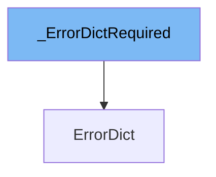

This document will cover the following aspects of the `_ErrorDictRequired` class:

1. What is `_ErrorDictRequired`.
2. Variables and functions in `_ErrorDictRequired`.
3. Usage example of `_ErrorDictRequired`.



# What is \_ErrorDictRequired

`_ErrorDictRequired` is a class in the `pydantic/v1/error_wrappers.py` file. It is a TypedDict, which is a dictionary that allows for type checking. This class is used to define the structure of error dictionaries in Pydantic, specifying that each error dictionary must contain a location (`loc`), a message (`msg`), and a type (`type`).

<SwmSnippet path="/pydantic/v1/error_wrappers.py" line="17">

---

# Variables in \_ErrorDictRequired

`loc` is a variable of type `Loc` which represents the location of the error.

```python
        loc: Loc
        msg: str
        type: str
```

---

</SwmSnippet>

<SwmSnippet path="/pydantic/v1/error_wrappers.py" line="18">

---

`msg` is a string variable that stores the error message.

```python
        msg: str
        type: str
```

---

</SwmSnippet>

<SwmSnippet path="/pydantic/v1/error_wrappers.py" line="19">

---

`type` is a string variable that indicates the type of the error.

```python
        type: str
```

---

</SwmSnippet>

<SwmSnippet path="/pydantic/v1/error_wrappers.py" line="21">

---

# Usage example of \_ErrorDictRequired

`_ErrorDictRequired` is used as a base class for the `ErrorDict` class. `ErrorDict` extends `_ErrorDictRequired` and adds an additional `ctx` field which is a dictionary containing any additional context for the error.

```python
    class ErrorDict(_ErrorDictRequired, total=False):
        ctx: Dict[str, Any]
```

---

</SwmSnippet>

&nbsp;

*This is an auto-generated document by Swimm AI 🌊 and has not yet been verified by a human*

<SwmMeta version="3.0.0" repo-id="Z2l0aHViJTNBJTNBREVNTy1weWRhbnRpYyUzQSUzQWdpbGFkbmF2b3Q=" repo-name="DEMO-pydantic" doc-type="class"><sup>Powered by [Swimm](/)</sup></SwmMeta>
