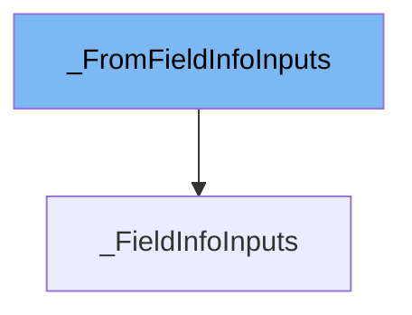

This document will cover the following topics related to the `_FromFieldInfoInputs` class in the `pydantic/fields.py` file of the DEMO-pydantic repo:

1. What is `_FromFieldInfoInputs`.
2. Variables and functions defined in `_FromFieldInfoInputs`.
3. An example of how to use `_FromFieldInfoInputs`.



# What is \_FromFieldInfoInputs

`_FromFieldInfoInputs` is a class in the `pydantic/fields.py` file of the DEMO-pydantic repo. It is a subclass of `typing_extensions.TypedDict` and is used to add type checking for the `**kwargs` in `FieldInfo.from_field`. This class is not meant to be used directly, but rather as a helper for the `FieldInfo` class.

<SwmSnippet path="/pydantic/fields.py" line="50">

---

# Variables in \_FromFieldInfoInputs

These are the variables defined in the `_FromFieldInfoInputs` class. Each variable represents a possible keyword argument that can be passed to `FieldInfo.from_field`. The type of each variable corresponds to the expected type of the argument. For example, `annotation` is expected to be a type or `None`, `default_factory` is expected to be a callable that returns `Any` or `None`, `alias` is expected to be a string or `None`, and so on. All variables are optional, as indicated by the `total=False` argument in the class definition.

```python
    annotation: type[Any] | None
    default_factory: typing.Callable[[], Any] | None
    alias: str | None
    alias_priority: int | None
    validation_alias: str | AliasPath | AliasChoices | None
    serialization_alias: str | None
    title: str | None
    field_title_generator: typing_extensions.Callable[[str, FieldInfo], str] | None
    description: str | None
    examples: list[Any] | None
    exclude: bool | None
    gt: annotated_types.SupportsGt | None
    ge: annotated_types.SupportsGe | None
    lt: annotated_types.SupportsLt | None
    le: annotated_types.SupportsLe | None
    multiple_of: float | None
    strict: bool | None
    min_length: int | None
    max_length: int | None
    pattern: str | typing.Pattern[str] | None
    allow_inf_nan: bool | None
```

---

</SwmSnippet>

<SwmSnippet path="/pydantic/fields.py" line="244">

---

# Usage example of \_FromFieldInfoInputs

Here is an example of how `_FromFieldInfoInputs` is used in the `from_field` static method of the `FieldInfo` class. This method creates a new `FieldInfo` object, using the `default` argument and any additional keyword arguments. The `**kwargs` in this method's signature is where `_FromFieldInfoInputs` comes into play, providing type checking for these keyword arguments. If 'annotation' is included in `kwargs`, a `TypeError` is raised, as 'annotation' is not a permitted keyword argument for `FieldInfo.from_field`.

````python
    def from_field(default: Any = PydanticUndefined, **kwargs: Unpack[_FromFieldInfoInputs]) -> FieldInfo:
        """Create a new `FieldInfo` object with the `Field` function.

        Args:
            default: The default value for the field. Defaults to Undefined.
            **kwargs: Additional arguments dictionary.

        Raises:
            TypeError: If 'annotation' is passed as a keyword argument.

        Returns:
            A new FieldInfo object with the given parameters.

        Example:
            This is how you can create a field with default value like this:

            ```python
            import pydantic

            class MyModel(pydantic.BaseModel):
                foo: int = pydantic.Field(4)
````

---

</SwmSnippet>

&nbsp;

*This is an auto-generated document by Swimm AI 🌊 and has not yet been verified by a human*

<SwmMeta version="3.0.0" repo-id="Z2l0aHViJTNBJTNBREVNTy1weWRhbnRpYyUzQSUzQWdpbGFkbmF2b3Q=" repo-name="DEMO-pydantic" doc-type="class"><sup>Powered by [Swimm](/)</sup></SwmMeta>
