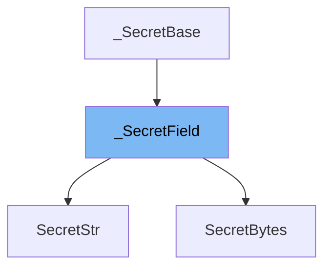

This document will cover the following topics related to the <SwmToken path="/pydantic/types.py" pos="1594:2:2" line-data="class _SecretField(_SecretBase[SecretType]):">`_SecretField`</SwmToken> class:

1. What is <SwmToken path="/pydantic/types.py" pos="1594:2:2" line-data="class _SecretField(_SecretBase[SecretType]):">`_SecretField`</SwmToken>
2. Variables and functions in <SwmToken path="/pydantic/types.py" pos="1594:2:2" line-data="class _SecretField(_SecretBase[SecretType]):">`_SecretField`</SwmToken>
3. Usage example of <SwmToken path="/pydantic/types.py" pos="1594:2:2" line-data="class _SecretField(_SecretBase[SecretType]):">`_SecretField`</SwmToken>



# What is <SwmToken path="/pydantic/types.py" pos="1594:2:2" line-data="class _SecretField(_SecretBase[SecretType]):">`_SecretField`</SwmToken>

<SwmToken path="/pydantic/types.py" pos="1594:2:2" line-data="class _SecretField(_SecretBase[SecretType]):">`_SecretField`</SwmToken> is a base class used for storing sensitive information that you do not want to be visible in logging or tracebacks. When the secret value is nonempty, it is displayed as '\*\*\*\*\*\*\*\*\*\*' instead of the underlying value in calls to <SwmToken path="/pydantic/types.py" pos="1488:33:35" line-data="    is that you can define a custom `_display` method, which will be used for `repr()` and `str()` methods. The examples below demonstrate both">`repr()`</SwmToken> and <SwmToken path="/pydantic/types.py" pos="1488:41:43" line-data="    is that you can define a custom `_display` method, which will be used for `repr()` and `str()` methods. The examples below demonstrate both">`str()`</SwmToken>. If the value is empty, it is displayed as ''.

<SwmSnippet path="/pydantic/types.py" line="2">

---

# Variables and functions

The variable <SwmToken path="/pydantic/types.py" pos="1458:3:3" line-data="        self._secret_value: SecretType = secret_value">`_secret_value`</SwmToken> is used to store the actual secret value. It is of type <SwmToken path="/pydantic/types.py" pos="1457:11:11" line-data="    def __init__(self, secret_value: SecretType) -&gt; None:">`SecretType`</SwmToken>, which is a generic type variable.

```python

```

---

</SwmSnippet>

<SwmSnippet path="/pydantic/types.py" line="1457">

---

The <SwmToken path="/pydantic/types.py" pos="1460:3:3" line-data="    def get_secret_value(self) -&gt; SecretType:">`get_secret_value`</SwmToken> function is used to retrieve the actual secret value. It returns the value of the <SwmToken path="/pydantic/types.py" pos="1458:3:3" line-data="        self._secret_value: SecretType = secret_value">`_secret_value`</SwmToken> variable.

```python
    def __init__(self, secret_value: SecretType) -> None:
        self._secret_value: SecretType = secret_value

    def get_secret_value(self) -> SecretType:
        """Get the secret value.
```

---

</SwmSnippet>

<SwmSnippet path="/pydantic/types.py" line="1463">

---

The <SwmToken path="/pydantic/v1/main.py" pos="905:3:3" line-data="    def __eq__(self, other: Any) -&gt; bool:">`__eq__`</SwmToken> function is used to compare two <SwmToken path="/pydantic/types.py" pos="1594:2:2" line-data="class _SecretField(_SecretBase[SecretType]):">`_SecretField`</SwmToken> instances. It checks if the other instance is of the same class and if their secret values are equal.

```python
        Returns:
            The secret value.
        """
        return self._secret_value

```

---

</SwmSnippet>

<SwmSnippet path="/pydantic/types.py" line="1469">

---

The <SwmToken path="/pydantic/color.py" pos="254:3:3" line-data="    def __hash__(self) -&gt; int:">`__hash__`</SwmToken> function is used to generate a hash value for the <SwmToken path="/pydantic/types.py" pos="1594:2:2" line-data="class _SecretField(_SecretBase[SecretType]):">`_SecretField`</SwmToken> instance. It returns the hash of the secret value.

```python
        return isinstance(other, self.__class__) and self.get_secret_value() == other.get_secret_value()

```

---

</SwmSnippet>

<SwmSnippet path="/pydantic/types.py" line="1472">

---

The <SwmToken path="/pydantic/v1/error_wrappers.py" pos="70:3:3" line-data="    def __str__(self) -&gt; str:">`__str__`</SwmToken> function is used to generate a string representation of the <SwmToken path="/pydantic/types.py" pos="1594:2:2" line-data="class _SecretField(_SecretBase[SecretType]):">`_SecretField`</SwmToken> instance. It returns the result of the <SwmToken path="/pydantic/types.py" pos="1475:7:7" line-data="        return str(self._display())">`_display`</SwmToken> function.

```python
        return hash(self.get_secret_value())

```

---

</SwmSnippet>

<SwmSnippet path="/pydantic/types.py" line="1475">

---

The <SwmToken path="/pydantic/v1/env_settings.py" pos="147:3:3" line-data="    def __repr__(self) -&gt; str:">`__repr__`</SwmToken> function is used to generate a string representation of the <SwmToken path="/pydantic/types.py" pos="1594:2:2" line-data="class _SecretField(_SecretBase[SecretType]):">`_SecretField`</SwmToken> instance for debugging. It returns a string in the format 'ClassName(\*\*\*\*\*\*\*\*\*\*)'

```python
        return str(self._display())

```

---

</SwmSnippet>

<SwmSnippet path="/pydantic/types.py" line="1478">

---

The <SwmToken path="/pydantic/types.py" pos="1478:16:16" line-data="        return f&#39;{self.__class__.__name__}({self._display()!r})&#39;">`_display`</SwmToken> function is used to generate a display string for the <SwmToken path="/pydantic/types.py" pos="1594:2:2" line-data="class _SecretField(_SecretBase[SecretType]):">`_SecretField`</SwmToken> instance. It is not implemented in the base class and should be implemented in subclasses.

```python
        return f'{self.__class__.__name__}({self._display()!r})'

```

---

</SwmSnippet>

<SwmSnippet path="/pydantic/types.py" line="2583">

---

# Usage example

The <SwmToken path="/pydantic/v1/types.py" pos="875:2:2" line-data="class SecretStr(SecretField):">`SecretStr`</SwmToken> class is an example of a class that extends <SwmToken path="/pydantic/types.py" pos="1594:2:2" line-data="class _SecretField(_SecretBase[SecretType]):">`_SecretField`</SwmToken>. It overrides the <SwmToken path="/pydantic/types.py" pos="1475:7:7" line-data="        return str(self._display())">`_display`</SwmToken> function to return '\*\*\*\*\*\*\*\*\*\*' when the secret value is nonempty and '' when it is empty.

```python
class Model(BaseModel):
    base64url_str: Base64UrlStr

# Initialize the model with base64 data
```

---

</SwmSnippet>

&nbsp;

*This is an auto-generated document by Swimm AI 🌊 and has not yet been verified by a human*

<SwmMeta version="3.0.0" repo-id="Z2l0aHViJTNBJTNBREVNTy1weWRhbnRpYyUzQSUzQWdpbGFkbmF2b3Q=" repo-name="DEMO-pydantic"><sup>Powered by [Swimm](https://app.swimm.io/)</sup></SwmMeta>
