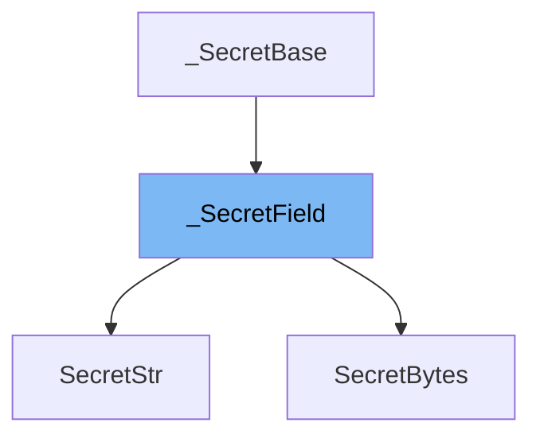

This document will cover the following topics related to the \_SecretField class in the DEMO-pydantic repo:

1. What is \_SecretField
2. Variables and functions in \_SecretField
3. Usage example of \_SecretField



# What is \_SecretField

\_SecretField is a base class for secret types in Pydantic. It is used to store sensitive information that you do not want to be visible in logging or tracebacks. When the secret value is nonempty, it is displayed as '\*\*\*\*\*\*\*\*\*\*' instead of the underlying value in calls to `repr()` and `str()`. If the value is empty, it is displayed as ''.

<SwmSnippet path="/pydantic/types.py" line="1453">

---

# Variables and functions in \_SecretField

The variable `_secret_value` is used to store the actual secret value. It is of generic type `SecretType`.

```python
SecretType = TypeVar('SecretType')
```

---

</SwmSnippet>

<SwmSnippet path="/pydantic/types.py" line="1455">

---

The function `get_secret_value` is used to retrieve the actual secret value. It returns the `_secret_value`.

```python

class _SecretBase(Generic[SecretType]):
```

---

</SwmSnippet>

<SwmSnippet path="/pydantic/types.py" line="1458">

---

The function `__eq__` is used to compare two \_SecretField objects. It checks if the other object is an instance of the same class and if their secret values are equal.

```python
        self._secret_value: SecretType = secret_value

    def get_secret_value(self) -> SecretType:
        """Get the secret value.
```

---

</SwmSnippet>

<SwmSnippet path="/pydantic/types.py" line="1463">

---

The function `__hash__` is used to get the hash value of the \_SecretField object. It returns the hash of the secret value.

```python
        Returns:
            The secret value.
```

---

</SwmSnippet>

<SwmSnippet path="/pydantic/types.py" line="1466">

---

The function `__str__` is used to get the string representation of the \_SecretField object. It returns the result of the `_display` function.

```python
        return self._secret_value

```

---

</SwmSnippet>

<SwmSnippet path="/pydantic/types.py" line="1469">

---

The function `__repr__` is used to get the string representation of the \_SecretField object for debugging. It returns the class name and the result of the `_display` function.

```python
        return isinstance(other, self.__class__) and self.get_secret_value() == other.get_secret_value()

```

---

</SwmSnippet>

<SwmSnippet path="/pydantic/types.py" line="1472">

---

The function `_display` is a placeholder function that should be implemented in subclasses. It is used to get the display value of the \_SecretField object.

```python
        return hash(self.get_secret_value())

```

---

</SwmSnippet>

&nbsp;

*This is an auto-generated document by Swimm AI 🌊 and has not yet been verified by a human*

<SwmMeta version="3.0.0" repo-id="Z2l0aHViJTNBJTNBREVNTy1weWRhbnRpYyUzQSUzQWdpbGFkbmF2b3Q=" repo-name="DEMO-pydantic" doc-type="class"><sup>Powered by [Swimm](/)</sup></SwmMeta>
