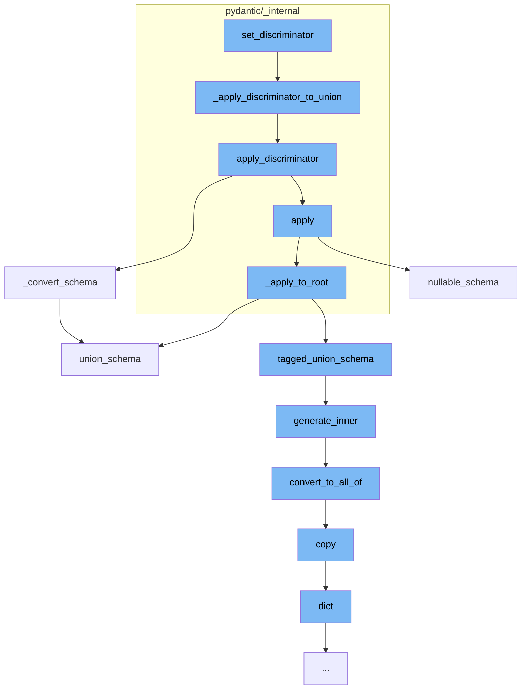

This document will cover the process of applying a discriminator to a schema in the Pydantic library. The process includes the following steps:

1. Setting the discriminator
2. Applying the discriminator to a union
3. Converting the schema
4. Applying the discriminator to the root
5. Generating the inner schema
6. Converting to 'allOf'
7. Copying the schema
8. Creating a dictionary from the schema



<SwmSnippet path="/pydantic/_internal/_generate_schema.py" line="425">

---

# Setting the discriminator

The function `set_discriminator` is the entry point for applying a discriminator to a schema. If the discriminator is not None, it calls `_apply_discriminator_to_union`.

```python
    def _apply_discriminator_to_union(
        self, schema: CoreSchema, discriminator: str | Discriminator | None
    ) -> CoreSchema:
        if discriminator is None:
            return schema
        try:
            return _discriminated_union.apply_discriminator(
                schema,
                discriminator,
            )
        except _discriminated_union.MissingDefinitionForUnionRef:
            # defer until defs are resolved
            _discriminated_union.set_discriminator_in_metadata(
                schema,
                discriminator,
            )
            return schema
```

---

</SwmSnippet>

<SwmSnippet path="/pydantic/_internal/_discriminated_union.py" line="61">

---

# Applying the discriminator to a union

The function `apply_discriminator` is called by `_apply_discriminator_to_union`. It applies the discriminator and returns a new core schema.

```python
def apply_discriminator(
    schema: core_schema.CoreSchema,
    discriminator: str | Discriminator,
    definitions: dict[str, core_schema.CoreSchema] | None = None,
) -> core_schema.CoreSchema:
    """Applies the discriminator and returns a new core schema.

    Args:
        schema: The input schema.
        discriminator: The name of the field which will serve as the discriminator.
        definitions: A mapping of schema ref to schema.

    Returns:
        The new core schema.

    Raises:
        TypeError:
            - If `discriminator` is used with invalid union variant.
            - If `discriminator` is used with `Union` type with one variant.
            - If `discriminator` value mapped to multiple choices.
        MissingDefinitionForUnionRef:
```

---

</SwmSnippet>

<SwmSnippet path="/pydantic/types.py" line="2835">

---

# Converting the schema

The function `_convert_schema` is called by `apply_discriminator`. It converts the original schema to a `tagged_union_schema`.

```python
    def _convert_schema(self, original_schema: core_schema.CoreSchema) -> core_schema.TaggedUnionSchema:
        if original_schema['type'] != 'union':
            # This likely indicates that the schema was a single-item union that was simplified.
            # In this case, we do the same thing we do in
            # `pydantic._internal._discriminated_union._ApplyInferredDiscriminator._apply_to_root`, namely,
            # package the generated schema back into a single-item union.
            original_schema = core_schema.union_schema([original_schema])

        tagged_union_choices = {}
        for i, choice in enumerate(original_schema['choices']):
            tag = None
            if isinstance(choice, tuple):
                choice, tag = choice
            metadata = choice.get('metadata')
            if metadata is not None:
                metadata_tag = metadata.get(_core_utils.TAGGED_UNION_TAG_KEY)
                if metadata_tag is not None:
                    tag = metadata_tag
            if tag is None:
                raise PydanticUserError(
                    f'`Tag` not provided for choice {choice} used with `Discriminator`',
```

---

</SwmSnippet>

<SwmSnippet path="/pydantic/_internal/_discriminated_union.py" line="61">

---

# Applying the discriminator to the root

The function `apply` is called by `apply_discriminator`. It applies the discriminator to the root of the schema.

```python
def apply_discriminator(
    schema: core_schema.CoreSchema,
    discriminator: str | Discriminator,
    definitions: dict[str, core_schema.CoreSchema] | None = None,
) -> core_schema.CoreSchema:
    """Applies the discriminator and returns a new core schema.

    Args:
        schema: The input schema.
        discriminator: The name of the field which will serve as the discriminator.
        definitions: A mapping of schema ref to schema.

    Returns:
        The new core schema.

    Raises:
        TypeError:
            - If `discriminator` is used with invalid union variant.
            - If `discriminator` is used with `Union` type with one variant.
            - If `discriminator` value mapped to multiple choices.
        MissingDefinitionForUnionRef:
```

---

</SwmSnippet>

<SwmSnippet path="/pydantic/json_schema.py" line="445">

---

# Generating the inner schema

The function `generate_inner` is called by `tagged_union_schema`. It generates a JSON schema based on the input schema.

```python
    def generate_inner(self, schema: CoreSchemaOrField) -> JsonSchemaValue:  # noqa: C901
        """Generates a JSON schema for a given core schema.

        Args:
            schema: The given core schema.

        Returns:
            The generated JSON schema.
        """
        # If a schema with the same CoreRef has been handled, just return a reference to it
        # Note that this assumes that it will _never_ be the case that the same CoreRef is used
        # on types that should have different JSON schemas
        if 'ref' in schema:
            core_ref = CoreRef(schema['ref'])  # type: ignore[typeddict-item]
            core_mode_ref = (core_ref, self.mode)
            if core_mode_ref in self.core_to_defs_refs and self.core_to_defs_refs[core_mode_ref] in self.definitions:
                return {'$ref': self.core_to_json_refs[core_mode_ref]}

        # Generate the JSON schema, accounting for the json_schema_override and core_schema_override
        metadata_handler = _core_metadata.CoreMetadataHandler(schema)

```

---

</SwmSnippet>

<SwmSnippet path="/pydantic/json_schema.py" line="481">

---

# Converting to 'allOf'

The function `convert_to_all_of` is called by `generate_inner`. It converts the JSON schema to an 'allOf' schema if necessary.

```python
        def convert_to_all_of(json_schema: JsonSchemaValue) -> JsonSchemaValue:
            if '$ref' in json_schema and len(json_schema.keys()) > 1:
                # technically you can't have any other keys next to a "$ref"
                # but it's an easy mistake to make and not hard to correct automatically here
                json_schema = json_schema.copy()
                ref = json_schema.pop('$ref')
                json_schema = {'allOf': [{'$ref': ref}], **json_schema}
            return json_schema
```

---

</SwmSnippet>

<SwmSnippet path="/pydantic/main.py" line="1251">

---

# Copying the schema

The function `copy` is called by `convert_to_all_of`. It returns a copy of the model.

````python
    def copy(
        self,
        *,
        include: AbstractSetIntStr | MappingIntStrAny | None = None,
        exclude: AbstractSetIntStr | MappingIntStrAny | None = None,
        update: Dict[str, Any] | None = None,  # noqa UP006
        deep: bool = False,
    ) -> Self:  # pragma: no cover
        """Returns a copy of the model.

        !!! warning "Deprecated"
            This method is now deprecated; use `model_copy` instead.

        If you need `include` or `exclude`, use:

        ```py
        data = self.model_dump(include=include, exclude=exclude, round_trip=True)
        data = {**data, **(update or {})}
        copied = self.model_validate(data)
        ```

````

---

</SwmSnippet>

<SwmSnippet path="/pydantic/main.py" line="1076">

---

# Creating a dictionary from the schema

The function `dict` is called by `copy`. It returns a dictionary representation of the model.

```python
    def dict(  # noqa: D102
        self,
        *,
        include: IncEx = None,
        exclude: IncEx = None,
        by_alias: bool = False,
        exclude_unset: bool = False,
        exclude_defaults: bool = False,
        exclude_none: bool = False,
    ) -> Dict[str, Any]:  # noqa UP006
        warnings.warn('The `dict` method is deprecated; use `model_dump` instead.', category=PydanticDeprecatedSince20)
        return self.model_dump(
            include=include,
            exclude=exclude,
            by_alias=by_alias,
            exclude_unset=exclude_unset,
            exclude_defaults=exclude_defaults,
            exclude_none=exclude_none,
        )
```

---

</SwmSnippet>

&nbsp;

*This is an auto-generated document by Swimm AI 🌊 and has not yet been verified by a human*

<SwmMeta version="3.0.0" repo-id="Z2l0aHViJTNBJTNBREVNTy1weWRhbnRpYyUzQSUzQWdpbGFkbmF2b3Q=" repo-name="DEMO-pydantic" doc-type="flows"><sup>Powered by [Swimm](/)</sup></SwmMeta>
