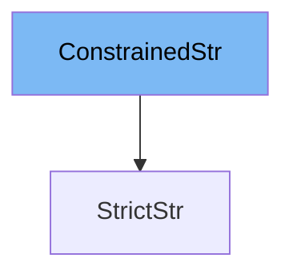

This document will cover the `ConstrainedStr` class from the Pydantic library. We'll cover:

1. What is `ConstrainedStr`
2. Variables and functions in `ConstrainedStr`
3. An example of how to use `ConstrainedStr` in `StrictStr`.



# What is ConstrainedStr

`ConstrainedStr` is a class in the Pydantic library that is used for validating string data. It provides several options for constraining the string, such as minimum and maximum length, whether to strip whitespace, convert to upper or lower case, and whether to apply a regular expression pattern. It also supports strict validation, which means that the input data must be a string type, and cannot be a type that is convertible to a string.

<SwmSnippet path="/pydantic/v1/types.py" line="406">

---

# Variables in ConstrainedStr

These are the variables defined in the `ConstrainedStr` class. `strip_whitespace`, `to_upper`, and `to_lower` are boolean variables that determine whether to strip whitespace from the string, convert it to upper case, or convert it to lower case, respectively. `min_length` and `max_length` are used to specify the minimum and maximum length of the string. `curtail_length` is used to limit the length of the string, and `regex` is used to apply a regular expression pattern to the string. `strict` is a boolean variable that determines whether strict validation is applied, meaning the input data must be a string type.

```python
    strip_whitespace = False
    to_upper = False
    to_lower = False
    min_length: OptionalInt = None
    max_length: OptionalInt = None
    curtail_length: OptionalInt = None
    regex: Optional[Union[str, Pattern[str]]] = None
    strict = False
```

---

</SwmSnippet>

<SwmSnippet path="/pydantic/v1/types.py" line="415">

---

# Functions in ConstrainedStr

These are the functions defined in the `ConstrainedStr` class. The `__modify_schema__` function is used to update the field schema with the constraints defined in the class. The `__get_validators__` function yields the validators that are used for the string validation. The `validate` function is used to validate the string according to the constraints defined in the class. The `_get_pattern` function is used to get the regular expression pattern that is applied to the string.

```python
    @classmethod
    def __modify_schema__(cls, field_schema: Dict[str, Any]) -> None:
        update_not_none(
            field_schema,
            minLength=cls.min_length,
            maxLength=cls.max_length,
            pattern=cls.regex and cls._get_pattern(cls.regex),
        )

    @classmethod
    def __get_validators__(cls) -> 'CallableGenerator':
        yield strict_str_validator if cls.strict else str_validator
        yield constr_strip_whitespace
        yield constr_upper
        yield constr_lower
        yield constr_length_validator
        yield cls.validate

    @classmethod
    def validate(cls, value: Union[str]) -> Union[str]:
        if cls.curtail_length and len(value) > cls.curtail_length:
```

---

</SwmSnippet>

<SwmSnippet path="/pydantic/v1/types.py" line="476">

---

# Usage example

Here is an example of how `ConstrainedStr` is used in the `StrictStr` class. `StrictStr` is a subclass of `ConstrainedStr` that sets `strict` to `True`, meaning it requires the input data to be a string type.

```python
else:

    class StrictStr(ConstrainedStr):
        strict = True
```

---

</SwmSnippet>

&nbsp;

*This is an auto-generated document by Swimm AI 🌊 and has not yet been verified by a human*

<SwmMeta version="3.0.0" repo-id="Z2l0aHViJTNBJTNBREVNTy1weWRhbnRpYyUzQSUzQWdpbGFkbmF2b3Q=" repo-name="DEMO-pydantic" doc-type="class"><sup>Powered by [Swimm](/)</sup></SwmMeta>
