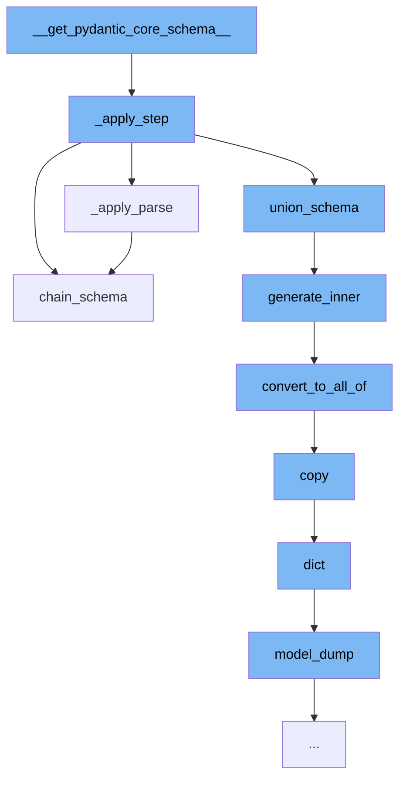

This document will cover the process of generating a core schema in Pydantic, which includes:

1. Applying a step to the schema
2. Parsing the schema
3. Generating the inner schema
4. Converting to <SwmToken path="/pydantic/json_schema.py" pos="487:7:7" line-data="                json_schema = {&#39;allOf&#39;: [{&#39;$ref&#39;: ref}], **json_schema}">`allOf`</SwmToken> schema
5. Copying the schema
6. Dumping the model of the schema
7. Chaining the schema



<SwmSnippet path="/pydantic/experimental/pipeline.py" line="377">

---

# Applying a step to the schema

The function <SwmToken path="/pydantic/experimental/pipeline.py" pos="377:2:2" line-data="def _apply_step(step: _Step, s: cs.CoreSchema | None, handler: GetCoreSchemaHandler, source_type: Any) -&gt; cs.CoreSchema:">`_apply_step`</SwmToken> is used to apply a step to the core schema. Depending on the type of the step, different functions are called to modify the schema.

```python
def _apply_step(step: _Step, s: cs.CoreSchema | None, handler: GetCoreSchemaHandler, source_type: Any) -> cs.CoreSchema:
    from pydantic_core import core_schema as cs

    if isinstance(step, _ValidateAs):
        s = _apply_parse(s, step.tp, step.strict, handler, source_type)
    elif isinstance(step, _ValidateAsDefer):
        s = _apply_parse(s, step.tp, False, handler, source_type)
    elif isinstance(step, _Transform):
        s = _apply_transform(s, step.func, handler)
    elif isinstance(step, _Constraint):
        s = _apply_constraint(s, step.constraint)
    elif isinstance(step, _PipelineOr):
        s = cs.union_schema([handler(step.left), handler(step.right)])
    else:
        assert isinstance(step, _PipelineAnd)
        s = cs.chain_schema([handler(step.left), handler(step.right)])
    return s
```

---

</SwmSnippet>

<SwmSnippet path="/pydantic/experimental/pipeline.py" line="396">

---

# Parsing the schema

The function <SwmToken path="/pydantic/experimental/pipeline.py" pos="396:2:2" line-data="def _apply_parse(">`_apply_parse`</SwmToken> is used to parse the core schema. Depending on the type of the schema, different handlers are applied.

```python
def _apply_parse(
    s: cs.CoreSchema | None,
    tp: type[Any],
    strict: bool,
    handler: GetCoreSchemaHandler,
    source_type: Any,
) -> cs.CoreSchema:
    from pydantic_core import core_schema as cs

    from pydantic import Strict

    if tp is _FieldTypeMarker:
        return handler(source_type)

    if strict:
        tp = Annotated[tp, Strict()]  # type: ignore

    if s and s['type'] == 'any':
        return handler(tp)
    else:
        return cs.chain_schema([s, handler(tp)]) if s else handler(tp)
```

---

</SwmSnippet>

<SwmSnippet path="/pydantic/json_schema.py" line="445">

---

# Generating the inner schema

The function <SwmToken path="/pydantic/json_schema.py" pos="445:3:3" line-data="    def generate_inner(self, schema: CoreSchemaOrField) -&gt; JsonSchemaValue:  # noqa: C901">`generate_inner`</SwmToken> is used to generate the inner schema of the core schema. It populates the definitions and converts the schema to <SwmToken path="/pydantic/json_schema.py" pos="487:7:7" line-data="                json_schema = {&#39;allOf&#39;: [{&#39;$ref&#39;: ref}], **json_schema}">`allOf`</SwmToken> schema if necessary.

```python
    def generate_inner(self, schema: CoreSchemaOrField) -> JsonSchemaValue:  # noqa: C901
        """Generates a JSON schema for a given core schema.

        Args:
            schema: The given core schema.

        Returns:
            The generated JSON schema.
        """
        # If a schema with the same CoreRef has been handled, just return a reference to it
        # Note that this assumes that it will _never_ be the case that the same CoreRef is used
        # on types that should have different JSON schemas
        if 'ref' in schema:
            core_ref = CoreRef(schema['ref'])  # type: ignore[typeddict-item]
            core_mode_ref = (core_ref, self.mode)
            if core_mode_ref in self.core_to_defs_refs and self.core_to_defs_refs[core_mode_ref] in self.definitions:
                return {'$ref': self.core_to_json_refs[core_mode_ref]}

        # Generate the JSON schema, accounting for the json_schema_override and core_schema_override
        metadata_handler = _core_metadata.CoreMetadataHandler(schema)

```

---

</SwmSnippet>

<SwmSnippet path="/pydantic/json_schema.py" line="481">

---

# Converting to <SwmToken path="/pydantic/json_schema.py" pos="487:7:7" line-data="                json_schema = {&#39;allOf&#39;: [{&#39;$ref&#39;: ref}], **json_schema}">`allOf`</SwmToken> schema

The function <SwmToken path="/pydantic/json_schema.py" pos="481:3:3" line-data="        def convert_to_all_of(json_schema: JsonSchemaValue) -&gt; JsonSchemaValue:">`convert_to_all_of`</SwmToken> is used to convert the schema to <SwmToken path="/pydantic/json_schema.py" pos="487:7:7" line-data="                json_schema = {&#39;allOf&#39;: [{&#39;$ref&#39;: ref}], **json_schema}">`allOf`</SwmToken> schema if it contains a '$ref' and other keys.

```python
        def convert_to_all_of(json_schema: JsonSchemaValue) -> JsonSchemaValue:
            if '$ref' in json_schema and len(json_schema.keys()) > 1:
                # technically you can't have any other keys next to a "$ref"
                # but it's an easy mistake to make and not hard to correct automatically here
                json_schema = json_schema.copy()
                ref = json_schema.pop('$ref')
                json_schema = {'allOf': [{'$ref': ref}], **json_schema}
            return json_schema
```

---

</SwmSnippet>

<SwmSnippet path="/pydantic/main.py" line="1251">

---

# Copying the schema

The function <SwmToken path="/pydantic/main.py" pos="1251:3:3" line-data="    def copy(">`copy`</SwmToken> is used to create a copy of the model. It includes or excludes fields as specified and handles deep copying of Pydantic models.

````python
    def copy(
        self,
        *,
        include: AbstractSetIntStr | MappingIntStrAny | None = None,
        exclude: AbstractSetIntStr | MappingIntStrAny | None = None,
        update: Dict[str, Any] | None = None,  # noqa UP006
        deep: bool = False,
    ) -> Self:  # pragma: no cover
        """Returns a copy of the model.

        !!! warning "Deprecated"
            This method is now deprecated; use `model_copy` instead.

        If you need `include` or `exclude`, use:

        ```py
        data = self.model_dump(include=include, exclude=exclude, round_trip=True)
        data = {**data, **(update or {})}
        copied = self.model_validate(data)
        ```

````

---

</SwmSnippet>

<SwmSnippet path="/pydantic/main.py" line="325">

---

# Dumping the model of the schema

The function <SwmToken path="/pydantic/main.py" pos="325:3:3" line-data="    def model_dump(">`model_dump`</SwmToken> is used to generate a dictionary representation of the model. It includes or excludes fields as specified and handles serialization errors.

```python
    def model_dump(
        self,
        *,
        mode: Literal['json', 'python'] | str = 'python',
        include: IncEx = None,
        exclude: IncEx = None,
        context: Any | None = None,
        by_alias: bool = False,
        exclude_unset: bool = False,
        exclude_defaults: bool = False,
        exclude_none: bool = False,
        round_trip: bool = False,
        warnings: bool | Literal['none', 'warn', 'error'] = True,
        serialize_as_any: bool = False,
    ) -> dict[str, Any]:
        """Usage docs: https://docs.pydantic.dev/2.8/concepts/serialization/#modelmodel_dump

        Generate a dictionary representation of the model, optionally specifying which fields to include or exclude.

        Args:
            mode: The mode in which `to_python` should run.
```

---

</SwmSnippet>

<SwmSnippet path="/pydantic/json_schema.py" line="1211">

---

# Chaining the schema

The function <SwmToken path="/pydantic/json_schema.py" pos="1211:3:3" line-data="    def chain_schema(self, schema: core_schema.ChainSchema) -&gt; JsonSchemaValue:">`chain_schema`</SwmToken> is used to generate a JSON schema that matches a <SwmToken path="/pydantic/json_schema.py" pos="1211:11:13" line-data="    def chain_schema(self, schema: core_schema.ChainSchema) -&gt; JsonSchemaValue:">`core_schema.ChainSchema`</SwmToken>. It uses the first step for validation and the last for serialization.

```python
    def chain_schema(self, schema: core_schema.ChainSchema) -> JsonSchemaValue:
        """Generates a JSON schema that matches a core_schema.ChainSchema.

        When generating a schema for validation, we return the validation JSON schema for the first step in the chain.
        For serialization, we return the serialization JSON schema for the last step in the chain.

        Args:
            schema: The core schema.

        Returns:
            The generated JSON schema.
        """
        step_index = 0 if self.mode == 'validation' else -1  # use first step for validation, last for serialization
        return self.generate_inner(schema['steps'][step_index])
```

---

</SwmSnippet>

&nbsp;

*This is an auto-generated document by Swimm AI 🌊 and has not yet been verified by a human*

<SwmMeta version="3.0.0" repo-id="Z2l0aHViJTNBJTNBREVNTy1weWRhbnRpYyUzQSUzQWdpbGFkbmF2b3Q=" repo-name="DEMO-pydantic"><sup>Powered by [Swimm](https://app.swimm.io/)</sup></SwmMeta>
