This document will cover the process of data validation and manipulation in the Pydantic library, specifically focusing on the following steps:

1. Iterating over data
2. Calculating keys
3. Copying data
4. Setting values
5. Creating new instances
6. Populating validators
7. Updating forward references
8. Preparing fields
9. Finding validators.

```mermaid
graph TD;
subgraph pydantic/v1
  dict:::mainFlowStyle --> _iter
end
subgraph pydantic/v1
  _iter:::mainFlowStyle --> _calculate_keys
end
subgraph pydantic/v1
  _iter:::mainFlowStyle --> _get_value
end
subgraph pydantic/v1
  _get_value:::mainFlowStyle --> copy
end
subgraph pydantic/v1
  copy:::mainFlowStyle --> _copy_and_set_values
end
subgraph pydantic/v1
  _copy_and_set_values:::mainFlowStyle --> __new__
end
subgraph pydantic/v1
  __new__:::mainFlowStyle --> populate_validators
end
subgraph pydantic/v1
  __new__:::mainFlowStyle --> infer
end
subgraph pydantic/v1
  __new__:::mainFlowStyle --> __try_update_forward_refs__
end
subgraph pydantic/v1
  populate_validators --> find_validators
end
subgraph pydantic/v1
  find_validators --> make_typeddict_validator
end
subgraph pydantic/v1
  find_validators --> make_namedtuple_validator
end
subgraph pydantic/v1
  infer --> get_annotation_from_field_info
end
subgraph pydantic/v1
  infer --> _get_field_info
end
subgraph pydantic/v1
  get_annotation_from_field_info --> get_annotation_with_constraints
end
subgraph pydantic/v1
  _get_field_info --> update_from_config
end
subgraph pydantic/v1
  __try_update_forward_refs__:::mainFlowStyle --> update_model_forward_refs
end
subgraph pydantic/v1
  update_model_forward_refs:::mainFlowStyle --> update_field_forward_refs
end
subgraph pydantic/v1
  update_field_forward_refs:::mainFlowStyle --> prepare
end
  prepare:::mainFlowStyle --> ...

 classDef mainFlowStyle color:#000000,fill:#7CB9F4
  classDef rootsStyle color:#000000,fill:#00FFF4

%% Swimm:
%% graph TD;
%% subgraph <SwmPath>[pydantic/v1//](/pydantic/v1//)</SwmPath>
%%   dict:::mainFlowStyle --> _iter
%% end
%% subgraph <SwmPath>[pydantic/v1//](/pydantic/v1//)</SwmPath>
%%   _iter:::mainFlowStyle --> <SwmToken path="/pydantic/v1/main.py" pos="840:7:7" line-data="        allowed_keys = self._calculate_keys(">`_calculate_keys`</SwmToken>
%% end
%% subgraph <SwmPath>[pydantic/v1//](/pydantic/v1//)</SwmPath>
%%   _iter:::mainFlowStyle --> <SwmToken path="/pydantic/deprecated/copy_internals.py" pos="124:2:2" line-data="def _get_value(">`_get_value`</SwmToken>
%% end
%% subgraph <SwmPath>[pydantic/v1//](/pydantic/v1//)</SwmPath>
%%   _get_value:::mainFlowStyle --> copy
%% end
%% subgraph <SwmPath>[pydantic/v1//](/pydantic/v1//)</SwmPath>
%%   copy:::mainFlowStyle --> <SwmToken path="/pydantic/v1/main.py" pos="609:3:3" line-data="    def _copy_and_set_values(self: &#39;Model&#39;, values: &#39;DictStrAny&#39;, fields_set: &#39;SetStr&#39;, *, deep: bool) -&gt; &#39;Model&#39;:">`_copy_and_set_values`</SwmToken>
%% end
%% subgraph <SwmPath>[pydantic/v1//](/pydantic/v1//)</SwmPath>
%%   _copy_and_set_values:::mainFlowStyle --> __new__
%% end
%% subgraph <SwmPath>[pydantic/v1//](/pydantic/v1//)</SwmPath>
%%   __new__:::mainFlowStyle --> <SwmToken path="/pydantic/v1/fields.py" pos="814:3:3" line-data="    def populate_validators(self) -&gt; None:">`populate_validators`</SwmToken>
%% end
%% subgraph <SwmPath>[pydantic/v1//](/pydantic/v1//)</SwmPath>
%%   __new__:::mainFlowStyle --> infer
%% end
%% subgraph <SwmPath>[pydantic/v1//](/pydantic/v1//)</SwmPath>
%%   __new__:::mainFlowStyle --> <SwmToken path="/pydantic/v1/main.py" pos="286:3:3" line-data="            cls.__try_update_forward_refs__()">`__try_update_forward_refs__`</SwmToken>
%% end
%% subgraph <SwmPath>[pydantic/v1//](/pydantic/v1//)</SwmPath>
%%   <SwmToken path="/pydantic/v1/fields.py" pos="814:3:3" line-data="    def populate_validators(self) -&gt; None:">`populate_validators`</SwmToken> --> <SwmToken path="/pydantic/v1/fields.py" pos="829:15:15" line-data="                *(get_validators() if get_validators else list(find_validators(self.type_, self.model_config))),">`find_validators`</SwmToken>
%% end
%% subgraph <SwmPath>[pydantic/v1//](/pydantic/v1//)</SwmPath>
%%   <SwmToken path="/pydantic/v1/fields.py" pos="829:15:15" line-data="                *(get_validators() if get_validators else list(find_validators(self.type_, self.model_config))),">`find_validators`</SwmToken> --> <SwmToken path="/pydantic/v1/validators.py" pos="619:2:2" line-data="def make_typeddict_validator(">`make_typeddict_validator`</SwmToken>
%% end
%% subgraph <SwmPath>[pydantic/v1//](/pydantic/v1//)</SwmPath>
%%   <SwmToken path="/pydantic/v1/fields.py" pos="829:15:15" line-data="                *(get_validators() if get_validators else list(find_validators(self.type_, self.model_config))),">`find_validators`</SwmToken> --> <SwmToken path="/pydantic/v1/validators.py" pos="594:2:2" line-data="def make_namedtuple_validator(">`make_namedtuple_validator`</SwmToken>
%% end
%% subgraph <SwmPath>[pydantic/v1//](/pydantic/v1//)</SwmPath>
%%   infer --> <SwmToken path="/pydantic/v1/schema.py" pos="1001:2:2" line-data="def get_annotation_from_field_info(">`get_annotation_from_field_info`</SwmToken>
%% end
%% subgraph <SwmPath>[pydantic/v1//](/pydantic/v1//)</SwmPath>
%%   infer --> <SwmToken path="/pydantic/v1/fields.py" pos="440:3:3" line-data="    def _get_field_info(">`_get_field_info`</SwmToken>
%% end
%% subgraph <SwmPath>[pydantic/v1//](/pydantic/v1//)</SwmPath>
%%   <SwmToken path="/pydantic/v1/schema.py" pos="1001:2:2" line-data="def get_annotation_from_field_info(">`get_annotation_from_field_info`</SwmToken> --> <SwmToken path="/pydantic/v1/schema.py" pos="1030:2:2" line-data="def get_annotation_with_constraints(annotation: Any, field_info: FieldInfo) -&gt; Tuple[Type[Any], Set[str]]:  # noqa: C901">`get_annotation_with_constraints`</SwmToken>
%% end
%% subgraph <SwmPath>[pydantic/v1//](/pydantic/v1//)</SwmPath>
%%   <SwmToken path="/pydantic/v1/fields.py" pos="440:3:3" line-data="    def _get_field_info(">`_get_field_info`</SwmToken> --> <SwmToken path="/pydantic/v1/fields.py" pos="132:26:26" line-data="    # field constraints with the default value, it&#39;s also used in update_from_config below">`update_from_config`</SwmToken>
%% end
%% subgraph <SwmPath>[pydantic/v1//](/pydantic/v1//)</SwmPath>
%%   __try_update_forward_refs__:::mainFlowStyle --> <SwmToken path="/pydantic/v1/typing.py" pos="540:2:2" line-data="def update_model_forward_refs(">`update_model_forward_refs`</SwmToken>
%% end
%% subgraph <SwmPath>[pydantic/v1//](/pydantic/v1//)</SwmPath>
%%   update_model_forward_refs:::mainFlowStyle --> <SwmToken path="/pydantic/v1/typing.py" pos="559:1:1" line-data="            update_field_forward_refs(f, globalns=globalns, localns=localns)">`update_field_forward_refs`</SwmToken>
%% end
%% subgraph <SwmPath>[pydantic/v1//](/pydantic/v1//)</SwmPath>
%%   update_field_forward_refs:::mainFlowStyle --> prepare
%% end
%%   prepare:::mainFlowStyle --> ...
%% 
%%  classDef mainFlowStyle color:#000000,fill:#7CB9F4
%%   classDef rootsStyle color:#000000,fill:#00FFF4
```



<SwmSnippet path="/pydantic/v1/main.py" line="822">

---

# Iterating over data

The <SwmToken path="/pydantic/v1/main.py" pos="822:3:3" line-data="    def _iter(">`_iter`</SwmToken> function is used to iterate over the data. It merges field set excludes with explicit exclude parameter and includes with explicit include parameter. It then calculates the allowed keys and yields the key-value pairs.

```python
    def _iter(
        self,
        to_dict: bool = False,
        by_alias: bool = False,
        include: Optional[Union['AbstractSetIntStr', 'MappingIntStrAny']] = None,
        exclude: Optional[Union['AbstractSetIntStr', 'MappingIntStrAny']] = None,
        exclude_unset: bool = False,
        exclude_defaults: bool = False,
        exclude_none: bool = False,
    ) -> 'TupleGenerator':
        # Merge field set excludes with explicit exclude parameter with explicit overriding field set options.
        # The extra "is not None" guards are not logically necessary but optimizes performance for the simple case.
        if exclude is not None or self.__exclude_fields__ is not None:
            exclude = ValueItems.merge(self.__exclude_fields__, exclude)

        if include is not None or self.__include_fields__ is not None:
            include = ValueItems.merge(self.__include_fields__, include, intersect=True)

        allowed_keys = self._calculate_keys(
            include=include, exclude=exclude, exclude_unset=exclude_unset  # type: ignore
        )
```

---

</SwmSnippet>

<SwmSnippet path="/pydantic/v1/main.py" line="878">

---

# Calculating keys

The <SwmToken path="/pydantic/v1/main.py" pos="878:3:3" line-data="    def _calculate_keys(">`_calculate_keys`</SwmToken> function is used to calculate the keys that are allowed based on the include and exclude parameters. If <SwmToken path="/pydantic/v1/main.py" pos="882:1:1" line-data="        exclude_unset: bool,">`exclude_unset`</SwmToken> is True, it only considers the fields that have been set.

```python
    def _calculate_keys(
        self,
        include: Optional['MappingIntStrAny'],
        exclude: Optional['MappingIntStrAny'],
        exclude_unset: bool,
        update: Optional['DictStrAny'] = None,
    ) -> Optional[AbstractSet[str]]:
        if include is None and exclude is None and exclude_unset is False:
            return None

        keys: AbstractSet[str]
        if exclude_unset:
            keys = self.__fields_set__.copy()
        else:
            keys = self.__dict__.keys()

        if include is not None:
            keys &= include.keys()

        if update:
            keys -= update.keys()
```

---

</SwmSnippet>

<SwmSnippet path="/pydantic/v1/main.py" line="627">

---

# Copying data

The <SwmToken path="/pydantic/v1/main.py" pos="627:3:3" line-data="    def copy(">`copy`</SwmToken> function is used to duplicate a model. It uses the <SwmToken path="/pydantic/v1/main.py" pos="647:3:3" line-data="            self._iter(to_dict=False, by_alias=False, include=include, exclude=exclude, exclude_unset=False),">`_iter`</SwmToken> function to get the values to be copied and then calls the <SwmToken path="/pydantic/v1/main.py" pos="609:3:3" line-data="    def _copy_and_set_values(self: &#39;Model&#39;, values: &#39;DictStrAny&#39;, fields_set: &#39;SetStr&#39;, *, deep: bool) -&gt; &#39;Model&#39;:">`_copy_and_set_values`</SwmToken> function to create a new model instance.

```python
    def copy(
        self: 'Model',
        *,
        include: Optional[Union['AbstractSetIntStr', 'MappingIntStrAny']] = None,
        exclude: Optional[Union['AbstractSetIntStr', 'MappingIntStrAny']] = None,
        update: Optional['DictStrAny'] = None,
        deep: bool = False,
    ) -> 'Model':
        """
        Duplicate a model, optionally choose which fields to include, exclude and change.

        :param include: fields to include in new model
        :param exclude: fields to exclude from new model, as with values this takes precedence over include
        :param update: values to change/add in the new model. Note: the data is not validated before creating
            the new model: you should trust this data
        :param deep: set to `True` to make a deep copy of the model
        :return: new model instance
        """

        values = dict(
            self._iter(to_dict=False, by_alias=False, include=include, exclude=exclude, exclude_unset=False),
```

---

</SwmSnippet>

<SwmSnippet path="/pydantic/v1/main.py" line="609">

---

# Setting values

The <SwmToken path="/pydantic/v1/main.py" pos="609:3:3" line-data="    def _copy_and_set_values(self: &#39;Model&#39;, values: &#39;DictStrAny&#39;, fields_set: &#39;SetStr&#39;, *, deep: bool) -&gt; &#39;Model&#39;:">`_copy_and_set_values`</SwmToken> function is used to set the values in the new model instance. If <SwmToken path="/pydantic/v1/main.py" pos="609:31:31" line-data="    def _copy_and_set_values(self: &#39;Model&#39;, values: &#39;DictStrAny&#39;, fields_set: &#39;SetStr&#39;, *, deep: bool) -&gt; &#39;Model&#39;:">`deep`</SwmToken> is True, it creates a deep copy of the values.

```python
    def _copy_and_set_values(self: 'Model', values: 'DictStrAny', fields_set: 'SetStr', *, deep: bool) -> 'Model':
        if deep:
            # chances of having empty dict here are quite low for using smart_deepcopy
            values = deepcopy(values)

        cls = self.__class__
        m = cls.__new__(cls)
        object_setattr(m, '__dict__', values)
        object_setattr(m, '__fields_set__', fields_set)
        for name in self.__private_attributes__:
            value = getattr(self, name, Undefined)
            if value is not Undefined:
                if deep:
                    value = deepcopy(value)
                object_setattr(m, name, value)

        return m
```

---

</SwmSnippet>

<SwmSnippet path="/pydantic/v1/main.py" line="123">

---

# Creating new instances

The <SwmToken path="/pydantic/v1/main.py" pos="123:3:3" line-data="    def __new__(mcs, name, bases, namespace, **kwargs):  # noqa C901">`__new__`</SwmToken> function is used to create a new instance of the model. It prepares the fields, configures the validators, and resolves forward references.

```python
    def __new__(mcs, name, bases, namespace, **kwargs):  # noqa C901
        fields: Dict[str, ModelField] = {}
        config = BaseConfig
        validators: 'ValidatorListDict' = {}

        pre_root_validators, post_root_validators = [], []
        private_attributes: Dict[str, ModelPrivateAttr] = {}
        base_private_attributes: Dict[str, ModelPrivateAttr] = {}
        slots: SetStr = namespace.get('__slots__', ())
        slots = {slots} if isinstance(slots, str) else set(slots)
        class_vars: SetStr = set()
        hash_func: Optional[Callable[[Any], int]] = None

        for base in reversed(bases):
            if _is_base_model_class_defined and issubclass(base, BaseModel) and base != BaseModel:
                fields.update(smart_deepcopy(base.__fields__))
                config = inherit_config(base.__config__, config)
                validators = inherit_validators(base.__validators__, validators)
                pre_root_validators += base.__pre_root_validators__
                post_root_validators += base.__post_root_validators__
                base_private_attributes.update(base.__private_attributes__)
```

---

</SwmSnippet>

<SwmSnippet path="/pydantic/v1/fields.py" line="814">

---

# Populating validators

The <SwmToken path="/pydantic/v1/fields.py" pos="814:3:3" line-data="    def populate_validators(self) -&gt; None:">`populate_validators`</SwmToken> function is used to prepare the validators for the fields based on the field's type and class validators.

```python
    def populate_validators(self) -> None:
        """
        Prepare self.pre_validators, self.validators, and self.post_validators based on self.type_'s  __get_validators__
        and class validators. This method should be idempotent, e.g. it should be safe to call multiple times
        without mis-configuring the field.
        """
        self.validate_always = getattr(self.type_, 'validate_always', False) or any(
            v.always for v in self.class_validators.values()
        )

        class_validators_ = self.class_validators.values()
        if not self.sub_fields or self.shape == SHAPE_GENERIC:
            get_validators = getattr(self.type_, '__get_validators__', None)
            v_funcs = (
                *[v.func for v in class_validators_ if v.each_item and v.pre],
                *(get_validators() if get_validators else list(find_validators(self.type_, self.model_config))),
                *[v.func for v in class_validators_ if v.each_item and not v.pre],
            )
            self.validators = prep_validators(v_funcs)

        self.pre_validators = []
```

---

</SwmSnippet>

<SwmSnippet path="/pydantic/v1/typing.py" line="540">

---

# Updating forward references

The <SwmToken path="/pydantic/v1/typing.py" pos="540:2:2" line-data="def update_model_forward_refs(">`update_model_forward_refs`</SwmToken> function is used to update the model fields' <SwmToken path="/pydantic/v1/typing.py" pos="548:11:11" line-data="    Try to update model fields ForwardRefs based on model and localns.">`ForwardRefs`</SwmToken> based on the model and local namespace.

```python
def update_model_forward_refs(
    model: Type[Any],
    fields: Iterable['ModelField'],
    json_encoders: Dict[Union[Type[Any], str, ForwardRef], AnyCallable],
    localns: 'DictStrAny',
    exc_to_suppress: Tuple[Type[BaseException], ...] = (),
) -> None:
    """
    Try to update model fields ForwardRefs based on model and localns.
    """
    if model.__module__ in sys.modules:
        globalns = sys.modules[model.__module__].__dict__.copy()
    else:
        globalns = {}

    globalns.setdefault(model.__name__, model)

    for f in fields:
        try:
            update_field_forward_refs(f, globalns=globalns, localns=localns)
        except exc_to_suppress:
```

---

</SwmSnippet>

<SwmSnippet path="/pydantic/v1/fields.py" line="537">

---

# Preparing fields

The <SwmToken path="/pydantic/v1/fields.py" pos="537:3:3" line-data="    def prepare(self) -&gt; None:">`prepare`</SwmToken> function is used to prepare the field by inspecting its default value and type. It also populates the validators for the field.

```python
    def prepare(self) -> None:
        """
        Prepare the field but inspecting self.default, self.type_ etc.

        Note: this method is **not** idempotent (because _type_analysis is not idempotent),
        e.g. calling it it multiple times may modify the field and configure it incorrectly.
        """
        self._set_default_and_type()
        if self.type_.__class__ is ForwardRef or self.type_.__class__ is DeferredType:
            # self.type_ is currently a ForwardRef and there's nothing we can do now,
            # user will need to call model.update_forward_refs()
            return

        self._type_analysis()
        if self.required is Undefined:
```

---

</SwmSnippet>

<SwmSnippet path="/pydantic/v1/validators.py" line="698">

---

# Finding validators

The <SwmToken path="/pydantic/v1/validators.py" pos="698:2:2" line-data="def find_validators(  # noqa: C901 (ignore complexity)">`find_validators`</SwmToken> function is used to find the appropriate validators for a given type. It checks the type against a list of known types and returns the corresponding validators.

```python
def find_validators(  # noqa: C901 (ignore complexity)
    type_: Type[Any], config: Type['BaseConfig']
) -> Generator[AnyCallable, None, None]:
    from pydantic.v1.dataclasses import is_builtin_dataclass, make_dataclass_validator

    if type_ is Any or type_ is object:
        return
    type_type = type_.__class__
    if type_type == ForwardRef or type_type == TypeVar:
        return

    if is_none_type(type_):
        yield none_validator
        return
    if type_ is Pattern or type_ is re.Pattern:
        yield pattern_validator
        return
    if type_ is Hashable or type_ is CollectionsHashable:
        yield hashable_validator
        return
    if is_callable_type(type_):
```

---

</SwmSnippet>

&nbsp;

*This is an auto-generated document by Swimm AI 🌊 and has not yet been verified by a human*

<SwmMeta version="3.0.0" repo-id="Z2l0aHViJTNBJTNBREVNTy1weWRhbnRpYyUzQSUzQWdpbGFkbmF2b3Q=" repo-name="DEMO-pydantic"><sup>Powered by [Swimm](https://app.swimm.io/)</sup></SwmMeta>
