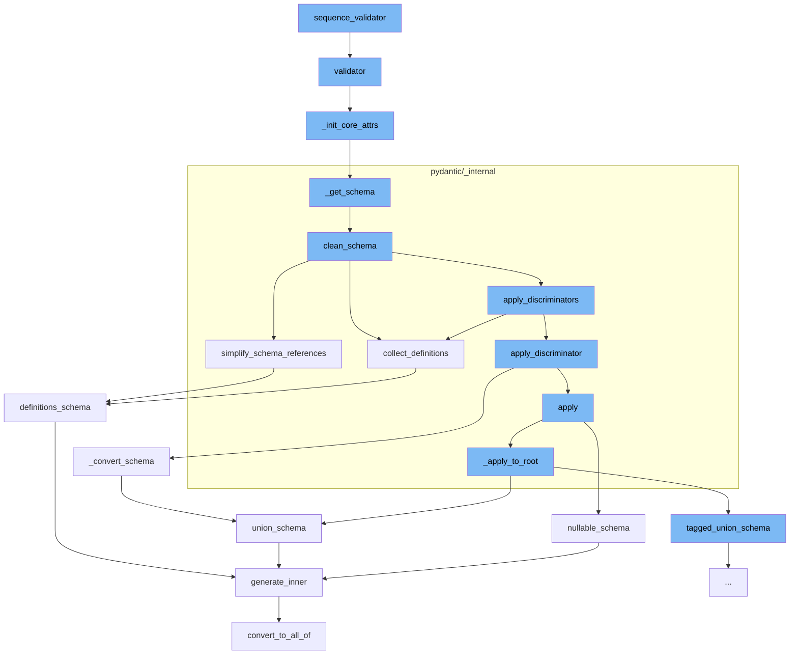

This document will cover the process of data validation in Pydantic, which includes:

 1. The sequence validator function
 2. The validator function
 3. The <SwmToken path="/pydantic/type_adapter.py" pos="275:3:3" line-data="    def _init_core_attrs(self, rebuild_mocks: bool) -&gt; None:">`_init_core_attrs`</SwmToken> function
 4. The <SwmToken path="/pydantic/type_adapter.py" pos="54:2:2" line-data="def _get_schema(type_: Any, config_wrapper: _config.ConfigWrapper, parent_depth: int) -&gt; CoreSchema:">`_get_schema`</SwmToken> function
 5. The <SwmToken path="/pydantic/_internal/_generate_schema.py" pos="446:3:3" line-data="    def clean_schema(self, schema: CoreSchema) -&gt; CoreSchema:">`clean_schema`</SwmToken> function
 6. The <SwmToken path="/pydantic/_internal/_generate_schema.py" pos="448:5:5" line-data="        schema = simplify_schema_references(schema)">`simplify_schema_references`</SwmToken> function
 7. The <SwmToken path="/pydantic/_internal/_generate_schema.py" pos="447:7:7" line-data="        schema = self.collect_definitions(schema)">`collect_definitions`</SwmToken> function
 8. The <SwmToken path="/pydantic/types.py" pos="2835:3:3" line-data="    def _convert_schema(self, original_schema: core_schema.CoreSchema) -&gt; core_schema.TaggedUnionSchema:">`_convert_schema`</SwmToken> function
 9. The <SwmToken path="/pydantic/json_schema.py" pos="1090:3:3" line-data="    def nullable_schema(self, schema: core_schema.NullableSchema) -&gt; JsonSchemaValue:">`nullable_schema`</SwmToken> function
10. The <SwmToken path="/pydantic/types.py" pos="2841:7:7" line-data="            original_schema = core_schema.union_schema([original_schema])">`union_schema`</SwmToken> function
11. The <SwmToken path="/pydantic/json_schema.py" pos="445:3:3" line-data="    def generate_inner(self, schema: CoreSchemaOrField) -&gt; JsonSchemaValue:  # noqa: C901">`generate_inner`</SwmToken> function
12. The <SwmToken path="/pydantic/_internal/_generate_schema.py" pos="461:5:5" line-data="        return core_schema.definitions_schema(">`definitions_schema`</SwmToken> function
13. The <SwmToken path="/pydantic/json_schema.py" pos="481:3:3" line-data="        def convert_to_all_of(json_schema: JsonSchemaValue) -&gt; JsonSchemaValue:">`convert_to_all_of`</SwmToken> function.



<SwmSnippet path="/pydantic/_internal/_validators.py" line="1">

---

# The sequence validator function

The sequence validator function is the starting point of the data validation process. It is responsible for initiating the validation process for a sequence of data.

```python
"""Validator functions for standard library types.
```

---

</SwmSnippet>

<SwmSnippet path="/pydantic/type_adapter.py" line="314">

---

# The validator function

The validator function is used to validate instances of the model. If the validator is not an instance of <SwmToken path="/pydantic/type_adapter.py" pos="314:10:10" line-data="    def validator(self) -&gt; SchemaValidator:">`SchemaValidator`</SwmToken>, it calls the <SwmToken path="/pydantic/type_adapter.py" pos="317:3:3" line-data="            self._init_core_attrs(rebuild_mocks=True)  # Do not expose MockValSer from public function">`_init_core_attrs`</SwmToken> function to initialize core attributes.

```python
    def validator(self) -> SchemaValidator:
        """The pydantic-core SchemaValidator used to validate instances of the model."""
        if not isinstance(self._validator, SchemaValidator):
            self._init_core_attrs(rebuild_mocks=True)  # Do not expose MockValSer from public function
        assert isinstance(self._validator, SchemaValidator)
        return self._validator
```

---

</SwmSnippet>

<SwmSnippet path="/pydantic/type_adapter.py" line="275">

---

# The <SwmToken path="/pydantic/type_adapter.py" pos="275:3:3" line-data="    def _init_core_attrs(self, rebuild_mocks: bool) -&gt; None:">`_init_core_attrs`</SwmToken> function

The <SwmToken path="/pydantic/type_adapter.py" pos="275:3:3" line-data="    def _init_core_attrs(self, rebuild_mocks: bool) -&gt; None:">`_init_core_attrs`</SwmToken> function initializes core attributes of the model. It sets the <SwmToken path="/pydantic/type_adapter.py" pos="277:3:3" line-data="            self._core_schema = _getattr_no_parents(self._type, &#39;__pydantic_core_schema__&#39;)">`_core_schema`</SwmToken>, \_validator, and \_serializer attributes of the model.

```python
    def _init_core_attrs(self, rebuild_mocks: bool) -> None:
        try:
            self._core_schema = _getattr_no_parents(self._type, '__pydantic_core_schema__')
            self._validator = _getattr_no_parents(self._type, '__pydantic_validator__')
            self._serializer = _getattr_no_parents(self._type, '__pydantic_serializer__')
        except AttributeError:
            config_wrapper = _config.ConfigWrapper(self._config)
            core_config = config_wrapper.core_config(None)

            self._core_schema = _get_schema(self._type, config_wrapper, parent_depth=self._parent_depth)
            self._validator = create_schema_validator(
                schema=self._core_schema,
                schema_type=self._type,
                schema_type_module=self._module_name,
                schema_type_name=str(self._type),
                schema_kind='TypeAdapter',
                config=core_config,
                plugin_settings=config_wrapper.plugin_settings,
            )
            self._serializer = SchemaSerializer(self._core_schema, core_config)

```

---

</SwmSnippet>

<SwmSnippet path="/pydantic/type_adapter.py" line="54">

---

# The <SwmToken path="/pydantic/type_adapter.py" pos="54:2:2" line-data="def _get_schema(type_: Any, config_wrapper: _config.ConfigWrapper, parent_depth: int) -&gt; CoreSchema:">`_get_schema`</SwmToken> function

The <SwmToken path="/pydantic/type_adapter.py" pos="54:2:2" line-data="def _get_schema(type_: Any, config_wrapper: _config.ConfigWrapper, parent_depth: int) -&gt; CoreSchema:">`_get_schema`</SwmToken> function generates a schema for the model. It uses the <SwmToken path="/pydantic/type_adapter.py" pos="101:7:7" line-data="    gen = _generate_schema.GenerateSchema(config_wrapper, types_namespace=global_ns, typevars_map={})">`GenerateSchema`</SwmToken> class to generate and clean the schema.

````python
def _get_schema(type_: Any, config_wrapper: _config.ConfigWrapper, parent_depth: int) -> CoreSchema:
    """`BaseModel` uses its own `__module__` to find out where it was defined
    and then looks for symbols to resolve forward references in those globals.
    On the other hand this function can be called with arbitrary objects,
    including type aliases, where `__module__` (always `typing.py`) is not useful.
    So instead we look at the globals in our parent stack frame.

    This works for the case where this function is called in a module that
    has the target of forward references in its scope, but
    does not always work for more complex cases.

    For example, take the following:

    a.py
    ```python
    from typing import Dict, List

    IntList = List[int]
    OuterDict = Dict[str, 'IntList']
    ```

````

---

</SwmSnippet>

<SwmSnippet path="/pydantic/_internal/_generate_schema.py" line="446">

---

# The <SwmToken path="/pydantic/_internal/_generate_schema.py" pos="446:3:3" line-data="    def clean_schema(self, schema: CoreSchema) -&gt; CoreSchema:">`clean_schema`</SwmToken> function

The <SwmToken path="/pydantic/_internal/_generate_schema.py" pos="446:3:3" line-data="    def clean_schema(self, schema: CoreSchema) -&gt; CoreSchema:">`clean_schema`</SwmToken> function cleans the generated schema. It collects definitions, simplifies schema references, applies discriminators, and validates the core schema.

```python
    def clean_schema(self, schema: CoreSchema) -> CoreSchema:
        schema = self.collect_definitions(schema)
        schema = simplify_schema_references(schema)
        if collect_invalid_schemas(schema):
            raise self.CollectedInvalid()
        schema = _discriminated_union.apply_discriminators(schema)
        schema = validate_core_schema(schema)
        return schema
```

---

</SwmSnippet>

<SwmSnippet path="/pydantic/_internal/_core_utils.py" line="417">

---

# The <SwmToken path="/pydantic/_internal/_core_utils.py" pos="417:2:2" line-data="def simplify_schema_references(schema: core_schema.CoreSchema) -&gt; core_schema.CoreSchema:  # noqa: C901">`simplify_schema_references`</SwmToken> function

The <SwmToken path="/pydantic/_internal/_core_utils.py" pos="417:2:2" line-data="def simplify_schema_references(schema: core_schema.CoreSchema) -&gt; core_schema.CoreSchema:  # noqa: C901">`simplify_schema_references`</SwmToken> function simplifies the schema references. It collects references, counts references, inlines references, and returns the simplified schema.

```python
def simplify_schema_references(schema: core_schema.CoreSchema) -> core_schema.CoreSchema:  # noqa: C901
    definitions: dict[str, core_schema.CoreSchema] = {}
    ref_counts: dict[str, int] = defaultdict(int)
    involved_in_recursion: dict[str, bool] = {}
    current_recursion_ref_count: dict[str, int] = defaultdict(int)

    def collect_refs(s: core_schema.CoreSchema, recurse: Recurse) -> core_schema.CoreSchema:
        if s['type'] == 'definitions':
            for definition in s['definitions']:
                ref = get_ref(definition)
                assert ref is not None
                if ref not in definitions:
                    definitions[ref] = definition
                recurse(definition, collect_refs)
            return recurse(s['schema'], collect_refs)
        else:
            ref = get_ref(s)
            if ref is not None:
                new = recurse(s, collect_refs)
                new_ref = get_ref(new)
                if new_ref:
```

---

</SwmSnippet>

<SwmSnippet path="/pydantic/_internal/_generate_schema.py" line="455">

---

# The <SwmToken path="/pydantic/_internal/_generate_schema.py" pos="455:3:3" line-data="    def collect_definitions(self, schema: CoreSchema) -&gt; CoreSchema:">`collect_definitions`</SwmToken> function

The <SwmToken path="/pydantic/_internal/_generate_schema.py" pos="455:3:3" line-data="    def collect_definitions(self, schema: CoreSchema) -&gt; CoreSchema:">`collect_definitions`</SwmToken> function collects definitions from the schema. It adds the definitions to the <SwmToken path="/pydantic/_internal/_generate_schema.py" pos="458:3:5" line-data="            self.defs.definitions[ref] = schema">`defs.definitions`</SwmToken> dictionary.

```python
    def collect_definitions(self, schema: CoreSchema) -> CoreSchema:
        ref = cast('str | None', schema.get('ref', None))
        if ref:
            self.defs.definitions[ref] = schema
        if 'ref' in schema:
            schema = core_schema.definition_reference_schema(schema['ref'])
        return core_schema.definitions_schema(
            schema,
            list(self.defs.definitions.values()),
```

---

</SwmSnippet>

<SwmSnippet path="/pydantic/types.py" line="2835">

---

# The <SwmToken path="/pydantic/types.py" pos="2835:3:3" line-data="    def _convert_schema(self, original_schema: core_schema.CoreSchema) -&gt; core_schema.TaggedUnionSchema:">`_convert_schema`</SwmToken> function

The <SwmToken path="/pydantic/types.py" pos="2835:3:3" line-data="    def _convert_schema(self, original_schema: core_schema.CoreSchema) -&gt; core_schema.TaggedUnionSchema:">`_convert_schema`</SwmToken> function converts the original schema to a <SwmToken path="/pydantic/types.py" pos="2835:20:20" line-data="    def _convert_schema(self, original_schema: core_schema.CoreSchema) -&gt; core_schema.TaggedUnionSchema:">`TaggedUnionSchema`</SwmToken>. It iterates over the choices in the original schema and generates a new schema for each choice.

```python
    def _convert_schema(self, original_schema: core_schema.CoreSchema) -> core_schema.TaggedUnionSchema:
        if original_schema['type'] != 'union':
            # This likely indicates that the schema was a single-item union that was simplified.
            # In this case, we do the same thing we do in
            # `pydantic._internal._discriminated_union._ApplyInferredDiscriminator._apply_to_root`, namely,
            # package the generated schema back into a single-item union.
            original_schema = core_schema.union_schema([original_schema])

        tagged_union_choices = {}
        for i, choice in enumerate(original_schema['choices']):
            tag = None
            if isinstance(choice, tuple):
                choice, tag = choice
            metadata = choice.get('metadata')
            if metadata is not None:
                metadata_tag = metadata.get(_core_utils.TAGGED_UNION_TAG_KEY)
                if metadata_tag is not None:
                    tag = metadata_tag
            if tag is None:
                raise PydanticUserError(
                    f'`Tag` not provided for choice {choice} used with `Discriminator`',
```

---

</SwmSnippet>

<SwmSnippet path="/pydantic/json_schema.py" line="1090">

---

# The <SwmToken path="/pydantic/json_schema.py" pos="1090:3:3" line-data="    def nullable_schema(self, schema: core_schema.NullableSchema) -&gt; JsonSchemaValue:">`nullable_schema`</SwmToken> function

The <SwmToken path="/pydantic/json_schema.py" pos="1090:3:3" line-data="    def nullable_schema(self, schema: core_schema.NullableSchema) -&gt; JsonSchemaValue:">`nullable_schema`</SwmToken> function generates a JSON schema that matches a schema that allows null values. It generates an inner JSON schema and returns a flattened <SwmToken path="/pydantic/json_schema.py" pos="1106:10:10" line-data="            # I&#39;ll use &#39;anyOf&#39; for now, but it could be changed it if it would work better with some external tooling">`anyOf`</SwmToken> schema.

```python
    def nullable_schema(self, schema: core_schema.NullableSchema) -> JsonSchemaValue:
        """Generates a JSON schema that matches a schema that allows null values.

        Args:
            schema: The core schema.

        Returns:
            The generated JSON schema.
        """
        null_schema = {'type': 'null'}
        inner_json_schema = self.generate_inner(schema['schema'])

        if inner_json_schema == null_schema:
            return null_schema
        else:
            # Thanks to the equality check against `null_schema` above, I think 'oneOf' would also be valid here;
            # I'll use 'anyOf' for now, but it could be changed it if it would work better with some external tooling
            return self.get_flattened_anyof([inner_json_schema, null_schema])
```

---

</SwmSnippet>

<SwmSnippet path="/pydantic/json_schema.py" line="1109">

---

# The <SwmToken path="/pydantic/json_schema.py" pos="1109:3:3" line-data="    def union_schema(self, schema: core_schema.UnionSchema) -&gt; JsonSchemaValue:">`union_schema`</SwmToken> function

The <SwmToken path="/pydantic/json_schema.py" pos="1109:3:3" line-data="    def union_schema(self, schema: core_schema.UnionSchema) -&gt; JsonSchemaValue:">`union_schema`</SwmToken> function generates a JSON schema that matches a schema that allows values matching any of the given schemas. It generates a new schema for each choice in the union schema.

```python
    def union_schema(self, schema: core_schema.UnionSchema) -> JsonSchemaValue:
        """Generates a JSON schema that matches a schema that allows values matching any of the given schemas.

        Args:
            schema: The core schema.

        Returns:
            The generated JSON schema.
        """
        generated: list[JsonSchemaValue] = []

        choices = schema['choices']
        for choice in choices:
            # choice will be a tuple if an explicit label was provided
            choice_schema = choice[0] if isinstance(choice, tuple) else choice
            try:
                generated.append(self.generate_inner(choice_schema))
            except PydanticOmit:
                continue
            except PydanticInvalidForJsonSchema as exc:
                self.emit_warning('skipped-choice', exc.message)
```

---

</SwmSnippet>

<SwmSnippet path="/pydantic/json_schema.py" line="445">

---

# The <SwmToken path="/pydantic/json_schema.py" pos="445:3:3" line-data="    def generate_inner(self, schema: CoreSchemaOrField) -&gt; JsonSchemaValue:  # noqa: C901">`generate_inner`</SwmToken> function

The <SwmToken path="/pydantic/json_schema.py" pos="445:3:3" line-data="    def generate_inner(self, schema: CoreSchemaOrField) -&gt; JsonSchemaValue:  # noqa: C901">`generate_inner`</SwmToken> function generates a JSON schema based on the input schema. It populates definitions, converts to <SwmToken path="/pydantic/json_schema.py" pos="487:7:7" line-data="                json_schema = {&#39;allOf&#39;: [{&#39;$ref&#39;: ref}], **json_schema}">`allOf`</SwmToken>, and handles the schema or field.

```python
    def generate_inner(self, schema: CoreSchemaOrField) -> JsonSchemaValue:  # noqa: C901
        """Generates a JSON schema for a given core schema.

        Args:
            schema: The given core schema.

        Returns:
            The generated JSON schema.
        """
        # If a schema with the same CoreRef has been handled, just return a reference to it
        # Note that this assumes that it will _never_ be the case that the same CoreRef is used
        # on types that should have different JSON schemas
        if 'ref' in schema:
            core_ref = CoreRef(schema['ref'])  # type: ignore[typeddict-item]
            core_mode_ref = (core_ref, self.mode)
            if core_mode_ref in self.core_to_defs_refs and self.core_to_defs_refs[core_mode_ref] in self.definitions:
                return {'$ref': self.core_to_json_refs[core_mode_ref]}

        # Generate the JSON schema, accounting for the json_schema_override and core_schema_override
        metadata_handler = _core_metadata.CoreMetadataHandler(schema)

```

---

</SwmSnippet>

<SwmSnippet path="/pydantic/json_schema.py" line="1812">

---

# The <SwmToken path="/pydantic/json_schema.py" pos="1812:3:3" line-data="    def definitions_schema(self, schema: core_schema.DefinitionsSchema) -&gt; JsonSchemaValue:">`definitions_schema`</SwmToken> function

The <SwmToken path="/pydantic/json_schema.py" pos="1812:3:3" line-data="    def definitions_schema(self, schema: core_schema.DefinitionsSchema) -&gt; JsonSchemaValue:">`definitions_schema`</SwmToken> function generates a JSON schema that matches a schema that defines a JSON object with definitions. It generates an inner schema for each definition in the definitions schema.

```python
    def definitions_schema(self, schema: core_schema.DefinitionsSchema) -> JsonSchemaValue:
        """Generates a JSON schema that matches a schema that defines a JSON object with definitions.

        Args:
            schema: The core schema.

        Returns:
            The generated JSON schema.
        """
        for definition in schema['definitions']:
            try:
                self.generate_inner(definition)
            except PydanticInvalidForJsonSchema as e:
                core_ref: CoreRef = CoreRef(definition['ref'])  # type: ignore
                self._core_defs_invalid_for_json_schema[self.get_defs_ref((core_ref, self.mode))] = e
                continue
        return self.generate_inner(schema['schema'])
```

---

</SwmSnippet>

<SwmSnippet path="/pydantic/json_schema.py" line="481">

---

# The <SwmToken path="/pydantic/json_schema.py" pos="481:3:3" line-data="        def convert_to_all_of(json_schema: JsonSchemaValue) -&gt; JsonSchemaValue:">`convert_to_all_of`</SwmToken> function

The <SwmToken path="/pydantic/json_schema.py" pos="481:3:3" line-data="        def convert_to_all_of(json_schema: JsonSchemaValue) -&gt; JsonSchemaValue:">`convert_to_all_of`</SwmToken> function converts a JSON schema to an <SwmToken path="/pydantic/json_schema.py" pos="487:7:7" line-data="                json_schema = {&#39;allOf&#39;: [{&#39;$ref&#39;: ref}], **json_schema}">`allOf`</SwmToken> schema. It is used when a schema has a $ref and other keys.

```python
        def convert_to_all_of(json_schema: JsonSchemaValue) -> JsonSchemaValue:
            if '$ref' in json_schema and len(json_schema.keys()) > 1:
                # technically you can't have any other keys next to a "$ref"
                # but it's an easy mistake to make and not hard to correct automatically here
                json_schema = json_schema.copy()
                ref = json_schema.pop('$ref')
                json_schema = {'allOf': [{'$ref': ref}], **json_schema}
            return json_schema
```

---

</SwmSnippet>

&nbsp;

*This is an auto-generated document by Swimm AI 🌊 and has not yet been verified by a human*

<SwmMeta version="3.0.0" repo-id="Z2l0aHViJTNBJTNBREVNTy1weWRhbnRpYyUzQSUzQWdpbGFkbmF2b3Q=" repo-name="DEMO-pydantic"><sup>Powered by [Swimm](https://app.swimm.io/)</sup></SwmMeta>
