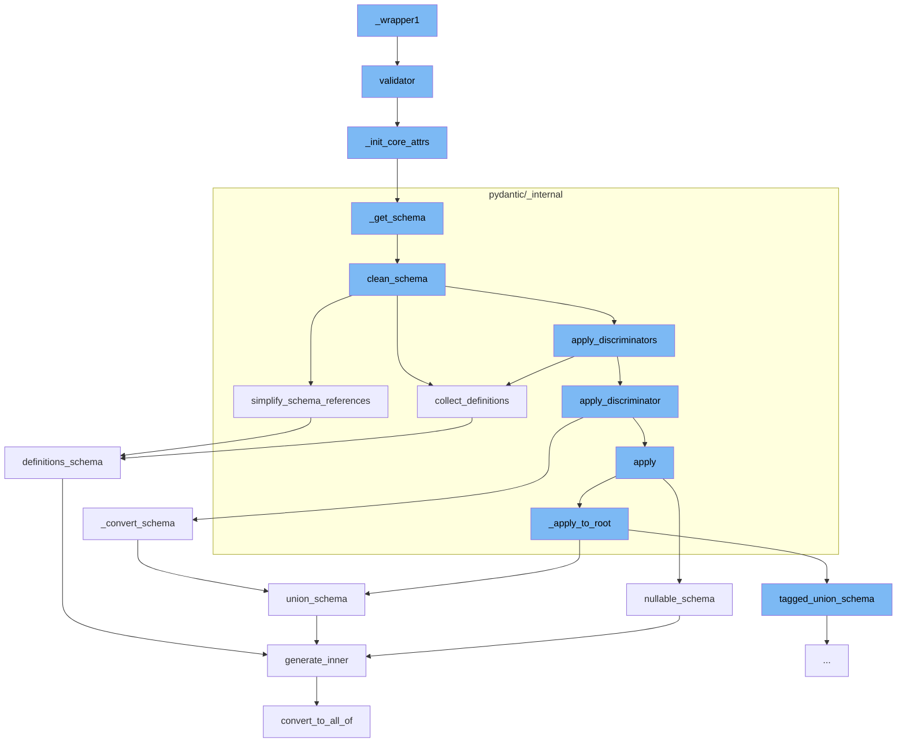

This document will cover the process of data validation in Pydantic, which includes:

1. Initiating the validator
2. Initializing core attributes
3. Generating and cleaning the schema
4. Applying discriminators to the schema
5. Converting and simplifying the schema



<SwmSnippet path="/pydantic/type_adapter.py" line="314">

---

# Initiating the validator

The function `validator` is used to initiate the Pydantic-core SchemaValidator used to validate instances of the model.

```python
    def validator(self) -> SchemaValidator:
        """The pydantic-core SchemaValidator used to validate instances of the model."""
        if not isinstance(self._validator, SchemaValidator):
            self._init_core_attrs(rebuild_mocks=True)  # Do not expose MockValSer from public function
        assert isinstance(self._validator, SchemaValidator)
        return self._validator
```

---

</SwmSnippet>

<SwmSnippet path="/pydantic/type_adapter.py" line="275">

---

# Initializing core attributes

The function `_init_core_attrs` is used to initialize core attributes of the model. If the model's core schema, validator, or serializer are not instances of their respective classes, they are created and assigned here.

```python
    def _init_core_attrs(self, rebuild_mocks: bool) -> None:
        try:
            self._core_schema = _getattr_no_parents(self._type, '__pydantic_core_schema__')
            self._validator = _getattr_no_parents(self._type, '__pydantic_validator__')
            self._serializer = _getattr_no_parents(self._type, '__pydantic_serializer__')
        except AttributeError:
            config_wrapper = _config.ConfigWrapper(self._config)
            core_config = config_wrapper.core_config(None)

            self._core_schema = _get_schema(self._type, config_wrapper, parent_depth=self._parent_depth)
            self._validator = create_schema_validator(
                schema=self._core_schema,
                schema_type=self._type,
                schema_type_module=self._module_name,
                schema_type_name=str(self._type),
                schema_kind='TypeAdapter',
                config=core_config,
                plugin_settings=config_wrapper.plugin_settings,
            )
            self._serializer = SchemaSerializer(self._core_schema, core_config)

```

---

</SwmSnippet>

<SwmSnippet path="/pydantic/type_adapter.py" line="54">

---

# Generating and cleaning the schema

The function `_get_schema` generates the schema for the model. After the schema is generated, it is cleaned by the `clean_schema` function in `pydantic/_internal/_generate_schema.py`.

````python
def _get_schema(type_: Any, config_wrapper: _config.ConfigWrapper, parent_depth: int) -> CoreSchema:
    """`BaseModel` uses its own `__module__` to find out where it was defined
    and then looks for symbols to resolve forward references in those globals.
    On the other hand this function can be called with arbitrary objects,
    including type aliases, where `__module__` (always `typing.py`) is not useful.
    So instead we look at the globals in our parent stack frame.

    This works for the case where this function is called in a module that
    has the target of forward references in its scope, but
    does not always work for more complex cases.

    For example, take the following:

    a.py
    ```python
    from typing import Dict, List

    IntList = List[int]
    OuterDict = Dict[str, 'IntList']
    ```

````

---

</SwmSnippet>

<SwmSnippet path="/pydantic/_internal/_generate_schema.py" line="446">

---

# Applying discriminators to the schema

The function `clean_schema` applies discriminators to the schema using the `apply_discriminators` function in `pydantic/_internal/_discriminated_union.py`.

```python
    def clean_schema(self, schema: CoreSchema) -> CoreSchema:
        schema = self.collect_definitions(schema)
        schema = simplify_schema_references(schema)
        if collect_invalid_schemas(schema):
            raise self.CollectedInvalid()
        schema = _discriminated_union.apply_discriminators(schema)
        schema = validate_core_schema(schema)
        return schema
```

---

</SwmSnippet>

<SwmSnippet path="/pydantic/types.py" line="2835">

---

# Converting and simplifying the schema

The function `_convert_schema` converts the schema into a tagged union schema. The schema is then simplified by the `simplify_schema_references` function in `pydantic/_internal/_core_utils.py`.

```python
    def _convert_schema(self, original_schema: core_schema.CoreSchema) -> core_schema.TaggedUnionSchema:
        if original_schema['type'] != 'union':
            # This likely indicates that the schema was a single-item union that was simplified.
            # In this case, we do the same thing we do in
            # `pydantic._internal._discriminated_union._ApplyInferredDiscriminator._apply_to_root`, namely,
            # package the generated schema back into a single-item union.
            original_schema = core_schema.union_schema([original_schema])

        tagged_union_choices = {}
        for i, choice in enumerate(original_schema['choices']):
            tag = None
            if isinstance(choice, tuple):
                choice, tag = choice
            metadata = choice.get('metadata')
            if metadata is not None:
                metadata_tag = metadata.get(_core_utils.TAGGED_UNION_TAG_KEY)
                if metadata_tag is not None:
                    tag = metadata_tag
            if tag is None:
                raise PydanticUserError(
                    f'`Tag` not provided for choice {choice} used with `Discriminator`',
```

---

</SwmSnippet>

&nbsp;

*This is an auto-generated document by Swimm AI 🌊 and has not yet been verified by a human*

<SwmMeta version="3.0.0" repo-id="Z2l0aHViJTNBJTNBREVNTy1weWRhbnRpYyUzQSUzQWdpbGFkbmF2b3Q=" repo-name="DEMO-pydantic" doc-type="flows"><sup>Powered by [Swimm](/)</sup></SwmMeta>
