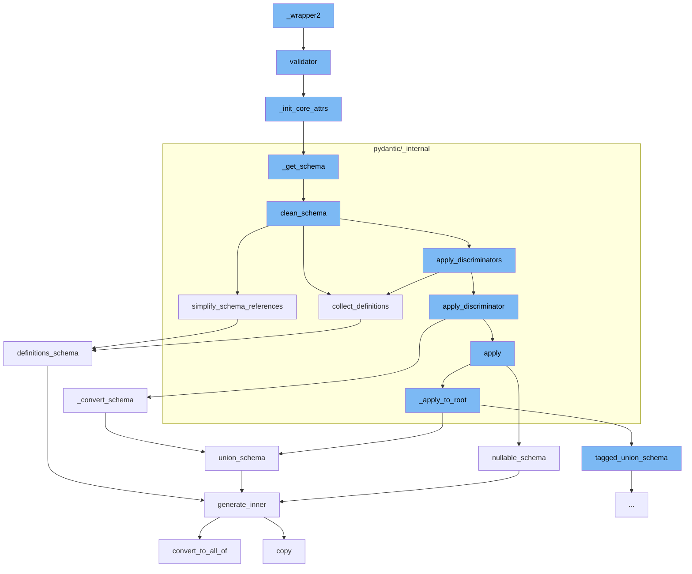

This document will cover the process of data validation in Pydantic, which includes:

1. Calling the validator function
2. Initializing core attributes
3. Getting the schema
4. Cleaning the schema
5. Simplifying schema references
6. Collecting definitions
7. Converting the schema
8. Applying the schema to the root
9. Generating the inner schema



<SwmSnippet path="/pydantic/type_adapter.py" line="314">

---

# Calling the validator function

The function `validator` is used to validate instances of the model. If the validator is not an instance of `SchemaValidator`, it initializes the core attributes.

```python
    def validator(self) -> SchemaValidator:
        """The pydantic-core SchemaValidator used to validate instances of the model."""
        if not isinstance(self._validator, SchemaValidator):
            self._init_core_attrs(rebuild_mocks=True)  # Do not expose MockValSer from public function
        assert isinstance(self._validator, SchemaValidator)
        return self._validator
```

---

</SwmSnippet>

<SwmSnippet path="/pydantic/type_adapter.py" line="275">

---

# Initializing core attributes

The function `_init_core_attrs` is used to initialize the core attributes of the schema. If the core schema, validator, or serializer are not instances of their respective classes, they are created and assigned.

```python
    def _init_core_attrs(self, rebuild_mocks: bool) -> None:
        try:
            self._core_schema = _getattr_no_parents(self._type, '__pydantic_core_schema__')
            self._validator = _getattr_no_parents(self._type, '__pydantic_validator__')
            self._serializer = _getattr_no_parents(self._type, '__pydantic_serializer__')
        except AttributeError:
            config_wrapper = _config.ConfigWrapper(self._config)
            core_config = config_wrapper.core_config(None)

            self._core_schema = _get_schema(self._type, config_wrapper, parent_depth=self._parent_depth)
            self._validator = create_schema_validator(
                schema=self._core_schema,
                schema_type=self._type,
                schema_type_module=self._module_name,
                schema_type_name=str(self._type),
                schema_kind='TypeAdapter',
                config=core_config,
                plugin_settings=config_wrapper.plugin_settings,
            )
            self._serializer = SchemaSerializer(self._core_schema, core_config)

```

---

</SwmSnippet>

<SwmSnippet path="/pydantic/type_adapter.py" line="54">

---

# Getting the schema

The function `_get_schema` is used to get the schema of the type. It generates the schema and cleans it before returning.

````python
def _get_schema(type_: Any, config_wrapper: _config.ConfigWrapper, parent_depth: int) -> CoreSchema:
    """`BaseModel` uses its own `__module__` to find out where it was defined
    and then looks for symbols to resolve forward references in those globals.
    On the other hand this function can be called with arbitrary objects,
    including type aliases, where `__module__` (always `typing.py`) is not useful.
    So instead we look at the globals in our parent stack frame.

    This works for the case where this function is called in a module that
    has the target of forward references in its scope, but
    does not always work for more complex cases.

    For example, take the following:

    a.py
    ```python
    from typing import Dict, List

    IntList = List[int]
    OuterDict = Dict[str, 'IntList']
    ```

````

---

</SwmSnippet>

<SwmSnippet path="/pydantic/_internal/_generate_schema.py" line="446">

---

# Cleaning the schema

The function `clean_schema` is used to clean the schema. It collects definitions, simplifies schema references, applies discriminators, and validates the core schema.

```python
    def clean_schema(self, schema: CoreSchema) -> CoreSchema:
        schema = self.collect_definitions(schema)
        schema = simplify_schema_references(schema)
        if collect_invalid_schemas(schema):
            raise self.CollectedInvalid()
        schema = _discriminated_union.apply_discriminators(schema)
        schema = validate_core_schema(schema)
        return schema
```

---

</SwmSnippet>

<SwmSnippet path="/pydantic/_internal/_core_utils.py" line="417">

---

# Simplifying schema references

The function `simplify_schema_references` is used to simplify the schema references. It counts the references and inlines them if possible.

```python
def simplify_schema_references(schema: core_schema.CoreSchema) -> core_schema.CoreSchema:  # noqa: C901
    definitions: dict[str, core_schema.CoreSchema] = {}
    ref_counts: dict[str, int] = defaultdict(int)
    involved_in_recursion: dict[str, bool] = {}
    current_recursion_ref_count: dict[str, int] = defaultdict(int)

    def collect_refs(s: core_schema.CoreSchema, recurse: Recurse) -> core_schema.CoreSchema:
        if s['type'] == 'definitions':
            for definition in s['definitions']:
                ref = get_ref(definition)
                assert ref is not None
                if ref not in definitions:
                    definitions[ref] = definition
                recurse(definition, collect_refs)
            return recurse(s['schema'], collect_refs)
        else:
            ref = get_ref(s)
            if ref is not None:
                new = recurse(s, collect_refs)
                new_ref = get_ref(new)
                if new_ref:
```

---

</SwmSnippet>

<SwmSnippet path="/pydantic/_internal/_generate_schema.py" line="455">

---

# Collecting definitions

The function `collect_definitions` is used to collect the definitions from the schema. It generates the inner schema for each definition.

```python
    def collect_definitions(self, schema: CoreSchema) -> CoreSchema:
        ref = cast('str | None', schema.get('ref', None))
        if ref:
            self.defs.definitions[ref] = schema
        if 'ref' in schema:
            schema = core_schema.definition_reference_schema(schema['ref'])
        return core_schema.definitions_schema(
            schema,
            list(self.defs.definitions.values()),
```

---

</SwmSnippet>

<SwmSnippet path="/pydantic/types.py" line="2835">

---

# Converting the schema

The function `_convert_schema` is used to convert the schema. It creates a tagged union schema from the original schema.

```python
    def _convert_schema(self, original_schema: core_schema.CoreSchema) -> core_schema.TaggedUnionSchema:
        if original_schema['type'] != 'union':
            # This likely indicates that the schema was a single-item union that was simplified.
            # In this case, we do the same thing we do in
            # `pydantic._internal._discriminated_union._ApplyInferredDiscriminator._apply_to_root`, namely,
            # package the generated schema back into a single-item union.
            original_schema = core_schema.union_schema([original_schema])

        tagged_union_choices = {}
        for i, choice in enumerate(original_schema['choices']):
            tag = None
            if isinstance(choice, tuple):
                choice, tag = choice
            metadata = choice.get('metadata')
            if metadata is not None:
                metadata_tag = metadata.get(_core_utils.TAGGED_UNION_TAG_KEY)
                if metadata_tag is not None:
                    tag = metadata_tag
            if tag is None:
                raise PydanticUserError(
                    f'`Tag` not provided for choice {choice} used with `Discriminator`',
```

---

</SwmSnippet>

<SwmSnippet path="/pydantic/_internal/_discriminated_union.py" line="1090">

---

# Applying the schema to the root

The function `nullable_schema` is used to generate a JSON schema that matches a schema that allows null values. It generates the inner schema for the given schema.

```python

```

---

</SwmSnippet>

<SwmSnippet path="/pydantic/json_schema.py" line="445">

---

# Generating the inner schema

The function `generate_inner` is used to generate the inner schema. It populates the definitions and converts to 'allOf' if necessary.

```python
    def generate_inner(self, schema: CoreSchemaOrField) -> JsonSchemaValue:  # noqa: C901
        """Generates a JSON schema for a given core schema.

        Args:
            schema: The given core schema.

        Returns:
            The generated JSON schema.
        """
        # If a schema with the same CoreRef has been handled, just return a reference to it
        # Note that this assumes that it will _never_ be the case that the same CoreRef is used
        # on types that should have different JSON schemas
        if 'ref' in schema:
            core_ref = CoreRef(schema['ref'])  # type: ignore[typeddict-item]
            core_mode_ref = (core_ref, self.mode)
            if core_mode_ref in self.core_to_defs_refs and self.core_to_defs_refs[core_mode_ref] in self.definitions:
                return {'$ref': self.core_to_json_refs[core_mode_ref]}

        # Generate the JSON schema, accounting for the json_schema_override and core_schema_override
        metadata_handler = _core_metadata.CoreMetadataHandler(schema)

```

---

</SwmSnippet>

&nbsp;

*This is an auto-generated document by Swimm AI 🌊 and has not yet been verified by a human*

<SwmMeta version="3.0.0" repo-id="Z2l0aHViJTNBJTNBREVNTy1weWRhbnRpYyUzQSUzQWdpbGFkbmF2b3Q=" repo-name="DEMO-pydantic" doc-type="flows"><sup>Powered by [Swimm](/)</sup></SwmMeta>
