This document will cover the process of data validation in Pydantic, specifically focusing on the function `__init__` in the file `pydantic/_internal/_validate_call.py`. We will explore the flow of function calls starting from `__init__`, and how each function contributes to the overall data validation process. The topics covered include:

1. The initiation of the data validation process
2. The generation of the data schema
3. The validation of different data types
4. The handling of dataclass and model schemas
5. The application of field serializers and discriminators.

```mermaid
graph TD;
subgraph pydantic/_internal
  __init__:::mainFlowStyle --> clean_schema
end
subgraph pydantic/_internal
  __init__:::mainFlowStyle --> generate_schema
end
subgraph pydantic/_internal
  clean_schema --> apply_discriminators
end
subgraph pydantic/_internal
  clean_schema --> simplify_schema_references
end
subgraph pydantic/_internal
  clean_schema --> collect_definitions
end
subgraph pydantic/_internal
  apply_discriminators --> apply_discriminator
end
subgraph pydantic/_internal
  apply_discriminators --> collect_definitions
end
  simplify_schema_references --> definitions_schema
  collect_definitions --> definitions_schema
subgraph pydantic/_internal
  generate_schema:::mainFlowStyle --> _generate_schema_from_property
end
subgraph pydantic/_internal
  generate_schema:::mainFlowStyle --> _generate_schema_inner
end
  _generate_schema_from_property --> chain_schema
  chain_schema --> generate_inner
subgraph pydantic/_internal
  _generate_schema_inner:::mainFlowStyle --> _model_schema
end
subgraph pydantic/_internal
  _generate_schema_inner:::mainFlowStyle --> _annotated_schema
end
subgraph pydantic/_internal
  _generate_schema_inner:::mainFlowStyle --> match_type
end
subgraph pydantic/_internal
  _model_schema --> _generate_md_field_schema
end
  _model_schema --> model_fields_schema
subgraph pydantic/_internal
  _model_schema --> _computed_field_schema
end
subgraph pydantic/_internal
  _model_schema --> define_expected_missing_refs
end
  model_fields_schema --> _named_required_fields_schema
  model_fields_schema --> generate_inner
subgraph pydantic/_internal
  _computed_field_schema --> _apply_field_serializers
end
subgraph pydantic/_internal
  _computed_field_schema --> get_function_return_type
end
  define_expected_missing_refs --> definitions_schema
subgraph pydantic/_internal
  match_type:::mainFlowStyle --> _typed_dict_schema
end
subgraph pydantic/_internal
  match_type:::mainFlowStyle --> _namedtuple_schema
end
subgraph pydantic/_internal
  match_type:::mainFlowStyle --> _callable_schema
end
subgraph pydantic/_internal
  match_type:::mainFlowStyle --> _unsubstituted_typevar_schema
end
subgraph pydantic/_internal
  match_type:::mainFlowStyle --> _match_generic_type
end
subgraph pydantic/_internal
  _typed_dict_schema --> _generate_td_field_schema
end
subgraph pydantic/_internal
  _typed_dict_schema --> _computed_field_schema
end
  _typed_dict_schema --> typed_dict_schema
subgraph pydantic/_internal
  _typed_dict_schema --> _apply_model_serializers
end
  typed_dict_schema --> _named_required_fields_schema
subgraph pydantic/_internal
  _apply_model_serializers --> get_function_return_type
end
subgraph pydantic/_internal
  _apply_model_serializers --> inspect_model_serializer
end
subgraph pydantic/_internal
  _namedtuple_schema --> _generate_parameter_schema
end
  _namedtuple_schema --> arguments_schema
  _namedtuple_schema --> call_schema
  _generate_parameter_schema --> from_annotated_attribute
  _generate_parameter_schema --> from_annotation
  arguments_schema --> p_arguments_schema
  arguments_schema --> kw_arguments_schema
  call_schema --> generate_inner
subgraph pydantic/_internal
  _callable_schema --> _generate_parameter_schema
end
  _callable_schema --> arguments_schema
  _callable_schema --> call_schema
subgraph pydantic/_internal
  _callable_schema --> get_function_type_hints
end
subgraph pydantic/_internal
  get_function_type_hints --> get_type_hints
end
subgraph pydantic/_internal
  get_function_type_hints --> add_module_globals
end
subgraph pydantic/_internal
  _unsubstituted_typevar_schema --> _union_schema
end
  _union_schema --> union_schema
  _union_schema --> nullable_schema
subgraph pydantic/_internal
  _match_generic_type:::mainFlowStyle --> _typed_dict_schema
end
subgraph pydantic/_internal
  _match_generic_type:::mainFlowStyle --> _namedtuple_schema
end
subgraph pydantic/_internal
  _match_generic_type:::mainFlowStyle --> _subclass_schema
end
subgraph pydantic/_internal
  _match_generic_type:::mainFlowStyle --> _sequence_schema
end
subgraph pydantic/_internal
  _match_generic_type:::mainFlowStyle --> _dataclass_schema
end
subgraph pydantic/_internal
  _subclass_schema --> _union_is_subclass_schema
end
  _subclass_schema --> union_schema
subgraph pydantic/_internal
  _subclass_schema --> _type_schema
end
  _union_is_subclass_schema --> union_schema
  union_schema --> generate_inner
  _type_schema --> custom_error_schema
  _sequence_schema --> list_schema
  _sequence_schema --> chain_schema
  _sequence_schema --> json_or_python_schema
  list_schema --> generate_inner
  json_or_python_schema --> generate_inner
subgraph pydantic/_internal
  _dataclass_schema:::mainFlowStyle --> _computed_field_schema
end
  _dataclass_schema:::mainFlowStyle --> dataclass_args_schema
subgraph pydantic/_internal
  _dataclass_schema:::mainFlowStyle --> collect_dataclass_fields
end
  _dataclass_schema:::mainFlowStyle --> dataclass_schema
subgraph pydantic/_internal
  _dataclass_schema:::mainFlowStyle --> _generate_dc_field_schema
end
subgraph pydantic/_internal
  _apply_field_serializers --> get_function_return_type
end
subgraph pydantic/_internal
  get_function_return_type --> get_function_type_hints
end
  dataclass_args_schema --> _named_required_fields_schema
  _named_required_fields_schema --> generate_inner
  collect_dataclass_fields --> from_annotated_attribute
  from_annotated_attribute --> merge_field_infos
  from_annotated_attribute --> _from_dataclass_field
  dataclass_schema --> generate_inner
  generate_inner --> convert_to_all_of
  generate_inner --> copy
subgraph pydantic/_internal
  _generate_dc_field_schema:::mainFlowStyle --> _common_field_schema
end
subgraph pydantic/_internal
  _common_field_schema:::mainFlowStyle --> _apply_discriminator_to_union
end
subgraph pydantic/_internal
  _common_field_schema:::mainFlowStyle --> _apply_field_serializers
end
  _common_field_schema:::mainFlowStyle --> from_annotation
subgraph pydantic/_internal
  _common_field_schema:::mainFlowStyle --> _apply_annotations
end
subgraph pydantic/_internal
  _apply_discriminator_to_union --> apply_discriminator
end
subgraph pydantic/_internal
  apply_discriminator --> apply
end
  apply_discriminator --> _convert_schema
  from_annotation --> merge_field_infos
  from_annotation --> copy
  merge_field_infos --> copy
subgraph pydantic/_internal
  _apply_annotations:::mainFlowStyle --> _generate_schema_from_property
end
subgraph pydantic/_internal
  _apply_annotations:::mainFlowStyle --> _get_wrapped_inner_schema
end
  _get_wrapped_inner_schema:::mainFlowStyle --> ...

 classDef mainFlowStyle color:#000000,fill:#7CB9F4
  classDef rootsStyle color:#000000,fill:#00FFF4
```



<SwmSnippet path="/pydantic/_internal/_validate_call.py" line="446">

---

# Initiation of the Data Validation Process

The `clean_schema` function initiates the data validation process. It collects definitions from the schema, simplifies schema references, checks for invalid schemas, applies discriminators to the schema, and finally validates the core schema.

```python

```

---

</SwmSnippet>

<SwmSnippet path="/pydantic/_internal/_generate_schema.py" line="654">

---

# Generation of the Data Schema

The `_generate_schema_from_property` function generates the schema from the `__get_pydantic_core_schema__` function or `__pydantic_core_schema__` property. It prioritizes the `__get_pydantic_core_schema__` function so it can decide whether to use a `__pydantic_core_schema__` attribute or generate a fresh schema.

```python
    def _generate_schema_from_property(self, obj: Any, source: Any) -> core_schema.CoreSchema | None:
        """Try to generate schema from either the `__get_pydantic_core_schema__` function or
        `__pydantic_core_schema__` property.

        Note: `__get_pydantic_core_schema__` takes priority so it can
        decide whether to use a `__pydantic_core_schema__` attribute, or generate a fresh schema.
        """
        # avoid calling `__get_pydantic_core_schema__` if we've already visited this object
        if is_self_type(obj):
            obj = self.model_type_stack.get()
        with self.defs.get_schema_or_ref(obj) as (_, maybe_schema):
            if maybe_schema is not None:
                return maybe_schema
        if obj is source:
            ref_mode = 'unpack'
        else:
            ref_mode = 'to-def'

        schema: CoreSchema

        if (get_schema := getattr(obj, '__get_pydantic_core_schema__', None)) is not None:
```

---

</SwmSnippet>

<SwmSnippet path="/pydantic/_internal/_generate_schema.py" line="1253">

---

# Validation of Different Data Types

The `_typed_dict_schema` function generates the schema for a TypedDict. It checks if the type annotation for `__pydantic_extra__` is `Dict[str, ...]` and if the extra items type is not `Any`, it generates the schema for the extra items type.

```python
    def _typed_dict_schema(self, typed_dict_cls: Any, origin: Any) -> core_schema.CoreSchema:
        """Generate schema for a TypedDict.

        It is not possible to track required/optional keys in TypedDict without __required_keys__
        since TypedDict.__new__ erases the base classes (it replaces them with just `dict`)
        and thus we can track usage of total=True/False
        __required_keys__ was added in Python 3.9
        (https://github.com/miss-islington/cpython/blob/1e9939657dd1f8eb9f596f77c1084d2d351172fc/Doc/library/typing.rst?plain=1#L1546-L1548)
        however it is buggy
        (https://github.com/python/typing_extensions/blob/ac52ac5f2cb0e00e7988bae1e2a1b8257ac88d6d/src/typing_extensions.py#L657-L666).

        On 3.11 but < 3.12 TypedDict does not preserve inheritance information.

        Hence to avoid creating validators that do not do what users expect we only
        support typing.TypedDict on Python >= 3.12 or typing_extension.TypedDict on all versions
        """
        from ..fields import FieldInfo

        with self.model_type_stack.push(typed_dict_cls), self.defs.get_schema_or_ref(typed_dict_cls) as (
            typed_dict_ref,
            maybe_schema,
```

---

</SwmSnippet>

<SwmSnippet path="/pydantic/_internal/_generate_schema.py" line="524">

---

# Handling of Dataclass and Model Schemas

The `_model_schema` function generates the schema for a Pydantic model. It applies field serializers to the model schema and applies model validators to the schema.

```python
    def _model_schema(self, cls: type[BaseModel]) -> core_schema.CoreSchema:
        """Generate schema for a Pydantic model."""
        with self.defs.get_schema_or_ref(cls) as (model_ref, maybe_schema):
            if maybe_schema is not None:
                return maybe_schema

            fields = cls.model_fields
            decorators = cls.__pydantic_decorators__
            computed_fields = decorators.computed_fields
            check_decorator_fields_exist(
                chain(
                    decorators.field_validators.values(),
                    decorators.field_serializers.values(),
                    decorators.validators.values(),
                ),
                {*fields.keys(), *computed_fields.keys()},
            )
            config_wrapper = ConfigWrapper(cls.model_config, check=False)
            core_config = config_wrapper.core_config(cls)
            title = self._get_model_title_from_config(cls, config_wrapper)
            metadata = build_metadata_dict(js_functions=[partial(modify_model_json_schema, cls=cls, title=title)])
```

---

</SwmSnippet>

<SwmSnippet path="/pydantic/_internal/_generate_schema.py" line="1983">

---

# Application of Field Serializers and Discriminators

The `_apply_field_serializers` function applies field serializers to a schema. It checks if there are any serializers and applies the last serializer to make it easy to override a serializer set on a parent model.

```python
    def _apply_field_serializers(
        self,
        schema: core_schema.CoreSchema,
        serializers: list[Decorator[FieldSerializerDecoratorInfo]],
        computed_field: bool = False,
    ) -> core_schema.CoreSchema:
        """Apply field serializers to a schema."""
        if serializers:
            schema = copy(schema)
            if schema['type'] == 'definitions':
                inner_schema = schema['schema']
                schema['schema'] = self._apply_field_serializers(inner_schema, serializers)
                return schema
            else:
                ref = typing.cast('str|None', schema.get('ref', None))
                if ref is not None:
                    schema = core_schema.definition_reference_schema(ref)

            # use the last serializer to make it easy to override a serializer set on a parent model
            serializer = serializers[-1]
            is_field_serializer, info_arg = inspect_field_serializer(
```

---

</SwmSnippet>

&nbsp;

*This is an auto-generated document by Swimm AI 🌊 and has not yet been verified by a human*

<SwmMeta version="3.0.0" repo-id="Z2l0aHViJTNBJTNBREVNTy1weWRhbnRpYyUzQSUzQWdpbGFkbmF2b3Q=" repo-name="DEMO-pydantic" doc-type="flows"><sup>Powered by [Swimm](/)</sup></SwmMeta>
