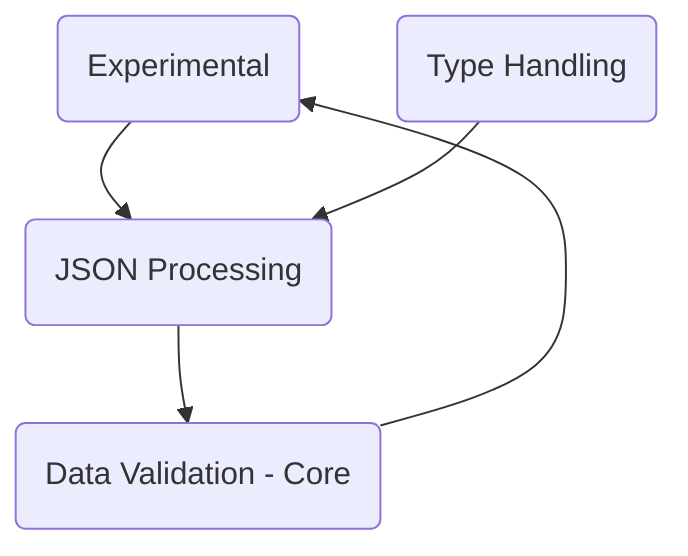

DEMO-pydantic is a Python library that provides data validation using Python type hints. It allows developers to define data in pure Python 3.8+ and validate it with Pydantic. The library includes various modules and functions that handle different aspects of data validation, such as model validation, signature generation, and more. It also includes utilities for handling different data types and structures, like tuples, strings, and JSON. The repo also contains documentation and scripts related to the Pydantic project.

## Modules

### Data Validation - Core

The core of data validation in Pydantic is handled by the <SwmToken path="/pydantic/main.py" pos="80:2:2" line-data="class BaseModel(metaclass=_model_construction.ModelMetaclass):">`BaseModel`</SwmToken> class and its methods. The <SwmToken path="/pydantic/main.py" pos="80:2:2" line-data="class BaseModel(metaclass=_model_construction.ModelMetaclass):">`BaseModel`</SwmToken> class provides a structure for data validation and settings management. It includes methods for initializing a model, validating data, creating a model dynamically, and copying a model. The <SwmToken path="/pydantic/main.py" pos="80:2:2" line-data="class BaseModel(metaclass=_model_construction.ModelMetaclass):">`BaseModel`</SwmToken> class also uses various helper functions and classes to perform its tasks.

- <SwmLink doc-title="Understanding Core Data Validation">[Understanding Core Data Validation](/.swm/understanding-core-data-validation.yx4ramb1.sw.md)</SwmLink>
- <SwmLink doc-title="Overview of the BaseModel Class">[Overview of the BaseModel Class](/.swm/overview-of-the-basemodel-class.mr4w3.sw.md)</SwmLink>
- <SwmLink doc-title="Getting Started with the Validate Call Decorator">[Getting Started with the Validate Call Decorator](/.swm/getting-started-with-the-validate-call-decorator.3lbqta8g.sw.md)</SwmLink>
- <SwmLink doc-title="Pydantics Core Schema Generation and Validation">[Pydantics Core Schema Generation and Validation](/.swm/pydantics-core-schema-generation-and-validation.uf9wfz2p.sw.md)</SwmLink>

### Data Validation - Advanced

Advanced data validation in Pydantic allows for more complex validation logic to be applied to data. This includes applying validation logic before, after, or instead of the inner validation logic, or even wrapping the validation logic around the inner validation. This is achieved through the use of various classes and functions in the <SwmPath>[pydantic/functional_validators.py](/pydantic/functional_validators.py)</SwmPath> file, such as <SwmToken path="/pydantic/functional_validators.py" pos="29:2:2" line-data="class AfterValidator:">`AfterValidator`</SwmToken>, <SwmToken path="/pydantic/functional_validators.py" pos="85:2:2" line-data="class BeforeValidator:">`BeforeValidator`</SwmToken>, <SwmToken path="/pydantic/functional_validators.py" pos="129:2:2" line-data="class PlainValidator:">`PlainValidator`</SwmToken>, <SwmToken path="/pydantic/functional_validators.py" pos="181:2:2" line-data="class WrapValidator:">`WrapValidator`</SwmToken>, <SwmToken path="/pydantic/functional_validators.py" pos="272:2:2" line-data="def field_validator(">`field_validator`</SwmToken>, and <SwmToken path="/pydantic/functional_validators.py" pos="393:5:5" line-data="    &quot;&quot;&quot;@model_validator decorated function handler argument type. This is used when `mode=&#39;wrap&#39;`.&quot;&quot;&quot;">`model_validator`</SwmToken>. These classes and functions allow developers to define custom validation logic and apply it to specific fields or models in a flexible manner.

- <SwmLink doc-title="Advanced Data Validation in Pydantic">[Advanced Data Validation in Pydantic](/.swm/advanced-data-validation-in-pydantic.hd57io1m.sw.md)</SwmLink>
- <SwmLink doc-title="Generic Root Validator Creation in Pydantic">[Generic Root Validator Creation in Pydantic](/.swm/generic-root-validator-creation-in-pydantic.d8xoht7p.sw.md)</SwmLink>
- <SwmLink doc-title="Data Validation Flow">[Data Validation Flow](/.swm/data-validation-flow.129j1puy.sw.md)</SwmLink>
- **Class Validators**
  - <SwmLink doc-title="Exploring the interaction between class validator functions and Pydantic data models">[Exploring the interaction between class validator functions and Pydantic data models](/.swm/exploring-the-interaction-between-class-validator-functions-and-pydantic-data-models.9hyp596j.sw.md)</SwmLink>
  - <SwmLink doc-title="Defining the role of class validators in Pydantics data validation">[Defining the role of class validators in Pydantics data validation](/.swm/defining-the-role-of-class-validators-in-pydantics-data-validation.1ibh7jra.sw.md)</SwmLink>
  - <SwmLink doc-title="Demystifying the migration process from V1 to V2 of Pydantic - the case of getattr_migration">[Demystifying the migration process from V1 to V2 of Pydantic - the case of getattr_migration](/.swm/demystifying-the-migration-process-from-v1-to-v2-of-pydantic-the-case-of-getattr_migration.ty0mtwgu.sw.md)</SwmLink>

### Type Handling

Type handling in Pydantic involves the use of Python's type hints to validate data. Pydantic provides several built-in types and allows for the creation of custom types. The library uses these types to validate data when creating instances of data classes. This ensures that the data conforms to the expected structure and type, reducing the likelihood of runtime errors due to incorrect data types or structures.

- <SwmLink doc-title="Getting Started with Type Handling">[Getting Started with Type Handling](/.swm/getting-started-with-type-handling.n25dluos.sw.md)</SwmLink>
- <SwmLink doc-title="Overview of EncodedBytes">[Overview of EncodedBytes](/.swm/overview-of-encodedbytes.7d4t8.sw.md)</SwmLink>
- <SwmLink doc-title="Understanding Basic Type Definitions">[Understanding Basic Type Definitions](/.swm/understanding-basic-type-definitions.mdgf21vb.sw.md)</SwmLink>
- <SwmLink doc-title="Getting started with Complex Type Definitions">[Getting started with Complex Type Definitions](/.swm/getting-started-with-complex-type-definitions.sdbvob5y.sw.md)</SwmLink>
- <SwmLink doc-title="Pydantics Type Adapter Serialization">[Pydantics Type Adapter Serialization](/.swm/pydantics-type-adapter-serialization.dof0jhvm.sw.md)</SwmLink>

### JSON Processing

JSON processing in Pydantic involves validating, serializing, and deserializing JSON data. Pydantic provides several functionalities for JSON processing, such as generating JSON schemas for models, validating JSON data against these schemas, and handling JSON data types. The Pydantic library uses Python's type hinting feature to perform these tasks, ensuring type safety and reducing runtime errors.

- <SwmLink doc-title="Understanding JSON Processing">[Understanding JSON Processing](/.swm/understanding-json-processing.uvksorqe.sw.md)</SwmLink>
- <SwmLink doc-title="Understanding JSON Schema">[Understanding JSON Schema](/.swm/understanding-json-schema.u88bxbkh.sw.md)</SwmLink>
- <SwmLink doc-title="JSON Schema Generation in Pydantic">[JSON Schema Generation in Pydantic](/.swm/json-schema-generation-in-pydantic.8jebx0se.sw.md)</SwmLink>
- **JSON Validation**
  - <SwmLink doc-title="Introduction to JSON Validation">[Introduction to JSON Validation](/.swm/introduction-to-json-validation.ancunlwh.sw.md)</SwmLink>
  - <SwmLink doc-title="Major Differences between Pydantic V1.10 and V2: The Need for Backward Compatibility">[Major Differences between Pydantic V1.10 and V2: The Need for Backward Compatibility](/.swm/major-differences-between-pydantic-v110-and-v2-the-need-for-backward-compatibility.xwq0t7p9.sw.md)</SwmLink>
  - <SwmLink doc-title="Overview of the GetJsonSchemaHandler Class">[Overview of the GetJsonSchemaHandler Class](/.swm/overview-of-the-getjsonschemahandler-class.8v9ns.sw.md)</SwmLink>

### Plugin

The <SwmPath>[pydantic/plugin/](/pydantic/plugin/)</SwmPath> directory contains the implementation of the Pydantic plugin system. This system includes a protocol for defining plugins, a loader for managing plugins, and a schema validator. The Pydantic plugin system is used to extend the functionality of Pydantic, a Python library for data validation and settings management.

- <SwmLink doc-title="Understanding Pydantic Plugin System">[Understanding Pydantic Plugin System](/.swm/understanding-pydantic-plugin-system.5oj9vanm.sw.md)</SwmLink>
- **Schema Validator**
  - <SwmLink doc-title="Getting Started with Schema Validator">[Getting Started with Schema Validator](/.swm/getting-started-with-schema-validator.9c1egr1r.sw.md)</SwmLink>
  - <SwmLink doc-title="Understanding Type Hints">[Understanding Type Hints](/.swm/understanding-type-hints.y1c11klg.sw.md)</SwmLink>
  - <SwmLink doc-title="Overview of Plugin Development">[Overview of Plugin Development](/.swm/overview-of-plugin-development.3q1x58z3.sw.md)</SwmLink>
- **Loader**
  - <SwmLink doc-title="Getting Started with the Loader Mechanism">[Getting Started with the Loader Mechanism](/.swm/getting-started-with-the-loader-mechanism.uldfmfw8.sw.md)</SwmLink>
  - <SwmLink doc-title="Understanding Data Validation">[Understanding Data Validation](/.swm/understanding-data-validation.nwy1oqi1.sw.md)</SwmLink>
  - <SwmLink doc-title="Getting started with Python 3.8+">[Getting started with Python 3.8+](/.swm/getting-started-with-python-38.bci8vxvn.sw.md)</SwmLink>
- **Plugin Functionality**
  - <SwmLink doc-title="Understanding Pydantic Plugin Functionality">[Understanding Pydantic Plugin Functionality](/.swm/understanding-pydantic-plugin-functionality.gg09gggr.sw.md)</SwmLink>
  - <SwmLink doc-title="Role and Impact of the PYDANTIC_DISABLE_PLUGINS Environment Variable">[Role and Impact of the PYDANTIC_DISABLE_PLUGINS Environment Variable](/.swm/role-and-impact-of-the-pydantic_disable_plugins-environment-variable.ho9zvor7.sw.md)</SwmLink>
  - <SwmLink doc-title="Basic Concepts of Plugin Initialization">[Basic Concepts of Plugin Initialization](/.swm/basic-concepts-of-plugin-initialization.cgp6vohe.sw.md)</SwmLink>
  - <SwmLink doc-title="Introduction to Data Loading in Pydantic">[Introduction to Data Loading in Pydantic](/.swm/introduction-to-data-loading-in-pydantic.i26bhggq.sw.md)</SwmLink>

### Experimental

The <SwmPath>[pydantic/experimental/](/pydantic/experimental/)</SwmPath> directory contains experimental features of the Pydantic library. Experimental features in Pydantic are potential new functionalities that are currently being tested and refined. They are not stable and may undergo significant changes or even removal. These features are housed in the 'experimental' module of Pydantic. This module is explicitly marked as experimental to warn users about the potential instability and changes in its features. The code in this module, such as the pipeline API functionality, is subject to change and should be used with caution.

- <SwmLink doc-title="Introduction to Pydantic Experimental Features">[Introduction to Pydantic Experimental Features](/.swm/introduction-to-pydantic-experimental-features.sokvvb1b.sw.md)</SwmLink>

### Deprecated Features

Deprecated features are parts of the codebase that are no longer recommended for use and are likely to be removed in future versions. In Pydantic, these features are marked with a special warning called <SwmToken path="/pydantic/deprecated/tools.py" pos="16:1:1" line-data="    DeprecationWarning = PydanticDeprecatedSince20">`DeprecationWarning`</SwmToken>, which is an alias for <SwmToken path="/pydantic/warnings.py" pos="49:2:2" line-data="class PydanticDeprecatedSince20(PydanticDeprecationWarning):">`PydanticDeprecatedSince20`</SwmToken>. This warning is used across different modules in the <SwmPath>[pydantic/deprecated//](/pydantic/deprecated//)</SwmPath> directory to indicate deprecated features. For instance, the <SwmToken path="/pydantic/v1/config.py" pos="80:2:2" line-data="class BaseConfig:">`BaseConfig`</SwmToken> class in <SwmPath>[pydantic/deprecated/config.py](/pydantic/deprecated/config.py)</SwmPath> is marked as deprecated and any attempt to use it will trigger a <SwmToken path="/pydantic/deprecated/tools.py" pos="16:1:1" line-data="    DeprecationWarning = PydanticDeprecatedSince20">`DeprecationWarning`</SwmToken>. Developers are advised to avoid using deprecated features and to migrate their code to use the recommended alternatives.

- <SwmLink doc-title="PydanticDeprecationWarning Overview">[PydanticDeprecationWarning Overview](/.swm/pydanticdeprecationwarning-overview.kqb4e.sw.md)</SwmLink>
- <SwmLink doc-title="Protocol Class Overview">[Protocol Class Overview](/.swm/protocol-class-overview.03g5n.sw.md)</SwmLink>

### Classes

- <SwmLink doc-title="Overview of the GetCoreSchemaHandler Class">[Overview of the GetCoreSchemaHandler Class](/.swm/overview-of-the-getcoreschemahandler-class.ys9w5.sw.md)</SwmLink>
- <SwmLink doc-title="Overview of StandardDataclass in Pydantic">[Overview of StandardDataclass in Pydantic](/.swm/overview-of-standarddataclass-in-pydantic.a61oo.sw.md)</SwmLink>
- <SwmLink doc-title="Overview of PydanticMetadata">[Overview of PydanticMetadata](/.swm/overview-of-pydanticmetadata.nc2w5.sw.md)</SwmLink>

### Flows

- <SwmLink doc-title="Core Schema Generation in Pydantic">[Core Schema Generation in Pydantic](/.swm/core-schema-generation-in-pydantic.y543wtp6.sw.md)</SwmLink>
- <SwmLink doc-title="IP Preparation in Pydantic">[IP Preparation in Pydantic](/.swm/ip-preparation-in-pydantic.zrws5of9.sw.md)</SwmLink>
- <SwmLink doc-title="JSON Schema Generation in Pydantic">[JSON Schema Generation in Pydantic](/.swm/json-schema-generation-in-pydantic.sovrr636.sw.md)</SwmLink>
- <SwmLink doc-title="BaseModel Subclass Configuration">[BaseModel Subclass Configuration](/.swm/basemodel-subclass-configuration.e7vnz1s3.sw.md)</SwmLink>
- <SwmLink doc-title="Update Forward References in Pydantic">[Update Forward References in Pydantic](/.swm/update-forward-references-in-pydantic.pkxlt2ja.sw.md)</SwmLink>
- <SwmLink doc-title="Discriminator Application in Pydantic">[Discriminator Application in Pydantic](/.swm/discriminator-application-in-pydantic.nrjr28pd.sw.md)</SwmLink>

## Build Tools

- <SwmLink doc-title="Usage of Makefile in the Project">[Usage of Makefile in the Project](/.swm/usage-of-makefile-in-the-project.rkhu3t5w.sw.md)</SwmLink>

&nbsp;

*This is an auto-generated document by Swimm AI 🌊 and has not yet been verified by a human*

<SwmMeta version="3.0.0" repo-id="Z2l0aHViJTNBJTNBREVNTy1weWRhbnRpYyUzQSUzQWdpbGFkbmF2b3Q=" repo-name="DEMO-pydantic">Powered by [Swimm](https://app.swimm.io/)</SwmMeta>
