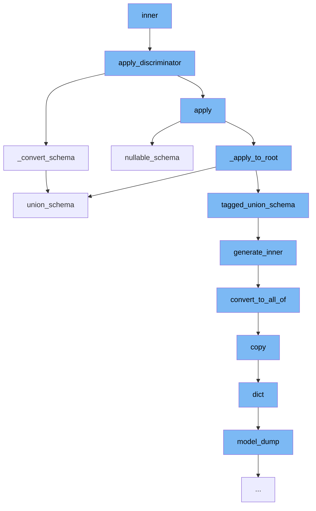

This document will cover the process of applying discriminators in Pydantic, which includes:

1. Applying the discriminator
2. Converting the schema
3. Generating a nullable schema
4. Creating a union schema
5. Generating inner schema
6. Converting to all_of schema
7. Copying the model
8. Dumping the model as a dictionary



<SwmSnippet path="/pydantic/_internal/_discriminated_union.py" line="61">

---

# Applying the discriminator

The function <SwmToken path="/pydantic/_internal/_discriminated_union.py" pos="61:2:2" line-data="def apply_discriminator(">`apply_discriminator`</SwmToken> is used to apply the discriminator and returns a new core schema. It takes in the schema, discriminator, and definitions as arguments.

```python
def apply_discriminator(
    schema: core_schema.CoreSchema,
    discriminator: str | Discriminator,
    definitions: dict[str, core_schema.CoreSchema] | None = None,
) -> core_schema.CoreSchema:
    """Applies the discriminator and returns a new core schema.

    Args:
        schema: The input schema.
        discriminator: The name of the field which will serve as the discriminator.
        definitions: A mapping of schema ref to schema.

    Returns:
        The new core schema.

    Raises:
        TypeError:
            - If `discriminator` is used with invalid union variant.
            - If `discriminator` is used with `Union` type with one variant.
            - If `discriminator` value mapped to multiple choices.
        MissingDefinitionForUnionRef:
```

---

</SwmSnippet>

<SwmSnippet path="/pydantic/types.py" line="2835">

---

# Converting the schema

The function <SwmToken path="/pydantic/types.py" pos="2835:3:3" line-data="    def _convert_schema(self, original_schema: core_schema.CoreSchema) -&gt; core_schema.TaggedUnionSchema:">`_convert_schema`</SwmToken> is used to convert the original schema into a <SwmToken path="/pydantic/types.py" pos="2835:20:20" line-data="    def _convert_schema(self, original_schema: core_schema.CoreSchema) -&gt; core_schema.TaggedUnionSchema:">`TaggedUnionSchema`</SwmToken>. It checks if the original schema type is not 'union' and if so, packages the generated schema back into a <SwmToken path="/pydantic/types.py" pos="2837:19:21" line-data="            # This likely indicates that the schema was a single-item union that was simplified.">`single-item`</SwmToken> union.

```python
    def _convert_schema(self, original_schema: core_schema.CoreSchema) -> core_schema.TaggedUnionSchema:
        if original_schema['type'] != 'union':
            # This likely indicates that the schema was a single-item union that was simplified.
            # In this case, we do the same thing we do in
            # `pydantic._internal._discriminated_union._ApplyInferredDiscriminator._apply_to_root`, namely,
            # package the generated schema back into a single-item union.
            original_schema = core_schema.union_schema([original_schema])

        tagged_union_choices = {}
        for i, choice in enumerate(original_schema['choices']):
            tag = None
            if isinstance(choice, tuple):
                choice, tag = choice
            metadata = choice.get('metadata')
            if metadata is not None:
                metadata_tag = metadata.get(_core_utils.TAGGED_UNION_TAG_KEY)
                if metadata_tag is not None:
                    tag = metadata_tag
            if tag is None:
                raise PydanticUserError(
                    f'`Tag` not provided for choice {choice} used with `Discriminator`',
```

---

</SwmSnippet>

<SwmSnippet path="/pydantic/json_schema.py" line="1090">

---

# Generating a nullable schema

The function <SwmToken path="/pydantic/json_schema.py" pos="1090:3:3" line-data="    def nullable_schema(self, schema: core_schema.NullableSchema) -&gt; JsonSchemaValue:">`nullable_schema`</SwmToken> is used to generate a JSON schema that matches a schema that allows null values.

```python
    def nullable_schema(self, schema: core_schema.NullableSchema) -> JsonSchemaValue:
        """Generates a JSON schema that matches a schema that allows null values.

        Args:
            schema: The core schema.

        Returns:
            The generated JSON schema.
        """
        null_schema = {'type': 'null'}
        inner_json_schema = self.generate_inner(schema['schema'])

        if inner_json_schema == null_schema:
            return null_schema
        else:
            # Thanks to the equality check against `null_schema` above, I think 'oneOf' would also be valid here;
            # I'll use 'anyOf' for now, but it could be changed it if it would work better with some external tooling
            return self.get_flattened_anyof([inner_json_schema, null_schema])
```

---

</SwmSnippet>

<SwmSnippet path="/pydantic/json_schema.py" line="1109">

---

# Creating a union schema

The function <SwmToken path="/pydantic/json_schema.py" pos="1109:3:3" line-data="    def union_schema(self, schema: core_schema.UnionSchema) -&gt; JsonSchemaValue:">`union_schema`</SwmToken> is used to generate a JSON schema that matches a schema that allows values matching any of the given schemas.

```python
    def union_schema(self, schema: core_schema.UnionSchema) -> JsonSchemaValue:
        """Generates a JSON schema that matches a schema that allows values matching any of the given schemas.

        Args:
            schema: The core schema.

        Returns:
            The generated JSON schema.
        """
        generated: list[JsonSchemaValue] = []

        choices = schema['choices']
        for choice in choices:
            # choice will be a tuple if an explicit label was provided
            choice_schema = choice[0] if isinstance(choice, tuple) else choice
            try:
                generated.append(self.generate_inner(choice_schema))
            except PydanticOmit:
                continue
            except PydanticInvalidForJsonSchema as exc:
                self.emit_warning('skipped-choice', exc.message)
```

---

</SwmSnippet>

<SwmSnippet path="/pydantic/json_schema.py" line="445">

---

# Generating inner schema

The function <SwmToken path="/pydantic/json_schema.py" pos="445:3:3" line-data="    def generate_inner(self, schema: CoreSchemaOrField) -&gt; JsonSchemaValue:  # noqa: C901">`generate_inner`</SwmToken> is used to generate a JSON schema based on the input schema.

```python
    def generate_inner(self, schema: CoreSchemaOrField) -> JsonSchemaValue:  # noqa: C901
        """Generates a JSON schema for a given core schema.

        Args:
            schema: The given core schema.

        Returns:
            The generated JSON schema.
        """
        # If a schema with the same CoreRef has been handled, just return a reference to it
        # Note that this assumes that it will _never_ be the case that the same CoreRef is used
        # on types that should have different JSON schemas
        if 'ref' in schema:
            core_ref = CoreRef(schema['ref'])  # type: ignore[typeddict-item]
            core_mode_ref = (core_ref, self.mode)
            if core_mode_ref in self.core_to_defs_refs and self.core_to_defs_refs[core_mode_ref] in self.definitions:
                return {'$ref': self.core_to_json_refs[core_mode_ref]}

        # Generate the JSON schema, accounting for the json_schema_override and core_schema_override
        metadata_handler = _core_metadata.CoreMetadataHandler(schema)

```

---

</SwmSnippet>

<SwmSnippet path="/pydantic/json_schema.py" line="481">

---

# Converting to all_of schema

The function <SwmToken path="/pydantic/json_schema.py" pos="481:3:3" line-data="        def convert_to_all_of(json_schema: JsonSchemaValue) -&gt; JsonSchemaValue:">`convert_to_all_of`</SwmToken> is used to convert the JSON schema to an all_of schema if it contains a '$ref' and other keys.

```python
        def convert_to_all_of(json_schema: JsonSchemaValue) -> JsonSchemaValue:
            if '$ref' in json_schema and len(json_schema.keys()) > 1:
                # technically you can't have any other keys next to a "$ref"
                # but it's an easy mistake to make and not hard to correct automatically here
                json_schema = json_schema.copy()
                ref = json_schema.pop('$ref')
                json_schema = {'allOf': [{'$ref': ref}], **json_schema}
            return json_schema
```

---

</SwmSnippet>

<SwmSnippet path="/pydantic/main.py" line="1251">

---

# Copying the model

The function <SwmToken path="/pydantic/main.py" pos="1251:3:3" line-data="    def copy(">`copy`</SwmToken> is used to return a copy of the model. It takes in include, exclude, update, and deep as arguments.

````python
    def copy(
        self,
        *,
        include: AbstractSetIntStr | MappingIntStrAny | None = None,
        exclude: AbstractSetIntStr | MappingIntStrAny | None = None,
        update: Dict[str, Any] | None = None,  # noqa UP006
        deep: bool = False,
    ) -> Self:  # pragma: no cover
        """Returns a copy of the model.

        !!! warning "Deprecated"
            This method is now deprecated; use `model_copy` instead.

        If you need `include` or `exclude`, use:

        ```py
        data = self.model_dump(include=include, exclude=exclude, round_trip=True)
        data = {**data, **(update or {})}
        copied = self.model_validate(data)
        ```

````

---

</SwmSnippet>

<SwmSnippet path="/pydantic/main.py" line="325">

---

# Dumping the model as a dictionary

The function <SwmToken path="/pydantic/main.py" pos="325:3:3" line-data="    def model_dump(">`model_dump`</SwmToken> is used to generate a dictionary representation of the model, optionally specifying which fields to include or exclude.

```python
    def model_dump(
        self,
        *,
        mode: Literal['json', 'python'] | str = 'python',
        include: IncEx = None,
        exclude: IncEx = None,
        context: Any | None = None,
        by_alias: bool = False,
        exclude_unset: bool = False,
        exclude_defaults: bool = False,
        exclude_none: bool = False,
        round_trip: bool = False,
        warnings: bool | Literal['none', 'warn', 'error'] = True,
        serialize_as_any: bool = False,
    ) -> dict[str, Any]:
        """Usage docs: https://docs.pydantic.dev/2.8/concepts/serialization/#modelmodel_dump

        Generate a dictionary representation of the model, optionally specifying which fields to include or exclude.

        Args:
            mode: The mode in which `to_python` should run.
```

---

</SwmSnippet>

&nbsp;

*This is an auto-generated document by Swimm AI 🌊 and has not yet been verified by a human*

<SwmMeta version="3.0.0" repo-id="Z2l0aHViJTNBJTNBREVNTy1weWRhbnRpYyUzQSUzQWdpbGFkbmF2b3Q=" repo-name="DEMO-pydantic"><sup>Powered by [Swimm](https://app.swimm.io/)</sup></SwmMeta>
