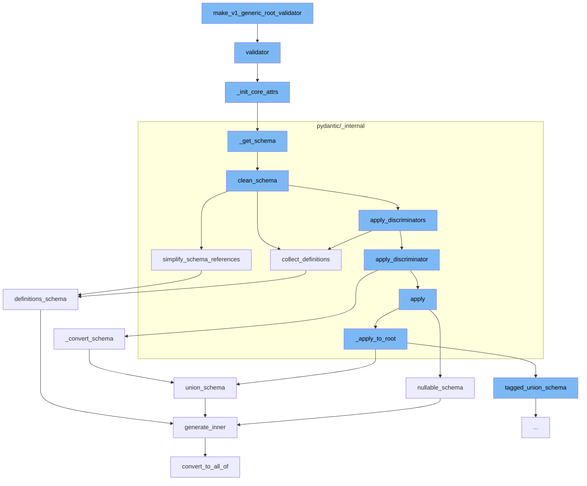

This document will cover the process of creating a generic root validator in Pydantic, which includes:

1. Constructing the validator
2. Initializing core attributes
3. Generating the schema
4. Cleaning the schema
5. Simplifying schema references
6. Collecting definitions
7. Converting the schema
8. Applying the schema to the root



<SwmSnippet path="/pydantic/type_adapter.py" line="314">

---

# Constructing the Validator

The function <SwmToken path="/pydantic/type_adapter.py" pos="314:3:3" line-data="    def validator(self) -&gt; SchemaValidator:">`validator`</SwmToken> is used to construct the <SwmToken path="/pydantic/type_adapter.py" pos="314:10:10" line-data="    def validator(self) -&gt; SchemaValidator:">`SchemaValidator`</SwmToken> used to validate instances of the model.

```python
    def validator(self) -> SchemaValidator:
        """The pydantic-core SchemaValidator used to validate instances of the model."""
        if not isinstance(self._validator, SchemaValidator):
            self._init_core_attrs(rebuild_mocks=True)  # Do not expose MockValSer from public function
        assert isinstance(self._validator, SchemaValidator)
        return self._validator
```

---

</SwmSnippet>

<SwmSnippet path="/pydantic/type_adapter.py" line="275">

---

# Initializing Core Attributes

The function <SwmToken path="/pydantic/type_adapter.py" pos="275:3:3" line-data="    def _init_core_attrs(self, rebuild_mocks: bool) -&gt; None:">`_init_core_attrs`</SwmToken> is used to initialize core attributes of the model.

```python
    def _init_core_attrs(self, rebuild_mocks: bool) -> None:
        try:
            self._core_schema = _getattr_no_parents(self._type, '__pydantic_core_schema__')
            self._validator = _getattr_no_parents(self._type, '__pydantic_validator__')
            self._serializer = _getattr_no_parents(self._type, '__pydantic_serializer__')
        except AttributeError:
            config_wrapper = _config.ConfigWrapper(self._config)
            core_config = config_wrapper.core_config(None)

            self._core_schema = _get_schema(self._type, config_wrapper, parent_depth=self._parent_depth)
            self._validator = create_schema_validator(
                schema=self._core_schema,
                schema_type=self._type,
                schema_type_module=self._module_name,
                schema_type_name=str(self._type),
                schema_kind='TypeAdapter',
                config=core_config,
                plugin_settings=config_wrapper.plugin_settings,
            )
            self._serializer = SchemaSerializer(self._core_schema, core_config)

```

---

</SwmSnippet>

<SwmSnippet path="/pydantic/type_adapter.py" line="54">

---

# Generating the Schema

The function <SwmToken path="/pydantic/type_adapter.py" pos="54:2:2" line-data="def _get_schema(type_: Any, config_wrapper: _config.ConfigWrapper, parent_depth: int) -&gt; CoreSchema:">`_get_schema`</SwmToken> is used to generate the schema for the model.

````python
def _get_schema(type_: Any, config_wrapper: _config.ConfigWrapper, parent_depth: int) -> CoreSchema:
    """`BaseModel` uses its own `__module__` to find out where it was defined
    and then looks for symbols to resolve forward references in those globals.
    On the other hand this function can be called with arbitrary objects,
    including type aliases, where `__module__` (always `typing.py`) is not useful.
    So instead we look at the globals in our parent stack frame.

    This works for the case where this function is called in a module that
    has the target of forward references in its scope, but
    does not always work for more complex cases.

    For example, take the following:

    a.py
    ```python
    from typing import Dict, List

    IntList = List[int]
    OuterDict = Dict[str, 'IntList']
    ```

````

---

</SwmSnippet>

<SwmSnippet path="/pydantic/_internal/_generate_schema.py" line="446">

---

# Cleaning the Schema

The function <SwmToken path="/pydantic/_internal/_generate_schema.py" pos="446:3:3" line-data="    def clean_schema(self, schema: CoreSchema) -&gt; CoreSchema:">`clean_schema`</SwmToken> is used to clean the generated schema.

```python
    def clean_schema(self, schema: CoreSchema) -> CoreSchema:
        schema = self.collect_definitions(schema)
        schema = simplify_schema_references(schema)
        if collect_invalid_schemas(schema):
            raise self.CollectedInvalid()
        schema = _discriminated_union.apply_discriminators(schema)
        schema = validate_core_schema(schema)
        return schema
```

---

</SwmSnippet>

<SwmSnippet path="/pydantic/_internal/_core_utils.py" line="417">

---

# Simplifying Schema References

The function <SwmToken path="/pydantic/_internal/_core_utils.py" pos="417:2:2" line-data="def simplify_schema_references(schema: core_schema.CoreSchema) -&gt; core_schema.CoreSchema:  # noqa: C901">`simplify_schema_references`</SwmToken> is used to simplify the references in the schema.

```python
def simplify_schema_references(schema: core_schema.CoreSchema) -> core_schema.CoreSchema:  # noqa: C901
    definitions: dict[str, core_schema.CoreSchema] = {}
    ref_counts: dict[str, int] = defaultdict(int)
    involved_in_recursion: dict[str, bool] = {}
    current_recursion_ref_count: dict[str, int] = defaultdict(int)

    def collect_refs(s: core_schema.CoreSchema, recurse: Recurse) -> core_schema.CoreSchema:
        if s['type'] == 'definitions':
            for definition in s['definitions']:
                ref = get_ref(definition)
                assert ref is not None
                if ref not in definitions:
                    definitions[ref] = definition
                recurse(definition, collect_refs)
            return recurse(s['schema'], collect_refs)
        else:
            ref = get_ref(s)
            if ref is not None:
                new = recurse(s, collect_refs)
                new_ref = get_ref(new)
                if new_ref:
```

---

</SwmSnippet>

<SwmSnippet path="/pydantic/_internal/_generate_schema.py" line="455">

---

# Collecting Definitions

The function <SwmToken path="/pydantic/_internal/_generate_schema.py" pos="455:3:3" line-data="    def collect_definitions(self, schema: CoreSchema) -&gt; CoreSchema:">`collect_definitions`</SwmToken> is used to collect definitions from the schema.

```python
    def collect_definitions(self, schema: CoreSchema) -> CoreSchema:
        ref = cast('str | None', schema.get('ref', None))
        if ref:
            self.defs.definitions[ref] = schema
        if 'ref' in schema:
            schema = core_schema.definition_reference_schema(schema['ref'])
        return core_schema.definitions_schema(
            schema,
            list(self.defs.definitions.values()),
        )
```

---

</SwmSnippet>

<SwmSnippet path="/pydantic/types.py" line="2835">

---

# Converting the Schema

The function <SwmToken path="/pydantic/types.py" pos="2835:3:3" line-data="    def _convert_schema(self, original_schema: core_schema.CoreSchema) -&gt; core_schema.TaggedUnionSchema:">`_convert_schema`</SwmToken> is used to convert the schema into a <SwmToken path="/pydantic/types.py" pos="2835:20:20" line-data="    def _convert_schema(self, original_schema: core_schema.CoreSchema) -&gt; core_schema.TaggedUnionSchema:">`TaggedUnionSchema`</SwmToken>.

```python
    def _convert_schema(self, original_schema: core_schema.CoreSchema) -> core_schema.TaggedUnionSchema:
        if original_schema['type'] != 'union':
            # This likely indicates that the schema was a single-item union that was simplified.
            # In this case, we do the same thing we do in
            # `pydantic._internal._discriminated_union._ApplyInferredDiscriminator._apply_to_root`, namely,
            # package the generated schema back into a single-item union.
            original_schema = core_schema.union_schema([original_schema])

        tagged_union_choices = {}
        for i, choice in enumerate(original_schema['choices']):
            tag = None
            if isinstance(choice, tuple):
                choice, tag = choice
            metadata = choice.get('metadata')
            if metadata is not None:
                metadata_tag = metadata.get(_core_utils.TAGGED_UNION_TAG_KEY)
                if metadata_tag is not None:
                    tag = metadata_tag
            if tag is None:
                raise PydanticUserError(
                    f'`Tag` not provided for choice {choice} used with `Discriminator`',
```

---

</SwmSnippet>

<SwmSnippet path="/pydantic/_internal/_discriminated_union.py" line="2">

---

# Applying the Schema to the Root

The function <SwmToken path="/pydantic/types.py" pos="2841:7:7" line-data="            original_schema = core_schema.union_schema([original_schema])">`union_schema`</SwmToken> is used to apply the schema to the root.

```python

```

---

</SwmSnippet>

&nbsp;

*This is an auto-generated document by Swimm AI 🌊 and has not yet been verified by a human*

<SwmMeta version="3.0.0" repo-id="Z2l0aHViJTNBJTNBREVNTy1weWRhbnRpYyUzQSUzQWdpbGFkbmF2b3Q=" repo-name="DEMO-pydantic"><sup>Powered by [Swimm](https://app.swimm.io/)</sup></SwmMeta>
