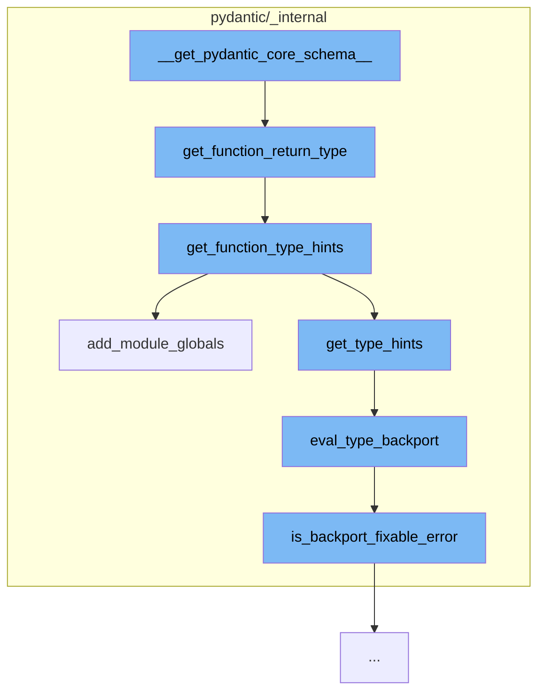

This document will cover the process of getting the Pydantic core schema, which includes:

1. Getting the function return type
2. Getting function type hints
3. Adding module globals
4. Evaluating type backport
5. Checking if backport fixable error exists.



<SwmSnippet path="/pydantic/_internal/_decorators.py" line="755">

---

# Getting the function return type

The function `get_function_return_type` is used to get the return type of a function. If an explicit return type is provided, it is returned. Otherwise, the function tries to get the return type from the type annotation.

```python
def get_function_return_type(
    func: Any, explicit_return_type: Any, types_namespace: dict[str, Any] | None = None
) -> Any:
    """Get the function return type.

    It gets the return type from the type annotation if `explicit_return_type` is `None`.
    Otherwise, it returns `explicit_return_type`.

    Args:
        func: The function to get its return type.
        explicit_return_type: The explicit return type.
        types_namespace: The types namespace, defaults to `None`.

    Returns:
        The function return type.
    """
    if explicit_return_type is PydanticUndefined:
        # try to get it from the type annotation
        hints = get_function_type_hints(
            unwrap_wrapped_function(func), include_keys={'return'}, types_namespace=types_namespace
        )
```

---

</SwmSnippet>

<SwmSnippet path="/pydantic/_internal/_typing_extra.py" line="288">

---

# Getting function type hints

The function `get_function_type_hints` is used to get the type hints of a function. It handles partial functions and does not convert `X` to `Optional[X]` if the default value is `None`.

```python
def get_function_type_hints(
    function: Callable[..., Any], *, include_keys: set[str] | None = None, types_namespace: dict[str, Any] | None = None
) -> dict[str, Any]:
    """Like `typing.get_type_hints`, but doesn't convert `X` to `Optional[X]` if the default value is `None`, also
    copes with `partial`.
    """
    try:
        if isinstance(function, partial):
            annotations = function.func.__annotations__
        else:
            annotations = function.__annotations__
    except AttributeError:
        type_hints = get_type_hints(function)
        if isinstance(function, type):
            # `type[...]` is a callable, which returns an instance of itself.
            # At some point, we might even look into the return type of `__new__`
            # if it returns something else.
            type_hints.setdefault('return', function)
        return type_hints

    globalns = add_module_globals(function)
```

---

</SwmSnippet>

<SwmSnippet path="/pydantic/_internal/_typing_extra.py" line="193">

---

# Adding module globals

The function `add_module_globals` is used to add global variables from the module of the object to the provided namespace. If no namespace is provided, it returns the module's global variables.

```python
def add_module_globals(obj: Any, globalns: dict[str, Any] | None = None) -> dict[str, Any]:
    module_name = getattr(obj, '__module__', None)
    if module_name:
        try:
            module_globalns = sys.modules[module_name].__dict__
        except KeyError:
            # happens occasionally, see https://github.com/pydantic/pydantic/issues/2363
            pass
        else:
            if globalns:
                return {**module_globalns, **globalns}
            else:
                # copy module globals to make sure it can't be updated later
                return module_globalns.copy()

    return globalns or {}
```

---

</SwmSnippet>

<SwmSnippet path="/pydantic/_internal/_typing_extra.py" line="246">

---

# Evaluating type backport

The function `eval_type_backport` is used to evaluate the type. It falls back to the `eval_type_backport` package if it's installed to let older Python versions use newer typing features.

```python
def eval_type_backport(
    value: Any,
    globalns: dict[str, Any] | None = None,
    localns: dict[str, Any] | None = None,
    type_params: tuple[Any] | None = None,
) -> Any:
    """Like `typing._eval_type`, but falls back to the `eval_type_backport` package if it's
    installed to let older Python versions use newer typing features.
    Specifically, this transforms `X | Y` into `typing.Union[X, Y]`
    and `list[X]` into `typing.List[X]` etc. (for all the types made generic in PEP 585)
    if the original syntax is not supported in the current Python version.
    """
    try:
        if sys.version_info >= (3, 12):
            return typing._eval_type(  # type: ignore
                value, globalns, localns, type_params=type_params
            )
        else:
            return typing._eval_type(  # type: ignore
                value, globalns, localns
            )
```

---

</SwmSnippet>

<SwmSnippet path="/pydantic/_internal/_typing_extra.py" line="283">

---

# Checking if backport fixable error exists

The function `is_backport_fixable_error` is used to check if the error can be fixed by backport. It checks if the error message starts with 'unsupported operand type(s) for |: ' or contains ' object is not subscriptable'.

```python
def is_backport_fixable_error(e: TypeError) -> bool:
    msg = str(e)
    return msg.startswith('unsupported operand type(s) for |: ') or "' object is not subscriptable" in msg
```

---

</SwmSnippet>

&nbsp;

*This is an auto-generated document by Swimm AI 🌊 and has not yet been verified by a human*

<SwmMeta version="3.0.0" repo-id="Z2l0aHViJTNBJTNBREVNTy1weWRhbnRpYyUzQSUzQWdpbGFkbmF2b3Q=" repo-name="DEMO-pydantic" doc-type="flows"><sup>Powered by [Swimm](/)</sup></SwmMeta>
