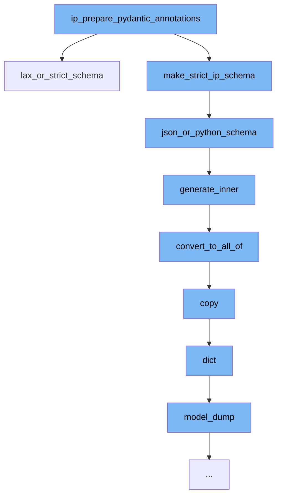

This document will cover the process of preparing Pydantic annotations for IP addresses, which includes:

1. Generating a lax or strict schema
2. Creating a JSON or Python schema
3. Generating inner schema
4. Converting to all_of schema
5. Copying the model
6. Converting the model to a dictionary
7. Dumping the model



<SwmSnippet path="/pydantic/json_schema.py" line="1226">

---

# Generating a lax or strict schema

The function <SwmToken path="/pydantic/json_schema.py" pos="1226:3:3" line-data="    def lax_or_strict_schema(self, schema: core_schema.LaxOrStrictSchema) -&gt; JsonSchemaValue:">`lax_or_strict_schema`</SwmToken> generates a JSON schema that matches a schema that allows values matching either the lax schema or the strict schema. It decides which schema to use based on the 'strict' key in the schema dictionary.

```python
    def lax_or_strict_schema(self, schema: core_schema.LaxOrStrictSchema) -> JsonSchemaValue:
        """Generates a JSON schema that matches a schema that allows values matching either the lax schema or the
        strict schema.

        Args:
            schema: The core schema.

        Returns:
            The generated JSON schema.
        """
        # TODO: Need to read the default value off of model config or whatever
        use_strict = schema.get('strict', False)  # TODO: replace this default False
        # If your JSON schema fails to generate it is probably
        # because one of the following two branches failed.
        if use_strict:
            return self.generate_inner(schema['strict_schema'])
        else:
            return self.generate_inner(schema['lax_schema'])
```

---

</SwmSnippet>

<SwmSnippet path="/pydantic/json_schema.py" line="1245">

---

# Creating a JSON or Python schema

The function <SwmToken path="/pydantic/json_schema.py" pos="1245:3:3" line-data="    def json_or_python_schema(self, schema: core_schema.JsonOrPythonSchema) -&gt; JsonSchemaValue:">`json_or_python_schema`</SwmToken> generates a JSON schema that matches a schema that allows values matching either the JSON schema or the Python schema. By default, the JSON schema is used.

```python
    def json_or_python_schema(self, schema: core_schema.JsonOrPythonSchema) -> JsonSchemaValue:
        """Generates a JSON schema that matches a schema that allows values matching either the JSON schema or the
        Python schema.

        The JSON schema is used instead of the Python schema. If you want to use the Python schema, you should override
        this method.

        Args:
            schema: The core schema.

        Returns:
            The generated JSON schema.
        """
        return self.generate_inner(schema['json_schema'])
```

---

</SwmSnippet>

<SwmSnippet path="/pydantic/json_schema.py" line="445">

---

# Generating inner schema

The function <SwmToken path="/pydantic/json_schema.py" pos="445:3:3" line-data="    def generate_inner(self, schema: CoreSchemaOrField) -&gt; JsonSchemaValue:  # noqa: C901">`generate_inner`</SwmToken> generates a JSON schema based on the input schema. It populates definitions, converts to all_of schema, and handles the schema or field.

```python
    def generate_inner(self, schema: CoreSchemaOrField) -> JsonSchemaValue:  # noqa: C901
        """Generates a JSON schema for a given core schema.

        Args:
            schema: The given core schema.

        Returns:
            The generated JSON schema.
        """
        # If a schema with the same CoreRef has been handled, just return a reference to it
        # Note that this assumes that it will _never_ be the case that the same CoreRef is used
        # on types that should have different JSON schemas
        if 'ref' in schema:
            core_ref = CoreRef(schema['ref'])  # type: ignore[typeddict-item]
            core_mode_ref = (core_ref, self.mode)
            if core_mode_ref in self.core_to_defs_refs and self.core_to_defs_refs[core_mode_ref] in self.definitions:
                return {'$ref': self.core_to_json_refs[core_mode_ref]}

        # Generate the JSON schema, accounting for the json_schema_override and core_schema_override
        metadata_handler = _core_metadata.CoreMetadataHandler(schema)

```

---

</SwmSnippet>

<SwmSnippet path="/pydantic/json_schema.py" line="481">

---

# Converting to all_of schema

The function <SwmToken path="/pydantic/json_schema.py" pos="481:3:3" line-data="        def convert_to_all_of(json_schema: JsonSchemaValue) -&gt; JsonSchemaValue:">`convert_to_all_of`</SwmToken> converts the JSON schema to an all_of schema if it contains a '$ref' key and other keys. This is done to correct a common mistake where other keys are present next to a '$ref' key.

```python
        def convert_to_all_of(json_schema: JsonSchemaValue) -> JsonSchemaValue:
            if '$ref' in json_schema and len(json_schema.keys()) > 1:
                # technically you can't have any other keys next to a "$ref"
                # but it's an easy mistake to make and not hard to correct automatically here
                json_schema = json_schema.copy()
                ref = json_schema.pop('$ref')
                json_schema = {'allOf': [{'$ref': ref}], **json_schema}
            return json_schema
```

---

</SwmSnippet>

<SwmSnippet path="/pydantic/main.py" line="1251">

---

# Copying the model

The function <SwmToken path="/pydantic/main.py" pos="1251:3:3" line-data="    def copy(">`copy`</SwmToken> returns a copy of the model. It allows specifying which fields to include or exclude in the copied model.

````python
    def copy(
        self,
        *,
        include: AbstractSetIntStr | MappingIntStrAny | None = None,
        exclude: AbstractSetIntStr | MappingIntStrAny | None = None,
        update: Dict[str, Any] | None = None,  # noqa UP006
        deep: bool = False,
    ) -> Self:  # pragma: no cover
        """Returns a copy of the model.

        !!! warning "Deprecated"
            This method is now deprecated; use `model_copy` instead.

        If you need `include` or `exclude`, use:

        ```py
        data = self.model_dump(include=include, exclude=exclude, round_trip=True)
        data = {**data, **(update or {})}
        copied = self.model_validate(data)
        ```

````

---

</SwmSnippet>

<SwmSnippet path="/pydantic/main.py" line="1076">

---

# Converting the model to a dictionary

The function <SwmToken path="/pydantic/main.py" pos="1076:3:3" line-data="    def dict(  # noqa: D102">`dict`</SwmToken> converts the model to a dictionary. It allows specifying which fields to include or exclude in the output dictionary.

```python
    def dict(  # noqa: D102
        self,
        *,
        include: IncEx = None,
        exclude: IncEx = None,
        by_alias: bool = False,
        exclude_unset: bool = False,
        exclude_defaults: bool = False,
        exclude_none: bool = False,
    ) -> Dict[str, Any]:  # noqa UP006
        warnings.warn('The `dict` method is deprecated; use `model_dump` instead.', category=PydanticDeprecatedSince20)
        return self.model_dump(
            include=include,
            exclude=exclude,
            by_alias=by_alias,
            exclude_unset=exclude_unset,
            exclude_defaults=exclude_defaults,
            exclude_none=exclude_none,
        )
```

---

</SwmSnippet>

<SwmSnippet path="/pydantic/main.py" line="325">

---

# Dumping the model

The function <SwmToken path="/pydantic/main.py" pos="325:3:3" line-data="    def model_dump(">`model_dump`</SwmToken> generates a dictionary representation of the model. It allows specifying which fields to include or exclude in the output dictionary.

```python
    def model_dump(
        self,
        *,
        mode: Literal['json', 'python'] | str = 'python',
        include: IncEx = None,
        exclude: IncEx = None,
        context: Any | None = None,
        by_alias: bool = False,
        exclude_unset: bool = False,
        exclude_defaults: bool = False,
        exclude_none: bool = False,
        round_trip: bool = False,
        warnings: bool | Literal['none', 'warn', 'error'] = True,
        serialize_as_any: bool = False,
    ) -> dict[str, Any]:
        """Usage docs: https://docs.pydantic.dev/2.8/concepts/serialization/#modelmodel_dump

        Generate a dictionary representation of the model, optionally specifying which fields to include or exclude.

        Args:
            mode: The mode in which `to_python` should run.
```

---

</SwmSnippet>

&nbsp;

*This is an auto-generated document by Swimm AI 🌊 and has not yet been verified by a human*

<SwmMeta version="3.0.0" repo-id="Z2l0aHViJTNBJTNBREVNTy1weWRhbnRpYyUzQSUzQWdpbGFkbmF2b3Q=" repo-name="DEMO-pydantic"><sup>Powered by [Swimm](https://app.swimm.io/)</sup></SwmMeta>
