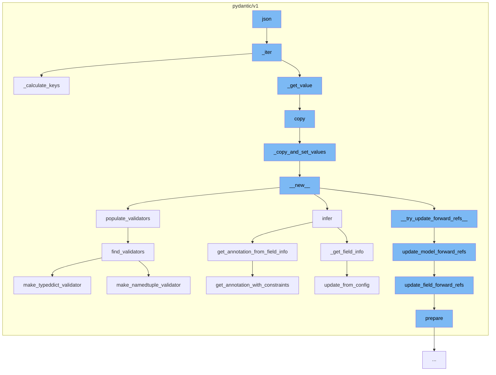

This document will cover the process of JSON data validation and manipulation in the Pydantic library. We'll cover:

 1. Iterating over JSON data
 2. Calculating keys for JSON data
 3. Copying JSON data
 4. Creating new instances of JSON data
 5. Updating forward references in JSON data
 6. Updating field forward references
 7. Preparing fields for validation
 8. Getting annotation from field info
 9. Updating from config
10. Getting annotation with constraints
11. Finding validators for data types.



<SwmSnippet path="/pydantic/v1/main.py" line="822">

---

# Iterating over JSON data

The function `_iter` is used to iterate over the JSON data. It takes into account various parameters such as `include`, `exclude`, `exclude_unset`, `exclude_defaults`, and `exclude_none` to filter the data during iteration.

```python
    def _iter(
        self,
        to_dict: bool = False,
        by_alias: bool = False,
        include: Optional[Union['AbstractSetIntStr', 'MappingIntStrAny']] = None,
        exclude: Optional[Union['AbstractSetIntStr', 'MappingIntStrAny']] = None,
        exclude_unset: bool = False,
        exclude_defaults: bool = False,
        exclude_none: bool = False,
    ) -> 'TupleGenerator':
        # Merge field set excludes with explicit exclude parameter with explicit overriding field set options.
        # The extra "is not None" guards are not logically necessary but optimizes performance for the simple case.
        if exclude is not None or self.__exclude_fields__ is not None:
            exclude = ValueItems.merge(self.__exclude_fields__, exclude)

        if include is not None or self.__include_fields__ is not None:
            include = ValueItems.merge(self.__include_fields__, include, intersect=True)

        allowed_keys = self._calculate_keys(
            include=include, exclude=exclude, exclude_unset=exclude_unset  # type: ignore
        )
```

---

</SwmSnippet>

<SwmSnippet path="/pydantic/v1/main.py" line="878">

---

# Calculating keys for JSON data

The function `_calculate_keys` is used to calculate the keys that should be included in the final JSON data based on the `include`, `exclude`, and `exclude_unset` parameters.

```python
    def _calculate_keys(
        self,
        include: Optional['MappingIntStrAny'],
        exclude: Optional['MappingIntStrAny'],
        exclude_unset: bool,
        update: Optional['DictStrAny'] = None,
    ) -> Optional[AbstractSet[str]]:
        if include is None and exclude is None and exclude_unset is False:
            return None

        keys: AbstractSet[str]
        if exclude_unset:
            keys = self.__fields_set__.copy()
        else:
            keys = self.__dict__.keys()

        if include is not None:
            keys &= include.keys()

        if update:
            keys -= update.keys()
```

---

</SwmSnippet>

<SwmSnippet path="/pydantic/v1/main.py" line="627">

---

# Copying JSON data

The function `copy` is used to create a copy of the JSON data. It allows for inclusion and exclusion of certain fields and also allows for updating certain fields.

```python
    def copy(
        self: 'Model',
        *,
        include: Optional[Union['AbstractSetIntStr', 'MappingIntStrAny']] = None,
        exclude: Optional[Union['AbstractSetIntStr', 'MappingIntStrAny']] = None,
        update: Optional['DictStrAny'] = None,
        deep: bool = False,
    ) -> 'Model':
        """
        Duplicate a model, optionally choose which fields to include, exclude and change.

        :param include: fields to include in new model
        :param exclude: fields to exclude from new model, as with values this takes precedence over include
        :param update: values to change/add in the new model. Note: the data is not validated before creating
            the new model: you should trust this data
        :param deep: set to `True` to make a deep copy of the model
        :return: new model instance
        """

        values = dict(
            self._iter(to_dict=False, by_alias=False, include=include, exclude=exclude, exclude_unset=False),
```

---

</SwmSnippet>

<SwmSnippet path="/pydantic/v1/main.py" line="609">

---

# Creating new instances of JSON data

The function `_copy_and_set_values` is used to create a new instance of the JSON data with updated values. It also takes into account whether a deep copy should be made.

```python
    def _copy_and_set_values(self: 'Model', values: 'DictStrAny', fields_set: 'SetStr', *, deep: bool) -> 'Model':
        if deep:
            # chances of having empty dict here are quite low for using smart_deepcopy
            values = deepcopy(values)

        cls = self.__class__
        m = cls.__new__(cls)
        object_setattr(m, '__dict__', values)
        object_setattr(m, '__fields_set__', fields_set)
        for name in self.__private_attributes__:
            value = getattr(self, name, Undefined)
            if value is not Undefined:
                if deep:
                    value = deepcopy(value)
                object_setattr(m, name, value)

        return m
```

---

</SwmSnippet>

<SwmSnippet path="/pydantic/v1/typing.py" line="540">

---

# Updating forward references in JSON data

The function `update_model_forward_refs` is used to update forward references in the JSON data based on the model and local namespace.

```python
def update_model_forward_refs(
    model: Type[Any],
    fields: Iterable['ModelField'],
    json_encoders: Dict[Union[Type[Any], str, ForwardRef], AnyCallable],
    localns: 'DictStrAny',
    exc_to_suppress: Tuple[Type[BaseException], ...] = (),
) -> None:
    """
    Try to update model fields ForwardRefs based on model and localns.
    """
    if model.__module__ in sys.modules:
        globalns = sys.modules[model.__module__].__dict__.copy()
    else:
        globalns = {}

    globalns.setdefault(model.__name__, model)

    for f in fields:
        try:
            update_field_forward_refs(f, globalns=globalns, localns=localns)
        except exc_to_suppress:
```

---

</SwmSnippet>

<SwmSnippet path="/pydantic/v1/typing.py" line="518">

---

# Updating field forward references

The function `update_field_forward_refs` is used to update forward references in the fields of the JSON data based on the global and local namespace.

```python
def update_field_forward_refs(field: 'ModelField', globalns: Any, localns: Any) -> None:
    """
    Try to update ForwardRefs on fields based on this ModelField, globalns and localns.
    """
    prepare = False
    if field.type_.__class__ == ForwardRef:
        prepare = True
        field.type_ = evaluate_forwardref(field.type_, globalns, localns or None)
    if field.outer_type_.__class__ == ForwardRef:
        prepare = True
        field.outer_type_ = evaluate_forwardref(field.outer_type_, globalns, localns or None)
    if prepare:
        field.prepare()

    if field.sub_fields:
        for sub_f in field.sub_fields:
            update_field_forward_refs(sub_f, globalns=globalns, localns=localns)

    if field.discriminator_key is not None:
```

---

</SwmSnippet>

<SwmSnippet path="/pydantic/v1/fields.py" line="537">

---

# Preparing fields for validation

The function `prepare` is used to prepare the fields for validation by inspecting the default values and types of the fields.

```python
    def prepare(self) -> None:
        """
        Prepare the field but inspecting self.default, self.type_ etc.

        Note: this method is **not** idempotent (because _type_analysis is not idempotent),
        e.g. calling it it multiple times may modify the field and configure it incorrectly.
        """
        self._set_default_and_type()
        if self.type_.__class__ is ForwardRef or self.type_.__class__ is DeferredType:
            # self.type_ is currently a ForwardRef and there's nothing we can do now,
            # user will need to call model.update_forward_refs()
            return

        self._type_analysis()
        if self.required is Undefined:
```

---

</SwmSnippet>

<SwmSnippet path="/pydantic/v1/schema.py" line="1001">

---

# Getting annotation from field info

The function `get_annotation_from_field_info` is used to get an annotation with validation implemented for numbers and strings based on the field info.

```python
def get_annotation_from_field_info(
    annotation: Any, field_info: FieldInfo, field_name: str, validate_assignment: bool = False
) -> Type[Any]:
    """
    Get an annotation with validation implemented for numbers and strings based on the field_info.
    :param annotation: an annotation from a field specification, as ``str``, ``ConstrainedStr``
    :param field_info: an instance of FieldInfo, possibly with declarations for validations and JSON Schema
    :param field_name: name of the field for use in error messages
    :param validate_assignment: default False, flag for BaseModel Config value of validate_assignment
    :return: the same ``annotation`` if unmodified or a new annotation with validation in place
    """
    constraints = field_info.get_constraints()
    used_constraints: Set[str] = set()
    if constraints:
        annotation, used_constraints = get_annotation_with_constraints(annotation, field_info)
    if validate_assignment:
        used_constraints.add('allow_mutation')

    unused_constraints = constraints - used_constraints
    if unused_constraints:
        raise ValueError(
```

---

</SwmSnippet>

<SwmSnippet path="/pydantic/v1/fields.py" line="197">

---

# Updating from config

The function `update_from_config` is used to update the FieldInfo based on a dict from get_field_info. Only fields which have not been set are updated.

```python
    def update_from_config(self, from_config: Dict[str, Any]) -> None:
        """
        Update this FieldInfo based on a dict from get_field_info, only fields which have not been set are dated.
        """
        for attr_name, value in from_config.items():
            try:
                current_value = getattr(self, attr_name)
            except AttributeError:
                # attr_name is not an attribute of FieldInfo, it should therefore be added to extra
                # (except if extra already has this value!)
                self.extra.setdefault(attr_name, value)
            else:
                if current_value is self.__field_constraints__.get(attr_name, None):
                    setattr(self, attr_name, value)
                elif attr_name == 'exclude':
                    self.exclude = ValueItems.merge(value, current_value)
                elif attr_name == 'include':
                    self.include = ValueItems.merge(value, current_value, intersect=True)
```

---

</SwmSnippet>

<SwmSnippet path="/pydantic/v1/schema.py" line="1030">

---

# Getting annotation with constraints

The function `get_annotation_with_constraints` is used to get an annotation with validation constraints based on the field info.

```python
def get_annotation_with_constraints(annotation: Any, field_info: FieldInfo) -> Tuple[Type[Any], Set[str]]:  # noqa: C901
    """
    Get an annotation with used constraints implemented for numbers and strings based on the field_info.

    :param annotation: an annotation from a field specification, as ``str``, ``ConstrainedStr``
    :param field_info: an instance of FieldInfo, possibly with declarations for validations and JSON Schema
    :return: the same ``annotation`` if unmodified or a new annotation along with the used constraints.
    """
    used_constraints: Set[str] = set()

    def go(type_: Any) -> Type[Any]:
        if (
            is_literal_type(type_)
            or isinstance(type_, ForwardRef)
            or lenient_issubclass(type_, (ConstrainedList, ConstrainedSet, ConstrainedFrozenSet))
        ):
            return type_
        origin = get_origin(type_)
        if origin is not None:
            args: Tuple[Any, ...] = get_args(type_)
            if any(isinstance(a, ForwardRef) for a in args):
```

---

</SwmSnippet>

<SwmSnippet path="/pydantic/v1/validators.py" line="698">

---

# Finding validators for data types

The function `find_validators` is used to find validators for the given data types. It checks for various data types and returns the corresponding validators.

```python
def find_validators(  # noqa: C901 (ignore complexity)
    type_: Type[Any], config: Type['BaseConfig']
) -> Generator[AnyCallable, None, None]:
    from pydantic.v1.dataclasses import is_builtin_dataclass, make_dataclass_validator

    if type_ is Any or type_ is object:
        return
    type_type = type_.__class__
    if type_type == ForwardRef or type_type == TypeVar:
        return

    if is_none_type(type_):
        yield none_validator
        return
    if type_ is Pattern or type_ is re.Pattern:
        yield pattern_validator
        return
    if type_ is Hashable or type_ is CollectionsHashable:
        yield hashable_validator
        return
    if is_callable_type(type_):
```

---

</SwmSnippet>

&nbsp;

*This is an auto-generated document by Swimm AI 🌊 and has not yet been verified by a human*

<SwmMeta version="3.0.0" repo-id="Z2l0aHViJTNBJTNBREVNTy1weWRhbnRpYyUzQSUzQWdpbGFkbmF2b3Q=" repo-name="DEMO-pydantic" doc-type="flows"><sup>Powered by [Swimm](/)</sup></SwmMeta>
