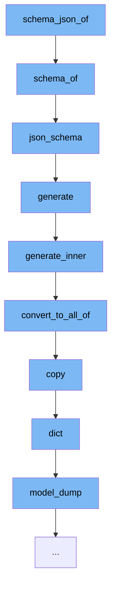

This document will cover the process of generating a JSON schema for a Pydantic model, which includes:

1. The initial function call to `schema_json_of`.
2. The subsequent function calls to `schema_of`, `json_schema`, `generate`, `generate_inner`, `convert_to_all_of`, `copy`, `dict`, and `model_dump`.
3. The purpose and functionality of each function in the flow.



<SwmSnippet path="/pydantic/deprecated/tools.py" line="49">

---

# Initial Function Call: schema_json_of

The function `schema_json_of` is the entry point of the flow. It generates a JSON schema for the passed model or dynamically generated one. It calls the `schema_of` function.

```python
def schema_of(
    type_: Any,
    *,
    title: NameFactory | None = None,
    by_alias: bool = True,
    ref_template: str = DEFAULT_REF_TEMPLATE,
    schema_generator: type[GenerateJsonSchema] = GenerateJsonSchema,
) -> dict[str, Any]:
    """Generate a JSON schema (as dict) for the passed model or dynamically generated one."""
    warnings.warn(
        '`schema_of` is deprecated. Use `pydantic.TypeAdapter.json_schema` instead.',
        category=PydanticDeprecatedSince20,
        stacklevel=2,
    )
    res = TypeAdapter(type_).json_schema(
        by_alias=by_alias,
        schema_generator=schema_generator,
        ref_template=ref_template,
    )
    if title is not None:
        if isinstance(title, str):
```

---

</SwmSnippet>

<SwmSnippet path="/pydantic/deprecated/tools.py" line="49">

---

# Function Call: schema_of

The function `schema_of` is called by `schema_json_of`. It generates a JSON schema for the passed model or dynamically generated one. It calls the `json_schema` function.

```python
def schema_of(
    type_: Any,
    *,
    title: NameFactory | None = None,
    by_alias: bool = True,
    ref_template: str = DEFAULT_REF_TEMPLATE,
    schema_generator: type[GenerateJsonSchema] = GenerateJsonSchema,
) -> dict[str, Any]:
    """Generate a JSON schema (as dict) for the passed model or dynamically generated one."""
    warnings.warn(
        '`schema_of` is deprecated. Use `pydantic.TypeAdapter.json_schema` instead.',
        category=PydanticDeprecatedSince20,
        stacklevel=2,
    )
    res = TypeAdapter(type_).json_schema(
        by_alias=by_alias,
        schema_generator=schema_generator,
        ref_template=ref_template,
    )
    if title is not None:
        if isinstance(title, str):
```

---

</SwmSnippet>

<SwmSnippet path="/pydantic/type_adapter.py" line="529">

---

# Function Call: json_schema

The function `json_schema` is called by `schema_of`. It generates a JSON schema for the adapted type. It calls the `generate` function.

```python
    def json_schema(
        self,
        *,
        by_alias: bool = True,
        ref_template: str = DEFAULT_REF_TEMPLATE,
        schema_generator: type[GenerateJsonSchema] = GenerateJsonSchema,
        mode: JsonSchemaMode = 'validation',
    ) -> dict[str, Any]:
        """Generate a JSON schema for the adapted type.

        Args:
            by_alias: Whether to use alias names for field names.
            ref_template: The format string used for generating $ref strings.
            schema_generator: The generator class used for creating the schema.
            mode: The mode to use for schema generation.

        Returns:
            The JSON schema for the model as a dictionary.
        """
        schema_generator_instance = schema_generator(by_alias=by_alias, ref_template=ref_template)
        return schema_generator_instance.generate(self.core_schema, mode=mode)
```

---

</SwmSnippet>

<SwmSnippet path="/pydantic/json_schema.py" line="393">

---

# Function Call: generate

The function `generate` is called by `json_schema`. It generates a JSON schema for a specified schema in a specified mode. It calls the `generate_inner` function.

```python
    def generate(self, schema: CoreSchema, mode: JsonSchemaMode = 'validation') -> JsonSchemaValue:
        """Generates a JSON schema for a specified schema in a specified mode.

        Args:
            schema: A Pydantic model.
            mode: The mode in which to generate the schema. Defaults to 'validation'.

        Returns:
            A JSON schema representing the specified schema.

        Raises:
            PydanticUserError: If the JSON schema generator has already been used to generate a JSON schema.
        """
        self._mode = mode
        if self._used:
            raise PydanticUserError(
                'This JSON schema generator has already been used to generate a JSON schema. '
                f'You must create a new instance of {type(self).__name__} to generate a new JSON schema.',
                code='json-schema-already-used',
            )

```

---

</SwmSnippet>

<SwmSnippet path="/pydantic/json_schema.py" line="445">

---

# Function Call: generate_inner

The function `generate_inner` is called by `generate`. It generates a JSON schema based on the input schema. It calls the `convert_to_all_of` function.

```python
    def generate_inner(self, schema: CoreSchemaOrField) -> JsonSchemaValue:  # noqa: C901
        """Generates a JSON schema for a given core schema.

        Args:
            schema: The given core schema.

        Returns:
            The generated JSON schema.
        """
        # If a schema with the same CoreRef has been handled, just return a reference to it
        # Note that this assumes that it will _never_ be the case that the same CoreRef is used
        # on types that should have different JSON schemas
        if 'ref' in schema:
            core_ref = CoreRef(schema['ref'])  # type: ignore[typeddict-item]
            core_mode_ref = (core_ref, self.mode)
            if core_mode_ref in self.core_to_defs_refs and self.core_to_defs_refs[core_mode_ref] in self.definitions:
                return {'$ref': self.core_to_json_refs[core_mode_ref]}

        # Generate the JSON schema, accounting for the json_schema_override and core_schema_override
        metadata_handler = _core_metadata.CoreMetadataHandler(schema)

```

---

</SwmSnippet>

<SwmSnippet path="/pydantic/json_schema.py" line="481">

---

# Function Call: convert_to_all_of

The function `convert_to_all_of` is called by `generate_inner`. It converts a JSON schema to an 'allOf' schema if it contains a '$ref' key along with other keys. It calls the `copy` function.

```python
        def convert_to_all_of(json_schema: JsonSchemaValue) -> JsonSchemaValue:
            if '$ref' in json_schema and len(json_schema.keys()) > 1:
                # technically you can't have any other keys next to a "$ref"
                # but it's an easy mistake to make and not hard to correct automatically here
                json_schema = json_schema.copy()
                ref = json_schema.pop('$ref')
                json_schema = {'allOf': [{'$ref': ref}], **json_schema}
            return json_schema
```

---

</SwmSnippet>

<SwmSnippet path="/pydantic/main.py" line="1251">

---

# Function Call: copy

The function `copy` is called by `convert_to_all_of`. It returns a copy of the model. It calls the `dict` function.

````python
    def copy(
        self,
        *,
        include: AbstractSetIntStr | MappingIntStrAny | None = None,
        exclude: AbstractSetIntStr | MappingIntStrAny | None = None,
        update: Dict[str, Any] | None = None,  # noqa UP006
        deep: bool = False,
    ) -> Self:  # pragma: no cover
        """Returns a copy of the model.

        !!! warning "Deprecated"
            This method is now deprecated; use `model_copy` instead.

        If you need `include` or `exclude`, use:

        ```py
        data = self.model_dump(include=include, exclude=exclude, round_trip=True)
        data = {**data, **(update or {})}
        copied = self.model_validate(data)
        ```

````

---

</SwmSnippet>

<SwmSnippet path="/pydantic/main.py" line="1076">

---

# Function Call: dict

The function `dict` is called by `copy`. It generates a dictionary representation of the model. It calls the `model_dump` function.

```python
    def dict(  # noqa: D102
        self,
        *,
        include: IncEx = None,
        exclude: IncEx = None,
        by_alias: bool = False,
        exclude_unset: bool = False,
        exclude_defaults: bool = False,
        exclude_none: bool = False,
    ) -> Dict[str, Any]:  # noqa UP006
        warnings.warn('The `dict` method is deprecated; use `model_dump` instead.', category=PydanticDeprecatedSince20)
        return self.model_dump(
            include=include,
            exclude=exclude,
            by_alias=by_alias,
            exclude_unset=exclude_unset,
            exclude_defaults=exclude_defaults,
            exclude_none=exclude_none,
        )
```

---

</SwmSnippet>

<SwmSnippet path="/pydantic/main.py" line="325">

---

# Function Call: model_dump

The function `model_dump` is called by `dict`. It generates a dictionary representation of the model, optionally specifying which fields to include or exclude.

```python
    def model_dump(
        self,
        *,
        mode: Literal['json', 'python'] | str = 'python',
        include: IncEx = None,
        exclude: IncEx = None,
        context: Any | None = None,
        by_alias: bool = False,
        exclude_unset: bool = False,
        exclude_defaults: bool = False,
        exclude_none: bool = False,
        round_trip: bool = False,
        warnings: bool | Literal['none', 'warn', 'error'] = True,
        serialize_as_any: bool = False,
    ) -> dict[str, Any]:
        """Usage docs: https://docs.pydantic.dev/2.8/concepts/serialization/#modelmodel_dump

        Generate a dictionary representation of the model, optionally specifying which fields to include or exclude.

        Args:
            mode: The mode in which `to_python` should run.
```

---

</SwmSnippet>

&nbsp;

*This is an auto-generated document by Swimm AI 🌊 and has not yet been verified by a human*

<SwmMeta version="3.0.0" repo-id="Z2l0aHViJTNBJTNBREVNTy1weWRhbnRpYyUzQSUzQWdpbGFkbmF2b3Q=" repo-name="DEMO-pydantic" doc-type="flows"><sup>Powered by [Swimm](/)</sup></SwmMeta>
