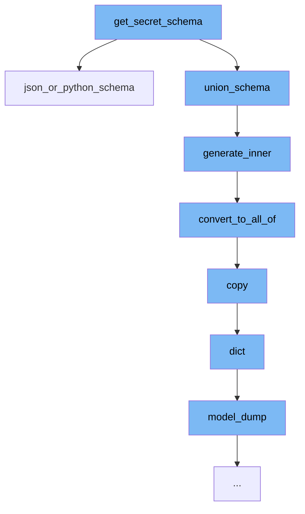

This document will cover the process of generating a JSON schema in Pydantic, which includes:

1. Invoking the <SwmToken path="/pydantic/types.py" pos="1625:3:3" line-data="        def get_secret_schema(strict: bool) -&gt; CoreSchema:">`get_secret_schema`</SwmToken> function
2. Generating the inner schema
3. Converting to <SwmToken path="/pydantic/json_schema.py" pos="487:7:7" line-data="                json_schema = {&#39;allOf&#39;: [{&#39;$ref&#39;: ref}], **json_schema}">`allOf`</SwmToken> schema
4. Copying the model
5. Dumping the model to a dictionary.



<SwmSnippet path="/pydantic/types.py" line="1">

---

# Invoking the <SwmToken path="/pydantic/types.py" pos="1625:3:3" line-data="        def get_secret_schema(strict: bool) -&gt; CoreSchema:">`get_secret_schema`</SwmToken> function

The <SwmToken path="/pydantic/types.py" pos="1625:3:3" line-data="        def get_secret_schema(strict: bool) -&gt; CoreSchema:">`get_secret_schema`</SwmToken> function is the entry point for generating a JSON schema. It calls the <SwmToken path="/pydantic/types.py" pos="1576:5:5" line-data="        return core_schema.json_or_python_schema(">`json_or_python_schema`</SwmToken> function to start the schema generation process.

```python
"""The types module contains custom types used by pydantic."""
```

---

</SwmSnippet>

<SwmSnippet path="/pydantic/json_schema.py" line="445">

---

# Generating the inner schema

The <SwmToken path="/pydantic/json_schema.py" pos="445:3:3" line-data="    def generate_inner(self, schema: CoreSchemaOrField) -&gt; JsonSchemaValue:  # noqa: C901">`generate_inner`</SwmToken> function is called to generate the inner schema. It populates the definitions and converts the schema to <SwmToken path="/pydantic/json_schema.py" pos="487:7:7" line-data="                json_schema = {&#39;allOf&#39;: [{&#39;$ref&#39;: ref}], **json_schema}">`allOf`</SwmToken> if necessary.

```python
    def generate_inner(self, schema: CoreSchemaOrField) -> JsonSchemaValue:  # noqa: C901
        """Generates a JSON schema for a given core schema.

        Args:
            schema: The given core schema.

        Returns:
            The generated JSON schema.
        """
        # If a schema with the same CoreRef has been handled, just return a reference to it
        # Note that this assumes that it will _never_ be the case that the same CoreRef is used
        # on types that should have different JSON schemas
        if 'ref' in schema:
            core_ref = CoreRef(schema['ref'])  # type: ignore[typeddict-item]
            core_mode_ref = (core_ref, self.mode)
            if core_mode_ref in self.core_to_defs_refs and self.core_to_defs_refs[core_mode_ref] in self.definitions:
                return {'$ref': self.core_to_json_refs[core_mode_ref]}

        # Generate the JSON schema, accounting for the json_schema_override and core_schema_override
        metadata_handler = _core_metadata.CoreMetadataHandler(schema)

```

---

</SwmSnippet>

<SwmSnippet path="/pydantic/json_schema.py" line="481">

---

# Converting to <SwmToken path="/pydantic/json_schema.py" pos="487:7:7" line-data="                json_schema = {&#39;allOf&#39;: [{&#39;$ref&#39;: ref}], **json_schema}">`allOf`</SwmToken> schema

The <SwmToken path="/pydantic/json_schema.py" pos="481:3:3" line-data="        def convert_to_all_of(json_schema: JsonSchemaValue) -&gt; JsonSchemaValue:">`convert_to_all_of`</SwmToken> function is used to convert the schema to <SwmToken path="/pydantic/json_schema.py" pos="487:7:7" line-data="                json_schema = {&#39;allOf&#39;: [{&#39;$ref&#39;: ref}], **json_schema}">`allOf`</SwmToken> format if it contains a '$ref' and other keys. This is done to correct any mistakes made in the schema definition.

```python
        def convert_to_all_of(json_schema: JsonSchemaValue) -> JsonSchemaValue:
            if '$ref' in json_schema and len(json_schema.keys()) > 1:
                # technically you can't have any other keys next to a "$ref"
                # but it's an easy mistake to make and not hard to correct automatically here
                json_schema = json_schema.copy()
                ref = json_schema.pop('$ref')
                json_schema = {'allOf': [{'$ref': ref}], **json_schema}
            return json_schema
```

---

</SwmSnippet>

<SwmSnippet path="/pydantic/main.py" line="1251">

---

# Copying the model

The <SwmToken path="/pydantic/main.py" pos="1251:3:3" line-data="    def copy(">`copy`</SwmToken> function is used to create a copy of the model. This is necessary to avoid modifying the original model during the schema generation process.

````python
    def copy(
        self,
        *,
        include: AbstractSetIntStr | MappingIntStrAny | None = None,
        exclude: AbstractSetIntStr | MappingIntStrAny | None = None,
        update: Dict[str, Any] | None = None,  # noqa UP006
        deep: bool = False,
    ) -> Self:  # pragma: no cover
        """Returns a copy of the model.

        !!! warning "Deprecated"
            This method is now deprecated; use `model_copy` instead.

        If you need `include` or `exclude`, use:

        ```py
        data = self.model_dump(include=include, exclude=exclude, round_trip=True)
        data = {**data, **(update or {})}
        copied = self.model_validate(data)
        ```

````

---

</SwmSnippet>

<SwmSnippet path="/pydantic/main.py" line="325">

---

# Dumping the model to a dictionary

Finally, the <SwmToken path="/pydantic/main.py" pos="325:3:3" line-data="    def model_dump(">`model_dump`</SwmToken> function is used to convert the model to a dictionary. This is the final step in the schema generation process.

```python
    def model_dump(
        self,
        *,
        mode: Literal['json', 'python'] | str = 'python',
        include: IncEx = None,
        exclude: IncEx = None,
        context: Any | None = None,
        by_alias: bool = False,
        exclude_unset: bool = False,
        exclude_defaults: bool = False,
        exclude_none: bool = False,
        round_trip: bool = False,
        warnings: bool | Literal['none', 'warn', 'error'] = True,
        serialize_as_any: bool = False,
    ) -> dict[str, Any]:
        """Usage docs: https://docs.pydantic.dev/2.8/concepts/serialization/#modelmodel_dump

        Generate a dictionary representation of the model, optionally specifying which fields to include or exclude.

        Args:
            mode: The mode in which `to_python` should run.
```

---

</SwmSnippet>

&nbsp;

*This is an auto-generated document by Swimm AI 🌊 and has not yet been verified by a human*

<SwmMeta version="3.0.0" repo-id="Z2l0aHViJTNBJTNBREVNTy1weWRhbnRpYyUzQSUzQWdpbGFkbmF2b3Q=" repo-name="DEMO-pydantic"><sup>Powered by [Swimm](https://app.swimm.io/)</sup></SwmMeta>
