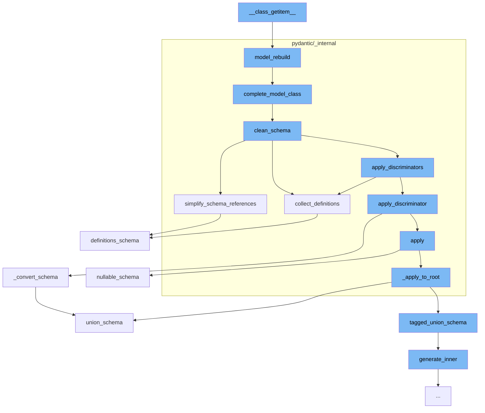

This document will cover the process of Pydantic's model rebuilding and schema generation, which includes:

1. Initiating the model rebuild
2. Completing the model class
3. Cleaning the schema
4. Simplifying schema references
5. Collecting definitions
6. Converting the schema
7. Generating inner schema



<SwmSnippet path="/pydantic/main.py" line="487">

---

# Initiating the model rebuild

The function `model_rebuild` is the entry point for the model rebuilding process. It checks if the schema is already complete and if not, it initiates the rebuilding process by calling `complete_model_class`.

```python
    def model_rebuild(
        cls,
        *,
        force: bool = False,
        raise_errors: bool = True,
        _parent_namespace_depth: int = 2,
        _types_namespace: dict[str, Any] | None = None,
    ) -> bool | None:
        """Try to rebuild the pydantic-core schema for the model.

        This may be necessary when one of the annotations is a ForwardRef which could not be resolved during
        the initial attempt to build the schema, and automatic rebuilding fails.

        Args:
            force: Whether to force the rebuilding of the model schema, defaults to `False`.
            raise_errors: Whether to raise errors, defaults to `True`.
            _parent_namespace_depth: The depth level of the parent namespace, defaults to 2.
            _types_namespace: The types namespace, defaults to `None`.

        Returns:
            Returns `None` if the schema is already "complete" and rebuilding was not required.
```

---

</SwmSnippet>

<SwmSnippet path="/pydantic/_internal/_model_construction.py" line="487">

---

# Completing the model class

`complete_model_class` finishes building a model class. It generates the schema for the model and cleans it using `clean_schema`.

```python
def complete_model_class(
    cls: type[BaseModel],
    cls_name: str,
    config_wrapper: ConfigWrapper,
    *,
    raise_errors: bool = True,
    types_namespace: dict[str, Any] | None,
    create_model_module: str | None = None,
) -> bool:
    """Finish building a model class.

    This logic must be called after class has been created since validation functions must be bound
    and `get_type_hints` requires a class object.

    Args:
        cls: BaseModel or dataclass.
        cls_name: The model or dataclass name.
        config_wrapper: The config wrapper instance.
        raise_errors: Whether to raise errors.
        types_namespace: Optional extra namespace to look for types in.
        create_model_module: The module of the class to be created, if created by `create_model`.
```

---

</SwmSnippet>

<SwmSnippet path="/pydantic/_internal/_generate_schema.py" line="446">

---

# Cleaning the schema

`clean_schema` collects definitions, simplifies schema references, and applies discriminators to the schema.

```python
    def clean_schema(self, schema: CoreSchema) -> CoreSchema:
        schema = self.collect_definitions(schema)
        schema = simplify_schema_references(schema)
        if collect_invalid_schemas(schema):
            raise self.CollectedInvalid()
        schema = _discriminated_union.apply_discriminators(schema)
        schema = validate_core_schema(schema)
        return schema
```

---

</SwmSnippet>

<SwmSnippet path="/pydantic/_internal/_core_utils.py" line="417">

---

# Simplifying schema references

`simplify_schema_references` simplifies the schema by replacing references with the actual schema whenever possible.

```python
def simplify_schema_references(schema: core_schema.CoreSchema) -> core_schema.CoreSchema:  # noqa: C901
    definitions: dict[str, core_schema.CoreSchema] = {}
    ref_counts: dict[str, int] = defaultdict(int)
    involved_in_recursion: dict[str, bool] = {}
    current_recursion_ref_count: dict[str, int] = defaultdict(int)

    def collect_refs(s: core_schema.CoreSchema, recurse: Recurse) -> core_schema.CoreSchema:
        if s['type'] == 'definitions':
            for definition in s['definitions']:
                ref = get_ref(definition)
                assert ref is not None
                if ref not in definitions:
                    definitions[ref] = definition
                recurse(definition, collect_refs)
            return recurse(s['schema'], collect_refs)
        else:
            ref = get_ref(s)
            if ref is not None:
                new = recurse(s, collect_refs)
                new_ref = get_ref(new)
                if new_ref:
```

---

</SwmSnippet>

<SwmSnippet path="/pydantic/_internal/_generate_schema.py" line="455">

---

# Collecting definitions

`collect_definitions` collects all definitions in the schema and stores them for later use.

```python
    def collect_definitions(self, schema: CoreSchema) -> CoreSchema:
        ref = cast('str | None', schema.get('ref', None))
        if ref:
            self.defs.definitions[ref] = schema
        if 'ref' in schema:
            schema = core_schema.definition_reference_schema(schema['ref'])
        return core_schema.definitions_schema(
            schema,
            list(self.defs.definitions.values()),
        )
```

---

</SwmSnippet>

<SwmSnippet path="/pydantic/types.py" line="2835">

---

# Converting the schema

`_convert_schema` converts the original schema into a tagged union schema.

```python
    def _convert_schema(self, original_schema: core_schema.CoreSchema) -> core_schema.TaggedUnionSchema:
        if original_schema['type'] != 'union':
            # This likely indicates that the schema was a single-item union that was simplified.
            # In this case, we do the same thing we do in
            # `pydantic._internal._discriminated_union._ApplyInferredDiscriminator._apply_to_root`, namely,
            # package the generated schema back into a single-item union.
            original_schema = core_schema.union_schema([original_schema])

        tagged_union_choices = {}
        for i, choice in enumerate(original_schema['choices']):
            tag = None
            if isinstance(choice, tuple):
                choice, tag = choice
            metadata = choice.get('metadata')
            if metadata is not None:
                metadata_tag = metadata.get(_core_utils.TAGGED_UNION_TAG_KEY)
                if metadata_tag is not None:
                    tag = metadata_tag
            if tag is None:
                raise PydanticUserError(
                    f'`Tag` not provided for choice {choice} used with `Discriminator`',
```

---

</SwmSnippet>

<SwmSnippet path="/pydantic/json_schema.py" line="445">

---

# Generating inner schema

`generate_inner` generates a JSON schema based on the input schema. It handles different types of schemas and converts them into the corresponding JSON schema.

```python
    def generate_inner(self, schema: CoreSchemaOrField) -> JsonSchemaValue:  # noqa: C901
        """Generates a JSON schema for a given core schema.

        Args:
            schema: The given core schema.

        Returns:
            The generated JSON schema.
        """
        # If a schema with the same CoreRef has been handled, just return a reference to it
        # Note that this assumes that it will _never_ be the case that the same CoreRef is used
        # on types that should have different JSON schemas
        if 'ref' in schema:
            core_ref = CoreRef(schema['ref'])  # type: ignore[typeddict-item]
            core_mode_ref = (core_ref, self.mode)
            if core_mode_ref in self.core_to_defs_refs and self.core_to_defs_refs[core_mode_ref] in self.definitions:
                return {'$ref': self.core_to_json_refs[core_mode_ref]}

        # Generate the JSON schema, accounting for the json_schema_override and core_schema_override
        metadata_handler = _core_metadata.CoreMetadataHandler(schema)

```

---

</SwmSnippet>

&nbsp;

*This is an auto-generated document by Swimm AI 🌊 and has not yet been verified by a human*

<SwmMeta version="3.0.0" repo-id="Z2l0aHViJTNBJTNBREVNTy1weWRhbnRpYyUzQSUzQWdpbGFkbmF2b3Q=" repo-name="DEMO-pydantic" doc-type="flows"><sup>Powered by [Swimm](/)</sup></SwmMeta>
