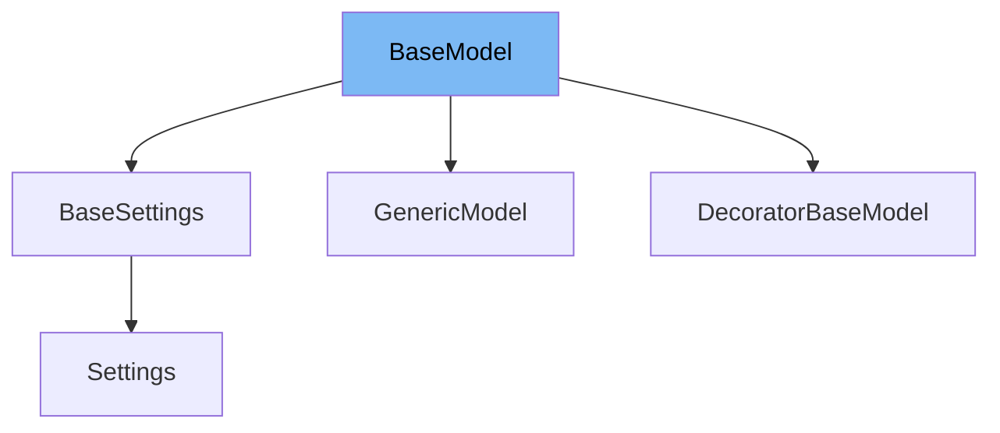

This document will cover the `BaseModel` class in the DEMO-pydantic repository. We'll cover:

1. What is BaseModel
2. Variables and functions in BaseModel
3. Usage example of BaseModel



# What is BaseModel

The `BaseModel` class is a fundamental building block in Pydantic. It's a base class for all models, providing core functionality for data validation, serialization (to/from JSON), and other operations. It uses Python's type hinting system to validate that the fields of a model are of the correct type, and can also perform more complex validation if necessary.

<SwmSnippet path="/pydantic/v1/main.py" line="310">

---

# Variables and functions

The `BaseModel` class is defined here. It inherits from the `Representation` class and uses the `ModelMetaclass` metaclass.

```python
class BaseModel(Representation, metaclass=ModelMetaclass):
```

---

</SwmSnippet>

<SwmSnippet path="/pydantic/v1/main.py" line="311">

---

These are the class variables of `BaseModel`. They include `__fields__`, `__validators__`, `__config__`, and others. These variables store the configuration, fields, and validators of the model.

```python
    if TYPE_CHECKING:
        # populated by the metaclass, defined here to help IDEs only
        __fields__: ClassVar[Dict[str, ModelField]] = {}
        __include_fields__: ClassVar[Optional[Mapping[str, Any]]] = None
        __exclude_fields__: ClassVar[Optional[Mapping[str, Any]]] = None
        __validators__: ClassVar[Dict[str, AnyCallable]] = {}
        __pre_root_validators__: ClassVar[List[AnyCallable]]
        __post_root_validators__: ClassVar[List[Tuple[bool, AnyCallable]]]
        __config__: ClassVar[Type[BaseConfig]] = BaseConfig
        __json_encoder__: ClassVar[Callable[[Any], Any]] = lambda x: x
        __schema_cache__: ClassVar['DictAny'] = {}
        __custom_root_type__: ClassVar[bool] = False
        __signature__: ClassVar['Signature']
        __private_attributes__: ClassVar[Dict[str, ModelPrivateAttr]]
        __class_vars__: ClassVar[SetStr]
        __fields_set__: ClassVar[SetStr] = set()
```

---

</SwmSnippet>

<SwmSnippet path="/pydantic/v1/main.py" line="332">

---

The `__init__` method of `BaseModel` is responsible for validating and setting the data passed to the model. It uses the `validate_model` function to perform the validation.

```python
    def __init__(__pydantic_self__, **data: Any) -> None:
        """
        Create a new model by parsing and validating input data from keyword arguments.

        Raises ValidationError if the input data cannot be parsed to form a valid model.
        """
        # Uses something other than `self` the first arg to allow "self" as a settable attribute
        values, fields_set, validation_error = validate_model(__pydantic_self__.__class__, data)
        if validation_error:
            raise validation_error
        try:
            object_setattr(__pydantic_self__, '__dict__', values)
        except TypeError as e:
            raise TypeError(
                'Model values must be a dict; you may not have returned a dictionary from a root validator'
            ) from e
        object_setattr(__pydantic_self__, '__fields_set__', fields_set)
        __pydantic_self__._init_private_attributes()
```

---

</SwmSnippet>

<SwmSnippet path="/pydantic/v1/main.py" line="352">

---

The `__setattr__` method of `BaseModel` is overridden to provide custom behavior when setting attributes. It includes checks for immutability, extra fields, and validation on assignment.

```python
    def __setattr__(self, name, value):  # noqa: C901 (ignore complexity)
        if name in self.__private_attributes__ or name in DUNDER_ATTRIBUTES:
            return object_setattr(self, name, value)

        if self.__config__.extra is not Extra.allow and name not in self.__fields__:
            raise ValueError(f'"{self.__class__.__name__}" object has no field "{name}"')
        elif not self.__config__.allow_mutation or self.__config__.frozen:
            raise TypeError(f'"{self.__class__.__name__}" is immutable and does not support item assignment')
        elif name in self.__fields__ and self.__fields__[name].final:
            raise TypeError(
                f'"{self.__class__.__name__}" object "{name}" field is final and does not support reassignment'
            )
        elif self.__config__.validate_assignment:
            new_values = {**self.__dict__, name: value}

            for validator in self.__pre_root_validators__:
                try:
                    new_values = validator(self.__class__, new_values)
                except (ValueError, TypeError, AssertionError) as exc:
                    raise ValidationError([ErrorWrapper(exc, loc=ROOT_KEY)], self.__class__)

```

---

</SwmSnippet>

<SwmSnippet path="/pydantic/v1/main.py" line="427">

---

The `dict` method of `BaseModel` generates a dictionary representation of the model, with options to include or exclude certain fields, use aliases, and more.

```python
    def dict(
        self,
        *,
        include: Optional[Union['AbstractSetIntStr', 'MappingIntStrAny']] = None,
        exclude: Optional[Union['AbstractSetIntStr', 'MappingIntStrAny']] = None,
        by_alias: bool = False,
        skip_defaults: Optional[bool] = None,
        exclude_unset: bool = False,
        exclude_defaults: bool = False,
        exclude_none: bool = False,
    ) -> 'DictStrAny':
        """
        Generate a dictionary representation of the model, optionally specifying which fields to include or exclude.

        """
        if skip_defaults is not None:
            warnings.warn(
                f'{self.__class__.__name__}.dict(): "skip_defaults" is deprecated and replaced by "exclude_unset"',
                DeprecationWarning,
            )
            exclude_unset = skip_defaults
```

---

</SwmSnippet>

<SwmSnippet path="/pydantic/v1/main.py" line="461">

---

The `json` method of `BaseModel` generates a JSON representation of the model. It uses the `dict` method to generate a dictionary representation, and then converts this to a JSON string.

```python
    def json(
        self,
        *,
        include: Optional[Union['AbstractSetIntStr', 'MappingIntStrAny']] = None,
        exclude: Optional[Union['AbstractSetIntStr', 'MappingIntStrAny']] = None,
        by_alias: bool = False,
        skip_defaults: Optional[bool] = None,
        exclude_unset: bool = False,
        exclude_defaults: bool = False,
        exclude_none: bool = False,
        encoder: Optional[Callable[[Any], Any]] = None,
        models_as_dict: bool = True,
        **dumps_kwargs: Any,
    ) -> str:
        """
        Generate a JSON representation of the model, `include` and `exclude` arguments as per `dict()`.

        `encoder` is an optional function to supply as `default` to json.dumps(), other arguments as per `json.dumps()`.
        """
        if skip_defaults is not None:
            warnings.warn(
```

---

</SwmSnippet>

<SwmSnippet path="/pydantic/v1/generics.py" line="57">

---

# Usage example

The `GenericModel` class is an example of a class that extends `BaseModel`. It provides additional functionality for creating generic classes, but still uses the core functionality provided by `BaseModel`.

```python
# as captured during construction of the class (not instances).
# E.g., for generic model `Model[A, B]`, when parametrized model `Model[int, str]` is created,
# `Model[int, str]`: {A: int, B: str}` will be stored in `_assigned_parameters`.
# (This information is only otherwise available after creation from the class name string).
_assigned_parameters = AssignedParameters()


class GenericModel(BaseModel):
    __slots__ = ()
    __concrete__: ClassVar[bool] = False

    if TYPE_CHECKING:
        # Putting this in a TYPE_CHECKING block allows us to replace `if Generic not in cls.__bases__` with
        # `not hasattr(cls, "__parameters__")`. This means we don't need to force non-concrete subclasses of
        # `GenericModel` to also inherit from `Generic`, which would require changes to the use of `create_model` below.
        __parameters__: ClassVar[Tuple[TypeVarType, ...]]

    # Setting the return type as Type[Any] instead of Type[BaseModel] prevents PyCharm warnings
    def __class_getitem__(cls: Type[GenericModelT], params: Union[Type[Any], Tuple[Type[Any], ...]]) -> Type[Any]:
        """Instantiates a new class from a generic class `cls` and type variables `params`.

```

---

</SwmSnippet>

&nbsp;

*This is an auto-generated document by Swimm AI 🌊 and has not yet been verified by a human*

<SwmMeta version="3.0.0" repo-id="Z2l0aHViJTNBJTNBREVNTy1weWRhbnRpYyUzQSUzQWdpbGFkbmF2b3Q=" repo-name="DEMO-pydantic" doc-type="class"><sup>Powered by [Swimm](/)</sup></SwmMeta>
