```mermaid
graph TD;
  EncodedBytes:::currentBaseStyle
EncodedBytes --> EncodedStr

 classDef currentBaseStyle color:#000000,fill:#7CB9F4

%% Swimm:
%% graph TD;
%%   EncodedBytes:::currentBaseStyle
%% <SwmToken path="/pydantic/types.py" pos="100:2:2" line-data="    &#39;EncodedBytes&#39;,">`EncodedBytes`</SwmToken> --> <SwmToken path="/pydantic/types.py" pos="101:2:2" line-data="    &#39;EncodedStr&#39;,">`EncodedStr`</SwmToken>
%% 
%%  classDef currentBaseStyle color:#000000,fill:#7CB9F4
```

This document will cover the <SwmToken path="/pydantic/types.py" pos="100:2:2" line-data="    &#39;EncodedBytes&#39;,">`EncodedBytes`</SwmToken> class in the DEMO-pydantic repo. We will cover:

1. What is <SwmToken path="/pydantic/types.py" pos="100:2:2" line-data="    &#39;EncodedBytes&#39;,">`EncodedBytes`</SwmToken>
2. Variables and functions in <SwmToken path="/pydantic/types.py" pos="100:2:2" line-data="    &#39;EncodedBytes&#39;,">`EncodedBytes`</SwmToken>
3. How to use <SwmToken path="/pydantic/types.py" pos="100:2:2" line-data="    &#39;EncodedBytes&#39;,">`EncodedBytes`</SwmToken> in <SwmToken path="/pydantic/types.py" pos="101:2:2" line-data="    &#39;EncodedStr&#39;,">`EncodedStr`</SwmToken>.



# What is <SwmToken path="/pydantic/types.py" pos="100:2:2" line-data="    &#39;EncodedBytes&#39;,">`EncodedBytes`</SwmToken>

<SwmToken path="/pydantic/types.py" pos="100:2:2" line-data="    &#39;EncodedBytes&#39;,">`EncodedBytes`</SwmToken> is a class in the DEMO-pydantic repo that is used for encoding and decoding data to and from bytes. It is a part of the Pydantic library, which is a Python library for data validation using Python type hints. <SwmToken path="/pydantic/types.py" pos="100:2:2" line-data="    &#39;EncodedBytes&#39;,">`EncodedBytes`</SwmToken> is used to ensure that data is correctly encoded and decoded when it is being processed by the application.

<SwmSnippet path="/pydantic/types.py" line="246">

---

# Variables and functions

The <SwmToken path="/pydantic/types.py" pos="2176:14:14" line-data="        &quot;&quot;&quot;Decode the data using the encoder.">`encoder`</SwmToken> variable is used to store the encoder that will be used to encode and decode the data. It is an instance of the <SwmToken path="/pydantic/types.py" pos="99:2:2" line-data="    &#39;EncoderProtocol&#39;,">`EncoderProtocol`</SwmToken> class, which defines the methods that an encoder must implement.

```python
class Model(BaseModel):
```

---

</SwmSnippet>

<SwmSnippet path="/pydantic/types.py" line="2594">

---

The <SwmToken path="/pydantic/types.py" pos="2175:3:3" line-data="    def decode(cls, data: bytes) -&gt; bytes:">`decode`</SwmToken> function is used to decode the data using the specified encoder. It takes in the data as bytes and returns the decoded data as bytes.

```python
__getattr__ = getattr_migration(__name__)
```

---

</SwmSnippet>

<SwmSnippet path="/pydantic/types.py" line="2598">

---

The <SwmToken path="/pydantic/types.py" pos="1715:10:10" line-data="        return _secret_display(self._secret_value).encode()">`encode`</SwmToken> function is used to encode the data using the specified encoder. It takes in the data as bytes and returns the encoded data as bytes.

```python
class GetPydanticSchema:
```

---

</SwmSnippet>

<SwmSnippet path="/pydantic/types.py" line="2583">

---

# Usage example

Here is an example of how <SwmToken path="/pydantic/types.py" pos="100:2:2" line-data="    &#39;EncodedBytes&#39;,">`EncodedBytes`</SwmToken> is used in the <SwmToken path="/pydantic/types.py" pos="101:2:2" line-data="    &#39;EncodedStr&#39;,">`EncodedStr`</SwmToken> class. <SwmToken path="/pydantic/types.py" pos="101:2:2" line-data="    &#39;EncodedStr&#39;,">`EncodedStr`</SwmToken> is a subclass of <SwmToken path="/pydantic/types.py" pos="100:2:2" line-data="    &#39;EncodedBytes&#39;,">`EncodedBytes`</SwmToken> that is used for encoding and decoding strings. It overrides the <SwmToken path="/pydantic/types.py" pos="2442:5:5" line-data="            function=self.decode_str,">`decode_str`</SwmToken> and <SwmToken path="/pydantic/types.py" pos="2444:11:11" line-data="            serialization=core_schema.plain_serializer_function_ser_schema(function=self.encode_str),">`encode_str`</SwmToken> methods of <SwmToken path="/pydantic/types.py" pos="100:2:2" line-data="    &#39;EncodedBytes&#39;,">`EncodedBytes`</SwmToken> to handle strings instead of bytes.

````python
class Model(BaseModel):
    base64url_str: Base64UrlStr

# Initialize the model with base64 data
m = Model(base64url_str='SHc_dHc-TXc==')
print(m)
#> base64url_str='Hw?tw>Mw'
```
"""


__getattr__ = getattr_migration(__name__)


@_dataclasses.dataclass(**_internal_dataclass.slots_true)
class GetPydanticSchema:
````

---

</SwmSnippet>

&nbsp;

*This is an auto-generated document by Swimm AI 🌊 and has not yet been verified by a human*

<SwmMeta version="3.0.0" repo-id="Z2l0aHViJTNBJTNBREVNTy1weWRhbnRpYyUzQSUzQWdpbGFkbmF2b3Q=" repo-name="DEMO-pydantic"><sup>Powered by [Swimm](https://app.swimm.io/)</sup></SwmMeta>
