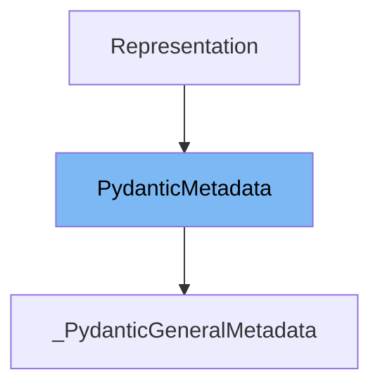

This document will cover the following aspects of the `PydanticMetadata` class:

1. What is `PydanticMetadata`.
2. Variables and functions in `PydanticMetadata`.
3. Usage example of `PydanticMetadata`.



# What is PydanticMetadata

`PydanticMetadata` is a base class for annotation markers like `Strict` in the Pydantic library. It is used to define metadata for Pydantic models and fields. This metadata can be used to customize the behavior of models and fields during validation, serialization, and other operations.

<SwmSnippet path="/pydantic/_internal/_fields.py" line="63">

---

# Variables and functions

`__slots__` is a built-in attribute of Python classes. It is used to declare fixed attributes for instances, which can optimize memory usage and attribute access speed. In `PydanticMetadata`, `__slots__` is set to an empty tuple, indicating that instances of this class do not have any additional attributes beyond what is declared in the class itself.

```python
    __slots__ = ()
```

---

</SwmSnippet>

<SwmSnippet path="/pydantic/_internal/_fields.py" line="66">

---

The function `pydantic_general_metadata` is used to create a new instance of `_PydanticGeneralMetadata` class with the given metadata. The metadata is passed as keyword arguments to this function, which are then used to initialize the `_PydanticGeneralMetadata` instance.

```python
def pydantic_general_metadata(**metadata: Any) -> BaseMetadata:
    """Create a new `_PydanticGeneralMetadata` class with the given metadata.

    Args:
        **metadata: The metadata to add.

    Returns:
        The new `_PydanticGeneralMetadata` class.
    """
    return _general_metadata_cls()(metadata)  # type: ignore
```

---

</SwmSnippet>

<SwmSnippet path="/pydantic/_internal/_fields.py" line="79">

---

The function `_general_metadata_cls` is used to create the `_PydanticGeneralMetadata` class. This class inherits from `PydanticMetadata` and `BaseMetadata`. It is used to store general metadata like `max_digits`.

```python
def _general_metadata_cls() -> type[BaseMetadata]:
    """Do it this way to avoid importing `annotated_types` at import time."""
    from annotated_types import BaseMetadata

    class _PydanticGeneralMetadata(PydanticMetadata, BaseMetadata):
        """Pydantic general metadata like `max_digits`."""

        def __init__(self, metadata: Any):
            self.__dict__ = metadata

    return _PydanticGeneralMetadata  # type: ignore
```

---

</SwmSnippet>

<SwmSnippet path="/pydantic/_internal/_fields.py" line="66">

---

# Usage example

Here is an example of how to use `PydanticMetadata`. The `pydantic_general_metadata` function is called with metadata as keyword arguments. This function creates a new instance of `_PydanticGeneralMetadata` class with the given metadata.

```python
def pydantic_general_metadata(**metadata: Any) -> BaseMetadata:
    """Create a new `_PydanticGeneralMetadata` class with the given metadata.

    Args:
        **metadata: The metadata to add.

    Returns:
        The new `_PydanticGeneralMetadata` class.
    """
    return _general_metadata_cls()(metadata)  # type: ignore
```

---

</SwmSnippet>

&nbsp;

*This is an auto-generated document by Swimm AI 🌊 and has not yet been verified by a human*

<SwmMeta version="3.0.0" repo-id="Z2l0aHViJTNBJTNBREVNTy1weWRhbnRpYyUzQSUzQWdpbGFkbmF2b3Q=" repo-name="DEMO-pydantic" doc-type="class"><sup>Powered by [Swimm](/)</sup></SwmMeta>
