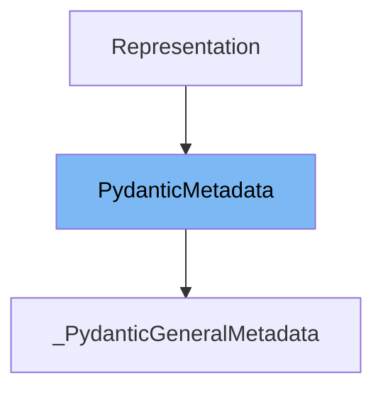

This document will cover the following topics related to the `PydanticMetadata` class:

1. What is `PydanticMetadata`.
2. Variables and functions defined in `PydanticMetadata`.
3. An example of how to use `PydanticMetadata`.



# What is PydanticMetadata

`PydanticMetadata` is a base class for annotation markers like `Strict` in the Pydantic library. It is used as a superclass for other classes that require annotation markers. This class is part of the internal workings of Pydantic and is used to provide additional metadata for Pydantic models and fields.

<SwmSnippet path="/pydantic/_internal/_fields.py" line="63">

---

# Variables and functions

`__slots__` is a built-in attribute of Python classes. It is used to declare fixed attributes for instances, which can optimize memory usage and attribute access speed. In `PydanticMetadata`, `__slots__` is set to an empty tuple, meaning instances of this class do not have their own attribute dictionary, and thus cannot have additional attributes assigned to them beyond what is defined in the class.

```python
    __slots__ = ()
```

---

</SwmSnippet>

<SwmSnippet path="/pydantic/_internal/_fields.py" line="66">

---

The function `pydantic_general_metadata` is used to create a new instance of `_PydanticGeneralMetadata` class with the given metadata. The metadata is passed as keyword arguments to this function, which are then used to instantiate the `_PydanticGeneralMetadata` class.

```python
def pydantic_general_metadata(**metadata: Any) -> BaseMetadata:
    """Create a new `_PydanticGeneralMetadata` class with the given metadata.

    Args:
        **metadata: The metadata to add.

    Returns:
        The new `_PydanticGeneralMetadata` class.
    """
    return _general_metadata_cls()(metadata)  # type: ignore
```

---

</SwmSnippet>

<SwmSnippet path="/pydantic/_internal/_fields.py" line="78">

---

The function `_general_metadata_cls` is used to create a new class of type `BaseMetadata`. This class is a subclass of `PydanticMetadata` and `BaseMetadata`. The function is decorated with `lru_cache` to cache the results, so that subsequent calls with the same arguments return the cached result instead of creating a new class.

```python
@lru_cache(maxsize=None)
def _general_metadata_cls() -> type[BaseMetadata]:
    """Do it this way to avoid importing `annotated_types` at import time."""
    from annotated_types import BaseMetadata

    class _PydanticGeneralMetadata(PydanticMetadata, BaseMetadata):
        """Pydantic general metadata like `max_digits`."""

        def __init__(self, metadata: Any):
            self.__dict__ = metadata

    return _PydanticGeneralMetadata  # type: ignore
```

---

</SwmSnippet>

<SwmSnippet path="/pydantic/_internal/_fields.py" line="66">

---

# Usage example

Here is an example of how to use `PydanticMetadata` in `_PydanticGeneralMetadata`. The `pydantic_general_metadata` function is called with metadata as keyword arguments. This function creates a new instance of `_PydanticGeneralMetadata` class with the given metadata.

```python
def pydantic_general_metadata(**metadata: Any) -> BaseMetadata:
    """Create a new `_PydanticGeneralMetadata` class with the given metadata.

    Args:
        **metadata: The metadata to add.

    Returns:
        The new `_PydanticGeneralMetadata` class.
    """
    return _general_metadata_cls()(metadata)  # type: ignore
```

---

</SwmSnippet>

&nbsp;

*This is an auto-generated document by Swimm AI 🌊 and has not yet been verified by a human*

<SwmMeta version="3.0.0" repo-id="Z2l0aHViJTNBJTNBREVNTy1weWRhbnRpYyUzQSUzQWdpbGFkbmF2b3Q=" repo-name="DEMO-pydantic" doc-type="class"><sup>Powered by [Swimm](/)</sup></SwmMeta>
