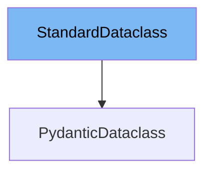

This document will cover the following aspects of the `StandardDataclass` in the Pydantic library:

1. What is `StandardDataclass`.
2. Variables and functions of `StandardDataclass`.
3. An example of how to use `StandardDataclass`.



# What is StandardDataclass

`StandardDataclass` is a protocol defined in the Pydantic library. It is used as a base class for data classes in Pydantic. It provides a standard structure for data classes, including some class variables and an initialization method.

<SwmSnippet path="/pydantic/_internal/_dataclasses.py" line="35">

---

# Variables and functions

The variable `__dataclass_fields__` is a class variable that stores a dictionary of the fields in the data class.

```python
        __dataclass_fields__: ClassVar[dict[str, Any]]
```

---

</SwmSnippet>

<SwmSnippet path="/pydantic/_internal/_dataclasses.py" line="36">

---

The variable `__dataclass_params__` is a class variable that stores the parameters of the data class.

```python
        __dataclass_params__: ClassVar[Any]  # in reality `dataclasses._DataclassParams`
```

---

</SwmSnippet>

<SwmSnippet path="/pydantic/_internal/_dataclasses.py" line="37">

---

The variable `__post_init__` is a class variable that stores a callable to be executed after the initialization of the data class.

```python
        __post_init__: ClassVar[Callable[..., None]]
```

---

</SwmSnippet>

<SwmSnippet path="/pydantic/_internal/_dataclasses.py" line="39">

---

The `__init__` function is used to initialize the data class. It takes any number of arguments and keyword arguments but does not perform any actions.

```python
        def __init__(self, *args: object, **kwargs: object) -> None:
            pass
```

---

</SwmSnippet>

<SwmSnippet path="/pydantic/_internal/_dataclasses.py" line="42">

---

# Usage example

`PydanticDataclass` is an example of a class that implements `StandardDataclass`. It extends `StandardDataclass` and adds additional Pydantic-specific attributes.

```python
    class PydanticDataclass(StandardDataclass, typing.Protocol):
        """A protocol containing attributes only available once a class has been decorated as a Pydantic dataclass.

        Attributes:
            __pydantic_config__: Pydantic-specific configuration settings for the dataclass.
            __pydantic_complete__: Whether dataclass building is completed, or if there are still undefined fields.
            __pydantic_core_schema__: The pydantic-core schema used to build the SchemaValidator and SchemaSerializer.
            __pydantic_decorators__: Metadata containing the decorators defined on the dataclass.
            __pydantic_fields__: Metadata about the fields defined on the dataclass.
            __pydantic_serializer__: The pydantic-core SchemaSerializer used to dump instances of the dataclass.
            __pydantic_validator__: The pydantic-core SchemaValidator used to validate instances of the dataclass.
        """

        __pydantic_config__: ClassVar[ConfigDict]
        __pydantic_complete__: ClassVar[bool]
        __pydantic_core_schema__: ClassVar[core_schema.CoreSchema]
        __pydantic_decorators__: ClassVar[_decorators.DecoratorInfos]
        __pydantic_fields__: ClassVar[dict[str, FieldInfo]]
        __pydantic_serializer__: ClassVar[SchemaSerializer]
        __pydantic_validator__: ClassVar[SchemaValidator]
```

---

</SwmSnippet>

&nbsp;

*This is an auto-generated document by Swimm AI 🌊 and has not yet been verified by a human*

<SwmMeta version="3.0.0" repo-id="Z2l0aHViJTNBJTNBREVNTy1weWRhbnRpYyUzQSUzQWdpbGFkbmF2b3Q=" repo-name="DEMO-pydantic" doc-type="class"><sup>Powered by [Swimm](/)</sup></SwmMeta>
