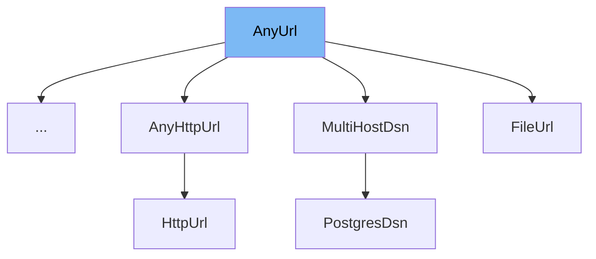

This document will cover the `AnyUrl` class in the `pydantic/v1/networks.py` file. We'll cover:

1. What is `AnyUrl`
2. Variables and functions in `AnyUrl`
3. An example of how to use `AnyUrl` in `CockroachDsn`.



# What is AnyUrl

`AnyUrl` is a class in the `pydantic/v1/networks.py` file. It is a subclass of `str` and is used for validating URLs. It provides a way to define and validate URLs using Python type hints. The class includes several variables and functions that help in validating and building URLs.

<SwmSnippet path="/pydantic/v1/networks.py" line="172">

---

# Variables in AnyUrl

The `AnyUrl` class has several class variables that define the properties of a URL. These include `strip_whitespace`, `min_length`, `max_length`, `allowed_schemes`, `tld_required`, `user_required`, `host_required`, and `hidden_parts`. These variables are used to set the requirements for a valid URL.

```python
    strip_whitespace = True
    min_length = 1
    max_length = 2**16
    allowed_schemes: Optional[Collection[str]] = None
    tld_required: bool = False
    user_required: bool = False
    host_required: bool = True
    hidden_parts: Set[str] = set()
```

---

</SwmSnippet>

<SwmSnippet path="/pydantic/v1/networks.py" line="183">

---

# Functions in AnyUrl

The `__new__` function is used to create a new instance of the `AnyUrl` class. It takes a URL and optional keyword arguments, and returns a new `AnyUrl` instance.

```python
    @no_type_check
    def __new__(cls, url: Optional[str], **kwargs) -> object:
        return str.__new__(cls, cls.build(**kwargs) if url is None else url)

```

---

</SwmSnippet>

<SwmSnippet path="/pydantic/v1/networks.py" line="187">

---

The `__init__` function is used to initialize an instance of the `AnyUrl` class. It sets the various parts of the URL, such as the scheme, user, password, host, tld, host_type, port, path, query, and fragment.

```python
    def __init__(
        self,
        url: str,
        *,
        scheme: str,
        user: Optional[str] = None,
        password: Optional[str] = None,
        host: Optional[str] = None,
        tld: Optional[str] = None,
        host_type: str = 'domain',
        port: Optional[str] = None,
        path: Optional[str] = None,
        query: Optional[str] = None,
        fragment: Optional[str] = None,
    ) -> None:
```

---

</SwmSnippet>

<SwmSnippet path="/pydantic/v1/networks.py" line="214">

---

The `build` function is a class method that builds a URL from its parts. It takes the parts of a URL as arguments, constructs a URL string, and returns it.

```python
    @classmethod
    def build(
        cls,
        *,
        scheme: str,
        user: Optional[str] = None,
        password: Optional[str] = None,
        host: str,
        port: Optional[str] = None,
        path: Optional[str] = None,
        query: Optional[str] = None,
        fragment: Optional[str] = None,
        **_kwargs: str,
    ) -> str:
        parts = Parts(
            scheme=scheme,
            user=user,
            password=password,
            host=host,
            port=port,
            path=path,
```

---

</SwmSnippet>

<SwmSnippet path="/pydantic/v1/networks.py" line="258">

---

The `__modify_schema__` function is a class method that modifies the schema of the `AnyUrl` class. It updates the schema with the minimum and maximum length of a URL and its format.

```python
    @classmethod
    def __modify_schema__(cls, field_schema: Dict[str, Any]) -> None:
        update_not_none(field_schema, minLength=cls.min_length, maxLength=cls.max_length, format='uri')

```

---

</SwmSnippet>

<SwmSnippet path="/pydantic/v1/networks.py" line="262">

---

The `__get_validators__` function is a class method that returns a generator of validators for the `AnyUrl` class. The validators are used to validate the URLs.

```python
    @classmethod
    def __get_validators__(cls) -> 'CallableGenerator':
        yield cls.validate

```

---

</SwmSnippet>

<SwmSnippet path="/pydantic/v1/networks.py" line="266">

---

The `validate` function is a class method that validates a URL. It checks if the URL meets the requirements defined by the `AnyUrl` class variables. If the URL is valid, it returns an `AnyUrl` instance. If the URL is not valid, it raises an error.

```python
    @classmethod
    def validate(cls, value: Any, field: 'ModelField', config: 'BaseConfig') -> 'AnyUrl':
        if value.__class__ == cls:
            return value
        value = str_validator(value)
        if cls.strip_whitespace:
            value = value.strip()
        url: str = cast(str, constr_length_validator(value, field, config))

        m = cls._match_url(url)
        # the regex should always match, if it doesn't please report with details of the URL tried
        assert m, 'URL regex failed unexpectedly'

        original_parts = cast('Parts', m.groupdict())
        parts = cls.apply_default_parts(original_parts)
        parts = cls.validate_parts(parts)

        if m.end() != len(url):
            raise errors.UrlExtraError(extra=url[m.end() :])

        return cls._build_url(m, url, parts)
```

---

</SwmSnippet>

<SwmSnippet path="/pydantic/v1/networks.py" line="504">

---

# Usage example

The `CockroachDsn` class is an example of how to use the `AnyUrl` class. It extends the `AnyUrl` class and sets the `allowed_schemes` and `user_required` variables. This means that a valid `CockroachDsn` URL must have a scheme that is in the `allowed_schemes` and must have a user.

```python
class CockroachDsn(AnyUrl):
    allowed_schemes = {
        'cockroachdb',
        'cockroachdb+psycopg2',
        'cockroachdb+asyncpg',
    }
    user_required = True
```

---

</SwmSnippet>

&nbsp;

*This is an auto-generated document by Swimm AI 🌊 and has not yet been verified by a human*

<SwmMeta version="3.0.0" repo-id="Z2l0aHViJTNBJTNBREVNTy1weWRhbnRpYyUzQSUzQWdpbGFkbmF2b3Q=" repo-name="DEMO-pydantic" doc-type="class"><sup>Powered by [Swimm](/)</sup></SwmMeta>
