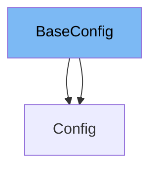

This document will cover the following aspects of the `BaseConfig` class in the `pydantic/v1/config.py` file:

1. What is `BaseConfig`.
2. Variables and functions in `BaseConfig`.
3. An example of how to use `BaseConfig`.



# What is BaseConfig

`BaseConfig` is a class in the `pydantic/v1/config.py` file. It is used to define and manage the configuration for Pydantic models. It provides a set of default configurations that can be overridden by the user-defined `Config` class in the Pydantic models.

<SwmSnippet path="/pydantic/v1/config.py" line="81">

---

# Variables in BaseConfig

The `title` variable is an optional string that can be used to provide a title for the model.

```python
    title: Optional[str] = None
```

---

</SwmSnippet>

<SwmSnippet path="/pydantic/v1/config.py" line="82">

---

The `anystr_lower` variable is a boolean that determines if strings should be automatically converted to lower case.

```python
    anystr_lower: bool = False
```

---

</SwmSnippet>

<SwmSnippet path="/pydantic/v1/config.py" line="83">

---

The `anystr_upper` variable is a boolean that determines if strings should be automatically converted to upper case.

```python
    anystr_upper: bool = False
```

---

</SwmSnippet>

<SwmSnippet path="/pydantic/v1/config.py" line="117">

---

# Functions in BaseConfig

The `get_field_info` function is a class method that retrieves properties of `FieldInfo` from the `fields` property of the config class.

```python
    @classmethod
    def get_field_info(cls, name: str) -> Dict[str, Any]:
        """
        Get properties of FieldInfo from the `fields` property of the config class.
        """

        fields_value = cls.fields.get(name)

        if isinstance(fields_value, str):
            field_info: Dict[str, Any] = {'alias': fields_value}
        elif isinstance(fields_value, dict):
            field_info = fields_value
        else:
            field_info = {}

        if 'alias' in field_info:
            field_info.setdefault('alias_priority', 2)

        if field_info.get('alias_priority', 0) <= 1 and cls.alias_generator:
            alias = cls.alias_generator(name)
            if not isinstance(alias, str):
```

---

</SwmSnippet>

<SwmSnippet path="/pydantic/v1/config.py" line="142">

---

The `prepare_field` function is a class method that serves as an optional hook to check or modify fields during model creation.

```python
    @classmethod
    def prepare_field(cls, field: 'ModelField') -> None:
        """
        Optional hook to check or modify fields during model creation.
        """
        pass
```

---

</SwmSnippet>

<SwmSnippet path="/pydantic/v1/config.py" line="161">

---

# Usage example

Here is an example of how `BaseConfig` is used in the `Config` class. The `Config` class inherits from `BaseConfig` and overrides its properties.

```python
        class Config(BaseConfig):
            ...

        for k, v in config_dict.items():
            setattr(Config, k, v)
        return Config
```

---

</SwmSnippet>

&nbsp;

*This is an auto-generated document by Swimm AI 🌊 and has not yet been verified by a human*

<SwmMeta version="3.0.0" repo-id="Z2l0aHViJTNBJTNBREVNTy1weWRhbnRpYyUzQSUzQWdpbGFkbmF2b3Q=" repo-name="DEMO-pydantic" doc-type="class"><sup>Powered by [Swimm](/)</sup></SwmMeta>
