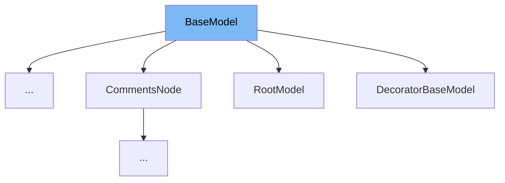

This document will cover the following topics related to the `BaseModel` class in the DEMO-pydantic repo:

1. What is `BaseModel` and its purpose.
2. The variables and functions defined in `BaseModel`.
3. An example of how to use `BaseModel` in `DecoratorBaseModel`.



# What is BaseModel

`BaseModel` is a base class for creating Pydantic models. It provides a structure for data validation using Python type hints. The class includes various attributes and methods that facilitate data validation, serialization, and model configuration.

<SwmSnippet path="/pydantic/main.py" line="116">

---

# Variables and functions

`model_config` is a class variable that holds the configuration for the model. It should be a dictionary conforming to `ConfigDict`.

```python
        model_config: ClassVar[ConfigDict]
        """
        Configuration for the model, should be a dictionary conforming to [`ConfigDict`][pydantic.config.ConfigDict].
        """
```

---

</SwmSnippet>

<SwmSnippet path="/pydantic/main.py" line="121">

---

`model_fields` is a class variable that holds metadata about the fields defined on the model. It maps field names to `FieldInfo` objects.

```python
        model_fields: ClassVar[dict[str, FieldInfo]]
        """
        Metadata about the fields defined on the model,
        mapping of field names to [`FieldInfo`][pydantic.fields.FieldInfo].

        This replaces `Model.__fields__` from Pydantic V1.
        """
```

---

</SwmSnippet>

<SwmSnippet path="/pydantic/main.py" line="129">

---

`model_computed_fields` is a class variable that holds a dictionary of computed field names and their corresponding `ComputedFieldInfo` objects.

```python
        model_computed_fields: ClassVar[dict[str, ComputedFieldInfo]]
        """A dictionary of computed field names and their corresponding `ComputedFieldInfo` objects."""
```

---

</SwmSnippet>

<SwmSnippet path="/pydantic/main.py" line="182">

---

The `__init__` method is used to create a new model by parsing and validating input data from keyword arguments. It raises a `ValidationError` if the input data cannot be validated to form a valid model.

```python
    def __init__(self, /, **data: Any) -> None:  # type: ignore
        """Create a new model by parsing and validating input data from keyword arguments.

        Raises [`ValidationError`][pydantic_core.ValidationError] if the input data cannot be
        validated to form a valid model.

        `self` is explicitly positional-only to allow `self` as a field name.
        """
        # `__tracebackhide__` tells pytest and some other tools to omit this function from tracebacks
        __tracebackhide__ = True
        self.__pydantic_validator__.validate_python(data, self_instance=self)

    # The following line sets a flag that we use to determine when `__init__` gets overridden by the user
    __init__.__pydantic_base_init__ = True  # pyright: ignore[reportFunctionMemberAccess]
```

---

</SwmSnippet>

<SwmSnippet path="/pydantic/main.py" line="217">

---

`model_construct` is a class method that creates a new instance of the `Model` class with validated data. It sets `__dict__` and `__pydantic_fields_set__` from trusted or pre-validated data. Default values are respected, but no other validation is performed.

```python
    def model_construct(cls, _fields_set: set[str] | None = None, **values: Any) -> Self:  # noqa: C901
        """Creates a new instance of the `Model` class with validated data.

        Creates a new model setting `__dict__` and `__pydantic_fields_set__` from trusted or pre-validated data.
        Default values are respected, but no other validation is performed.

        !!! note
            `model_construct()` generally respects the `model_config.extra` setting on the provided model.
            That is, if `model_config.extra == 'allow'`, then all extra passed values are added to the model instance's `__dict__`
            and `__pydantic_extra__` fields. If `model_config.extra == 'ignore'` (the default), then all extra passed values are ignored.
            Because no validation is performed with a call to `model_construct()`, having `model_config.extra == 'forbid'` does not result in
            an error if extra values are passed, but they will be ignored.

        Args:
            _fields_set: The set of field names accepted for the Model instance.
            values: Trusted or pre-validated data dictionary.

        Returns:
            A new instance of the `Model` class with validated data.
        """
        m = cls.__new__(cls)
```

---

</SwmSnippet>

<SwmSnippet path="/pydantic/main.py" line="297">

---

`model_copy` returns a copy of the model. It takes an optional `update` parameter to change/add values in the new model and a `deep` parameter to make a deep copy of the model.

```python
    def model_copy(self, *, update: dict[str, Any] | None = None, deep: bool = False) -> Self:
        """Usage docs: https://docs.pydantic.dev/2.8/concepts/serialization/#model_copy

        Returns a copy of the model.

        Args:
            update: Values to change/add in the new model. Note: the data is not validated
                before creating the new model. You should trust this data.
            deep: Set to `True` to make a deep copy of the model.

        Returns:
            New model instance.
        """
        copied = self.__deepcopy__() if deep else self.__copy__()
        if update:
            if self.model_config.get('extra') == 'allow':
                for k, v in update.items():
                    if k in self.model_fields:
                        copied.__dict__[k] = v
                    else:
                        if copied.__pydantic_extra__ is None:
```

---

</SwmSnippet>

<SwmSnippet path="/pydantic/main.py" line="325">

---

`model_dump` generates a dictionary representation of the model, optionally specifying which fields to include or exclude.

```python
    def model_dump(
        self,
        *,
        mode: Literal['json', 'python'] | str = 'python',
        include: IncEx = None,
        exclude: IncEx = None,
        context: Any | None = None,
        by_alias: bool = False,
        exclude_unset: bool = False,
        exclude_defaults: bool = False,
        exclude_none: bool = False,
        round_trip: bool = False,
        warnings: bool | Literal['none', 'warn', 'error'] = True,
        serialize_as_any: bool = False,
    ) -> dict[str, Any]:
        """Usage docs: https://docs.pydantic.dev/2.8/concepts/serialization/#modelmodel_dump

        Generate a dictionary representation of the model, optionally specifying which fields to include or exclude.

        Args:
            mode: The mode in which `to_python` should run.
```

---

</SwmSnippet>

<SwmSnippet path="/pydantic/deprecated/decorator.py" line="52">

---

# Usage example

`DecoratorBaseModel` is an example of a class that extends `BaseModel`.

```python

```

---

</SwmSnippet>

&nbsp;

*This is an auto-generated document by Swimm AI 🌊 and has not yet been verified by a human*

<SwmMeta version="3.0.0" repo-id="Z2l0aHViJTNBJTNBREVNTy1weWRhbnRpYyUzQSUzQWdpbGFkbmF2b3Q=" repo-name="DEMO-pydantic" doc-type="class"><sup>Powered by [Swimm](/)</sup></SwmMeta>
