```mermaid
graph TD;
  BaseModel:::currentBaseStyle
BaseModel --> CommentsNode
CommentsNode --> 1[...]
BaseModel --> RootModel
BaseModel --> DecoratorBaseModel
BaseModel --> 2[...]

 classDef currentBaseStyle color:#000000,fill:#7CB9F4

%% Swimm:
%% graph TD;
%%   BaseModel:::currentBaseStyle
%% <SwmToken path="/pydantic/v1/main.py" pos="310:2:2" line-data="class BaseModel(Representation, metaclass=ModelMetaclass):">`BaseModel`</SwmToken> --> <SwmToken path="/.github/actions/people/people.py" pos="156:2:2" line-data="class CommentsNode(BaseModel):">`CommentsNode`</SwmToken>
%% <SwmToken path="/.github/actions/people/people.py" pos="156:2:2" line-data="class CommentsNode(BaseModel):">`CommentsNode`</SwmToken> --> 1[...]
%% <SwmToken path="/pydantic/v1/main.py" pos="310:2:2" line-data="class BaseModel(Representation, metaclass=ModelMetaclass):">`BaseModel`</SwmToken> --> <SwmToken path="/pydantic/root_model.py" pos="58:3:3" line-data="                &quot;`RootModel` does not support setting `model_config[&#39;extra&#39;]`&quot;, code=&#39;root-model-extra&#39;">`RootModel`</SwmToken>
%% <SwmToken path="/pydantic/v1/main.py" pos="310:2:2" line-data="class BaseModel(Representation, metaclass=ModelMetaclass):">`BaseModel`</SwmToken> --> DecoratorBaseModel
%% <SwmToken path="/pydantic/v1/main.py" pos="310:2:2" line-data="class BaseModel(Representation, metaclass=ModelMetaclass):">`BaseModel`</SwmToken> --> 2[...]
%% 
%%  classDef currentBaseStyle color:#000000,fill:#7CB9F4
```

This document will cover the following topics related to the <SwmToken path="/pydantic/v1/main.py" pos="310:2:2" line-data="class BaseModel(Representation, metaclass=ModelMetaclass):">`BaseModel`</SwmToken> class in the DEMO-pydantic repo:

1. What is <SwmToken path="/pydantic/v1/main.py" pos="310:2:2" line-data="class BaseModel(Representation, metaclass=ModelMetaclass):">`BaseModel`</SwmToken> and its purpose.
2. The variables and functions defined in <SwmToken path="/pydantic/v1/main.py" pos="310:2:2" line-data="class BaseModel(Representation, metaclass=ModelMetaclass):">`BaseModel`</SwmToken>.
3. An example of how to use <SwmToken path="/pydantic/v1/main.py" pos="310:2:2" line-data="class BaseModel(Representation, metaclass=ModelMetaclass):">`BaseModel`</SwmToken> in <SwmToken path="/pydantic/root_model.py" pos="58:3:3" line-data="                &quot;`RootModel` does not support setting `model_config[&#39;extra&#39;]`&quot;, code=&#39;root-model-extra&#39;">`RootModel`</SwmToken>.



# What is <SwmToken path="/pydantic/v1/main.py" pos="310:2:2" line-data="class BaseModel(Representation, metaclass=ModelMetaclass):">`BaseModel`</SwmToken>

<SwmToken path="/pydantic/v1/main.py" pos="310:2:2" line-data="class BaseModel(Representation, metaclass=ModelMetaclass):">`BaseModel`</SwmToken> is a base class for creating Pydantic models. It provides a structure for data validation using Python type hints. The class includes various attributes and methods that aid in data validation, model construction, data serialization, and more. It is the core of the Pydantic library and serves as the foundation for user-defined models.

<SwmSnippet path="/pydantic/main.py" line="116">

---

# Variables and functions

<SwmToken path="/pydantic/main.py" pos="116:1:1" line-data="        model_config: ClassVar[ConfigDict]">`model_config`</SwmToken> is a class variable that holds the configuration for the model. It should be a dictionary conforming to <SwmToken path="/pydantic/main.py" pos="116:6:6" line-data="        model_config: ClassVar[ConfigDict]">`ConfigDict`</SwmToken>.

```python
        model_config: ClassVar[ConfigDict]
        """
        Configuration for the model, should be a dictionary conforming to [`ConfigDict`][pydantic.config.ConfigDict].
        """
```

---

</SwmSnippet>

<SwmSnippet path="/pydantic/main.py" line="121">

---

<SwmToken path="/pydantic/main.py" pos="121:1:1" line-data="        model_fields: ClassVar[dict[str, FieldInfo]]">`model_fields`</SwmToken> is a class variable that holds metadata about the fields defined on the model. It maps field names to <SwmToken path="/pydantic/main.py" pos="121:11:11" line-data="        model_fields: ClassVar[dict[str, FieldInfo]]">`FieldInfo`</SwmToken> objects. This replaces <SwmToken path="/pydantic/main.py" pos="126:6:8" line-data="        This replaces `Model.__fields__` from Pydantic V1.">`Model.__fields__`</SwmToken> from Pydantic <SwmToken path="/pydantic/main.py" pos="126:15:15" line-data="        This replaces `Model.__fields__` from Pydantic V1.">`V1`</SwmToken>.

```python
        model_fields: ClassVar[dict[str, FieldInfo]]
        """
        Metadata about the fields defined on the model,
        mapping of field names to [`FieldInfo`][pydantic.fields.FieldInfo].

        This replaces `Model.__fields__` from Pydantic V1.
        """
```

---

</SwmSnippet>

<SwmSnippet path="/pydantic/main.py" line="129">

---

<SwmToken path="/pydantic/main.py" pos="129:1:1" line-data="        model_computed_fields: ClassVar[dict[str, ComputedFieldInfo]]">`model_computed_fields`</SwmToken> is a class variable that holds a dictionary of computed field names and their corresponding <SwmToken path="/pydantic/main.py" pos="129:11:11" line-data="        model_computed_fields: ClassVar[dict[str, ComputedFieldInfo]]">`ComputedFieldInfo`</SwmToken> objects.

```python
        model_computed_fields: ClassVar[dict[str, ComputedFieldInfo]]
        """A dictionary of computed field names and their corresponding `ComputedFieldInfo` objects."""
```

---

</SwmSnippet>

<SwmSnippet path="/pydantic/main.py" line="182">

---

The <SwmToken path="/pydantic/main.py" pos="182:3:3" line-data="    def __init__(self, /, **data: Any) -&gt; None:  # type: ignore">`__init__`</SwmToken> method is used to create a new model by parsing and validating input data from keyword arguments. It raises a <SwmToken path="/pydantic/main.py" pos="185:5:5" line-data="        Raises [`ValidationError`][pydantic_core.ValidationError] if the input data cannot be">`ValidationError`</SwmToken> if the input data cannot be validated to form a valid model.

```python
    def __init__(self, /, **data: Any) -> None:  # type: ignore
        """Create a new model by parsing and validating input data from keyword arguments.

        Raises [`ValidationError`][pydantic_core.ValidationError] if the input data cannot be
        validated to form a valid model.

        `self` is explicitly positional-only to allow `self` as a field name.
        """
        # `__tracebackhide__` tells pytest and some other tools to omit this function from tracebacks
        __tracebackhide__ = True
        self.__pydantic_validator__.validate_python(data, self_instance=self)

    # The following line sets a flag that we use to determine when `__init__` gets overridden by the user
    __init__.__pydantic_base_init__ = True  # pyright: ignore[reportFunctionMemberAccess]
```

---

</SwmSnippet>

<SwmSnippet path="/pydantic/main.py" line="216">

---

<SwmToken path="/pydantic/main.py" pos="217:3:3" line-data="    def model_construct(cls, _fields_set: set[str] | None = None, **values: Any) -&gt; Self:  # noqa: C901">`model_construct`</SwmToken> is a class method that creates a new instance of the <SwmToken path="/pydantic/main.py" pos="218:17:17" line-data="        &quot;&quot;&quot;Creates a new instance of the `Model` class with validated data.">`Model`</SwmToken> class with validated data. It sets <SwmToken path="/pydantic/main.py" pos="220:12:12" line-data="        Creates a new model setting `__dict__` and `__pydantic_fields_set__` from trusted or pre-validated data.">`__dict__`</SwmToken> and <SwmToken path="/pydantic/main.py" pos="220:18:18" line-data="        Creates a new model setting `__dict__` and `__pydantic_fields_set__` from trusted or pre-validated data.">`__pydantic_fields_set__`</SwmToken> from trusted or <SwmToken path="/pydantic/main.py" pos="220:27:29" line-data="        Creates a new model setting `__dict__` and `__pydantic_fields_set__` from trusted or pre-validated data.">`pre-validated`</SwmToken> data. Default values are respected, but no other validation is performed.

```python
    @classmethod
    def model_construct(cls, _fields_set: set[str] | None = None, **values: Any) -> Self:  # noqa: C901
        """Creates a new instance of the `Model` class with validated data.

        Creates a new model setting `__dict__` and `__pydantic_fields_set__` from trusted or pre-validated data.
        Default values are respected, but no other validation is performed.

        !!! note
            `model_construct()` generally respects the `model_config.extra` setting on the provided model.
            That is, if `model_config.extra == 'allow'`, then all extra passed values are added to the model instance's `__dict__`
            and `__pydantic_extra__` fields. If `model_config.extra == 'ignore'` (the default), then all extra passed values are ignored.
            Because no validation is performed with a call to `model_construct()`, having `model_config.extra == 'forbid'` does not result in
            an error if extra values are passed, but they will be ignored.

        Args:
            _fields_set: The set of field names accepted for the Model instance.
            values: Trusted or pre-validated data dictionary.

        Returns:
            A new instance of the `Model` class with validated data.
        """
```

---

</SwmSnippet>

<SwmSnippet path="/pydantic/main.py" line="297">

---

<SwmToken path="/pydantic/main.py" pos="297:3:3" line-data="    def model_copy(self, *, update: dict[str, Any] | None = None, deep: bool = False) -&gt; Self:">`model_copy`</SwmToken> is a method that returns a copy of the model. It takes an optional <SwmToken path="/pydantic/main.py" pos="297:10:10" line-data="    def model_copy(self, *, update: dict[str, Any] | None = None, deep: bool = False) -&gt; Self:">`update`</SwmToken> parameter to <SwmToken path="/pydantic/main.py" pos="303:8:10" line-data="            update: Values to change/add in the new model. Note: the data is not validated">`change/add`</SwmToken> values in the new model and a <SwmToken path="/pydantic/main.py" pos="297:30:30" line-data="    def model_copy(self, *, update: dict[str, Any] | None = None, deep: bool = False) -&gt; Self:">`deep`</SwmToken> parameter to make a deep copy of the model.

```python
    def model_copy(self, *, update: dict[str, Any] | None = None, deep: bool = False) -> Self:
        """Usage docs: https://docs.pydantic.dev/2.8/concepts/serialization/#model_copy

        Returns a copy of the model.

        Args:
            update: Values to change/add in the new model. Note: the data is not validated
                before creating the new model. You should trust this data.
            deep: Set to `True` to make a deep copy of the model.

        Returns:
            New model instance.
        """
        copied = self.__deepcopy__() if deep else self.__copy__()
        if update:
            if self.model_config.get('extra') == 'allow':
                for k, v in update.items():
                    if k in self.model_fields:
                        copied.__dict__[k] = v
                    else:
                        if copied.__pydantic_extra__ is None:
```

---

</SwmSnippet>

<SwmSnippet path="/pydantic/main.py" line="325">

---

<SwmToken path="/pydantic/main.py" pos="325:3:3" line-data="    def model_dump(">`model_dump`</SwmToken> is a method that generates a dictionary representation of the model, optionally specifying which fields to include or exclude.

```python
    def model_dump(
        self,
        *,
        mode: Literal['json', 'python'] | str = 'python',
        include: IncEx = None,
        exclude: IncEx = None,
        context: Any | None = None,
        by_alias: bool = False,
        exclude_unset: bool = False,
        exclude_defaults: bool = False,
        exclude_none: bool = False,
        round_trip: bool = False,
        warnings: bool | Literal['none', 'warn', 'error'] = True,
        serialize_as_any: bool = False,
    ) -> dict[str, Any]:
        """Usage docs: https://docs.pydantic.dev/2.8/concepts/serialization/#modelmodel_dump

        Generate a dictionary representation of the model, optionally specifying which fields to include or exclude.

        Args:
            mode: The mode in which `to_python` should run.
```

---

</SwmSnippet>

<SwmSnippet path="/pydantic/main.py" line="378">

---

<SwmToken path="/pydantic/main.py" pos="378:3:3" line-data="    def model_dump_json(">`model_dump_json`</SwmToken> is a method that generates a JSON representation of the model using Pydantic's <SwmToken path="/pydantic/main.py" pos="395:22:22" line-data="        Generates a JSON representation of the model using Pydantic&#39;s `to_json` method.">`to_json`</SwmToken> method.

```python
    def model_dump_json(
        self,
        *,
        indent: int | None = None,
        include: IncEx = None,
        exclude: IncEx = None,
        context: Any | None = None,
        by_alias: bool = False,
        exclude_unset: bool = False,
        exclude_defaults: bool = False,
        exclude_none: bool = False,
        round_trip: bool = False,
        warnings: bool | Literal['none', 'warn', 'error'] = True,
        serialize_as_any: bool = False,
    ) -> str:
        """Usage docs: https://docs.pydantic.dev/2.8/concepts/serialization/#modelmodel_dump_json

        Generates a JSON representation of the model using Pydantic's `to_json` method.

        Args:
            indent: Indentation to use in the JSON output. If None is passed, the output will be compact.
```

---

</SwmSnippet>

<SwmSnippet path="/pydantic/main.py" line="429">

---

<SwmToken path="/pydantic/main.py" pos="430:3:3" line-data="    def model_json_schema(">`model_json_schema`</SwmToken> is a class method that generates a JSON schema for a model class.

```python
    @classmethod
    def model_json_schema(
        cls,
        by_alias: bool = True,
        ref_template: str = DEFAULT_REF_TEMPLATE,
        schema_generator: type[GenerateJsonSchema] = GenerateJsonSchema,
        mode: JsonSchemaMode = 'validation',
    ) -> dict[str, Any]:
        """Generates a JSON schema for a model class.

        Args:
            by_alias: Whether to use attribute aliases or not.
            ref_template: The reference template.
            schema_generator: To override the logic used to generate the JSON schema, as a subclass of
                `GenerateJsonSchema` with your desired modifications
            mode: The mode in which to generate the schema.

        Returns:
            The JSON schema for the given model class.
        """
        return model_json_schema(
```

---

</SwmSnippet>

<SwmSnippet path="/pydantic/main.py" line="453">

---

<SwmToken path="/pydantic/main.py" pos="454:3:3" line-data="    def model_parametrized_name(cls, params: tuple[type[Any], ...]) -&gt; str:">`model_parametrized_name`</SwmToken> is a class method that computes the class name for parametrizations of generic classes.

```python
    @classmethod
    def model_parametrized_name(cls, params: tuple[type[Any], ...]) -> str:
        """Compute the class name for parametrizations of generic classes.

        This method can be overridden to achieve a custom naming scheme for generic BaseModels.

        Args:
            params: Tuple of types of the class. Given a generic class
                `Model` with 2 type variables and a concrete model `Model[str, int]`,
                the value `(str, int)` would be passed to `params`.

        Returns:
            String representing the new class where `params` are passed to `cls` as type variables.

        Raises:
```

---

</SwmSnippet>

<SwmSnippet path="/pydantic/main.py" line="480">

---

<SwmToken path="/pydantic/main.py" pos="480:3:3" line-data="    def model_post_init(self, __context: Any) -&gt; None:">`model_post_init`</SwmToken> is a method that you can override to perform additional initialization after <SwmToken path="/pydantic/main.py" pos="481:21:21" line-data="        &quot;&quot;&quot;Override this method to perform additional initialization after `__init__` and `model_construct`.">`__init__`</SwmToken> and <SwmToken path="/pydantic/main.py" pos="481:27:27" line-data="        &quot;&quot;&quot;Override this method to perform additional initialization after `__init__` and `model_construct`.">`model_construct`</SwmToken>. This is useful if you want to do some validation that requires the entire model to be initialized.

```python
    def model_post_init(self, __context: Any) -> None:
        """Override this method to perform additional initialization after `__init__` and `model_construct`.
        This is useful if you want to do some validation that requires the entire model to be initialized.
        """
        pass
```

---

</SwmSnippet>

<SwmSnippet path="/pydantic/main.py" line="486">

---

<SwmToken path="/pydantic/main.py" pos="487:3:3" line-data="    def model_rebuild(">`model_rebuild`</SwmToken> is a class method that tries to rebuild the <SwmToken path="/pydantic/main.py" pos="91:6:8" line-data="        __pydantic_core_schema__: The pydantic-core schema used to build the SchemaValidator and SchemaSerializer.">`pydantic-core`</SwmToken> schema for the model. This may be necessary when one of the annotations is a <SwmToken path="/pydantic/main.py" pos="474:21:21" line-data="        # If we eventually move toward wrapping them in a ForwardRef in __class_getitem__ in the future,">`ForwardRef`</SwmToken> which could not be resolved during the initial attempt to build the schema, and automatic rebuilding fails.

```python
    @classmethod
    def model_rebuild(
        cls,
        *,
        force: bool = False,
        raise_errors: bool = True,
        _parent_namespace_depth: int = 2,
        _types_namespace: dict[str, Any] | None = None,
    ) -> bool | None:
```

---

</SwmSnippet>

<SwmSnippet path="/pydantic/main.py" line="542">

---

<SwmToken path="/pydantic/main.py" pos="543:3:3" line-data="    def model_validate(">`model_validate`</SwmToken> is a class method that validates a pydantic model instance.

```python
    @classmethod
    def model_validate(
        cls,
        obj: Any,
        *,
        strict: bool | None = None,
        from_attributes: bool | None = None,
        context: Any | None = None,
    ) -> Self:
```

---

</SwmSnippet>

<SwmSnippet path="/pydantic/main.py" line="572">

---

<SwmToken path="/pydantic/main.py" pos="572:3:3" line-data="    def model_validate_json(">`model_validate_json`</SwmToken> is a class method that validates the given JSON data against the Pydantic model.

```python
    def model_validate_json(
        cls,
        json_data: str | bytes | bytearray,
        *,
        strict: bool | None = None,
        context: Any | None = None,
    ) -> Self:
```

---

</SwmSnippet>

<SwmSnippet path="/pydantic/main.py" line="599">

---

<SwmToken path="/pydantic/main.py" pos="599:3:3" line-data="    def model_validate_strings(">`model_validate_strings`</SwmToken> is a class method that validates the given object with string data against the Pydantic model.

```python
    def model_validate_strings(
        cls,
        obj: Any,
        *,
        strict: bool | None = None,
        context: Any | None = None,
    ) -> Self:
```

---

</SwmSnippet>

<SwmSnippet path="/pydantic/root_model.py" line="52">

---

# Usage example

<SwmToken path="/pydantic/root_model.py" pos="58:3:3" line-data="                &quot;`RootModel` does not support setting `model_config[&#39;extra&#39;]`&quot;, code=&#39;root-model-extra&#39;">`RootModel`</SwmToken> is an example of how <SwmToken path="/pydantic/v1/main.py" pos="310:2:2" line-data="class BaseModel(Representation, metaclass=ModelMetaclass):">`BaseModel`</SwmToken> is used. It extends <SwmToken path="/pydantic/v1/main.py" pos="310:2:2" line-data="class BaseModel(Representation, metaclass=ModelMetaclass):">`BaseModel`</SwmToken> and sets <SwmToken path="/pydantic/main.py" pos="99:1:1" line-data="        __pydantic_root_model__: Whether the model is a `RootModel`.">`__pydantic_root_model__`</SwmToken> to `True`.

```python
    root: RootModelRootType

    def __init_subclass__(cls, **kwargs):
        extra = cls.model_config.get('extra')
        if extra is not None:
            raise PydanticUserError(
                "`RootModel` does not support setting `model_config['extra']`", code='root-model-extra'
```

---

</SwmSnippet>

&nbsp;

*This is an auto-generated document by Swimm AI 🌊 and has not yet been verified by a human*

<SwmMeta version="3.0.0" repo-id="Z2l0aHViJTNBJTNBREVNTy1weWRhbnRpYyUzQSUzQWdpbGFkbmF2b3Q=" repo-name="DEMO-pydantic"><sup>Powered by [Swimm](https://app.swimm.io/)</sup></SwmMeta>
