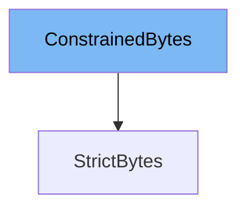

This document will cover the following topics related to the `ConstrainedBytes` class in the DEMO-pydantic repo:

1. What is `ConstrainedBytes`.
2. Variables and functions of `ConstrainedBytes`.
3. Usage example of `ConstrainedBytes`.



# What is ConstrainedBytes

`ConstrainedBytes` is a class in the Pydantic library that is used to validate and constrain bytes data. It inherits from the built-in `bytes` class in Python and adds additional functionality for data validation. It provides options to control the transformation and validation of the bytes data, such as whether to strip whitespace, convert to upper or lower case, and enforce minimum and maximum length. It also supports strict validation which, if enabled, will only allow bytes data and will not perform any type coercion.

<SwmSnippet path="/pydantic/v1/types.py" line="353">

---

# Variables and functions

The `strip_whitespace` variable is a boolean that determines whether to strip whitespace from the bytes data during validation. By default, it is set to `False`.

```python
    strip_whitespace = False
```

---

</SwmSnippet>

<SwmSnippet path="/pydantic/v1/types.py" line="354">

---

The `to_upper` variable is a boolean that determines whether to convert the bytes data to upper case during validation. By default, it is set to `False`.

```python
    to_upper = False
```

---

</SwmSnippet>

<SwmSnippet path="/pydantic/v1/types.py" line="355">

---

The `to_lower` variable is a boolean that determines whether to convert the bytes data to lower case during validation. By default, it is set to `False`.

```python
    to_lower = False
```

---

</SwmSnippet>

<SwmSnippet path="/pydantic/v1/types.py" line="356">

---

The `min_length` variable is an optional integer that specifies the minimum length of the bytes data. If not set, there is no minimum length constraint.

```python
    min_length: OptionalInt = None
```

---

</SwmSnippet>

<SwmSnippet path="/pydantic/v1/types.py" line="357">

---

The `max_length` variable is an optional integer that specifies the maximum length of the bytes data. If not set, there is no maximum length constraint.

```python
    max_length: OptionalInt = None
```

---

</SwmSnippet>

<SwmSnippet path="/pydantic/v1/types.py" line="358">

---

The `strict` variable is a boolean that determines whether to perform strict validation. If `strict` is `True`, only bytes data is allowed and no type coercion is performed. By default, it is set to `False`.

```python
    strict: bool = False
```

---

</SwmSnippet>

<SwmSnippet path="/pydantic/v1/types.py" line="360">

---

The `__modify_schema__` function is a class method that modifies the schema of the bytes data during validation. It updates the minimum and maximum length constraints in the schema.

```python
    @classmethod
    def __modify_schema__(cls, field_schema: Dict[str, Any]) -> None:
        update_not_none(field_schema, minLength=cls.min_length, maxLength=cls.max_length)
```

---

</SwmSnippet>

<SwmSnippet path="/pydantic/v1/types.py" line="364">

---

The `__get_validators__` function is a class method that yields the validators to be used during validation. Depending on the `strict` variable, it uses either the `strict_bytes_validator` or the `bytes_validator`. It also yields other validators for stripping whitespace, converting to upper or lower case, and validating the length.

```python
    @classmethod
    def __get_validators__(cls) -> 'CallableGenerator':
        yield strict_bytes_validator if cls.strict else bytes_validator
        yield constr_strip_whitespace
        yield constr_upper
        yield constr_lower
        yield constr_length_validator
```

---

</SwmSnippet>

<SwmSnippet path="/pydantic/v1/types.py" line="394">

---

# Usage example

The `StrictBytes` class is an example of how to use `ConstrainedBytes`. It extends `ConstrainedBytes` and sets the `strict` variable to `True`, which means it will only allow bytes data and will not perform any type coercion.

```python
if TYPE_CHECKING:
    StrictBytes = bytes
else:

    class StrictBytes(ConstrainedBytes):
        strict = True
```

---

</SwmSnippet>

&nbsp;

*This is an auto-generated document by Swimm AI 🌊 and has not yet been verified by a human*

<SwmMeta version="3.0.0" repo-id="Z2l0aHViJTNBJTNBREVNTy1weWRhbnRpYyUzQSUzQWdpbGFkbmF2b3Q=" repo-name="DEMO-pydantic" doc-type="class"><sup>Powered by [Swimm](/)</sup></SwmMeta>
