```mermaid
graph TD;
  ConstrainedFloat:::currentBaseStyle
ConstrainedFloat --> NonNegativeFloat
ConstrainedFloat --> NonPositiveFloat
ConstrainedFloat --> PositiveFloat
ConstrainedFloat --> NegativeFloat
ConstrainedFloat --> FiniteFloat
ConstrainedFloat --> StrictFloat

 classDef currentBaseStyle color:#000000,fill:#7CB9F4

%% Swimm:
%% graph TD;
%%   ConstrainedFloat:::currentBaseStyle
%% <SwmToken path="/pydantic/v1/types.py" pos="330:5:5" line-data="    class PositiveFloat(ConstrainedFloat):">`ConstrainedFloat`</SwmToken> --> <SwmToken path="/pydantic/types.py" pos="580:0:0" line-data="NonNegativeFloat = Annotated[float, annotated_types.Ge(0)]">`NonNegativeFloat`</SwmToken>
%% <SwmToken path="/pydantic/v1/types.py" pos="330:5:5" line-data="    class PositiveFloat(ConstrainedFloat):">`ConstrainedFloat`</SwmToken> --> <SwmToken path="/pydantic/types.py" pos="549:0:0" line-data="NonPositiveFloat = Annotated[float, annotated_types.Le(0)]">`NonPositiveFloat`</SwmToken>
%% <SwmToken path="/pydantic/v1/types.py" pos="330:5:5" line-data="    class PositiveFloat(ConstrainedFloat):">`ConstrainedFloat`</SwmToken> --> <SwmToken path="/pydantic/v1/types.py" pos="330:3:3" line-data="    class PositiveFloat(ConstrainedFloat):">`PositiveFloat`</SwmToken>
%% <SwmToken path="/pydantic/v1/types.py" pos="330:5:5" line-data="    class PositiveFloat(ConstrainedFloat):">`ConstrainedFloat`</SwmToken> --> <SwmToken path="/pydantic/types.py" pos="518:0:0" line-data="NegativeFloat = Annotated[float, annotated_types.Lt(0)]">`NegativeFloat`</SwmToken>
%% <SwmToken path="/pydantic/v1/types.py" pos="330:5:5" line-data="    class PositiveFloat(ConstrainedFloat):">`ConstrainedFloat`</SwmToken> --> <SwmToken path="/pydantic/types.py" pos="631:0:0" line-data="FiniteFloat = Annotated[float, AllowInfNan(False)]">`FiniteFloat`</SwmToken>
%% <SwmToken path="/pydantic/v1/types.py" pos="330:5:5" line-data="    class PositiveFloat(ConstrainedFloat):">`ConstrainedFloat`</SwmToken> --> <SwmToken path="/pydantic/types.py" pos="611:0:0" line-data="StrictFloat = Annotated[float, Strict(True)]">`StrictFloat`</SwmToken>
%% 
%%  classDef currentBaseStyle color:#000000,fill:#7CB9F4
```

This document will cover the following topics about the <SwmToken path="/pydantic/v1/types.py" pos="330:5:5" line-data="    class PositiveFloat(ConstrainedFloat):">`ConstrainedFloat`</SwmToken> class in the DEMO-pydantic repo:

1. What is <SwmToken path="/pydantic/v1/types.py" pos="330:5:5" line-data="    class PositiveFloat(ConstrainedFloat):">`ConstrainedFloat`</SwmToken>.
2. Variables and functions in <SwmToken path="/pydantic/v1/types.py" pos="330:5:5" line-data="    class PositiveFloat(ConstrainedFloat):">`ConstrainedFloat`</SwmToken>.
3. An example of how to use <SwmToken path="/pydantic/v1/types.py" pos="330:5:5" line-data="    class PositiveFloat(ConstrainedFloat):">`ConstrainedFloat`</SwmToken>.



# What is <SwmToken path="/pydantic/v1/types.py" pos="330:5:5" line-data="    class PositiveFloat(ConstrainedFloat):">`ConstrainedFloat`</SwmToken>

<SwmToken path="/pydantic/v1/types.py" pos="330:5:5" line-data="    class PositiveFloat(ConstrainedFloat):">`ConstrainedFloat`</SwmToken> is a class in the <SwmToken path="/pydantic/v1/types.py" pos="31:2:2" line-data="from pydantic.v1 import errors">`pydantic`</SwmToken> library that is used for data validation. It is a subclass of the <SwmToken path="/pydantic/v1/types.py" pos="118:9:9" line-data="OptionalIntFloat = Union[OptionalInt, float]">`float`</SwmToken> class and uses Python's metaclass system to add additional constraints to the float data type. These constraints can include restrictions on the range of the float, whether it can be infinite or NaN, and more. This allows developers to enforce specific rules on the float data type in a clear and concise way.

<SwmSnippet path="/pydantic/v1/types.py" line="270">

---

# Variables in <SwmToken path="/pydantic/v1/types.py" pos="330:5:5" line-data="    class PositiveFloat(ConstrainedFloat):">`ConstrainedFloat`</SwmToken>

<SwmToken path="/pydantic/v1/types.py" pos="330:5:5" line-data="    class PositiveFloat(ConstrainedFloat):">`ConstrainedFloat`</SwmToken> has several class variables that define the constraints for the float. The <SwmToken path="/pydantic/v1/types.py" pos="270:1:1" line-data="    strict: bool = False">`strict`</SwmToken> variable is a boolean that determines whether strict validation should be used. The <SwmToken path="/pydantic/v1/types.py" pos="271:1:1" line-data="    gt: OptionalIntFloat = None">`gt`</SwmToken>, <SwmToken path="/pydantic/v1/types.py" pos="272:1:1" line-data="    ge: OptionalIntFloat = None">`ge`</SwmToken>, <SwmToken path="/pydantic/v1/types.py" pos="273:1:1" line-data="    lt: OptionalIntFloat = None">`lt`</SwmToken>, and <SwmToken path="/pydantic/v1/types.py" pos="274:1:1" line-data="    le: OptionalIntFloat = None">`le`</SwmToken> variables are used to specify greater than, greater than or equal to, less than, and less than or equal to constraints respectively. The <SwmToken path="/pydantic/v1/types.py" pos="275:1:1" line-data="    multiple_of: OptionalIntFloat = None">`multiple_of`</SwmToken> variable is used to specify that the float should be a multiple of a certain number. The <SwmToken path="/pydantic/v1/types.py" pos="276:1:1" line-data="    allow_inf_nan: Optional[bool] = None">`allow_inf_nan`</SwmToken> variable is a boolean that determines whether infinite and NaN values are allowed.

```python
    strict: bool = False
    gt: OptionalIntFloat = None
    ge: OptionalIntFloat = None
    lt: OptionalIntFloat = None
    le: OptionalIntFloat = None
    multiple_of: OptionalIntFloat = None
    allow_inf_nan: Optional[bool] = None
```

---

</SwmSnippet>

<SwmSnippet path="/pydantic/v1/types.py" line="278">

---

# Functions in <SwmToken path="/pydantic/v1/types.py" pos="330:5:5" line-data="    class PositiveFloat(ConstrainedFloat):">`ConstrainedFloat`</SwmToken>

<SwmToken path="/pydantic/v1/types.py" pos="330:5:5" line-data="    class PositiveFloat(ConstrainedFloat):">`ConstrainedFloat`</SwmToken> has several class methods that are used to modify the schema and perform validation. The <SwmToken path="/pydantic/v1/types.py" pos="279:3:3" line-data="    def __modify_schema__(cls, field_schema: Dict[str, Any]) -&gt; None:">`__modify_schema__`</SwmToken> method is used to update the field schema with the constraints. The <SwmToken path="/pydantic/v1/dataclasses.py" pos="84:3:3" line-data="        def __get_validators__(cls: Type[&#39;Dataclass&#39;]) -&gt; &#39;CallableGenerator&#39;:">`__get_validators__`</SwmToken> method is used to yield the validators that should be used for this float. These validators include <SwmToken path="/pydantic/v1/validators.py" pos="162:2:2" line-data="def strict_float_validator(v: Any) -&gt; float:">`strict_float_validator`</SwmToken> or <SwmToken path="/pydantic/v1/validators.py" pos="152:2:2" line-data="def float_validator(v: Any) -&gt; float:">`float_validator`</SwmToken> depending on the <SwmToken path="/pydantic/v1/types.py" pos="270:1:1" line-data="    strict: bool = False">`strict`</SwmToken> variable, <SwmToken path="/pydantic/v1/validators.py" pos="187:2:2" line-data="def number_size_validator(v: &#39;Number&#39;, field: &#39;ModelField&#39;) -&gt; &#39;Number&#39;:">`number_size_validator`</SwmToken> to validate the size of the number, <SwmToken path="/pydantic/v1/validators.py" pos="178:2:2" line-data="def number_multiple_validator(v: &#39;Number&#39;, field: &#39;ModelField&#39;) -&gt; &#39;Number&#39;:">`number_multiple_validator`</SwmToken> to validate that the number is a multiple of <SwmToken path="/pydantic/v1/types.py" pos="286:5:5" line-data="            multipleOf=cls.multiple_of,">`multiple_of`</SwmToken>, and <SwmToken path="/pydantic/v1/validators.py" pos="168:2:2" line-data="def float_finite_validator(v: &#39;Number&#39;, field: &#39;ModelField&#39;, config: &#39;BaseConfig&#39;) -&gt; &#39;Number&#39;:">`float_finite_validator`</SwmToken> to validate that the float is finite if <SwmToken path="/pydantic/v1/types.py" pos="276:1:1" line-data="    allow_inf_nan: Optional[bool] = None">`allow_inf_nan`</SwmToken> is False.

```python
    @classmethod
    def __modify_schema__(cls, field_schema: Dict[str, Any]) -> None:
        update_not_none(
            field_schema,
            exclusiveMinimum=cls.gt,
            exclusiveMaximum=cls.lt,
            minimum=cls.ge,
            maximum=cls.le,
            multipleOf=cls.multiple_of,
        )
        # Modify constraints to account for differences between IEEE floats and JSON
        if field_schema.get('exclusiveMinimum') == -math.inf:
            del field_schema['exclusiveMinimum']
        if field_schema.get('minimum') == -math.inf:
            del field_schema['minimum']
        if field_schema.get('exclusiveMaximum') == math.inf:
            del field_schema['exclusiveMaximum']
        if field_schema.get('maximum') == math.inf:
            del field_schema['maximum']

    @classmethod
```

---

</SwmSnippet>

<SwmSnippet path="/pydantic/v1/types.py" line="328">

---

# Usage example

Here is an example of how <SwmToken path="/pydantic/v1/types.py" pos="330:5:5" line-data="    class PositiveFloat(ConstrainedFloat):">`ConstrainedFloat`</SwmToken> is used in the <SwmToken path="/pydantic/v1/types.py" pos="330:3:3" line-data="    class PositiveFloat(ConstrainedFloat):">`PositiveFloat`</SwmToken> class. <SwmToken path="/pydantic/v1/types.py" pos="330:3:3" line-data="    class PositiveFloat(ConstrainedFloat):">`PositiveFloat`</SwmToken> is a subclass of <SwmToken path="/pydantic/v1/types.py" pos="330:5:5" line-data="    class PositiveFloat(ConstrainedFloat):">`ConstrainedFloat`</SwmToken> that adds the constraint that the float must be greater than 0. This is done by setting the <SwmToken path="/pydantic/v1/types.py" pos="331:1:1" line-data="        gt = 0">`gt`</SwmToken> variable to 0.

```python
else:

    class PositiveFloat(ConstrainedFloat):
        gt = 0
```

---

</SwmSnippet>

&nbsp;

*This is an auto-generated document by Swimm AI 🌊 and has not yet been verified by a human*

<SwmMeta version="3.0.0" repo-id="Z2l0aHViJTNBJTNBREVNTy1weWRhbnRpYyUzQSUzQWdpbGFkbmF2b3Q=" repo-name="DEMO-pydantic"><sup>Powered by [Swimm](https://app.swimm.io/)</sup></SwmMeta>
