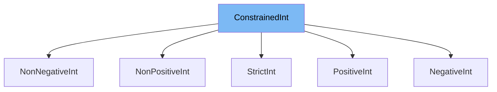

This document will cover the following topics related to the `ConstrainedInt` class in the DEMO-pydantic repository:

1. What is `ConstrainedInt`?
2. Variables and functions in `ConstrainedInt`.
3. An example of how to use `ConstrainedInt`.



# What is ConstrainedInt

`ConstrainedInt` is a class in the `pydantic/v1/types.py` file of the DEMO-pydantic repository. It is a subclass of the built-in `int` class in Python and is used to represent an integer with certain constraints. The constraints can be specified using the class variables `gt`, `ge`, `lt`, `le`, and `multiple_of`. The `ConstrainedInt` class is used to create more specific integer types with these constraints.

<SwmSnippet path="/pydantic/v1/types.py" line="203">

---

# Variables in ConstrainedInt

The `ConstrainedInt` class has five variables: `strict`, `gt`, `ge`, `lt`, `le`, and `multiple_of`. The `strict` variable is a boolean that determines whether strict integer validation is used. The `gt`, `ge`, `lt`, and `le` variables are used to specify the greater than, greater than or equal to, less than, and less than or equal to constraints, respectively. The `multiple_of` variable is used to specify that the integer should be a multiple of a certain number.

```python
    strict: bool = False
    gt: OptionalInt = None
    ge: OptionalInt = None
    lt: OptionalInt = None
    le: OptionalInt = None
    multiple_of: OptionalInt = None
```

---

</SwmSnippet>

<SwmSnippet path="/pydantic/v1/types.py" line="210">

---

# Functions in ConstrainedInt

The `ConstrainedInt` class has two class methods: `__modify_schema__` and `__get_validators__`. The `__modify_schema__` method is used to update the field schema with the constraints specified in the class variables. The `__get_validators__` method is a generator method that yields the validators to be used for this type. It yields the `strict_int_validator` if `strict` is `True`, otherwise it yields the `int_validator`. It also yields the `number_size_validator` and `number_multiple_validator`.

```python
    @classmethod
    def __modify_schema__(cls, field_schema: Dict[str, Any]) -> None:
        update_not_none(
            field_schema,
            exclusiveMinimum=cls.gt,
            exclusiveMaximum=cls.lt,
            minimum=cls.ge,
            maximum=cls.le,
            multipleOf=cls.multiple_of,
        )

    @classmethod
    def __get_validators__(cls) -> 'CallableGenerator':
        yield strict_int_validator if cls.strict else int_validator
        yield number_size_validator
        yield number_multiple_validator

```

---

</SwmSnippet>

<SwmSnippet path="/pydantic/v1/types.py" line="257">

---

# Usage example

`NonPositiveInt` is an example of a class that extends `ConstrainedInt`. It sets the `le` (less than or equal to) constraint to 0, meaning that a `NonPositiveInt` can only be an integer that is less than or equal to 0.

```python
        le = 0

    class NonNegativeInt(ConstrainedInt):
        ge = 0
```

---

</SwmSnippet>

&nbsp;

*This is an auto-generated document by Swimm AI 🌊 and has not yet been verified by a human*

<SwmMeta version="3.0.0" repo-id="Z2l0aHViJTNBJTNBREVNTy1weWRhbnRpYyUzQSUzQWdpbGFkbmF2b3Q=" repo-name="DEMO-pydantic" doc-type="class"><sup>Powered by [Swimm](/)</sup></SwmMeta>
