```mermaid
graph TD;
  EncodedBytes:::currentBaseStyle
EncodedBytes --> EncodedStr

 classDef currentBaseStyle color:#000000,fill:#7CB9F4

%% Swimm:
%% graph TD;
%%   EncodedBytes:::currentBaseStyle
%% <SwmToken path="/pydantic/types.py" pos="100:2:2" line-data="    &#39;EncodedBytes&#39;,">`EncodedBytes`</SwmToken> --> <SwmToken path="/pydantic/types.py" pos="2571:9:9" line-data="Base64UrlStr = Annotated[str, EncodedStr(encoder=Base64UrlEncoder)]">`EncodedStr`</SwmToken>
%% 
%%  classDef currentBaseStyle color:#000000,fill:#7CB9F4
```

This document will cover the following topics related to the <SwmToken path="/pydantic/types.py" pos="100:2:2" line-data="    &#39;EncodedBytes&#39;,">`EncodedBytes`</SwmToken> class in the DEMO-pydantic repo:

1. What is <SwmToken path="/pydantic/types.py" pos="100:2:2" line-data="    &#39;EncodedBytes&#39;,">`EncodedBytes`</SwmToken>
2. Variables and functions in <SwmToken path="/pydantic/types.py" pos="100:2:2" line-data="    &#39;EncodedBytes&#39;,">`EncodedBytes`</SwmToken>
3. Usage example of <SwmToken path="/pydantic/types.py" pos="100:2:2" line-data="    &#39;EncodedBytes&#39;,">`EncodedBytes`</SwmToken>



# What is <SwmToken path="/pydantic/types.py" pos="100:2:2" line-data="    &#39;EncodedBytes&#39;,">`EncodedBytes`</SwmToken>

<SwmToken path="/pydantic/types.py" pos="100:2:2" line-data="    &#39;EncodedBytes&#39;,">`EncodedBytes`</SwmToken> is a class in the DEMO-pydantic repo that is used for encoding and decoding bytes data. It is a part of the <SwmPath>[pydantic/types.py](/pydantic/types.py)</SwmPath> file. The class provides a way to encode and decode bytes data using a specified encoder. This is useful in scenarios where you need to encode data into a specific format before storing or transmitting it, and then decode it back into its original form.

<SwmSnippet path="/pydantic/types.py" line="246">

---

# Variables and functions in <SwmToken path="/pydantic/types.py" pos="100:2:2" line-data="    &#39;EncodedBytes&#39;,">`EncodedBytes`</SwmToken>

The <SwmToken path="/pydantic/types.py" pos="2571:11:11" line-data="Base64UrlStr = Annotated[str, EncodedStr(encoder=Base64UrlEncoder)]">`encoder`</SwmToken> variable is used to store the encoder that will be used for encoding and decoding the bytes data. It is of type <SwmToken path="/pydantic/types.py" pos="99:2:2" line-data="    &#39;EncoderProtocol&#39;,">`EncoderProtocol`</SwmToken>, which is a protocol that defines the methods that an encoder should have.

```python
class Model(BaseModel):
```

---

</SwmSnippet>

<SwmSnippet path="/pydantic/types.py" line="2635">

---

The <SwmToken path="/pydantic/types.py" pos="2175:3:3" line-data="    def decode(cls, data: bytes) -&gt; bytes:">`decode`</SwmToken> function is used to decode the data using the specified encoder. It takes in the data to be decoded as a parameter and returns the decoded data.

```python
            if item == '__get_pydantic_core_schema__' and self.get_pydantic_core_schema:
                return self.get_pydantic_core_schema
            elif item == '__get_pydantic_json_schema__' and self.get_pydantic_json_schema:
```

---

</SwmSnippet>

<SwmSnippet path="/pydantic/types.py" line="2639">

---

The <SwmToken path="/pydantic/types.py" pos="1715:10:10" line-data="        return _secret_display(self._secret_value).encode()">`encode`</SwmToken> function is used to encode the data using the specified encoder. It takes in the data to be encoded as a parameter and returns the encoded data.

```python
            else:
                return object.__getattribute__(self, item)

```

---

</SwmSnippet>

<SwmSnippet path="/pydantic/types.py" line="2571">

---

# Usage example of <SwmToken path="/pydantic/types.py" pos="100:2:2" line-data="    &#39;EncodedBytes&#39;,">`EncodedBytes`</SwmToken>

Here is an example of how <SwmToken path="/pydantic/types.py" pos="100:2:2" line-data="    &#39;EncodedBytes&#39;,">`EncodedBytes`</SwmToken> is used in the definition of <SwmToken path="/pydantic/types.py" pos="103:2:2" line-data="    &#39;Base64Bytes&#39;,">`Base64Bytes`</SwmToken>. <SwmToken path="/pydantic/types.py" pos="103:2:2" line-data="    &#39;Base64Bytes&#39;,">`Base64Bytes`</SwmToken> is an annotated type that uses <SwmToken path="/pydantic/types.py" pos="100:2:2" line-data="    &#39;EncodedBytes&#39;,">`EncodedBytes`</SwmToken> with <SwmToken path="/pydantic/types.py" pos="102:2:2" line-data="    &#39;Base64Encoder&#39;,">`Base64Encoder`</SwmToken> as the encoder. This means that <SwmToken path="/pydantic/types.py" pos="103:2:2" line-data="    &#39;Base64Bytes&#39;,">`Base64Bytes`</SwmToken> will encode and decode bytes data using <SwmToken path="/pydantic/types.py" pos="5:2:2" line-data="import base64">`base64`</SwmToken> encoding.

```python
Base64UrlStr = Annotated[str, EncodedStr(encoder=Base64UrlEncoder)]
```

---

</SwmSnippet>

&nbsp;

*This is an auto-generated document by Swimm AI 🌊 and has not yet been verified by a human*

<SwmMeta version="3.0.0" repo-id="Z2l0aHViJTNBJTNBREVNTy1weWRhbnRpYyUzQSUzQWdpbGFkbmF2b3Q=" repo-name="DEMO-pydantic"><sup>Powered by [Swimm](https://app.swimm.io/)</sup></SwmMeta>
