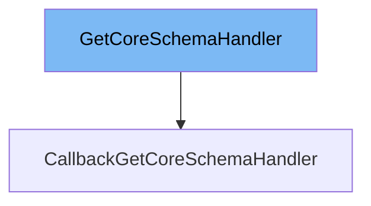

This document will cover the following aspects of the `GetCoreSchemaHandler` class:

1. What is `GetCoreSchemaHandler`.
2. Variables and functions within `GetCoreSchemaHandler`.
3. An example of how to use `GetCoreSchemaHandler`.



# What is GetCoreSchemaHandler

`GetCoreSchemaHandler` is a class in the `pydantic/annotated_handlers.py` file. It is a handler that calls into the next CoreSchema schema generation function. It is used to generate and manipulate CoreSchema objects, which are a part of Pydantic's internal schema generation machinery.

<SwmSnippet path="/pydantic/annotated_handlers.py" line="68">

---

# Variables and functions

The `__call__` function is used to call the inner handler and get the CoreSchema it returns. It takes a `source_type` as an input and returns a `CoreSchema` object.

```python
    def __call__(self, source_type: Any, /) -> core_schema.CoreSchema:
        """Call the inner handler and get the CoreSchema it returns.
        This will call the next CoreSchema modifying function up until it calls
        into Pydantic's internal schema generation machinery, which will raise a
        `pydantic.errors.PydanticSchemaGenerationError` error if it cannot generate
        a CoreSchema for the given source type.

        Args:
            source_type: The input type.

        Returns:
            CoreSchema: The `pydantic-core` CoreSchema generated.
        """
        raise NotImplementedError
```

---

</SwmSnippet>

<SwmSnippet path="/pydantic/annotated_handlers.py" line="83">

---

The `generate_schema` function is used to generate a schema unrelated to the current context. It takes a `source_type` as an input and returns a `CoreSchema` object.

```python
    def generate_schema(self, source_type: Any, /) -> core_schema.CoreSchema:
        """Generate a schema unrelated to the current context.
        Use this function if e.g. you are handling schema generation for a sequence
        and want to generate a schema for its items.
        Otherwise, you may end up doing something like applying a `min_length` constraint
        that was intended for the sequence itself to its items!

        Args:
            source_type: The input type.

        Returns:
            CoreSchema: The `pydantic-core` CoreSchema generated.
        """
        raise NotImplementedError
```

---

</SwmSnippet>

<SwmSnippet path="/pydantic/annotated_handlers.py" line="98">

---

The `resolve_ref_schema` function is used to get the real schema for a `definition-ref` schema. It takes a `maybe_ref_schema` as an input and returns a concrete `CoreSchema`.

```python
    def resolve_ref_schema(self, maybe_ref_schema: core_schema.CoreSchema, /) -> core_schema.CoreSchema:
        """Get the real schema for a `definition-ref` schema.
        If the schema given is not a `definition-ref` schema, it will be returned as is.
        This means you don't have to check before calling this function.

        Args:
            maybe_ref_schema: A `CoreSchema`, `ref`-based or not.

        Raises:
            LookupError: If the `ref` is not found.

        Returns:
            A concrete `CoreSchema`.
        """
        raise NotImplementedError
```

---

</SwmSnippet>

<SwmSnippet path="/pydantic/annotated_handlers.py" line="114">

---

The `field_name` property is used to get the name of the closest field to this validator.

```python
    @property
    def field_name(self) -> str | None:
        """Get the name of the closest field to this validator."""
        raise NotImplementedError
```

---

</SwmSnippet>

<SwmSnippet path="/pydantic/annotated_handlers.py" line="119">

---

The `_get_types_namespace` function is an internal method used during type resolution for serializer annotations.

```python
    def _get_types_namespace(self) -> dict[str, Any] | None:
        """Internal method used during type resolution for serializer annotations."""
        raise NotImplementedError
```

---

</SwmSnippet>

# Usage example

Unfortunately, there are no direct usages of `GetCoreSchemaHandler` in the provided context. However, it is designed to be extended by other classes which implement its methods to suit their specific needs.

&nbsp;

*This is an auto-generated document by Swimm AI 🌊 and has not yet been verified by a human*

<SwmMeta version="3.0.0" repo-id="Z2l0aHViJTNBJTNBREVNTy1weWRhbnRpYyUzQSUzQWdpbGFkbmF2b3Q=" repo-name="DEMO-pydantic" doc-type="class"><sup>Powered by [Swimm](/)</sup></SwmMeta>
