```mermaid
graph TD;
  GetJsonSchemaHandler:::currentBaseStyle
GetJsonSchemaHandler --> GenerateJsonSchemaHandler

 classDef currentBaseStyle color:#000000,fill:#7CB9F4

%% Swimm:
%% graph TD;
%%   GetJsonSchemaHandler:::currentBaseStyle
%% <SwmToken path="/pydantic/annotated_handlers.py" pos="20:5:5" line-data="__all__ = &#39;GetJsonSchemaHandler&#39;, &#39;GetCoreSchemaHandler&#39;">`GetJsonSchemaHandler`</SwmToken> --> <SwmToken path="/pydantic/_internal/_schema_generation_shared.py" pos="21:2:2" line-data="class GenerateJsonSchemaHandler(GetJsonSchemaHandler):">`GenerateJsonSchemaHandler`</SwmToken>
%% 
%%  classDef currentBaseStyle color:#000000,fill:#7CB9F4
```

This document will cover the following aspects of the <SwmToken path="/pydantic/annotated_handlers.py" pos="20:5:5" line-data="__all__ = &#39;GetJsonSchemaHandler&#39;, &#39;GetCoreSchemaHandler&#39;">`GetJsonSchemaHandler`</SwmToken> class:

1. What is <SwmToken path="/pydantic/annotated_handlers.py" pos="20:5:5" line-data="__all__ = &#39;GetJsonSchemaHandler&#39;, &#39;GetCoreSchemaHandler&#39;">`GetJsonSchemaHandler`</SwmToken>.
2. Variables and functions of <SwmToken path="/pydantic/annotated_handlers.py" pos="20:5:5" line-data="__all__ = &#39;GetJsonSchemaHandler&#39;, &#39;GetCoreSchemaHandler&#39;">`GetJsonSchemaHandler`</SwmToken>.
3. An example of how to use <SwmToken path="/pydantic/annotated_handlers.py" pos="20:5:5" line-data="__all__ = &#39;GetJsonSchemaHandler&#39;, &#39;GetCoreSchemaHandler&#39;">`GetJsonSchemaHandler`</SwmToken>.



# What is <SwmToken path="/pydantic/annotated_handlers.py" pos="20:5:5" line-data="__all__ = &#39;GetJsonSchemaHandler&#39;, &#39;GetCoreSchemaHandler&#39;">`GetJsonSchemaHandler`</SwmToken>

<SwmToken path="/pydantic/annotated_handlers.py" pos="20:5:5" line-data="__all__ = &#39;GetJsonSchemaHandler&#39;, &#39;GetCoreSchemaHandler&#39;">`GetJsonSchemaHandler`</SwmToken> is a class in the <SwmPath>[pydantic/annotated_handlers.py](/pydantic/annotated_handlers.py)</SwmPath> file. It is a handler used to call into the next JSON schema generation function. It has an attribute <SwmToken path="/pydantic/annotated_handlers.py" pos="30:1:1" line-data="    mode: JsonSchemaMode">`mode`</SwmToken> which can be <SwmToken path="/pydantic/annotated_handlers.py" pos="27:16:16" line-data="        mode: Json schema mode, can be `validation` or `serialization`.">`validation`</SwmToken> or <SwmToken path="/pydantic/annotated_handlers.py" pos="27:22:22" line-data="        mode: Json schema mode, can be `validation` or `serialization`.">`serialization`</SwmToken>.

<SwmSnippet path="/pydantic/annotated_handlers.py" line="30">

---

# Variables and functions

The variable <SwmToken path="/pydantic/annotated_handlers.py" pos="30:1:1" line-data="    mode: JsonSchemaMode">`mode`</SwmToken> is of type <SwmToken path="/pydantic/annotated_handlers.py" pos="30:4:4" line-data="    mode: JsonSchemaMode">`JsonSchemaMode`</SwmToken>. It represents the mode of the JSON schema, which can be either <SwmToken path="/pydantic/annotated_handlers.py" pos="27:16:16" line-data="        mode: Json schema mode, can be `validation` or `serialization`.">`validation`</SwmToken> or <SwmToken path="/pydantic/annotated_handlers.py" pos="27:22:22" line-data="        mode: Json schema mode, can be `validation` or `serialization`.">`serialization`</SwmToken>.

```python
    mode: JsonSchemaMode
```

---

</SwmSnippet>

<SwmSnippet path="/pydantic/annotated_handlers.py" line="32">

---

The <SwmToken path="/pydantic/annotated_handlers.py" pos="32:3:3" line-data="    def __call__(self, core_schema: CoreSchemaOrField, /) -&gt; JsonSchemaValue:">`__call__`</SwmToken> function is used to call the inner handler and get the <SwmToken path="/pydantic/annotated_handlers.py" pos="32:19:19" line-data="    def __call__(self, core_schema: CoreSchemaOrField, /) -&gt; JsonSchemaValue:">`JsonSchemaValue`</SwmToken> it returns. It takes a <SwmToken path="/pydantic/annotated_handlers.py" pos="32:8:8" line-data="    def __call__(self, core_schema: CoreSchemaOrField, /) -&gt; JsonSchemaValue:">`core_schema`</SwmToken> of type <SwmToken path="/pydantic/annotated_handlers.py" pos="32:11:11" line-data="    def __call__(self, core_schema: CoreSchemaOrField, /) -&gt; JsonSchemaValue:">`CoreSchemaOrField`</SwmToken> as an argument and returns a <SwmToken path="/pydantic/annotated_handlers.py" pos="32:19:19" line-data="    def __call__(self, core_schema: CoreSchemaOrField, /) -&gt; JsonSchemaValue:">`JsonSchemaValue`</SwmToken>. This function will call the next JSON schema modifying function up until it calls into <SwmToken path="/pydantic/annotated_handlers.py" pos="35:4:8" line-data="        into `pydantic.json_schema.GenerateJsonSchema`, which will raise a">`pydantic.json_schema.GenerateJsonSchema`</SwmToken>, which will raise a <SwmToken path="/pydantic/annotated_handlers.py" pos="36:2:6" line-data="        `pydantic.errors.PydanticInvalidForJsonSchema` error if it cannot generate">`pydantic.errors.PydanticInvalidForJsonSchema`</SwmToken> error if it cannot generate a JSON schema.

```python
    def __call__(self, core_schema: CoreSchemaOrField, /) -> JsonSchemaValue:
        """Call the inner handler and get the JsonSchemaValue it returns.
        This will call the next JSON schema modifying function up until it calls
        into `pydantic.json_schema.GenerateJsonSchema`, which will raise a
        `pydantic.errors.PydanticInvalidForJsonSchema` error if it cannot generate
        a JSON schema.

        Args:
            core_schema: A `pydantic_core.core_schema.CoreSchema`.

        Returns:
            JsonSchemaValue: The JSON schema generated by the inner JSON schema modify
            functions.
        """
        raise NotImplementedError
```

---

</SwmSnippet>

<SwmSnippet path="/pydantic/annotated_handlers.py" line="48">

---

The <SwmToken path="/pydantic/annotated_handlers.py" pos="48:3:3" line-data="    def resolve_ref_schema(self, maybe_ref_json_schema: JsonSchemaValue, /) -&gt; JsonSchemaValue:">`resolve_ref_schema`</SwmToken> function is used to get the real schema for a `{'$ref': `<SwmToken path="/pydantic/annotated_handlers.py" pos="49:24:25" line-data="        &quot;&quot;&quot;Get the real schema for a `{&quot;$ref&quot;: ...}` schema.">`...}`</SwmToken> schema. If the schema given is not a <SwmToken path="/pydantic/annotated_handlers.py" pos="49:19:20" line-data="        &quot;&quot;&quot;Get the real schema for a `{&quot;$ref&quot;: ...}` schema.">`$ref`</SwmToken> schema, it will be returned as is. This function takes a <SwmToken path="/pydantic/annotated_handlers.py" pos="48:8:8" line-data="    def resolve_ref_schema(self, maybe_ref_json_schema: JsonSchemaValue, /) -&gt; JsonSchemaValue:">`maybe_ref_json_schema`</SwmToken> of type <SwmToken path="/pydantic/annotated_handlers.py" pos="48:11:11" line-data="    def resolve_ref_schema(self, maybe_ref_json_schema: JsonSchemaValue, /) -&gt; JsonSchemaValue:">`JsonSchemaValue`</SwmToken> as an argument and returns a <SwmToken path="/pydantic/annotated_handlers.py" pos="48:11:11" line-data="    def resolve_ref_schema(self, maybe_ref_json_schema: JsonSchemaValue, /) -&gt; JsonSchemaValue:">`JsonSchemaValue`</SwmToken>. If the ref is not found, it raises a <SwmToken path="/pydantic/annotated_handlers.py" pos="57:1:1" line-data="            LookupError: If the ref is not found.">`LookupError`</SwmToken>.

```python
    def resolve_ref_schema(self, maybe_ref_json_schema: JsonSchemaValue, /) -> JsonSchemaValue:
        """Get the real schema for a `{"$ref": ...}` schema.
        If the schema given is not a `$ref` schema, it will be returned as is.
        This means you don't have to check before calling this function.

        Args:
            maybe_ref_json_schema: A JsonSchemaValue which may be a `$ref` schema.

        Raises:
            LookupError: If the ref is not found.

        Returns:
            JsonSchemaValue: A JsonSchemaValue that has no `$ref`.
        """
        raise NotImplementedError
```

---

</SwmSnippet>

# Usage example

The <SwmToken path="/pydantic/annotated_handlers.py" pos="20:5:5" line-data="__all__ = &#39;GetJsonSchemaHandler&#39;, &#39;GetCoreSchemaHandler&#39;">`GetJsonSchemaHandler`</SwmToken> class is not directly used in the codebase. However, it serves as a base class for other classes like <SwmToken path="/pydantic/_internal/_schema_generation_shared.py" pos="21:2:2" line-data="class GenerateJsonSchemaHandler(GetJsonSchemaHandler):">`GenerateJsonSchemaHandler`</SwmToken> in <SwmPath>[pydantic/\_internal/\_schema_generation_shared.py](/pydantic/_internal/_schema_generation_shared.py)</SwmPath>.

&nbsp;

*This is an auto-generated document by Swimm AI 🌊 and has not yet been verified by a human*

<SwmMeta version="3.0.0" repo-id="Z2l0aHViJTNBJTNBREVNTy1weWRhbnRpYyUzQSUzQWdpbGFkbmF2b3Q=" repo-name="DEMO-pydantic"><sup>Powered by [Swimm](https://app.swimm.io/)</sup></SwmMeta>
