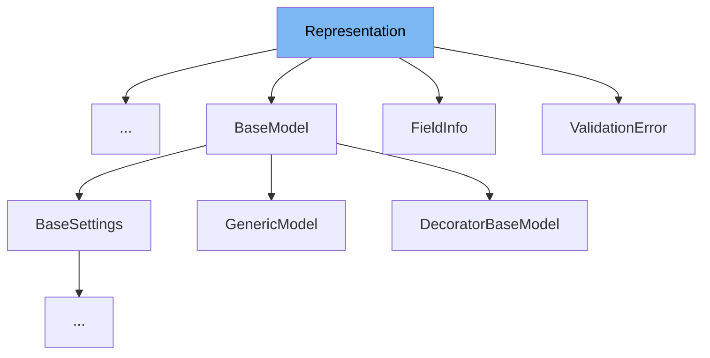

This document will cover the following topics related to the `Representation` class in the `pydantic/v1/utils.py` file:

1. What is `Representation`
2. Variables and functions in `Representation`
3. Usage example of `Representation` in `ErrorWrapper`.



# What is Representation

`Representation` is a mixin class in the `pydantic/v1/utils.py` file. It provides `__str__`, `__repr__`, and `__pretty__` methods. The `__pretty__` method is used by devtools to provide human-readable representations of objects.

<SwmSnippet path="/pydantic/v1/utils.py" line="368">

---

# Variables and functions in Representation

`__slots__` is a built-in attribute of python classes. It is used to declare fixed memory for instance attributes. In `Representation`, it is an empty tuple, indicating that instances of this class do not have their own instance attributes.

```python
    __slots__: Tuple[str, ...] = tuple()
```

---

</SwmSnippet>

<SwmSnippet path="/pydantic/v1/utils.py" line="370">

---

The `__repr_args__` function returns the attributes to show in `__str__`, `__repr__`, and `__pretty__`. This function is generally overridden. It returns a list of tuples where each tuple contains an attribute name and its value.

```python
    def __repr_args__(self) -> 'ReprArgs':
        """
        Returns the attributes to show in __str__, __repr__, and __pretty__ this is generally overridden.

        Can either return:
        * name - value pairs, e.g.: `[('foo_name', 'foo'), ('bar_name', ['b', 'a', 'r'])]`
        * or, just values, e.g.: `[(None, 'foo'), (None, ['b', 'a', 'r'])]`
        """
        attrs = ((s, getattr(self, s)) for s in self.__slots__)
        return [(a, v) for a, v in attrs if v is not None]
```

---

</SwmSnippet>

<SwmSnippet path="/pydantic/v1/utils.py" line="381">

---

The `__repr_name__` function returns the name of the instance's class, used in `__repr__`.

```python
    def __repr_name__(self) -> str:
        """
        Name of the instance's class, used in __repr__.
        """
        return self.__class__.__name__
```

---

</SwmSnippet>

<SwmSnippet path="/pydantic/v1/utils.py" line="387">

---

The `__repr_str__` function returns a string that represents the instance of the class. It joins the representation of each attribute value if the attribute name is `None`, otherwise it joins the attribute name and its representation.

```python
    def __repr_str__(self, join_str: str) -> str:
        return join_str.join(repr(v) if a is None else f'{a}={v!r}' for a, v in self.__repr_args__())

```

---

</SwmSnippet>

<SwmSnippet path="/pydantic/v1/utils.py" line="390">

---

The `__pretty__` function is used by devtools to provide a human-readable representation of objects. It yields a string that represents the instance of the class in a pretty format.

```python
    def __pretty__(self, fmt: Callable[[Any], Any], **kwargs: Any) -> Generator[Any, None, None]:
        """
        Used by devtools (https://python-devtools.helpmanual.io/) to provide a human readable representations of objects
        """
        yield self.__repr_name__() + '('
        yield 1
        for name, value in self.__repr_args__():
            if name is not None:
                yield name + '='
            yield fmt(value)
            yield ','
            yield 0
        yield -1
        yield ')'

```

---

</SwmSnippet>

<SwmSnippet path="/pydantic/v1/utils.py" line="405">

---

The `__str__` function returns a string that represents the instance of the class. It calls the `__repr_str__` function with a space as the join string.

```python
    def __str__(self) -> str:
        return self.__repr_str__(' ')
```

---

</SwmSnippet>

<SwmSnippet path="/pydantic/v1/utils.py" line="408">

---

The `__repr__` function returns a string that represents the instance of the class. It calls the `__repr_str__` function with a comma and a space as the join string.

```python
    def __repr__(self) -> str:
        return f'{self.__repr_name__()}({self.__repr_str__(", ")})'
```

---

</SwmSnippet>

<SwmSnippet path="/pydantic/v1/utils.py" line="411">

---

The `__rich_repr__` function gets fields for the Rich library. It yields the representation of each attribute value if the attribute name is `None`, otherwise it yields the attribute name and its representation.

```python
    def __rich_repr__(self) -> 'RichReprResult':
        """Get fields for Rich library"""
        for name, field_repr in self.__repr_args__():
            if name is None:
                yield field_repr
            else:
                yield name, field_repr
```

---

</SwmSnippet>

# Usage example

The `Representation` class is a mixin and is intended to be used with other classes to provide them with `__str__`, `__repr__`, and `__pretty__` methods. However, there are no direct usages of the `Representation` class in the provided context.

&nbsp;

*This is an auto-generated document by Swimm AI 🌊 and has not yet been verified by a human*

<SwmMeta version="3.0.0" repo-id="Z2l0aHViJTNBJTNBREVNTy1weWRhbnRpYyUzQSUzQWdpbGFkbmF2b3Q=" repo-name="DEMO-pydantic" doc-type="class"><sup>Powered by [Swimm](/)</sup></SwmMeta>
