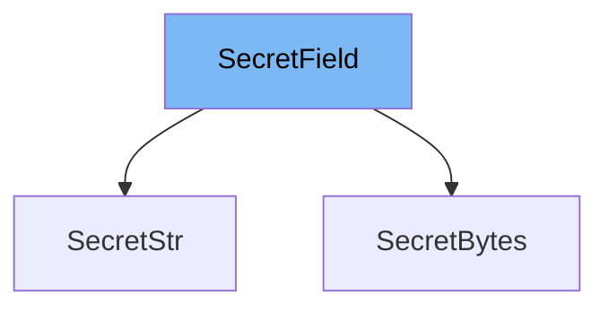

This document will cover the following topics related to the `SecretField` class in the `pydantic/v1/types.py` file:

1. What is `SecretField`
2. Variables and functions in `SecretField`
3. An example of how to use `SecretField` in `SecretStr`.



# What is SecretField

`SecretField` is an abstract base class (ABC) in the Pydantic library. It's designed to handle sensitive data fields, such as passwords, that you wouldn't want to accidentally expose. When represented as a string, a `SecretField` obscures its value to protect the data. The actual value can be accessed through the `get_secret_value` method.

<SwmSnippet path="/pydantic/v1/types.py" line="850">

---

# Variables and functions

`SecretField` doesn't define any variables. It does, however, define several methods. The `__eq__` method checks if another object is of the same class and has the same secret value. The `__str__` method returns a string of asterisks if the secret value is not empty, otherwise it returns an empty string. The `__hash__` method returns the hash of the secret value. The `get_secret_value` method is an abstract method, meaning it must be implemented by any class that inherits from `SecretField`.

```python
class SecretField(abc.ABC):
    """
    Note: this should be implemented as a generic like `SecretField(ABC, Generic[T])`,
          the `__init__()` should be part of the abstract class and the
          `get_secret_value()` method should use the generic `T` type.

          However Cython doesn't support very well generics at the moment and
          the generated code fails to be imported (see
          https://github.com/cython/cython/issues/2753).
    """

    def __eq__(self, other: Any) -> bool:
        return isinstance(other, self.__class__) and self.get_secret_value() == other.get_secret_value()

    def __str__(self) -> str:
        return '**********' if self.get_secret_value() else ''

    def __hash__(self) -> int:
        return hash(self.get_secret_value())

    @abc.abstractmethod
```

---

</SwmSnippet>

<SwmSnippet path="/pydantic/v1/types.py" line="875">

---

# Usage example

`SecretStr` is a subclass of `SecretField` that represents a secret string. It defines the `get_secret_value` method to return the secret string value. It also includes a `validate` method that ensures the value is a string, and a `__init__` method that sets the secret value. This is an example of how `SecretField` can be extended to handle specific types of secret data.

```python
class SecretStr(SecretField):
    min_length: OptionalInt = None
    max_length: OptionalInt = None

    @classmethod
    def __modify_schema__(cls, field_schema: Dict[str, Any]) -> None:
        update_not_none(
            field_schema,
            type='string',
            writeOnly=True,
            format='password',
            minLength=cls.min_length,
            maxLength=cls.max_length,
        )

    @classmethod
    def __get_validators__(cls) -> 'CallableGenerator':
        yield cls.validate
        yield constr_length_validator

    @classmethod
```

---

</SwmSnippet>

&nbsp;

*This is an auto-generated document by Swimm AI 🌊 and has not yet been verified by a human*

<SwmMeta version="3.0.0" repo-id="Z2l0aHViJTNBJTNBREVNTy1weWRhbnRpYyUzQSUzQWdpbGFkbmF2b3Q=" repo-name="DEMO-pydantic" doc-type="class"><sup>Powered by [Swimm](/)</sup></SwmMeta>
