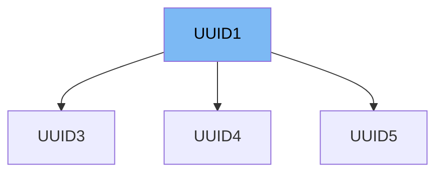

This document will cover the following topics related to the UUID1 class in the DEMO-pydantic repository:

1. What is UUID1
2. Variables and functions in UUID1
3. Usage example of UUID1



# What is UUID1

UUID1 is a class in the DEMO-pydantic repository that represents a UUID (Universally Unique Identifier) of version 1. UUIDs are used in computing for creating unique identifiers that can be used across all space and time, ensuring that no two UUIDs are the same. The UUID1 class in the DEMO-pydantic repository is a subclass of the UUID class from the Python standard library's `uuid` module. It is used to represent and work with UUIDs of version 1.

<SwmSnippet path="/pydantic/v1/types.py" line="761">

---

# Variables and functions in UUID1

The UUID1 class has a class variable `_required_version` which is set to 1. This indicates that this class is used for working with UUIDs of version 1. The class also has a class method `__modify_schema__` which is used to update the schema of the UUID1 field. It sets the type to 'string' and the format to 'uuid1' in the field schema.

```python
    class UUID1(UUID):
        _required_version = 1

        @classmethod
        def __modify_schema__(cls, field_schema: Dict[str, Any]) -> None:
            field_schema.update(type='string', format=f'uuid{cls._required_version}')
```

---

</SwmSnippet>

<SwmSnippet path="/pydantic/v1/types.py" line="768">

---

# Usage example of UUID1

Here is an example of how UUID1 is used in the UUID3 class. The UUID3 class is a subclass of UUID1, which means it inherits all the variables and methods from UUID1. In this case, the `_required_version` variable is overridden to 3, indicating that this class is used for working with UUIDs of version 3.

```python
    class UUID3(UUID1):
        _required_version = 3
```

---

</SwmSnippet>

&nbsp;

*This is an auto-generated document by Swimm AI 🌊 and has not yet been verified by a human*

<SwmMeta version="3.0.0" repo-id="Z2l0aHViJTNBJTNBREVNTy1weWRhbnRpYyUzQSUzQWdpbGFkbmF2b3Q=" repo-name="DEMO-pydantic" doc-type="class"><sup>Powered by [Swimm](/)</sup></SwmMeta>
