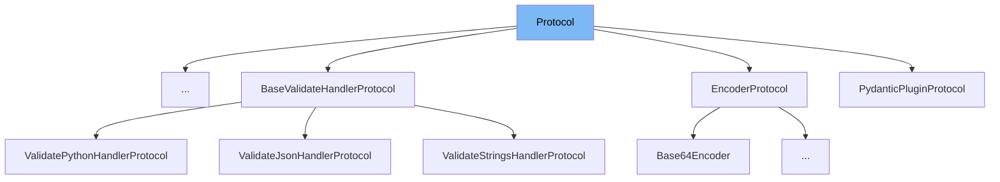

This document will cover the Protocol class in the DEMO-pydantic repository. We'll cover:

1. What is Protocol
2. Variables and functions in Protocol
3. Usage example of Protocol in ModelWrapValidatorWithoutInfo.



# What is Protocol

Protocol is a class in the `pydantic/deprecated/parse.py` file. It is an Enum class that inherits from the `str` class. It is used to define the type of protocol to be used in data serialization and deserialization. It has two values: 'json' and 'pickle', representing the JSON and Pickle protocols respectively.

<SwmSnippet path="/pydantic/deprecated/parse.py" line="21">

---

# Variables in Protocol

The Protocol class has two variables, `json` and `pickle`. These represent the two types of protocols that can be used.

```python
    json = 'json'
    pickle = 'pickle'
```

---

</SwmSnippet>

<SwmSnippet path="/pydantic/deprecated/parse.py" line="26">

---

# Functions in Protocol

The `load_str_bytes` function is used to load and deserialize data. It takes in a string or bytes, and based on the protocol specified (either 'json' or 'pickle'), it decodes and deserializes the data.

```python
def load_str_bytes(
    b: str | bytes,
    *,
    content_type: str | None = None,
    encoding: str = 'utf8',
    proto: Protocol | None = None,
    allow_pickle: bool = False,
    json_loads: Callable[[str], Any] = json.loads,
) -> Any:
    warnings.warn('`load_str_bytes` is deprecated.', category=PydanticDeprecatedSince20, stacklevel=2)
    if proto is None and content_type:
        if content_type.endswith(('json', 'javascript')):
            pass
        elif allow_pickle and content_type.endswith('pickle'):
            proto = Protocol.pickle
        else:
            raise TypeError(f'Unknown content-type: {content_type}')

    proto = proto or Protocol.json

    if proto == Protocol.json:
```

---

</SwmSnippet>

<SwmSnippet path="/pydantic/deprecated/parse.py" line="59">

---

The `load_file` function is used to load and deserialize data from a file. It takes in a file path, and based on the file extension and the protocol specified, it reads the file, decodes and deserializes the data.

```python
@deprecated('`load_file` is deprecated.', category=None)
def load_file(
    path: str | Path,
    *,
    content_type: str | None = None,
    encoding: str = 'utf8',
    proto: Protocol | None = None,
    allow_pickle: bool = False,
    json_loads: Callable[[str], Any] = json.loads,
) -> Any:
    warnings.warn('`load_file` is deprecated.', category=PydanticDeprecatedSince20, stacklevel=2)
    path = Path(path)
    b = path.read_bytes()
    if content_type is None:
        if path.suffix in ('.js', '.json'):
            proto = Protocol.json
        elif path.suffix == '.pkl':
            proto = Protocol.pickle

    return load_str_bytes(
        b, proto=proto, content_type=content_type, encoding=encoding, allow_pickle=allow_pickle, json_loads=json_loads
```

---

</SwmSnippet>

# Usage example

The Protocol class is used in the `ModelWrapValidatorWithoutInfo` class. It is used to specify the protocol for data serialization and deserialization.

&nbsp;

*This is an auto-generated document by Swimm AI 🌊 and has not yet been verified by a human*

<SwmMeta version="3.0.0" repo-id="Z2l0aHViJTNBJTNBREVNTy1weWRhbnRpYyUzQSUzQWdpbGFkbmF2b3Q=" repo-name="DEMO-pydantic" doc-type="class"><sup>Powered by [Swimm](/)</sup></SwmMeta>
