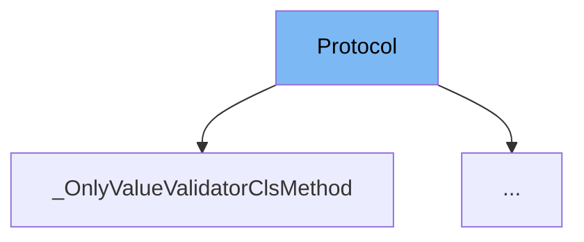

This document will cover the `Protocol` class in the `pydantic/deprecated/parse.py` file. We'll cover:

1. What is Protocol
2. Variables and functions in Protocol
3. Usage example of Protocol



# What is Protocol

The `Protocol` class is an enumeration that represents the type of protocol used for data serialization and deserialization. It has two possible values: `json` and `pickle`. `json` is used for data that is in JSON format, while `pickle` is used for serialized Python objects.

<SwmSnippet path="/pydantic/deprecated/parse.py" line="20">

---

# Variables and functions

The `Protocol` class has two variables: `json` and `pickle`. These represent the two possible values of the `Protocol` enumeration.

```python
class Protocol(str, Enum):
    json = 'json'
    pickle = 'pickle'
```

---

</SwmSnippet>

<SwmSnippet path="/pydantic/deprecated/parse.py" line="26">

---

The `load_str_bytes` function is a method that takes a string or bytes and deserializes it based on the provided protocol. If no protocol is provided, it defaults to `json`. If `pickle` is provided but `allow_pickle` is set to `False`, it raises a `RuntimeError`.

```python
def load_str_bytes(
    b: str | bytes,
    *,
    content_type: str | None = None,
    encoding: str = 'utf8',
    proto: Protocol | None = None,
    allow_pickle: bool = False,
    json_loads: Callable[[str], Any] = json.loads,
) -> Any:
    warnings.warn('`load_str_bytes` is deprecated.', category=PydanticDeprecatedSince20, stacklevel=2)
    if proto is None and content_type:
        if content_type.endswith(('json', 'javascript')):
            pass
        elif allow_pickle and content_type.endswith('pickle'):
            proto = Protocol.pickle
        else:
            raise TypeError(f'Unknown content-type: {content_type}')

    proto = proto or Protocol.json

    if proto == Protocol.json:
```

---

</SwmSnippet>

<SwmSnippet path="/pydantic/deprecated/parse.py" line="59">

---

The `load_file` function is a method that reads a file and deserializes its content based on the provided protocol. If no protocol is provided, it determines the protocol based on the file extension. If `pickle` is provided but `allow_pickle` is set to `False`, it raises a `RuntimeError`.

```python
@deprecated('`load_file` is deprecated.', category=None)
def load_file(
    path: str | Path,
    *,
    content_type: str | None = None,
    encoding: str = 'utf8',
    proto: Protocol | None = None,
    allow_pickle: bool = False,
    json_loads: Callable[[str], Any] = json.loads,
) -> Any:
    warnings.warn('`load_file` is deprecated.', category=PydanticDeprecatedSince20, stacklevel=2)
    path = Path(path)
    b = path.read_bytes()
    if content_type is None:
        if path.suffix in ('.js', '.json'):
            proto = Protocol.json
        elif path.suffix == '.pkl':
            proto = Protocol.pickle

    return load_str_bytes(
        b, proto=proto, content_type=content_type, encoding=encoding, allow_pickle=allow_pickle, json_loads=json_loads
```

---

</SwmSnippet>

<SwmSnippet path="/pydantic/deprecated/class_validators.py" line="1">

---

# Usage example

The `Protocol` class is used in the `_V1RootValidatorClsMethod` class. It is used to determine the protocol for deserializing data.

```python
"""Old `@validator` and `@root_validator` function validators from V1."""

from __future__ import annotations as _annotations

from functools import partial, partialmethod
from types import FunctionType
from typing import TYPE_CHECKING, Any, Callable, TypeVar, Union, overload
from warnings import warn

from typing_extensions import Literal, Protocol, TypeAlias, deprecated

from .._internal import _decorators, _decorators_v1
from ..errors import PydanticUserError
from ..warnings import PydanticDeprecatedSince20

_ALLOW_REUSE_WARNING_MESSAGE = '`allow_reuse` is deprecated and will be ignored; it should no longer be necessary'


if TYPE_CHECKING:

    class _OnlyValueValidatorClsMethod(Protocol):
```

---

</SwmSnippet>

&nbsp;

*This is an auto-generated document by Swimm AI 🌊 and has not yet been verified by a human*

<SwmMeta version="3.0.0" repo-id="Z2l0aHViJTNBJTNBREVNTy1weWRhbnRpYyUzQSUzQWdpbGFkbmF2b3Q=" repo-name="DEMO-pydantic" doc-type="class"><sup>Powered by [Swimm](/)</sup></SwmMeta>
