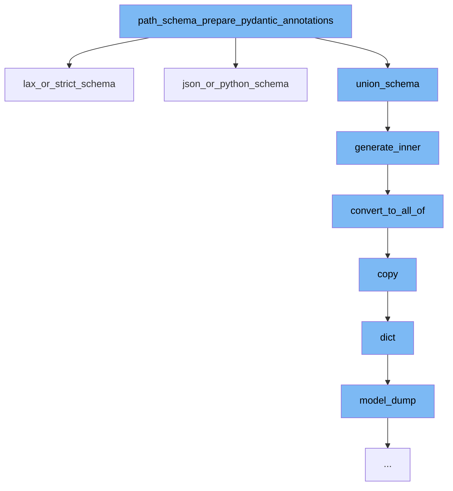

This document will cover the process of preparing Pydantic annotations and generating JSON schema for data validation. The steps include:

1. Preparing Pydantic annotations
2. Generating lax or strict schema
3. Generating inner schema
4. Converting to 'allOf' schema
5. Copying the model
6. Dumping the model to a dictionary



<SwmSnippet path="/pydantic/_internal/_std_types_schema.py" line="1">

---

# Preparing Pydantic annotations

The function `path_schema_prepare_pydantic_annotations` is the starting point of the flow. It prepares Pydantic annotations for data validation.

```python
"""Logic for generating pydantic-core schemas for standard library types.

Import of this module is deferred since it contains imports of many standard library modules.
"""

from __future__ import annotations as _annotations

import collections
import collections.abc
import dataclasses
```

---

</SwmSnippet>

<SwmSnippet path="/pydantic/json_schema.py" line="1226">

---

# Generating lax or strict schema

The function `lax_or_strict_schema` generates a JSON schema that matches a schema that allows values matching either the lax schema or the strict schema.

```python
    def lax_or_strict_schema(self, schema: core_schema.LaxOrStrictSchema) -> JsonSchemaValue:
        """Generates a JSON schema that matches a schema that allows values matching either the lax schema or the
        strict schema.

        Args:
            schema: The core schema.

        Returns:
            The generated JSON schema.
        """
        # TODO: Need to read the default value off of model config or whatever
        use_strict = schema.get('strict', False)  # TODO: replace this default False
        # If your JSON schema fails to generate it is probably
        # because one of the following two branches failed.
        if use_strict:
            return self.generate_inner(schema['strict_schema'])
        else:
            return self.generate_inner(schema['lax_schema'])
```

---

</SwmSnippet>

<SwmSnippet path="/pydantic/json_schema.py" line="445">

---

# Generating inner schema

The function `generate_inner` generates a JSON schema based on the input schema.

```python
    def generate_inner(self, schema: CoreSchemaOrField) -> JsonSchemaValue:  # noqa: C901
        """Generates a JSON schema for a given core schema.

        Args:
            schema: The given core schema.

        Returns:
            The generated JSON schema.
        """
        # If a schema with the same CoreRef has been handled, just return a reference to it
        # Note that this assumes that it will _never_ be the case that the same CoreRef is used
        # on types that should have different JSON schemas
        if 'ref' in schema:
            core_ref = CoreRef(schema['ref'])  # type: ignore[typeddict-item]
            core_mode_ref = (core_ref, self.mode)
            if core_mode_ref in self.core_to_defs_refs and self.core_to_defs_refs[core_mode_ref] in self.definitions:
                return {'$ref': self.core_to_json_refs[core_mode_ref]}

        # Generate the JSON schema, accounting for the json_schema_override and core_schema_override
        metadata_handler = _core_metadata.CoreMetadataHandler(schema)

```

---

</SwmSnippet>

<SwmSnippet path="/pydantic/json_schema.py" line="481">

---

# Converting to 'allOf' schema

The function `convert_to_all_of` converts the JSON schema to an 'allOf' schema if it contains a '$ref' and other keys.

```python
        def convert_to_all_of(json_schema: JsonSchemaValue) -> JsonSchemaValue:
            if '$ref' in json_schema and len(json_schema.keys()) > 1:
                # technically you can't have any other keys next to a "$ref"
                # but it's an easy mistake to make and not hard to correct automatically here
                json_schema = json_schema.copy()
                ref = json_schema.pop('$ref')
                json_schema = {'allOf': [{'$ref': ref}], **json_schema}
            return json_schema
```

---

</SwmSnippet>

<SwmSnippet path="/pydantic/main.py" line="1251">

---

# Copying the model

The function `copy` returns a copy of the model, with included, excluded and updated fields as specified.

````python
    def copy(
        self,
        *,
        include: AbstractSetIntStr | MappingIntStrAny | None = None,
        exclude: AbstractSetIntStr | MappingIntStrAny | None = None,
        update: Dict[str, Any] | None = None,  # noqa UP006
        deep: bool = False,
    ) -> Self:  # pragma: no cover
        """Returns a copy of the model.

        !!! warning "Deprecated"
            This method is now deprecated; use `model_copy` instead.

        If you need `include` or `exclude`, use:

        ```py
        data = self.model_dump(include=include, exclude=exclude, round_trip=True)
        data = {**data, **(update or {})}
        copied = self.model_validate(data)
        ```

````

---

</SwmSnippet>

<SwmSnippet path="/pydantic/main.py" line="1076">

---

# Dumping the model to a dictionary

The function `model_dump` generates a dictionary representation of the model, optionally specifying which fields to include or exclude.

```python
    def dict(  # noqa: D102
        self,
        *,
        include: IncEx = None,
        exclude: IncEx = None,
        by_alias: bool = False,
        exclude_unset: bool = False,
        exclude_defaults: bool = False,
        exclude_none: bool = False,
    ) -> Dict[str, Any]:  # noqa UP006
        warnings.warn('The `dict` method is deprecated; use `model_dump` instead.', category=PydanticDeprecatedSince20)
        return self.model_dump(
            include=include,
            exclude=exclude,
            by_alias=by_alias,
            exclude_unset=exclude_unset,
            exclude_defaults=exclude_defaults,
            exclude_none=exclude_none,
        )
```

---

</SwmSnippet>

&nbsp;

*This is an auto-generated document by Swimm AI 🌊 and has not yet been verified by a human*

<SwmMeta version="3.0.0" repo-id="Z2l0aHViJTNBJTNBREVNTy1weWRhbnRpYyUzQSUzQWdpbGFkbmF2b3Q=" repo-name="DEMO-pydantic" doc-type="flows"><sup>Powered by [Swimm](/)</sup></SwmMeta>
