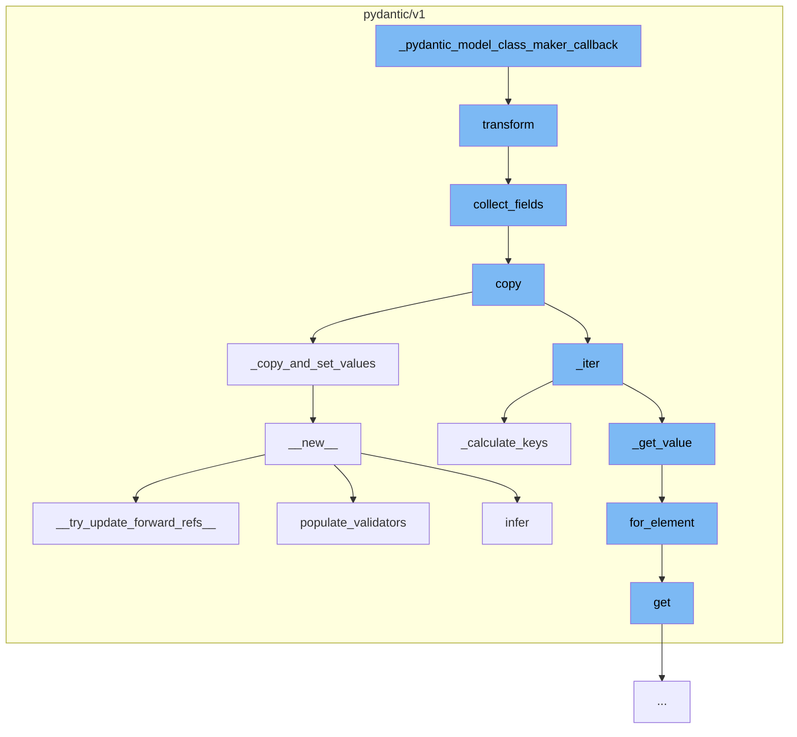

This document will cover the process of Pydantic model creation and validation in the DEMO-pydantic repository. We'll cover:

1. The initiation of the model creation process
2. Transformation of the BaseModel subclass
3. Collection of fields for the model
4. Copying of the model
5. Calculation of keys for the model
6. Finalization of the new model instance.



<SwmSnippet path="/pydantic/v1/mypy.py" line="123">

---

# Initiation of the Model Creation Process

The function `__new__` in `pydantic/v1/main.py` is the starting point of the model creation process. It prepares the model's configuration, collects validators, and sets up the model's fields. It also handles the creation of new instances of the model.

```python
        if fullname == MODEL_METACLASS_FULLNAME:
            return self._pydantic_model_metaclass_marker_callback
        return None

    def get_function_hook(self, fullname: str) -> 'Optional[Callable[[FunctionContext], Type]]':
        sym = self.lookup_fully_qualified(fullname)
        if sym and sym.fullname == FIELD_FULLNAME:
            return self._pydantic_field_callback
        return None

    def get_method_hook(self, fullname: str) -> Optional[Callable[[MethodContext], Type]]:
        if fullname.endswith('.from_orm'):
            return from_orm_callback
        return None

    def get_class_decorator_hook(self, fullname: str) -> Optional[Callable[[ClassDefContext], None]]:
        """Mark pydantic.dataclasses as dataclass.

        Mypy version 1.1.1 added support for `@dataclass_transform` decorator.
        """
        if fullname == DATACLASS_FULLNAME and MYPY_VERSION_TUPLE < (1, 1):
```

---

</SwmSnippet>

<SwmSnippet path="/pydantic/v1/mypy.py" line="301">

---

# Transformation of the BaseModel Subclass

The `transform` function in `pydantic/v1/mypy.py` configures the BaseModel subclass according to the plugin settings. It determines the model config and fields, adds a fields-aware signature for the initializer and construct methods, freezes the class if necessary, and stores the fields, config, and if the class is settings in the mypy metadata for access by subclasses.

```python
    def transform(self) -> None:
        """
        Configures the BaseModel subclass according to the plugin settings.

        In particular:
        * determines the model config and fields,
        * adds a fields-aware signature for the initializer and construct methods
        * freezes the class if allow_mutation = False or frozen = True
        * stores the fields, config, and if the class is settings in the mypy metadata for access by subclasses
        """
        ctx = self._ctx
        info = ctx.cls.info

        self.adjust_validator_signatures()
        config = self.collect_config()
        fields = self.collect_fields(config)
        is_settings = any(get_fullname(base) == BASESETTINGS_FULLNAME for base in info.mro[:-1])
        self.add_initializer(fields, config, is_settings)
        self.add_construct_method(fields)
        self.set_frozen(fields, frozen=config.allow_mutation is False or config.frozen is True)
        info.metadata[METADATA_KEY] = {
```

---

</SwmSnippet>

<SwmSnippet path="/pydantic/v1/mypy.py" line="375">

---

# Collection of Fields for the Model

The `collect_fields` function in `pydantic/v1/mypy.py` collects the fields for the model, taking into account fields belonging to the current class and parent classes.

```python
    def collect_fields(self, model_config: 'ModelConfigData') -> List['PydanticModelField']:
        """
        Collects the fields for the model, accounting for parent classes
        """
        # First, collect fields belonging to the current class.
        ctx = self._ctx
        cls = self._ctx.cls
        fields = []  # type: List[PydanticModelField]
        known_fields = set()  # type: Set[str]
        for stmt in cls.defs.body:
            if not isinstance(stmt, AssignmentStmt):  # `and stmt.new_syntax` to require annotation
                continue

            lhs = stmt.lvalues[0]
            if not isinstance(lhs, NameExpr) or not is_valid_field(lhs.name):
                continue

            if not stmt.new_syntax and self.plugin_config.warn_untyped_fields:
                error_untyped_fields(ctx.api, stmt)

            # if lhs.name == '__config__':  # BaseConfig not well handled; I'm not sure why yet
```

---

</SwmSnippet>

<SwmSnippet path="/pydantic/v1/main.py" line="627">

---

# Copying of the Model

The `copy` function in `pydantic/v1/main.py` duplicates a model, allowing for the inclusion, exclusion, and change of fields in the new model.

```python
    def copy(
        self: 'Model',
        *,
        include: Optional[Union['AbstractSetIntStr', 'MappingIntStrAny']] = None,
        exclude: Optional[Union['AbstractSetIntStr', 'MappingIntStrAny']] = None,
        update: Optional['DictStrAny'] = None,
        deep: bool = False,
    ) -> 'Model':
        """
        Duplicate a model, optionally choose which fields to include, exclude and change.

        :param include: fields to include in new model
        :param exclude: fields to exclude from new model, as with values this takes precedence over include
        :param update: values to change/add in the new model. Note: the data is not validated before creating
            the new model: you should trust this data
        :param deep: set to `True` to make a deep copy of the model
        :return: new model instance
        """

        values = dict(
            self._iter(to_dict=False, by_alias=False, include=include, exclude=exclude, exclude_unset=False),
```

---

</SwmSnippet>

<SwmSnippet path="/pydantic/v1/main.py" line="878">

---

# Calculation of Keys for the Model

The `_calculate_keys` function in `pydantic/v1/main.py` calculates the keys for the model based on the include, exclude, and exclude_unset parameters.

```python
    def _calculate_keys(
        self,
        include: Optional['MappingIntStrAny'],
        exclude: Optional['MappingIntStrAny'],
        exclude_unset: bool,
        update: Optional['DictStrAny'] = None,
    ) -> Optional[AbstractSet[str]]:
        if include is None and exclude is None and exclude_unset is False:
            return None

        keys: AbstractSet[str]
        if exclude_unset:
            keys = self.__fields_set__.copy()
        else:
            keys = self.__dict__.keys()

        if include is not None:
            keys &= include.keys()

        if update:
            keys -= update.keys()
```

---

</SwmSnippet>

<SwmSnippet path="/pydantic/v1/main.py" line="609">

---

# Finalization of the New Model Instance

The `_copy_and_set_values` function in `pydantic/v1/main.py` finalizes the creation of the new model instance by setting the values and fields of the model.

```python
    def _copy_and_set_values(self: 'Model', values: 'DictStrAny', fields_set: 'SetStr', *, deep: bool) -> 'Model':
        if deep:
            # chances of having empty dict here are quite low for using smart_deepcopy
            values = deepcopy(values)

        cls = self.__class__
        m = cls.__new__(cls)
        object_setattr(m, '__dict__', values)
        object_setattr(m, '__fields_set__', fields_set)
        for name in self.__private_attributes__:
            value = getattr(self, name, Undefined)
            if value is not Undefined:
                if deep:
                    value = deepcopy(value)
                object_setattr(m, name, value)

        return m
```

---

</SwmSnippet>

&nbsp;

*This is an auto-generated document by Swimm AI 🌊 and has not yet been verified by a human*

<SwmMeta version="3.0.0" repo-id="Z2l0aHViJTNBJTNBREVNTy1weWRhbnRpYyUzQSUzQWdpbGFkbmF2b3Q=" repo-name="DEMO-pydantic" doc-type="flows"><sup>Powered by [Swimm](/)</sup></SwmMeta>
