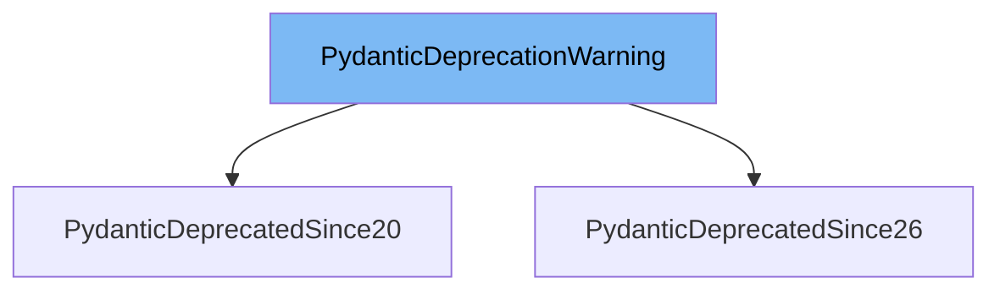

This document will cover the `PydanticDeprecationWarning` class from the `pydantic/warnings.py` file. We'll cover:

1. What is `PydanticDeprecationWarning`.
2. Variables and functions in `PydanticDeprecationWarning`.
3. Usage example of `PydanticDeprecationWarning`.



# What is PydanticDeprecationWarning

`PydanticDeprecationWarning` is a Pydantic specific deprecation warning. This warning is raised when using deprecated functionality in Pydantic. It provides information on when the deprecation was introduced and the expected version in which the corresponding functionality will be removed.

<SwmSnippet path="/pydantic/warnings.py" line="27">

---

# Variables and functions

The `PydanticDeprecationWarning` class has three variables: `message`, `since`, and `expected_removal`. `message` is a string that describes the warning. `since` is a tuple of integers representing the Pydantic version in which the deprecation was introduced. `expected_removal` is a tuple of integers representing the Pydantic version in which the corresponding functionality is expected to be removed.

```python
    message: str
    since: tuple[int, int]
    expected_removal: tuple[int, int]
```

---

</SwmSnippet>

<SwmSnippet path="/pydantic/warnings.py" line="31">

---

The `__init__` function is used to initialize the `PydanticDeprecationWarning` class. It takes in a `message`, `since`, and `expected_removal` as parameters. The `message` is stripped of any trailing periods. If `expected_removal` is not provided, it defaults to the next major version after `since`.

```python
    def __init__(
        self, message: str, *args: object, since: tuple[int, int], expected_removal: tuple[int, int] | None = None
    ) -> None:
        super().__init__(message, *args)
        self.message = message.rstrip('.')
        self.since = since
        self.expected_removal = expected_removal if expected_removal is not None else (since[0] + 1, 0)
```

---

</SwmSnippet>

<SwmSnippet path="/pydantic/warnings.py" line="39">

---

The `__str__` function is used to convert the `PydanticDeprecationWarning` instance to a string. It formats the `message`, `since`, and `expected_removal` into a single string. If the `since` version is 2.0, it also adds a link to the Pydantic V2 Migration Guide.

```python
    def __str__(self) -> str:
        message = (
            f'{self.message}. Deprecated in Pydantic V{self.since[0]}.{self.since[1]}'
            f' to be removed in V{self.expected_removal[0]}.{self.expected_removal[1]}.'
        )
        if self.since == (2, 0):
            message += f' See Pydantic V2 Migration Guide at https://errors.pydantic.dev/{version_short()}/migration/'
        return message
```

---

</SwmSnippet>

<SwmSnippet path="/pydantic/warnings.py" line="49">

---

# Usage example

`PydanticDeprecatedSince20` is a subclass of `PydanticDeprecationWarning` that represents functionality deprecated since Pydantic 2.0. It initializes the `PydanticDeprecationWarning` with a `message`, `since` of (2, 0), and `expected_removal` of (3, 0).

```python
class PydanticDeprecatedSince20(PydanticDeprecationWarning):
    """A specific `PydanticDeprecationWarning` subclass defining functionality deprecated since Pydantic 2.0."""

    def __init__(self, message: str, *args: object) -> None:
        super().__init__(message, *args, since=(2, 0), expected_removal=(3, 0))
```

---

</SwmSnippet>

&nbsp;

*This is an auto-generated document by Swimm AI 🌊 and has not yet been verified by a human*

<SwmMeta version="3.0.0" repo-id="Z2l0aHViJTNBJTNBREVNTy1weWRhbnRpYyUzQSUzQWdpbGFkbmF2b3Q=" repo-name="DEMO-pydantic" doc-type="class"><sup>Powered by [Swimm](/)</sup></SwmMeta>
