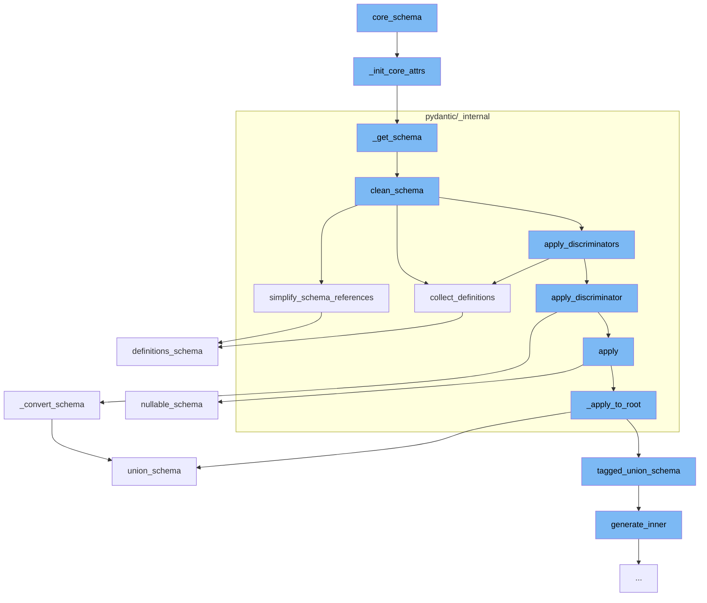

This document will cover the process of Pydantic's core schema generation and validation, which includes:

 1. Initializing core attributes
 2. Getting the schema
 3. Cleaning the schema
 4. Simplifying schema references
 5. Collecting definitions
 6. Converting the schema
 7. Applying nullable schema
 8. Applying union schema
 9. Generating inner schema
10. Applying definitions schema.



<SwmSnippet path="/pydantic/type_adapter.py" line="275">

---

# Initializing core attributes

The function `_init_core_attrs` is used to initialize core attributes of the schema. It tries to get the core schema, validator, and serializer from the type. If these attributes are not present, it creates them using the `_get_schema` function and the `create_schema_validator` and `SchemaSerializer` classes.

```python
    def _init_core_attrs(self, rebuild_mocks: bool) -> None:
        try:
            self._core_schema = _getattr_no_parents(self._type, '__pydantic_core_schema__')
            self._validator = _getattr_no_parents(self._type, '__pydantic_validator__')
            self._serializer = _getattr_no_parents(self._type, '__pydantic_serializer__')
        except AttributeError:
            config_wrapper = _config.ConfigWrapper(self._config)
            core_config = config_wrapper.core_config(None)

            self._core_schema = _get_schema(self._type, config_wrapper, parent_depth=self._parent_depth)
            self._validator = create_schema_validator(
                schema=self._core_schema,
                schema_type=self._type,
                schema_type_module=self._module_name,
                schema_type_name=str(self._type),
                schema_kind='TypeAdapter',
                config=core_config,
                plugin_settings=config_wrapper.plugin_settings,
            )
            self._serializer = SchemaSerializer(self._core_schema, core_config)

```

---

</SwmSnippet>

<SwmSnippet path="/pydantic/type_adapter.py" line="54">

---

# Getting the schema

The function `_get_schema` is used to generate the core schema for a given type. It uses the `GenerateSchema` class to generate the schema and then cleans it.

````python
def _get_schema(type_: Any, config_wrapper: _config.ConfigWrapper, parent_depth: int) -> CoreSchema:
    """`BaseModel` uses its own `__module__` to find out where it was defined
    and then looks for symbols to resolve forward references in those globals.
    On the other hand this function can be called with arbitrary objects,
    including type aliases, where `__module__` (always `typing.py`) is not useful.
    So instead we look at the globals in our parent stack frame.

    This works for the case where this function is called in a module that
    has the target of forward references in its scope, but
    does not always work for more complex cases.

    For example, take the following:

    a.py
    ```python
    from typing import Dict, List

    IntList = List[int]
    OuterDict = Dict[str, 'IntList']
    ```

````

---

</SwmSnippet>

<SwmSnippet path="/pydantic/_internal/_generate_schema.py" line="446">

---

# Cleaning the schema

The function `clean_schema` is used to clean the generated schema. It collects definitions, simplifies schema references, and applies discriminators to the schema.

```python
    def clean_schema(self, schema: CoreSchema) -> CoreSchema:
        schema = self.collect_definitions(schema)
        schema = simplify_schema_references(schema)
        if collect_invalid_schemas(schema):
            raise self.CollectedInvalid()
        schema = _discriminated_union.apply_discriminators(schema)
        schema = validate_core_schema(schema)
        return schema
```

---

</SwmSnippet>

<SwmSnippet path="/pydantic/_internal/_core_utils.py" line="417">

---

# Simplifying schema references

The function `simplify_schema_references` is used to simplify the schema references in the schema. It collects references, counts them, and then inlines the references that can be inlined.

```python
def simplify_schema_references(schema: core_schema.CoreSchema) -> core_schema.CoreSchema:  # noqa: C901
    definitions: dict[str, core_schema.CoreSchema] = {}
    ref_counts: dict[str, int] = defaultdict(int)
    involved_in_recursion: dict[str, bool] = {}
    current_recursion_ref_count: dict[str, int] = defaultdict(int)

    def collect_refs(s: core_schema.CoreSchema, recurse: Recurse) -> core_schema.CoreSchema:
        if s['type'] == 'definitions':
            for definition in s['definitions']:
                ref = get_ref(definition)
                assert ref is not None
                if ref not in definitions:
                    definitions[ref] = definition
                recurse(definition, collect_refs)
            return recurse(s['schema'], collect_refs)
        else:
            ref = get_ref(s)
            if ref is not None:
                new = recurse(s, collect_refs)
                new_ref = get_ref(new)
                if new_ref:
```

---

</SwmSnippet>

<SwmSnippet path="/pydantic/_internal/_generate_schema.py" line="455">

---

# Collecting definitions

The function `collect_definitions` is used to collect definitions from the schema. It adds the definitions to a definitions dictionary and replaces the original schema with a reference to the definition.

```python
    def collect_definitions(self, schema: CoreSchema) -> CoreSchema:
        ref = cast('str | None', schema.get('ref', None))
        if ref:
            self.defs.definitions[ref] = schema
        if 'ref' in schema:
            schema = core_schema.definition_reference_schema(schema['ref'])
        return core_schema.definitions_schema(
            schema,
            list(self.defs.definitions.values()),
```

---

</SwmSnippet>

<SwmSnippet path="/pydantic/types.py" line="2835">

---

# Converting the schema

The function `_convert_schema` is used to convert the original schema to a tagged union schema. It iterates over the choices in the original schema and generates a new schema for each choice.

```python
    def _convert_schema(self, original_schema: core_schema.CoreSchema) -> core_schema.TaggedUnionSchema:
        if original_schema['type'] != 'union':
            # This likely indicates that the schema was a single-item union that was simplified.
            # In this case, we do the same thing we do in
            # `pydantic._internal._discriminated_union._ApplyInferredDiscriminator._apply_to_root`, namely,
            # package the generated schema back into a single-item union.
            original_schema = core_schema.union_schema([original_schema])

        tagged_union_choices = {}
        for i, choice in enumerate(original_schema['choices']):
            tag = None
            if isinstance(choice, tuple):
                choice, tag = choice
            metadata = choice.get('metadata')
            if metadata is not None:
                metadata_tag = metadata.get(_core_utils.TAGGED_UNION_TAG_KEY)
                if metadata_tag is not None:
                    tag = metadata_tag
            if tag is None:
                raise PydanticUserError(
                    f'`Tag` not provided for choice {choice} used with `Discriminator`',
```

---

</SwmSnippet>

<SwmSnippet path="/pydantic/json_schema.py" line="1090">

---

# Applying nullable schema

The function `nullable_schema` is used to generate a JSON schema that matches a schema that allows null values. It generates a new schema for the inner schema of the original schema.

```python
    def nullable_schema(self, schema: core_schema.NullableSchema) -> JsonSchemaValue:
        """Generates a JSON schema that matches a schema that allows null values.

        Args:
            schema: The core schema.

        Returns:
            The generated JSON schema.
        """
        null_schema = {'type': 'null'}
        inner_json_schema = self.generate_inner(schema['schema'])

        if inner_json_schema == null_schema:
            return null_schema
        else:
            # Thanks to the equality check against `null_schema` above, I think 'oneOf' would also be valid here;
            # I'll use 'anyOf' for now, but it could be changed it if it would work better with some external tooling
            return self.get_flattened_anyof([inner_json_schema, null_schema])
```

---

</SwmSnippet>

<SwmSnippet path="/pydantic/json_schema.py" line="1109">

---

# Applying union schema

The function `union_schema` is used to generate a JSON schema that matches a schema that allows values matching any of the given schemas. It generates a new schema for each choice in the original schema.

```python
    def union_schema(self, schema: core_schema.UnionSchema) -> JsonSchemaValue:
        """Generates a JSON schema that matches a schema that allows values matching any of the given schemas.

        Args:
            schema: The core schema.

        Returns:
            The generated JSON schema.
        """
        generated: list[JsonSchemaValue] = []

        choices = schema['choices']
        for choice in choices:
            # choice will be a tuple if an explicit label was provided
            choice_schema = choice[0] if isinstance(choice, tuple) else choice
            try:
                generated.append(self.generate_inner(choice_schema))
            except PydanticOmit:
                continue
            except PydanticInvalidForJsonSchema as exc:
                self.emit_warning('skipped-choice', exc.message)
```

---

</SwmSnippet>

<SwmSnippet path="/pydantic/json_schema.py" line="445">

---

# Generating inner schema

The function `generate_inner` is used to generate a JSON schema based on the input schema. It handles different types of schemas and generates the appropriate JSON schema for each type.

```python
    def generate_inner(self, schema: CoreSchemaOrField) -> JsonSchemaValue:  # noqa: C901
        """Generates a JSON schema for a given core schema.

        Args:
            schema: The given core schema.

        Returns:
            The generated JSON schema.
        """
        # If a schema with the same CoreRef has been handled, just return a reference to it
        # Note that this assumes that it will _never_ be the case that the same CoreRef is used
        # on types that should have different JSON schemas
        if 'ref' in schema:
            core_ref = CoreRef(schema['ref'])  # type: ignore[typeddict-item]
            core_mode_ref = (core_ref, self.mode)
            if core_mode_ref in self.core_to_defs_refs and self.core_to_defs_refs[core_mode_ref] in self.definitions:
                return {'$ref': self.core_to_json_refs[core_mode_ref]}

        # Generate the JSON schema, accounting for the json_schema_override and core_schema_override
        metadata_handler = _core_metadata.CoreMetadataHandler(schema)

```

---

</SwmSnippet>

<SwmSnippet path="/pydantic/json_schema.py" line="1812">

---

# Applying definitions schema

The function `definitions_schema` is used to generate a JSON schema that matches a schema that defines a JSON object with definitions. It generates a new schema for each definition in the original schema.

```python
    def definitions_schema(self, schema: core_schema.DefinitionsSchema) -> JsonSchemaValue:
        """Generates a JSON schema that matches a schema that defines a JSON object with definitions.

        Args:
            schema: The core schema.

        Returns:
            The generated JSON schema.
        """
        for definition in schema['definitions']:
            try:
                self.generate_inner(definition)
            except PydanticInvalidForJsonSchema as e:
                core_ref: CoreRef = CoreRef(definition['ref'])  # type: ignore
                self._core_defs_invalid_for_json_schema[self.get_defs_ref((core_ref, self.mode))] = e
                continue
        return self.generate_inner(schema['schema'])
```

---

</SwmSnippet>

&nbsp;

*This is an auto-generated document by Swimm AI 🌊 and has not yet been verified by a human*

<SwmMeta version="3.0.0" repo-id="Z2l0aHViJTNBJTNBREVNTy1weWRhbnRpYyUzQSUzQWdpbGFkbmF2b3Q=" repo-name="DEMO-pydantic" doc-type="flows"><sup>Powered by [Swimm](/)</sup></SwmMeta>
