This document will cover the process of rebuilding a dataclass in the Pydantic library, which includes:

1. Completing the dataclass
2. Cleaning the schema
3. Generating the schema
4. Applying the discriminator to the union
5. Setting the dataclass fields.

```mermaid
graph TD;
subgraph pydantic/_internal
  rebuild_dataclass:::mainFlowStyle --> complete_dataclass
end
subgraph pydantic/_internal
  complete_dataclass:::mainFlowStyle --> clean_schema
end
subgraph pydantic/_internal
  complete_dataclass:::mainFlowStyle --> set_dataclass_fields
end
subgraph pydantic/_internal
  complete_dataclass:::mainFlowStyle --> generate_schema
end
subgraph pydantic/_internal
  clean_schema --> apply_discriminators
end
subgraph pydantic/_internal
  clean_schema --> simplify_schema_references
end
subgraph pydantic/_internal
  clean_schema --> collect_definitions
end
subgraph pydantic/_internal
  apply_discriminators --> apply_discriminator
end
subgraph pydantic/_internal
  apply_discriminators --> collect_definitions
end
  simplify_schema_references --> definitions_schema
  collect_definitions --> definitions_schema
subgraph pydantic/_internal
  set_dataclass_fields --> collect_dataclass_fields
end
  collect_dataclass_fields --> from_annotated_attribute
subgraph pydantic/_internal
  generate_schema:::mainFlowStyle --> _generate_schema_from_property
end
subgraph pydantic/_internal
  generate_schema:::mainFlowStyle --> _generate_schema_inner
end
  _generate_schema_from_property --> chain_schema
  chain_schema --> generate_inner
subgraph pydantic/_internal
  _generate_schema_inner:::mainFlowStyle --> _model_schema
end
subgraph pydantic/_internal
  _generate_schema_inner:::mainFlowStyle --> _annotated_schema
end
subgraph pydantic/_internal
  _generate_schema_inner:::mainFlowStyle --> match_type
end
subgraph pydantic/_internal
  _model_schema --> _generate_md_field_schema
end
  _model_schema --> model_fields_schema
subgraph pydantic/_internal
  _model_schema --> _computed_field_schema
end
subgraph pydantic/_internal
  _model_schema --> define_expected_missing_refs
end
  model_fields_schema --> _named_required_fields_schema
  model_fields_schema --> generate_inner
subgraph pydantic/_internal
  _computed_field_schema --> _apply_field_serializers
end
subgraph pydantic/_internal
  _computed_field_schema --> get_function_return_type
end
  define_expected_missing_refs --> definitions_schema
subgraph pydantic/_internal
  match_type:::mainFlowStyle --> _typed_dict_schema
end
subgraph pydantic/_internal
  match_type:::mainFlowStyle --> _namedtuple_schema
end
subgraph pydantic/_internal
  match_type:::mainFlowStyle --> _callable_schema
end
subgraph pydantic/_internal
  match_type:::mainFlowStyle --> _unsubstituted_typevar_schema
end
subgraph pydantic/_internal
  match_type:::mainFlowStyle --> _match_generic_type
end
subgraph pydantic/_internal
  _typed_dict_schema --> _generate_td_field_schema
end
subgraph pydantic/_internal
  _typed_dict_schema --> _computed_field_schema
end
  _typed_dict_schema --> typed_dict_schema
subgraph pydantic/_internal
  _typed_dict_schema --> _apply_model_serializers
end
  typed_dict_schema --> _named_required_fields_schema
subgraph pydantic/_internal
  _apply_model_serializers --> get_function_return_type
end
subgraph pydantic/_internal
  _namedtuple_schema --> _generate_parameter_schema
end
  _namedtuple_schema --> arguments_schema
  _namedtuple_schema --> call_schema
  _generate_parameter_schema --> from_annotated_attribute
  arguments_schema --> p_arguments_schema
  arguments_schema --> kw_arguments_schema
  call_schema --> generate_inner
subgraph pydantic/_internal
  _callable_schema --> _generate_parameter_schema
end
  _callable_schema --> arguments_schema
  _callable_schema --> call_schema
subgraph pydantic/_internal
  _unsubstituted_typevar_schema --> _union_schema
end
  _union_schema --> union_schema
  _union_schema --> nullable_schema
subgraph pydantic/_internal
  _match_generic_type:::mainFlowStyle --> _typed_dict_schema
end
subgraph pydantic/_internal
  _match_generic_type:::mainFlowStyle --> _namedtuple_schema
end
subgraph pydantic/_internal
  _match_generic_type:::mainFlowStyle --> _subclass_schema
end
subgraph pydantic/_internal
  _match_generic_type:::mainFlowStyle --> _sequence_schema
end
subgraph pydantic/_internal
  _match_generic_type:::mainFlowStyle --> _dataclass_schema
end
subgraph pydantic/_internal
  _subclass_schema --> _union_is_subclass_schema
end
  _subclass_schema --> union_schema
subgraph pydantic/_internal
  _subclass_schema --> _type_schema
end
  _union_is_subclass_schema --> union_schema
  union_schema --> generate_inner
  _type_schema --> custom_error_schema
  _sequence_schema --> list_schema
  _sequence_schema --> chain_schema
  _sequence_schema --> json_or_python_schema
  list_schema --> generate_inner
  json_or_python_schema --> generate_inner
subgraph pydantic/_internal
  _dataclass_schema:::mainFlowStyle --> _computed_field_schema
end
  _dataclass_schema:::mainFlowStyle --> dataclass_args_schema
subgraph pydantic/_internal
  _dataclass_schema:::mainFlowStyle --> collect_dataclass_fields
end
  _dataclass_schema:::mainFlowStyle --> dataclass_schema
subgraph pydantic/_internal
  _dataclass_schema:::mainFlowStyle --> _generate_dc_field_schema
end
subgraph pydantic/_internal
  _apply_field_serializers --> get_function_return_type
end
subgraph pydantic/_internal
  get_function_return_type --> get_function_type_hints
end
  dataclass_args_schema --> _named_required_fields_schema
  _named_required_fields_schema --> generate_inner
  from_annotated_attribute --> _from_dataclass_field
  from_annotated_attribute --> merge_field_infos
  dataclass_schema --> generate_inner
  generate_inner --> convert_to_all_of
subgraph pydantic/_internal
  _generate_dc_field_schema:::mainFlowStyle --> _common_field_schema
end
subgraph pydantic/_internal
  _common_field_schema:::mainFlowStyle --> _apply_discriminator_to_union
end
subgraph pydantic/_internal
  _common_field_schema:::mainFlowStyle --> _apply_field_serializers
end
subgraph pydantic/_internal
  _common_field_schema:::mainFlowStyle --> _apply_annotations
end
subgraph pydantic/_internal
  _apply_discriminator_to_union --> apply_discriminator
end
subgraph pydantic/_internal
  apply_discriminator --> apply
end
  apply_discriminator --> _convert_schema
  _apply_annotations:::mainFlowStyle --> ...

 classDef mainFlowStyle color:#000000,fill:#7CB9F4
  classDef rootsStyle color:#000000,fill:#00FFF4
```



<SwmSnippet path="/pydantic/_internal/_dataclasses.py" line="87">

---

# Completing the dataclass

The function `complete_dataclass` is used to finish building a Pydantic dataclass. It sets the dataclass fields, generates the schema, and applies any necessary modifications to the schema.

```python
def complete_dataclass(
    cls: type[Any],
    config_wrapper: _config.ConfigWrapper,
    *,
    raise_errors: bool = True,
    types_namespace: dict[str, Any] | None,
) -> bool:
    """Finish building a pydantic dataclass.

    This logic is called on a class which has already been wrapped in `dataclasses.dataclass()`.

    This is somewhat analogous to `pydantic._internal._model_construction.complete_model_class`.

    Args:
        cls: The class.
        config_wrapper: The config wrapper instance.
        raise_errors: Whether to raise errors, defaults to `True`.
        types_namespace: The types namespace.

    Returns:
        `True` if building a pydantic dataclass is successfully completed, `False` otherwise.
```

---

</SwmSnippet>

<SwmSnippet path="/pydantic/_internal/_generate_schema.py" line="446">

---

# Cleaning the schema

The function `clean_schema` is used to finalize the schema. It collects definitions, simplifies schema references, and applies discriminators.

```python
    def clean_schema(self, schema: CoreSchema) -> CoreSchema:
        schema = self.collect_definitions(schema)
        schema = simplify_schema_references(schema)
        if collect_invalid_schemas(schema):
            raise self.CollectedInvalid()
        schema = _discriminated_union.apply_discriminators(schema)
        schema = validate_core_schema(schema)
        return schema
```

---

</SwmSnippet>

<SwmSnippet path="/pydantic/_internal/_generate_schema.py" line="654">

---

# Generating the schema

The function `_generate_schema_from_property` is used to generate the schema from either the `__get_pydantic_core_schema__` function or `__pydantic_core_schema__` property.

```python
    def _generate_schema_from_property(self, obj: Any, source: Any) -> core_schema.CoreSchema | None:
        """Try to generate schema from either the `__get_pydantic_core_schema__` function or
        `__pydantic_core_schema__` property.

        Note: `__get_pydantic_core_schema__` takes priority so it can
        decide whether to use a `__pydantic_core_schema__` attribute, or generate a fresh schema.
        """
        # avoid calling `__get_pydantic_core_schema__` if we've already visited this object
        if is_self_type(obj):
            obj = self.model_type_stack.get()
        with self.defs.get_schema_or_ref(obj) as (_, maybe_schema):
            if maybe_schema is not None:
                return maybe_schema
        if obj is source:
            ref_mode = 'unpack'
        else:
            ref_mode = 'to-def'

        schema: CoreSchema

        if (get_schema := getattr(obj, '__get_pydantic_core_schema__', None)) is not None:
```

---

</SwmSnippet>

<SwmSnippet path="/pydantic/_internal/_generate_schema.py" line="425">

---

# Applying the discriminator to the union

The function `_apply_discriminator_to_union` is used to apply the discriminator to the union if one is present.

```python
    def _apply_discriminator_to_union(
        self, schema: CoreSchema, discriminator: str | Discriminator | None
    ) -> CoreSchema:
        if discriminator is None:
            return schema
        try:
            return _discriminated_union.apply_discriminator(
                schema,
                discriminator,
            )
        except _discriminated_union.MissingDefinitionForUnionRef:
```

---

</SwmSnippet>

<SwmSnippet path="/pydantic/_internal/_dataclasses.py" line="120">

---

# Setting the dataclass fields

The function `set_dataclass_fields` is used to set the fields of the dataclass.

```python
    set_dataclass_fields(cls, types_namespace, config_wrapper=config_wrapper)

```

---

</SwmSnippet>

&nbsp;

*This is an auto-generated document by Swimm AI 🌊 and has not yet been verified by a human*

<SwmMeta version="3.0.0" repo-id="Z2l0aHViJTNBJTNBREVNTy1weWRhbnRpYyUzQSUzQWdpbGFkbmF2b3Q=" repo-name="DEMO-pydantic" doc-type="flows"><sup>Powered by [Swimm](/)</sup></SwmMeta>
