This document will cover the process of rebuilding a dataclass in the Pydantic library. The steps include:

 1. Completing the dataclass
 2. Cleaning the schema
 3. Generating the schema from the property
 4. Applying the model schema
 5. Applying the typed dict schema
 6. Applying the computed field schema
 7. Applying the common field schema
 8. Applying the discriminator to the union
 9. Setting the dataclass fields
10. Collecting the dataclass fields.

```mermaid
graph TD;
subgraph pydantic/_internal
  rebuild_dataclass:::mainFlowStyle --> complete_dataclass
end
subgraph pydantic/_internal
  complete_dataclass:::mainFlowStyle --> clean_schema
end
subgraph pydantic/_internal
  complete_dataclass:::mainFlowStyle --> set_dataclass_fields
end
subgraph pydantic/_internal
  complete_dataclass:::mainFlowStyle --> generate_schema
end
subgraph pydantic/_internal
  clean_schema --> apply_discriminators
end
subgraph pydantic/_internal
  clean_schema --> simplify_schema_references
end
subgraph pydantic/_internal
  clean_schema --> collect_definitions
end
subgraph pydantic/_internal
  apply_discriminators --> apply_discriminator
end
subgraph pydantic/_internal
  apply_discriminators --> collect_definitions
end
  simplify_schema_references --> definitions_schema
  collect_definitions --> definitions_schema
subgraph pydantic/_internal
  set_dataclass_fields --> collect_dataclass_fields
end
  collect_dataclass_fields --> from_annotated_attribute
subgraph pydantic/_internal
  generate_schema:::mainFlowStyle --> _generate_schema_from_property
end
subgraph pydantic/_internal
  generate_schema:::mainFlowStyle --> _generate_schema_inner
end
  _generate_schema_from_property --> chain_schema
  chain_schema --> generate_inner
subgraph pydantic/_internal
  _generate_schema_inner:::mainFlowStyle --> _model_schema
end
subgraph pydantic/_internal
  _generate_schema_inner:::mainFlowStyle --> _annotated_schema
end
subgraph pydantic/_internal
  _generate_schema_inner:::mainFlowStyle --> match_type
end
subgraph pydantic/_internal
  _model_schema --> _generate_md_field_schema
end
  _model_schema --> model_fields_schema
subgraph pydantic/_internal
  _model_schema --> _computed_field_schema
end
subgraph pydantic/_internal
  _model_schema --> define_expected_missing_refs
end
  model_fields_schema --> _named_required_fields_schema
  model_fields_schema --> generate_inner
subgraph pydantic/_internal
  _computed_field_schema --> _apply_field_serializers
end
subgraph pydantic/_internal
  _computed_field_schema --> get_function_return_type
end
  define_expected_missing_refs --> definitions_schema
subgraph pydantic/_internal
  match_type:::mainFlowStyle --> _typed_dict_schema
end
subgraph pydantic/_internal
  match_type:::mainFlowStyle --> _namedtuple_schema
end
subgraph pydantic/_internal
  match_type:::mainFlowStyle --> _callable_schema
end
subgraph pydantic/_internal
  match_type:::mainFlowStyle --> _unsubstituted_typevar_schema
end
subgraph pydantic/_internal
  match_type:::mainFlowStyle --> _match_generic_type
end
subgraph pydantic/_internal
  _typed_dict_schema --> _generate_td_field_schema
end
subgraph pydantic/_internal
  _typed_dict_schema --> _computed_field_schema
end
  _typed_dict_schema --> typed_dict_schema
subgraph pydantic/_internal
  _typed_dict_schema --> _apply_model_serializers
end
  typed_dict_schema --> _named_required_fields_schema
subgraph pydantic/_internal
  _apply_model_serializers --> get_function_return_type
end
subgraph pydantic/_internal
  _apply_model_serializers --> inspect_model_serializer
end
subgraph pydantic/_internal
  _namedtuple_schema --> _generate_parameter_schema
end
  _namedtuple_schema --> arguments_schema
  _namedtuple_schema --> call_schema
  _generate_parameter_schema --> from_annotated_attribute
  _generate_parameter_schema --> from_annotation
  arguments_schema --> p_arguments_schema
  arguments_schema --> kw_arguments_schema
  call_schema --> generate_inner
subgraph pydantic/_internal
  _callable_schema --> _generate_parameter_schema
end
  _callable_schema --> arguments_schema
  _callable_schema --> call_schema
subgraph pydantic/_internal
  _callable_schema --> get_function_type_hints
end
subgraph pydantic/_internal
  get_function_type_hints --> get_type_hints
end
subgraph pydantic/_internal
  get_function_type_hints --> add_module_globals
end
subgraph pydantic/_internal
  _unsubstituted_typevar_schema --> _union_schema
end
  _union_schema --> union_schema
  _union_schema --> nullable_schema
subgraph pydantic/_internal
  _match_generic_type:::mainFlowStyle --> _typed_dict_schema
end
subgraph pydantic/_internal
  _match_generic_type:::mainFlowStyle --> _namedtuple_schema
end
subgraph pydantic/_internal
  _match_generic_type:::mainFlowStyle --> _subclass_schema
end
subgraph pydantic/_internal
  _match_generic_type:::mainFlowStyle --> _sequence_schema
end
subgraph pydantic/_internal
  _match_generic_type:::mainFlowStyle --> _dataclass_schema
end
subgraph pydantic/_internal
  _subclass_schema --> _union_is_subclass_schema
end
  _subclass_schema --> union_schema
subgraph pydantic/_internal
  _subclass_schema --> _type_schema
end
  _union_is_subclass_schema --> union_schema
  union_schema --> generate_inner
  _type_schema --> custom_error_schema
  _sequence_schema --> list_schema
  _sequence_schema --> chain_schema
  _sequence_schema --> json_or_python_schema
  list_schema --> generate_inner
  json_or_python_schema --> generate_inner
subgraph pydantic/_internal
  _dataclass_schema:::mainFlowStyle --> _computed_field_schema
end
  _dataclass_schema:::mainFlowStyle --> dataclass_args_schema
subgraph pydantic/_internal
  _dataclass_schema:::mainFlowStyle --> collect_dataclass_fields
end
  _dataclass_schema:::mainFlowStyle --> dataclass_schema
subgraph pydantic/_internal
  _dataclass_schema:::mainFlowStyle --> _generate_dc_field_schema
end
subgraph pydantic/_internal
  _apply_field_serializers --> get_function_return_type
end
subgraph pydantic/_internal
  get_function_return_type --> get_function_type_hints
end
  dataclass_args_schema --> _named_required_fields_schema
  _named_required_fields_schema --> generate_inner
  from_annotated_attribute --> merge_field_infos
  from_annotated_attribute --> _from_dataclass_field
  dataclass_schema --> generate_inner
  generate_inner --> convert_to_all_of
  generate_inner --> copy
subgraph pydantic/_internal
  _generate_dc_field_schema:::mainFlowStyle --> _common_field_schema
end
subgraph pydantic/_internal
  _common_field_schema:::mainFlowStyle --> _apply_discriminator_to_union
end
subgraph pydantic/_internal
  _common_field_schema:::mainFlowStyle --> _apply_field_serializers
end
  _common_field_schema:::mainFlowStyle --> from_annotation
subgraph pydantic/_internal
  _common_field_schema:::mainFlowStyle --> _apply_annotations
end
subgraph pydantic/_internal
  _apply_discriminator_to_union --> apply_discriminator
end
subgraph pydantic/_internal
  apply_discriminator --> apply
end
  apply_discriminator --> _convert_schema
  from_annotation --> merge_field_infos
  from_annotation --> copy
  merge_field_infos --> copy
  _apply_annotations:::mainFlowStyle --> ...

 classDef mainFlowStyle color:#000000,fill:#7CB9F4
  classDef rootsStyle color:#000000,fill:#00FFF4
```



<SwmSnippet path="/pydantic/_internal/_dataclasses.py" line="87">

---

# Completing the dataclass

The `complete_dataclass` function is used to finish building a Pydantic dataclass. It sets the dataclass fields, generates the schema, and applies any necessary modifications to the schema.

```python
def complete_dataclass(
    cls: type[Any],
    config_wrapper: _config.ConfigWrapper,
    *,
    raise_errors: bool = True,
    types_namespace: dict[str, Any] | None,
) -> bool:
    """Finish building a pydantic dataclass.

    This logic is called on a class which has already been wrapped in `dataclasses.dataclass()`.

    This is somewhat analogous to `pydantic._internal._model_construction.complete_model_class`.

    Args:
        cls: The class.
        config_wrapper: The config wrapper instance.
        raise_errors: Whether to raise errors, defaults to `True`.
        types_namespace: The types namespace.

    Returns:
        `True` if building a pydantic dataclass is successfully completed, `False` otherwise.
```

---

</SwmSnippet>

<SwmSnippet path="/pydantic/_internal/_generate_schema.py" line="446">

---

# Cleaning the schema

The `clean_schema` function is used to clean up the schema by collecting definitions, simplifying schema references, and applying discriminators.

```python
    def clean_schema(self, schema: CoreSchema) -> CoreSchema:
        schema = self.collect_definitions(schema)
        schema = simplify_schema_references(schema)
        if collect_invalid_schemas(schema):
            raise self.CollectedInvalid()
        schema = _discriminated_union.apply_discriminators(schema)
        schema = validate_core_schema(schema)
        return schema
```

---

</SwmSnippet>

<SwmSnippet path="/pydantic/_internal/_generate_schema.py" line="654">

---

# Generating the schema from the property

The `_generate_schema_from_property` function is used to generate a schema from either the `__get_pydantic_core_schema__` function or `__pydantic_core_schema__` property.

```python
    def _generate_schema_from_property(self, obj: Any, source: Any) -> core_schema.CoreSchema | None:
        """Try to generate schema from either the `__get_pydantic_core_schema__` function or
        `__pydantic_core_schema__` property.

        Note: `__get_pydantic_core_schema__` takes priority so it can
        decide whether to use a `__pydantic_core_schema__` attribute, or generate a fresh schema.
        """
        # avoid calling `__get_pydantic_core_schema__` if we've already visited this object
        if is_self_type(obj):
            obj = self.model_type_stack.get()
        with self.defs.get_schema_or_ref(obj) as (_, maybe_schema):
            if maybe_schema is not None:
                return maybe_schema
        if obj is source:
            ref_mode = 'unpack'
        else:
            ref_mode = 'to-def'

        schema: CoreSchema

        if (get_schema := getattr(obj, '__get_pydantic_core_schema__', None)) is not None:
```

---

</SwmSnippet>

<SwmSnippet path="/pydantic/_internal/_generate_schema.py" line="524">

---

# Applying the model schema

The `_model_schema` function is used to generate a schema for a Pydantic model. It applies any necessary modifications to the schema and sets all the remaining required properties expected for this cast.

```python
    def _model_schema(self, cls: type[BaseModel]) -> core_schema.CoreSchema:
        """Generate schema for a Pydantic model."""
        with self.defs.get_schema_or_ref(cls) as (model_ref, maybe_schema):
            if maybe_schema is not None:
                return maybe_schema

            fields = cls.model_fields
            decorators = cls.__pydantic_decorators__
            computed_fields = decorators.computed_fields
            check_decorator_fields_exist(
                chain(
                    decorators.field_validators.values(),
                    decorators.field_serializers.values(),
                    decorators.validators.values(),
                ),
                {*fields.keys(), *computed_fields.keys()},
            )
            config_wrapper = ConfigWrapper(cls.model_config, check=False)
            core_config = config_wrapper.core_config(cls)
            title = self._get_model_title_from_config(cls, config_wrapper)
            metadata = build_metadata_dict(js_functions=[partial(modify_model_json_schema, cls=cls, title=title)])
```

---

</SwmSnippet>

<SwmSnippet path="/pydantic/_internal/_generate_schema.py" line="1253">

---

# Applying the typed dict schema

The `_typed_dict_schema` function is used to generate a schema for a TypedDict. It applies any necessary modifications to the schema and sets all the remaining required properties expected for this cast.

```python
    def _typed_dict_schema(self, typed_dict_cls: Any, origin: Any) -> core_schema.CoreSchema:
        """Generate schema for a TypedDict.

        It is not possible to track required/optional keys in TypedDict without __required_keys__
        since TypedDict.__new__ erases the base classes (it replaces them with just `dict`)
        and thus we can track usage of total=True/False
        __required_keys__ was added in Python 3.9
        (https://github.com/miss-islington/cpython/blob/1e9939657dd1f8eb9f596f77c1084d2d351172fc/Doc/library/typing.rst?plain=1#L1546-L1548)
        however it is buggy
        (https://github.com/python/typing_extensions/blob/ac52ac5f2cb0e00e7988bae1e2a1b8257ac88d6d/src/typing_extensions.py#L657-L666).

        On 3.11 but < 3.12 TypedDict does not preserve inheritance information.

        Hence to avoid creating validators that do not do what users expect we only
        support typing.TypedDict on Python >= 3.12 or typing_extension.TypedDict on all versions
        """
        from ..fields import FieldInfo

        with self.model_type_stack.push(typed_dict_cls), self.defs.get_schema_or_ref(typed_dict_cls) as (
            typed_dict_ref,
            maybe_schema,
```

---

</SwmSnippet>

<SwmSnippet path="/pydantic/_internal/_generate_schema.py" line="1748">

---

# Applying the computed field schema

The `_computed_field_schema` function is used to generate a schema for a computed field. It applies any necessary modifications to the schema and sets all the remaining required properties expected for this cast.

```python
    def _computed_field_schema(
        self,
        d: Decorator[ComputedFieldInfo],
        field_serializers: dict[str, Decorator[FieldSerializerDecoratorInfo]],
    ) -> core_schema.ComputedField:
        try:
            return_type = _decorators.get_function_return_type(d.func, d.info.return_type, self._types_namespace)
        except NameError as e:
            raise PydanticUndefinedAnnotation.from_name_error(e) from e
        if return_type is PydanticUndefined:
            raise PydanticUserError(
                'Computed field is missing return type annotation or specifying `return_type`'
                ' to the `@computed_field` decorator (e.g. `@computed_field(return_type=int|str)`)',
                code='model-field-missing-annotation',
            )

        return_type = replace_types(return_type, self._typevars_map)
        # Create a new ComputedFieldInfo so that different type parametrizations of the same
        # generic model's computed field can have different return types.
        d.info = dataclasses.replace(d.info, return_type=return_type)
        return_type_schema = self.generate_schema(return_type)
```

---

</SwmSnippet>

<SwmSnippet path="/pydantic/_internal/_generate_schema.py" line="1093">

---

# Applying the common field schema

The `_common_field_schema` function is used to generate a schema for a common field. It applies any necessary modifications to the schema and sets all the remaining required properties expected for this cast.

```python
    def _common_field_schema(  # C901
        self, name: str, field_info: FieldInfo, decorators: DecoratorInfos
    ) -> _CommonField:
        # Update FieldInfo annotation if appropriate:
        from .. import AliasChoices, AliasPath
        from ..fields import FieldInfo

        if has_instance_in_type(field_info.annotation, (ForwardRef, str)):
            types_namespace = self._types_namespace
            if self._typevars_map:
                types_namespace = (types_namespace or {}).copy()
                # Ensure that typevars get mapped to their concrete types:
                types_namespace.update({k.__name__: v for k, v in self._typevars_map.items()})

            evaluated = _typing_extra.eval_type_lenient(field_info.annotation, types_namespace)
            if evaluated is not field_info.annotation and not has_instance_in_type(evaluated, PydanticRecursiveRef):
                new_field_info = FieldInfo.from_annotation(evaluated)
                field_info.annotation = new_field_info.annotation

                # Handle any field info attributes that may have been obtained from now-resolved annotations
                for k, v in new_field_info._attributes_set.items():
```

---

</SwmSnippet>

<SwmSnippet path="/pydantic/_internal/_generate_schema.py" line="425">

---

# Applying the discriminator to the union

The `_apply_discriminator_to_union` function is used to apply the discriminator to a union schema.

```python
    def _apply_discriminator_to_union(
        self, schema: CoreSchema, discriminator: str | Discriminator | None
    ) -> CoreSchema:
        if discriminator is None:
            return schema
        try:
            return _discriminated_union.apply_discriminator(
                schema,
                discriminator,
            )
        except _discriminated_union.MissingDefinitionForUnionRef:
```

---

</SwmSnippet>

<SwmSnippet path="/pydantic/_internal/_dataclasses.py" line="120">

---

# Setting the dataclass fields

The `set_dataclass_fields` function is used to set the fields of a dataclass.

```python
    set_dataclass_fields(cls, types_namespace, config_wrapper=config_wrapper)
```

---

</SwmSnippet>

<SwmSnippet path="/pydantic/_internal/_fields.py" line="285">

---

# Collecting the dataclass fields

The `collect_dataclass_fields` function is used to collect the fields of a dataclass.

```python
    cls: type[StandardDataclass],
    types_namespace: dict[str, Any] | None,
    *,
    typevars_map: dict[Any, Any] | None = None,
    config_wrapper: ConfigWrapper | None = None,
) -> dict[str, FieldInfo]:
    """Collect the fields of a dataclass.

    Args:
        cls: dataclass.
        types_namespace: Optional extra namespace to look for types in.
        typevars_map: A dictionary mapping type variables to their concrete types.
        config_wrapper: The config wrapper instance.

    Returns:
        The dataclass fields.
    """
    from ..fields import FieldInfo

    fields: dict[str, FieldInfo] = {}
    dataclass_fields: dict[str, dataclasses.Field] = cls.__dataclass_fields__
```

---

</SwmSnippet>

&nbsp;

*This is an auto-generated document by Swimm AI 🌊 and has not yet been verified by a human*

<SwmMeta version="3.0.0" repo-id="Z2l0aHViJTNBJTNBREVNTy1weWRhbnRpYyUzQSUzQWdpbGFkbmF2b3Q=" repo-name="DEMO-pydantic" doc-type="flows"><sup>Powered by [Swimm](/)</sup></SwmMeta>
