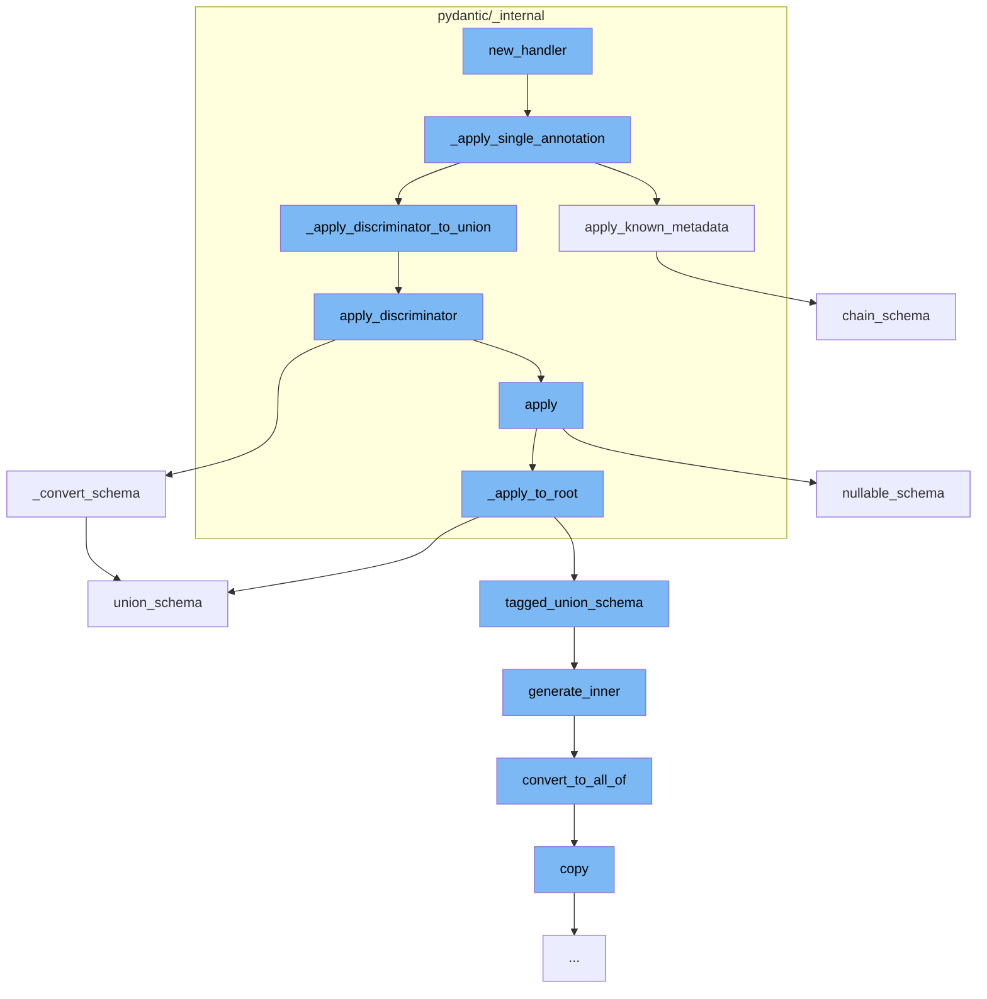

This document will cover the process of generating a schema in Pydantic, which includes:

1. Applying single annotation
2. Applying known metadata
3. Applying discriminator to union
4. Converting schema
5. Applying to root
6. Generating inner schema
7. Converting to all of schema
8. Copying schema



<SwmSnippet path="/pydantic/_internal/_generate_schema.py" line="1896">

---

# Applying single annotation

The function `_apply_single_annotation` is used to apply a single annotation to the schema. It checks if the metadata is an instance of `FieldInfo` and applies the annotation to each field metadata. If the metadata has a discriminator, it applies the discriminator to the union.

```python
    def _apply_single_annotation(self, schema: core_schema.CoreSchema, metadata: Any) -> core_schema.CoreSchema:
        from ..fields import FieldInfo

        if isinstance(metadata, FieldInfo):
            for field_metadata in metadata.metadata:
                schema = self._apply_single_annotation(schema, field_metadata)

            if metadata.discriminator is not None:
                schema = self._apply_discriminator_to_union(schema, metadata.discriminator)
            return schema

        if schema['type'] == 'nullable':
            # for nullable schemas, metadata is automatically applied to the inner schema
            inner = schema.get('schema', core_schema.any_schema())
            inner = self._apply_single_annotation(inner, metadata)
            if inner:
                schema['schema'] = inner
            return schema

        original_schema = schema
        ref = schema.get('ref', None)
```

---

</SwmSnippet>

<SwmSnippet path="/pydantic/_internal/_known_annotated_metadata.py" line="171">

---

# Applying known metadata

The function `apply_known_metadata` is used to apply known metadata to the schema. It checks if the annotation is known (Gt, Le, etc.) and applies it to the schema. If the annotation is not known, it returns `None`.

```python
def apply_known_metadata(annotation: Any, schema: CoreSchema) -> CoreSchema | None:  # noqa: C901
    """Apply `annotation` to `schema` if it is an annotation we know about (Gt, Le, etc.).
    Otherwise return `None`.

    This does not handle all known annotations. If / when it does, it can always
    return a CoreSchema and return the unmodified schema if the annotation should be ignored.

    Assumes that GroupedMetadata has already been expanded via `expand_grouped_metadata`.

    Args:
        annotation: The annotation.
        schema: The schema.

    Returns:
        An updated schema with annotation if it is an annotation we know about, `None` otherwise.

    Raises:
        PydanticCustomError: If `Predicate` fails.
    """
    import annotated_types as at

```

---

</SwmSnippet>

<SwmSnippet path="/pydantic/_internal/_discriminated_union.py" line="61">

---

# Applying discriminator to union

The function `apply_discriminator` is used to apply the discriminator to the schema and returns a new core schema. It checks if the discriminator is an instance of `Discriminator` and applies it to the schema.

```python
def apply_discriminator(
    schema: core_schema.CoreSchema,
    discriminator: str | Discriminator,
    definitions: dict[str, core_schema.CoreSchema] | None = None,
) -> core_schema.CoreSchema:
    """Applies the discriminator and returns a new core schema.

    Args:
        schema: The input schema.
        discriminator: The name of the field which will serve as the discriminator.
        definitions: A mapping of schema ref to schema.

    Returns:
        The new core schema.

    Raises:
        TypeError:
            - If `discriminator` is used with invalid union variant.
            - If `discriminator` is used with `Union` type with one variant.
            - If `discriminator` value mapped to multiple choices.
        MissingDefinitionForUnionRef:
```

---

</SwmSnippet>

<SwmSnippet path="/pydantic/types.py" line="2835">

---

# Converting schema

The function `_convert_schema` is used to convert the original schema to a `TaggedUnionSchema`. It checks if the original schema type is not 'union' and packages the generated schema back into a single-item union if it is.

```python
    def _convert_schema(self, original_schema: core_schema.CoreSchema) -> core_schema.TaggedUnionSchema:
        if original_schema['type'] != 'union':
            # This likely indicates that the schema was a single-item union that was simplified.
            # In this case, we do the same thing we do in
            # `pydantic._internal._discriminated_union._ApplyInferredDiscriminator._apply_to_root`, namely,
            # package the generated schema back into a single-item union.
            original_schema = core_schema.union_schema([original_schema])

        tagged_union_choices = {}
        for i, choice in enumerate(original_schema['choices']):
            tag = None
            if isinstance(choice, tuple):
                choice, tag = choice
            metadata = choice.get('metadata')
            if metadata is not None:
                metadata_tag = metadata.get(_core_utils.TAGGED_UNION_TAG_KEY)
                if metadata_tag is not None:
                    tag = metadata_tag
            if tag is None:
                raise PydanticUserError(
                    f'`Tag` not provided for choice {choice} used with `Discriminator`',
```

---

</SwmSnippet>

<SwmSnippet path="/pydantic/_internal/_discriminated_union.py" line="61">

---

# Applying to root

The function `apply_discriminator` is used to apply the discriminator to the schema and returns a new core schema. It checks if the discriminator is an instance of `Discriminator` and applies it to the schema.

```python
def apply_discriminator(
    schema: core_schema.CoreSchema,
    discriminator: str | Discriminator,
    definitions: dict[str, core_schema.CoreSchema] | None = None,
) -> core_schema.CoreSchema:
    """Applies the discriminator and returns a new core schema.

    Args:
        schema: The input schema.
        discriminator: The name of the field which will serve as the discriminator.
        definitions: A mapping of schema ref to schema.

    Returns:
        The new core schema.

    Raises:
        TypeError:
            - If `discriminator` is used with invalid union variant.
            - If `discriminator` is used with `Union` type with one variant.
            - If `discriminator` value mapped to multiple choices.
        MissingDefinitionForUnionRef:
```

---

</SwmSnippet>

<SwmSnippet path="/pydantic/json_schema.py" line="445">

---

# Generating inner schema

The function `generate_inner` is used to generate a JSON schema based on the input schema. It populates the definitions and converts the JSON schema to 'all of' schema if necessary.

```python
    def generate_inner(self, schema: CoreSchemaOrField) -> JsonSchemaValue:  # noqa: C901
        """Generates a JSON schema for a given core schema.

        Args:
            schema: The given core schema.

        Returns:
            The generated JSON schema.
        """
        # If a schema with the same CoreRef has been handled, just return a reference to it
        # Note that this assumes that it will _never_ be the case that the same CoreRef is used
        # on types that should have different JSON schemas
        if 'ref' in schema:
            core_ref = CoreRef(schema['ref'])  # type: ignore[typeddict-item]
            core_mode_ref = (core_ref, self.mode)
            if core_mode_ref in self.core_to_defs_refs and self.core_to_defs_refs[core_mode_ref] in self.definitions:
                return {'$ref': self.core_to_json_refs[core_mode_ref]}

        # Generate the JSON schema, accounting for the json_schema_override and core_schema_override
        metadata_handler = _core_metadata.CoreMetadataHandler(schema)

```

---

</SwmSnippet>

<SwmSnippet path="/pydantic/json_schema.py" line="481">

---

# Converting to all of schema

The function `convert_to_all_of` is used to convert the JSON schema to 'all of' schema if it contains a '$ref' and has more than one key.

```python
        def convert_to_all_of(json_schema: JsonSchemaValue) -> JsonSchemaValue:
            if '$ref' in json_schema and len(json_schema.keys()) > 1:
                # technically you can't have any other keys next to a "$ref"
                # but it's an easy mistake to make and not hard to correct automatically here
                json_schema = json_schema.copy()
                ref = json_schema.pop('$ref')
                json_schema = {'allOf': [{'$ref': ref}], **json_schema}
            return json_schema
```

---

</SwmSnippet>

<SwmSnippet path="/pydantic/main.py" line="1251">

---

# Copying schema

The function `copy` is used to return a copy of the model. It allows to include or exclude certain fields in the copied model and to override field values in the copied model.

````python
    def copy(
        self,
        *,
        include: AbstractSetIntStr | MappingIntStrAny | None = None,
        exclude: AbstractSetIntStr | MappingIntStrAny | None = None,
        update: Dict[str, Any] | None = None,  # noqa UP006
        deep: bool = False,
    ) -> Self:  # pragma: no cover
        """Returns a copy of the model.

        !!! warning "Deprecated"
            This method is now deprecated; use `model_copy` instead.

        If you need `include` or `exclude`, use:

        ```py
        data = self.model_dump(include=include, exclude=exclude, round_trip=True)
        data = {**data, **(update or {})}
        copied = self.model_validate(data)
        ```

````

---

</SwmSnippet>

&nbsp;

*This is an auto-generated document by Swimm AI 🌊 and has not yet been verified by a human*

<SwmMeta version="3.0.0" repo-id="Z2l0aHViJTNBJTNBREVNTy1weWRhbnRpYyUzQSUzQWdpbGFkbmF2b3Q=" repo-name="DEMO-pydantic" doc-type="flows"><sup>Powered by [Swimm](/)</sup></SwmMeta>
