This document will cover the process of generating a schema in Pydantic, which includes:

1. Handling the inner schema
2. Matching the type of the object
3. Applying annotations to the schema
4. Generating the schema from the property
5. Applying field serializers to the schema.

```mermaid
graph TD;
subgraph pydantic/_internal
  inner_handler:::mainFlowStyle --> _generate_schema_inner
end
subgraph pydantic/_internal
  _generate_schema_inner:::mainFlowStyle --> match_type
end
subgraph pydantic/_internal
  _generate_schema_inner:::mainFlowStyle --> _model_schema
end
subgraph pydantic/_internal
  _generate_schema_inner:::mainFlowStyle --> _annotated_schema
end
subgraph pydantic/_internal
  _generate_schema_inner:::mainFlowStyle --> generate_schema
end
subgraph pydantic/_internal
  match_type --> _match_generic_type
end
subgraph pydantic/_internal
  match_type --> _dataclass_schema
end
subgraph pydantic/_internal
  match_type --> _typed_dict_schema
end
subgraph pydantic/_internal
  match_type --> _namedtuple_schema
end
subgraph pydantic/_internal
  _match_generic_type --> _dataclass_schema
end
subgraph pydantic/_internal
  _match_generic_type --> _typed_dict_schema
end
subgraph pydantic/_internal
  _match_generic_type --> _namedtuple_schema
end
subgraph pydantic/_internal
  _match_generic_type --> _subclass_schema
end
subgraph pydantic/_internal
  _dataclass_schema --> _generate_dc_field_schema
end
subgraph pydantic/_internal
  _dataclass_schema --> _computed_field_schema
end
  _dataclass_schema --> dataclass_args_schema
subgraph pydantic/_internal
  _dataclass_schema --> collect_dataclass_fields
end
subgraph pydantic/_internal
  _typed_dict_schema --> _generate_td_field_schema
end
subgraph pydantic/_internal
  _typed_dict_schema --> _computed_field_schema
end
  _typed_dict_schema --> typed_dict_schema
subgraph pydantic/_internal
  _typed_dict_schema --> _apply_model_serializers
end
subgraph pydantic/_internal
  _namedtuple_schema --> _generate_parameter_schema
end
  _namedtuple_schema --> arguments_schema
  _namedtuple_schema --> call_schema
subgraph pydantic/_internal
  _model_schema --> _generate_md_field_schema
end
subgraph pydantic/_internal
  _model_schema --> _common_field_schema
end
  _model_schema --> model_fields_schema
subgraph pydantic/_internal
  _model_schema --> _computed_field_schema
end
subgraph pydantic/_internal
  _generate_md_field_schema --> _common_field_schema
end
subgraph pydantic/_internal
  _common_field_schema --> _apply_annotations
end
subgraph pydantic/_internal
  _common_field_schema --> _apply_discriminator_to_union
end
subgraph pydantic/_internal
  _common_field_schema --> _apply_field_serializers
end
  _common_field_schema --> from_annotation
  model_fields_schema --> _named_required_fields_schema
subgraph pydantic/_internal
  _computed_field_schema --> _apply_field_serializers
end
subgraph pydantic/_internal
  _computed_field_schema --> get_function_return_type
end
subgraph pydantic/_internal
  _annotated_schema --> _apply_annotations
end
subgraph pydantic/_internal
  _apply_annotations --> _get_wrapped_inner_schema
end
subgraph pydantic/_internal
  generate_schema:::mainFlowStyle --> _generate_schema_from_property
end
  _generate_schema_from_property:::mainFlowStyle --> chain_schema
  chain_schema:::mainFlowStyle --> generate_inner
  generate_inner:::mainFlowStyle --> convert_to_all_of
  convert_to_all_of:::mainFlowStyle --> copy
  copy:::mainFlowStyle --> dict
  dict:::mainFlowStyle --> model_dump
  model_dump:::mainFlowStyle --> ...

 classDef mainFlowStyle color:#000000,fill:#7CB9F4
  classDef rootsStyle color:#000000,fill:#00FFF4
```



<SwmSnippet path="/pydantic/_internal/_generate_schema.py" line="766">

---

# Handling the inner schema

The function `_generate_schema_inner` is used to handle the inner schema of an object. It checks the type of the object and calls the appropriate function to generate the schema.

```python
    def _generate_schema_inner(self, obj: Any) -> core_schema.CoreSchema:
        if isinstance(obj, _AnnotatedType):
            return self._annotated_schema(obj)

        if isinstance(obj, dict):
            # we assume this is already a valid schema
            return obj  # type: ignore[return-value]

        if isinstance(obj, str):
            obj = ForwardRef(obj)

        if isinstance(obj, ForwardRef):
            return self.generate_schema(self._resolve_forward_ref(obj))

        from ..main import BaseModel

        if lenient_issubclass(obj, BaseModel):
            with self.model_type_stack.push(obj):
                return self._model_schema(obj)

        if isinstance(obj, PydanticRecursiveRef):
```

---

</SwmSnippet>

<SwmSnippet path="/pydantic/_internal/_generate_schema.py" line="791">

---

# Matching the type of the object

The function `match_type` is used to match the type of the object and generate the appropriate schema. It checks the type of the object and calls the appropriate function to generate the schema.

```python
    def match_type(self, obj: Any) -> core_schema.CoreSchema:  # noqa: C901
        """Main mapping of types to schemas.

        The general structure is a series of if statements starting with the simple cases
        (non-generic primitive types) and then handling generics and other more complex cases.

        Each case either generates a schema directly, calls into a public user-overridable method
        (like `GenerateSchema.tuple_variable_schema`) or calls into a private method that handles some
        boilerplate before calling into the user-facing method (e.g. `GenerateSchema._tuple_schema`).

        The idea is that we'll evolve this into adding more and more user facing methods over time
        as they get requested and we figure out what the right API for them is.
        """
        if obj is str:
            return self.str_schema()
        elif obj is bytes:
            return core_schema.bytes_schema()
        elif obj is int:
            return core_schema.int_schema()
        elif obj is float:
            return core_schema.float_schema()
```

---

</SwmSnippet>

<SwmSnippet path="/pydantic/_internal/_generate_schema.py" line="1849">

---

# Applying annotations to the schema

The function `_apply_annotations` is used to apply annotations to the schema. It iterates over the annotations and applies each one to the schema.

```python
    def _apply_annotations(
        self,
        source_type: Any,
        annotations: list[Any],
        transform_inner_schema: Callable[[CoreSchema], CoreSchema] = lambda x: x,
    ) -> CoreSchema:
        """Apply arguments from `Annotated` or from `FieldInfo` to a schema.

        This gets called by `GenerateSchema._annotated_schema` but differs from it in that it does
        not expect `source_type` to be an `Annotated` object, it expects it to be  the first argument of that
        (in other words, `GenerateSchema._annotated_schema` just unpacks `Annotated`, this process it).
        """
        annotations = list(_known_annotated_metadata.expand_grouped_metadata(annotations))
        res = self._get_prepare_pydantic_annotations_for_known_type(source_type, tuple(annotations))
        if res is not None:
            source_type, annotations = res

        pydantic_js_annotation_functions: list[GetJsonSchemaFunction] = []

        def inner_handler(obj: Any) -> CoreSchema:
            from_property = self._generate_schema_from_property(obj, source_type)
```

---

</SwmSnippet>

<SwmSnippet path="/pydantic/_internal/_generate_schema.py" line="654">

---

# Generating the schema from the property

The function `_generate_schema_from_property` is used to generate the schema from the property of an object. It checks if the object has a `__get_pydantic_core_schema__` function or `__pydantic_core_schema__` property and uses it to generate the schema.

```python
    def _generate_schema_from_property(self, obj: Any, source: Any) -> core_schema.CoreSchema | None:
        """Try to generate schema from either the `__get_pydantic_core_schema__` function or
        `__pydantic_core_schema__` property.

        Note: `__get_pydantic_core_schema__` takes priority so it can
        decide whether to use a `__pydantic_core_schema__` attribute, or generate a fresh schema.
        """
        # avoid calling `__get_pydantic_core_schema__` if we've already visited this object
        if is_self_type(obj):
            obj = self.model_type_stack.get()
        with self.defs.get_schema_or_ref(obj) as (_, maybe_schema):
            if maybe_schema is not None:
                return maybe_schema
        if obj is source:
            ref_mode = 'unpack'
        else:
            ref_mode = 'to-def'

        schema: CoreSchema

        if (get_schema := getattr(obj, '__get_pydantic_core_schema__', None)) is not None:
```

---

</SwmSnippet>

<SwmSnippet path="/pydantic/_internal/_generate_schema.py" line="1983">

---

# Applying field serializers to the schema

The function `_apply_field_serializers` is used to apply field serializers to the schema. It iterates over the serializers and applies each one to the schema.

```python
    def _apply_field_serializers(
        self,
        schema: core_schema.CoreSchema,
        serializers: list[Decorator[FieldSerializerDecoratorInfo]],
        computed_field: bool = False,
    ) -> core_schema.CoreSchema:
        """Apply field serializers to a schema."""
        if serializers:
            schema = copy(schema)
            if schema['type'] == 'definitions':
                inner_schema = schema['schema']
                schema['schema'] = self._apply_field_serializers(inner_schema, serializers)
                return schema
            else:
                ref = typing.cast('str|None', schema.get('ref', None))
                if ref is not None:
                    schema = core_schema.definition_reference_schema(ref)

            # use the last serializer to make it easy to override a serializer set on a parent model
            serializer = serializers[-1]
            is_field_serializer, info_arg = inspect_field_serializer(
```

---

</SwmSnippet>

&nbsp;

*This is an auto-generated document by Swimm AI 🌊 and has not yet been verified by a human*

<SwmMeta version="3.0.0" repo-id="Z2l0aHViJTNBJTNBREVNTy1weWRhbnRpYyUzQSUzQWdpbGFkbmF2b3Q=" repo-name="DEMO-pydantic" doc-type="flows"><sup>Powered by [Swimm](/)</sup></SwmMeta>
