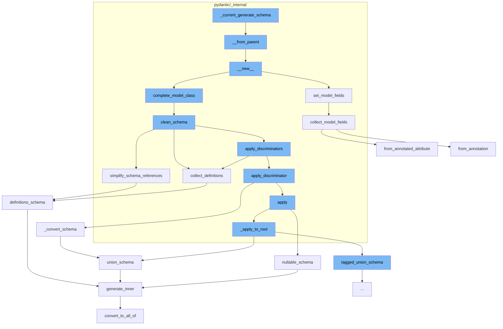

This document will cover the process of generating a schema in Pydantic, which includes:

 1. Constructing the schema object
 2. Setting model fields
 3. Cleaning the schema
 4. Simplifying schema references
 5. Collecting definitions
 6. Converting the schema
 7. Creating a nullable schema
 8. Creating a union schema
 9. Generating the inner schema
10. Converting to 'all_of' schema
11. Collecting model fields.



<SwmSnippet path="/pydantic/_internal/_generate_schema.py" line="344">

---

# Constructing the schema object

The function `__from_parent` is used to construct a new `GenerateSchema` object. It takes in several parameters including a stack of config wrappers, a stack of types namespaces, a stack of model types, a map of type variables, and definitions. It then creates a new `GenerateSchema` object and sets its properties based on these parameters.

```python
    def __from_parent(
        cls,
        config_wrapper_stack: ConfigWrapperStack,
        types_namespace_stack: TypesNamespaceStack,
        model_type_stack: _ModelTypeStack,
        typevars_map: dict[Any, Any] | None,
        defs: _Definitions,
    ) -> GenerateSchema:
        obj = cls.__new__(cls)
        obj._config_wrapper_stack = config_wrapper_stack
        obj._types_namespace_stack = types_namespace_stack
        obj.model_type_stack = model_type_stack
        obj._typevars_map = typevars_map
        obj.field_name_stack = _FieldNameStack()
        obj.defs = defs
        return obj
```

---

</SwmSnippet>

<SwmSnippet path="/pydantic/_internal/_model_construction.py" line="457">

---

# Setting model fields

The function `set_model_fields` is used to set the fields of a model. It takes in the model class, its base classes, and a config wrapper. It then collects the model fields and sets them on the model class.

```python
def set_model_fields(
    cls: type[BaseModel], bases: tuple[type[Any], ...], config_wrapper: ConfigWrapper, types_namespace: dict[str, Any]
) -> None:
    """Collect and set `cls.model_fields` and `cls.__class_vars__`.

    Args:
        cls: BaseModel or dataclass.
        bases: Parents of the class, generally `cls.__bases__`.
        config_wrapper: The config wrapper instance.
        types_namespace: Optional extra namespace to look for types in.
    """
    typevars_map = get_model_typevars_map(cls)
    fields, class_vars = collect_model_fields(cls, bases, config_wrapper, types_namespace, typevars_map=typevars_map)

    cls.model_fields = fields
    cls.__class_vars__.update(class_vars)

```

---

</SwmSnippet>

<SwmSnippet path="/pydantic/_internal/_generate_schema.py" line="446">

---

# Cleaning the schema

The function `clean_schema` is used to clean the schema. It collects definitions, simplifies schema references, applies discriminators, and validates the core schema.

```python
    def clean_schema(self, schema: CoreSchema) -> CoreSchema:
        schema = self.collect_definitions(schema)
        schema = simplify_schema_references(schema)
        if collect_invalid_schemas(schema):
            raise self.CollectedInvalid()
        schema = _discriminated_union.apply_discriminators(schema)
        schema = validate_core_schema(schema)
        return schema
```

---

</SwmSnippet>

<SwmSnippet path="/pydantic/_internal/_core_utils.py" line="417">

---

# Simplifying schema references

The function `simplify_schema_references` is used to simplify the schema references. It collects references, counts references, inlines references, and then returns the schema with definitions if there are any.

```python
def simplify_schema_references(schema: core_schema.CoreSchema) -> core_schema.CoreSchema:  # noqa: C901
    definitions: dict[str, core_schema.CoreSchema] = {}
    ref_counts: dict[str, int] = defaultdict(int)
    involved_in_recursion: dict[str, bool] = {}
    current_recursion_ref_count: dict[str, int] = defaultdict(int)

    def collect_refs(s: core_schema.CoreSchema, recurse: Recurse) -> core_schema.CoreSchema:
        if s['type'] == 'definitions':
            for definition in s['definitions']:
                ref = get_ref(definition)
                assert ref is not None
                if ref not in definitions:
                    definitions[ref] = definition
                recurse(definition, collect_refs)
            return recurse(s['schema'], collect_refs)
        else:
            ref = get_ref(s)
            if ref is not None:
                new = recurse(s, collect_refs)
                new_ref = get_ref(new)
                if new_ref:
```

---

</SwmSnippet>

<SwmSnippet path="/pydantic/_internal/_generate_schema.py" line="455">

---

# Collecting definitions

The function `collect_definitions` is used to collect definitions from the schema. If the schema has a reference, it adds the schema to the definitions and replaces the schema with a reference to the definition.

```python
    def collect_definitions(self, schema: CoreSchema) -> CoreSchema:
        ref = cast('str | None', schema.get('ref', None))
        if ref:
            self.defs.definitions[ref] = schema
        if 'ref' in schema:
            schema = core_schema.definition_reference_schema(schema['ref'])
        return core_schema.definitions_schema(
            schema,
            list(self.defs.definitions.values()),
```

---

</SwmSnippet>

<SwmSnippet path="/pydantic/types.py" line="2835">

---

# Converting the schema

The function `_convert_schema` is used to convert the original schema into a `TaggedUnionSchema`. It checks if the original schema is a union and if not, it packages the generated schema back into a single-item union. It then iterates over the choices in the original schema, extracts the tag and choice schema, and adds them to the `tagged_union_choices`.

```python
    def _convert_schema(self, original_schema: core_schema.CoreSchema) -> core_schema.TaggedUnionSchema:
        if original_schema['type'] != 'union':
            # This likely indicates that the schema was a single-item union that was simplified.
            # In this case, we do the same thing we do in
            # `pydantic._internal._discriminated_union._ApplyInferredDiscriminator._apply_to_root`, namely,
            # package the generated schema back into a single-item union.
            original_schema = core_schema.union_schema([original_schema])

        tagged_union_choices = {}
        for i, choice in enumerate(original_schema['choices']):
            tag = None
            if isinstance(choice, tuple):
                choice, tag = choice
            metadata = choice.get('metadata')
            if metadata is not None:
                metadata_tag = metadata.get(_core_utils.TAGGED_UNION_TAG_KEY)
                if metadata_tag is not None:
                    tag = metadata_tag
            if tag is None:
                raise PydanticUserError(
                    f'`Tag` not provided for choice {choice} used with `Discriminator`',
```

---

</SwmSnippet>

<SwmSnippet path="/pydantic/json_schema.py" line="1090">

---

# Creating a nullable schema

The function `nullable_schema` is used to generate a JSON schema that matches a schema that allows null values. It generates the inner JSON schema and if it is not a null schema, it returns a schema that matches either the inner schema or a null value.

```python
    def nullable_schema(self, schema: core_schema.NullableSchema) -> JsonSchemaValue:
        """Generates a JSON schema that matches a schema that allows null values.

        Args:
            schema: The core schema.

        Returns:
            The generated JSON schema.
        """
        null_schema = {'type': 'null'}
        inner_json_schema = self.generate_inner(schema['schema'])

        if inner_json_schema == null_schema:
            return null_schema
        else:
            # Thanks to the equality check against `null_schema` above, I think 'oneOf' would also be valid here;
            # I'll use 'anyOf' for now, but it could be changed it if it would work better with some external tooling
            return self.get_flattened_anyof([inner_json_schema, null_schema])
```

---

</SwmSnippet>

<SwmSnippet path="/pydantic/json_schema.py" line="1109">

---

# Creating a union schema

The function `union_schema` is used to generate a JSON schema that matches a schema that allows values matching any of the given schemas. It iterates over the choices in the schema, generates a JSON schema for each choice, and then returns a schema that matches any of the generated schemas.

```python
    def union_schema(self, schema: core_schema.UnionSchema) -> JsonSchemaValue:
        """Generates a JSON schema that matches a schema that allows values matching any of the given schemas.

        Args:
            schema: The core schema.

        Returns:
            The generated JSON schema.
        """
        generated: list[JsonSchemaValue] = []

        choices = schema['choices']
        for choice in choices:
            # choice will be a tuple if an explicit label was provided
            choice_schema = choice[0] if isinstance(choice, tuple) else choice
            try:
                generated.append(self.generate_inner(choice_schema))
            except PydanticOmit:
                continue
            except PydanticInvalidForJsonSchema as exc:
                self.emit_warning('skipped-choice', exc.message)
```

---

</SwmSnippet>

<SwmSnippet path="/pydantic/json_schema.py" line="445">

---

# Generating the inner schema

The function `generate_inner` is used to generate a JSON schema based on the input schema. It populates definitions, converts to 'all_of' schema, and then returns the generated schema.

```python
    def generate_inner(self, schema: CoreSchemaOrField) -> JsonSchemaValue:  # noqa: C901
        """Generates a JSON schema for a given core schema.

        Args:
            schema: The given core schema.

        Returns:
            The generated JSON schema.
        """
        # If a schema with the same CoreRef has been handled, just return a reference to it
        # Note that this assumes that it will _never_ be the case that the same CoreRef is used
        # on types that should have different JSON schemas
        if 'ref' in schema:
            core_ref = CoreRef(schema['ref'])  # type: ignore[typeddict-item]
            core_mode_ref = (core_ref, self.mode)
            if core_mode_ref in self.core_to_defs_refs and self.core_to_defs_refs[core_mode_ref] in self.definitions:
                return {'$ref': self.core_to_json_refs[core_mode_ref]}

        # Generate the JSON schema, accounting for the json_schema_override and core_schema_override
        metadata_handler = _core_metadata.CoreMetadataHandler(schema)

```

---

</SwmSnippet>

<SwmSnippet path="/pydantic/json_schema.py" line="481">

---

# Converting to 'all_of' schema

The function `convert_to_all_of` is used to convert a JSON schema to an 'all_of' schema. If the schema has a '$ref' key and other keys, it creates a new schema with an 'all_of' key that contains a list with the reference and the other keys.

```python
        def convert_to_all_of(json_schema: JsonSchemaValue) -> JsonSchemaValue:
            if '$ref' in json_schema and len(json_schema.keys()) > 1:
                # technically you can't have any other keys next to a "$ref"
                # but it's an easy mistake to make and not hard to correct automatically here
                json_schema = json_schema.copy()
                ref = json_schema.pop('$ref')
                json_schema = {'allOf': [{'$ref': ref}], **json_schema}
            return json_schema
```

---

</SwmSnippet>

<SwmSnippet path="/pydantic/_internal/_fields.py" line="100">

---

# Collecting model fields

The function `collect_model_fields` is used to collect the fields of a nascent pydantic model. It also collects the names of any ClassVars present in the type hints. The returned value is a tuple of two items: the fields dict, and the set of ClassVar names.

```python
def collect_model_fields(  # noqa: C901
    cls: type[BaseModel],
    bases: tuple[type[Any], ...],
    config_wrapper: ConfigWrapper,
    types_namespace: dict[str, Any] | None,
    *,
    typevars_map: dict[Any, Any] | None = None,
) -> tuple[dict[str, FieldInfo], set[str]]:
    """Collect the fields of a nascent pydantic model.

    Also collect the names of any ClassVars present in the type hints.

    The returned value is a tuple of two items: the fields dict, and the set of ClassVar names.

    Args:
        cls: BaseModel or dataclass.
        bases: Parents of the class, generally `cls.__bases__`.
        config_wrapper: The config wrapper instance.
        types_namespace: Optional extra namespace to look for types in.
        typevars_map: A dictionary mapping type variables to their concrete types.

```

---

</SwmSnippet>

&nbsp;

*This is an auto-generated document by Swimm AI 🌊 and has not yet been verified by a human*

<SwmMeta version="3.0.0" repo-id="Z2l0aHViJTNBJTNBREVNTy1weWRhbnRpYyUzQSUzQWdpbGFkbmF2b3Q=" repo-name="DEMO-pydantic" doc-type="flows"><sup>Powered by [Swimm](/)</sup></SwmMeta>
